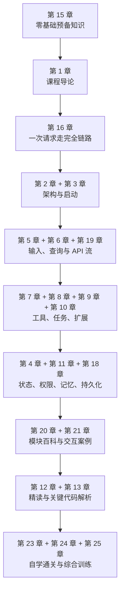
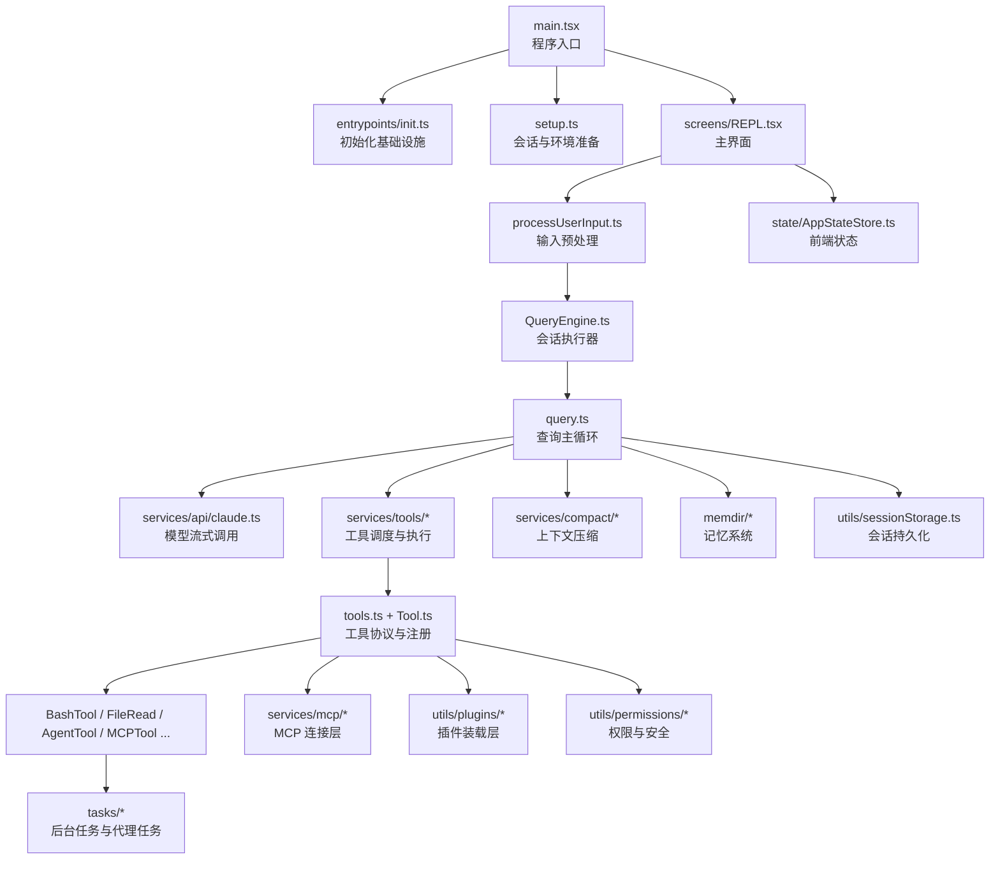

# Anthropic `src` 源码教科书（学生自学增强版）

> 面向授课、研讨与源码走读的 GitBook 讲义  
> 分析对象：`src`

## 本版定位

这是“学生自学增强版”教材。它的目标不只是让读者“知道这个系统大概做了什么”，而是让学生在完成全书之后，能够真正具备下面四种能力：

1. 能说清这个系统的整体定位、分层结构和核心运行机制。
2. 能独立追踪一次用户请求，从输入、建模、工具执行到结果回写完整走通。
3. 能按模块阅读关键源码，并解释关键数据结构、状态变化和模块协作关系。
4. 能在理解现有设计的基础上，继续做扩展、排障和二次开发。

因此，这一版不再只面向“老师怎么讲”，而是以“学生如何从零开始，最后真正掌握它”为中心来组织内容。全书当前共 25 章、5400 余行正文，采用“先建地图，再走主线，后做模块精读，最后以训练和考核收束”的结构。

## 这本书解决什么问题

这不是一份“文件注释汇编”，而是一份面向课堂讲授与学生自学的源码教材。它试图回答四个问题：

1. 这个 `src` 目录整体上在构建一个什么系统？
2. 这个系统是如何从“用户输入”一路运行到“模型响应、工具执行、结果回写”的？
3. 为什么它会拆成 `commands`、`tools`、`tasks`、`services`、`utils`、`ink`、`mcp`、`plugins` 这些层？
4. 如果要带学生系统读懂它，应该按什么顺序阅读，重点抓哪些文件？

为了让读者能逐步进入状态，这本书采用了“先给全局地图，再走一条主链路，最后做模块百科、训练任务和通关考核”的写法。也就是说，读者不需要一上来就懂 `QueryEngine`、`MCP` 或 `Ink`，我们会先解释这些名词为什么会出现、各自解决什么问题，然后再进入代码。

## 分析边界

- 本教材严格围绕 `src` 目录展开。
- 当前可见仓库根目录只有 `src`，没有同时提供 `package.json`、`tsconfig`、测试目录和构建脚本，因此：
  - 启动方式、打包参数、CI 规则等“仓库外层信息”不做强行推断。
  - 对外部构建流程的描述，以 `src` 内部代码能直接证明的内容为准。
- 书中对“产品定位”的判断来自 `main.tsx`、`screens/REPL.tsx`、`tools`、`commands`、`mcp`、`plugins`、`AgentTool` 等文件的综合推断。

## 源码体量概览

为了让学生对学习对象的难度有直观认识，先看本次分析范围 `src` 的代码规模：

- 可计作代码的源码文件共 `1902` 个。
- `.ts` 文件约 `379,997` 行。
- `.tsx` 文件约 `132,667` 行。
- 其它 `.js/.jsx/.mjs/.cjs` 文件约 `21` 行。
- 合计约 `512,685` 行代码。

这意味着本系统绝不是“几天扫一眼目录就能懂”的小项目，而是一套体量很大的终端 Agent 工程。正因为如此，全书采用分阶段推进，而不是文件平铺式讲解。

## 先给出结论

从源码结构看，这是一套“终端中的 AI Agent 操作系统式应用”：

- 它有完整的命令入口层：`commands.ts`
- 它有模型可调用的能力层：`tools.ts`、`Tool.ts`
- 它有对话主循环：`QueryEngine.ts`、`query.ts`
- 它有终端 UI 层：`screens/REPL.tsx`、`ink/`
- 它有任务与后台执行层：`Task.ts`、`tasks/`
- 它有扩展系统：`services/mcp/`、`utils/plugins/`
- 它有记忆、权限、压缩、持久化等横切能力：`memdir/`、`utils/permissions/`、`services/compact/`、`utils/sessionStorage.ts`

换句话说，它不是“调用一次模型 API 的脚本”，而是一个长期运行、可扩展、可恢复、可多代理协作的复杂系统。

## 自学者应该怎么用这本书

建议按下面六个阶段推进：

1. 基础准备阶段：先读第 15 章和第 1 章，建立最基本的概念框架。
2. 主链路建立阶段：重点读第 16、2、3、5、6、19 章，把一次请求从头到尾走通。
3. 核心能力层阶段：重点读第 7、8、9、10 章，理解工具、任务与扩展体系。
4. 运行支撑层阶段：读第 4、11、18 章，理解 UI、状态、权限、压缩、持久化。
5. 全局回看阶段：读第 20、21、12、13 章，把“知道发生了什么”升级为“知道为什么这样设计”。
6. 通关训练阶段：完成第 23、24、25 章里的自学任务、实验题和自测问题。

如果你的目标是“最后能自己改代码”，不要跳过第 24 章和第 25 章。这两章不是附录，而是把“读懂”变成“掌握”的关键环节。

## 全书使用方式

- 如果你要开一门 6 到 8 次课的源码课，请从第 1 章顺序讲到第 10 章。
- 如果你要做一次 90 分钟的专题讲座，请优先讲第 2、3、6、7、8、9 章。
- 如果你要带学生做源码实战，请先看第 12 章“代码阅读指南”，再配合第 13 章“关键代码精讲”。
- 如果学生完全没有相关背景，请先用第 15 章“零基础预备知识”做预热，再进入第 2 章。
- 如果你想把课堂讲得更有故事感，可以把第 16 章作为主线案例，从“用户输入一句话”一路讲到“模型回复、工具执行、状态回写”。
- 如果你要按模块逐章讲授，请把第 20 章当作总索引，它可以帮助学生把顶层目录和职责快速对上号。

## 自学路线图

## 全局架构图

## 推荐授课顺序

1. 先讲系统地图，建立“这不是普通 CLI”的整体认识。
2. 再讲启动链路，让学生知道程序为什么能进入 REPL。
3. 接着讲一次完整请求生命周期，把核心执行链打通。
4. 然后分别深入工具系统、BashTool、AgentTool。
5. 最后再讲扩展、权限、记忆、压缩、持久化这些高级主题。

## 给自学者的提醒

- 第一遍阅读的目标不是“记住所有文件名”，而是形成一张稳定的系统地图。
- 第二遍阅读要学会沿着一条请求链追代码，特别注意消息是怎样被构造、流转和回写的。
- 第三遍阅读才进入模块细节，例如 `Tool` 抽象、任务模型、MCP 接入、状态同步。
- 每读完一章，都应该回答三个问题：
  - 这一章解决的核心问题是什么？
  - 这里最关键的数据结构是什么？
  - 它和上一章、下一章是怎么接起来的？

## 给教师的提醒

- 本书最大的教学价值，不是记住每个文件，而是训练学生理解“大型 TypeScript 工程如何分层”。
- 讲解时务必反复强调三条主线：
  - 用户线：输入是怎样进入系统的
  - 模型线：系统提示词和消息是怎样构造的
  - 工具线：工具是怎样被注册、授权、执行和回写的

如果你是第一次接触这类工程，请从 [第 15 章 零基础预备知识](chapters/15-zero-background-primer.md) 开始；如果你已经具备基本背景并希望按自学计划推进，请先读 [第 23 章 学生自学总路线与阶段目标](chapters/23-self-study-roadmap.md)。
