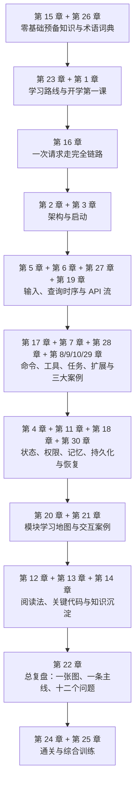
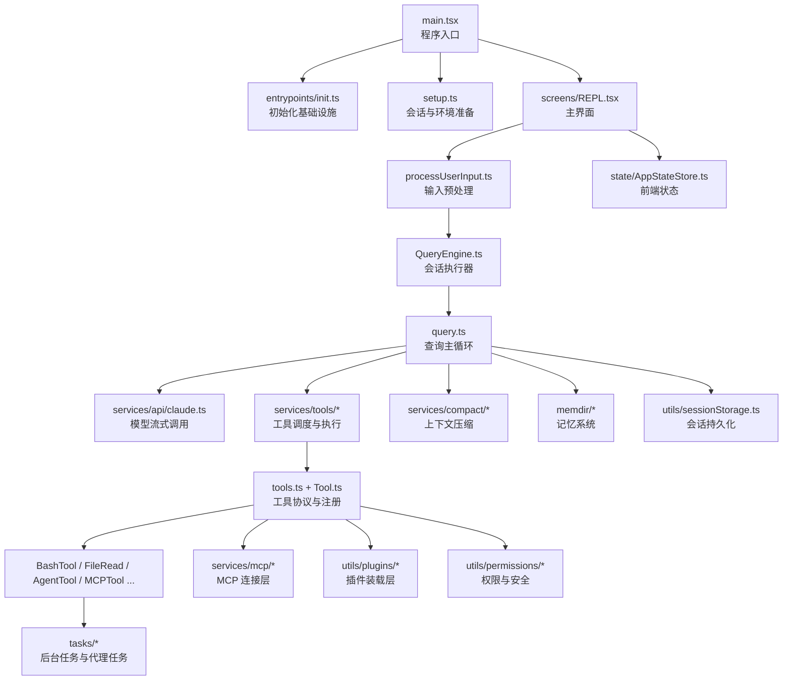

# Anthropic `src` 源码教科书（深度研究版）

> 面向系统阅读、源码深读与长期掌握的 GitBook 教材  
> 分析对象：`src`

## 本版定位

这是“深度研究版”教材。其目标不是给出一份目录注释，也不是给出一套速读提纲，而是建立一部可用于系统研读、结构复盘、设计迁移与跨语言重建的源码教科书。

全书围绕四项最终能力展开：

1. 准确说明该系统的产品定位、运行边界、分层结构与核心抽象。
2. 完整追踪一次请求从进入 REPL、变成消息、进入查询循环、触发工具、回写结果直到持久化收束的全过程。
3. 解释关键模块的职责、输入输出契约、状态模型、异常分支与协作关系。
4. 在抽离语言细节之后，重新搭建一套等价的系统骨架，并据此完成移植、裁剪、扩展或重写。

因此，本书不再按目录顺序平铺文件，而是按理解依赖来组织：先建立系统地图，再走通主链路，再分析能力层与横切治理，最后回到整体验证与重建视角。全书当前共 30 章、约 9200 行正文，形成了从“认识系统”到“重构系统”的连续路线。

这一版的重组不是在旧稿末尾补几章附录，而是重新定义整本书的组织原则：

- 目录按认知依赖排序，而不是按仓库自然目录排序。
- 核心章节明确标出在整条学习路线中的位置，避免局部阅读失去坐标。
- 模块说明不止回答“这个目录是什么”，还回答“为何存在、如何接入、如何替换”。
- 关键章节补入运行流程、数据结构、边界条件与重建要点，避免停留在表面概览。
- 代码阅读方法、案例追踪、通关检查与综合实验被纳入主干，而非作为边缘附录。

同时，全书 30 章已经统一为固定模板的完整教材形态：

- 每章开头给出：`本章目标`、`先修关系`、`关键词`、`正文图解`、`关键数据结构`。
- 每章正文包含：本章位置、核心问题、误区澄清、流程展开、源码锚点与设计解释。
- 每章结尾收束为：`章末小结`、`章末自测`。
- 核心章节进一步补入“语言无关重建视角”，把源码理解推进到实现规格层面。

## 本书采用的教材写法

本书的写法遵循通行教材中的几条稳定原则，并根据这套源码的结构进行本地化调整：

- 先定义学习结果，再安排目录顺序。章节顺序服务于理解路径，而不是服务于文件树。
- 先建立支架，再进入细节。术语、类比、总图与主链路优先于局部实现。
- 图、表、案例与自测嵌入正文，而不是集中堆放在章节末尾。
- 每章都以“问题驱动 + 证据支撑 + 结构收束”的方式展开，避免散漫陈述。
- 对关键模块同时给出两层解释：一层回答“源码里发生了什么”，另一层回答“若改用其他语言，应保留什么”。

因此，本书并不是按仓库目录顺序“扫文件”，而是按学习依赖安排：先理解系统是什么，再理解系统如何启动和运行，随后才进入工具、任务、扩展、状态与治理能力。

## 这一版为什么更接近 deep research

这本书不是只根据目录名做推测，而是围绕一批关键中枢源码进行反复交叉阅读后整理的。重点取证的主干文件包括但不限于：

- `main.tsx`
- `setup.ts`
- `screens/REPL.tsx`
- `QueryEngine.ts`
- `query.ts`
- `Tool.ts`
- `tools.ts`
- `services/tools/toolOrchestration.ts`
- `services/tools/toolExecution.ts`
- `services/tools/StreamingToolExecutor.ts`
- `tools/BashTool/BashTool.tsx`
- `tools/AgentTool/AgentTool.tsx`
- `services/mcp/client.ts`
- `state/AppStateStore.ts`
- `state/onChangeAppState.ts`
- `utils/processUserInput/processUserInput.ts`
- `utils/sessionStorage.ts`

这样做的目的是让书里的判断尽量建立在“可被源码证明的事实”上，而不是只给一个泛泛的架构印象。

## 本书的重建导向

本书的技术深度不以“是否能复述文件名”为标准，而以“是否能抽出可迁移的实现骨架”为标准。为此，核心章节会反复回答四类问题：

1. 该模块在语言无关层面到底承担什么抽象职责。
2. 该模块的输入输出契约、状态对象与副作用出口分别是什么。
3. 该模块与相邻模块如何交接，哪些边界绝不能混淆。
4. 若改用其他语言重新实现，最小可行实现顺序应当如何安排。

因此，本书既解释 TypeScript 源码中的具体写法，也主动把其中可迁移的设计抽象出来，例如：

- 用“会话执行器 + 单轮状态机”解释 `QueryEngine.ts` 与 `query.ts` 的分工。
- 用“统一能力协议 + 工具池装配 + 执行编排”解释 `Tool.ts`、`tools.ts` 与 `services/tools/*`。
- 用“消息账本 + 状态桥接 + 转录持久化”解释 `messages.ts`、`AppStateStore.ts` 与 `sessionStorage.ts`。
- 用“扩展总线”解释 MCP、插件与技能为何最终都要汇入统一协议层。

## 这本书解决什么问题

这不是一份“文件注释汇编”，而是一份真正面向普通读者的源码教材。它试图回答四个问题：

1. 这个 `src` 目录整体上在构建一个什么系统？
2. 这个系统是如何从“用户输入”一路运行到“模型响应、工具执行、结果回写”的？
3. 为什么它会拆成 `commands`、`tools`、`tasks`、`services`、`utils`、`ink`、`mcp`、`plugins` 这些层？
4. 如果要系统读懂它，应该按什么顺序阅读，重点抓哪些文件？

为了让读者能逐步进入状态，这本书采用了“先给全局地图，再走一条主链路，最后做模块百科、训练任务和通关考核”的写法。也就是说，读者不需要一上来就懂 `QueryEngine`、`MCP` 或 `Ink`，我们会先解释这些名词为什么会出现、各自解决什么问题，然后再进入代码。

## 分析边界

- 本教材严格围绕 `src` 目录展开。
- 当前可见仓库根目录只有 `src`，没有同时提供 `package.json`、`tsconfig`、测试目录和构建脚本，因此：
  - 启动方式、打包参数、CI 规则等“仓库外层信息”不做强行推断。
  - 对外部构建流程的描述，以 `src` 内部代码能直接证明的内容为准。
- 书中对“产品定位”的判断来自 `main.tsx`、`screens/REPL.tsx`、`tools`、`commands`、`mcp`、`plugins`、`AgentTool` 等文件的综合推断。

## 源码体量概览

为了让读者对学习对象的难度有直观认识，先看本次分析范围 `src` 的代码规模：

- 可计作代码的源码文件共 `1902` 个。
- `.ts` 文件约 `379,997` 行。
- `.tsx` 文件约 `132,667` 行。
- 其它 `.js/.jsx/.mjs/.cjs` 文件约 `21` 行。
- 合计约 `512,685` 行代码。

这意味着本系统绝不是“几天扫一眼目录就能懂”的小项目，而是一套体量很大的终端 Agent 工程。正因为如此，全书采用分阶段推进，而不是文件平铺式讲解。

## 先给出结论

从源码结构看，这是一套“终端中的 AI Agent 操作系统式应用”：

- 它有完整的命令入口层：`commands.ts`
- 它有模型可调用的能力层：`tools.ts`、`Tool.ts`
- 它有对话主循环：`QueryEngine.ts`、`query.ts`
- 它有终端 UI 层：`screens/REPL.tsx`、`ink/`
- 它有任务与后台执行层：`Task.ts`、`tasks/`
- 它有扩展系统：`services/mcp/`、`utils/plugins/`
- 它有记忆、权限、压缩、持久化等横切能力：`memdir/`、`utils/permissions/`、`services/compact/`、`utils/sessionStorage.ts`

换句话说，它不是“调用一次模型 API 的脚本”，而是一个长期运行、可扩展、可恢复、可多代理协作的复杂系统。

## 本书的使用方式

建议按下面六个阶段推进：

1. 基础准备阶段：先读第 15、26、23、1 章，建立概念框架、术语系统和学习路线。
2. 主链路建立阶段：重点读第 16、2、3、5、6、27、19 章，把一次请求从头到尾走通。
3. 核心能力层阶段：重点读第 17、7、28、8、9、10、29 章，理解命令、工具、任务与扩展体系。
4. 运行支撑层阶段：读第 4、11、18、30 章，理解 UI、状态、权限、压缩、持久化与恢复。
5. 全局回看阶段：读第 20、21、12、13、14 章，把“知道发生了什么”升级为“知道为什么这样设计、为什么应该这样读，以及怎样把知识沉淀下来”。
6. 通关训练阶段：先用第 22 章做整书复盘，再完成第 24、25 章里的训练任务、实验题和自测问题。

若目标是进入修改、扩展或重写层面，不应跳过第 24 章和第 25 章。这两章不是附录，而是把“读懂”转化为“掌握”的关键环节。

## 这本书现在是怎样组织的

全书现在被重排为六段主学习路径：

1. 第一阶段：建立最小认知框架。
2. 第二阶段：走通一条完整请求主链路，并把它细拆成可追踪的时序阶段。
3. 第三阶段：理解系统最核心的能力协议与执行层，并通过重量级案例真正看懂难点。
4. 第四阶段：补齐状态、权限、记忆、压缩、持久化与恢复等支撑能力。
5. 第五阶段：回到全局，按学习优先级整合目录、交互案例、阅读方法与关键代码。
6. 第六阶段：做整书复盘、通关检查与综合实验，完成从“看懂”到“掌握”的跃迁。

## 建议阅读方式

- 零基础背景可先读第 15、26、23、1 章，再进入主链路章节。
- 已具备 TypeScript、React 与 CLI 基础时，可从第 16 章起步，先把一次请求走通，再回读第 2、3、5、6 章。
- 若目标是进入修改与重写层面，不应跳过第 12、13、14、22、24、25 章；这些章节负责把“看懂”沉淀为“能复盘、能定位、能修改”。
- 如中途失去全局把握，优先返回第 20 章和第 21 章。前者给出模块地图，后者给出模块交互案例，可用来把零散理解重新织回系统图。

## 阅读路线图

## 全局架构图

## 建议二刷顺序

1. 先复盘第 16 章，重新把一条请求主链路讲顺。
2. 再回看第 2、3、5、6、19、27 章，确认启动、消息、查询和流式层如何衔接。
3. 接着集中读第 7、8、9、10、17、28、29 章，理解系统的行动能力是怎样建立的。
4. 然后读第 4、11、18、30 章，补齐那些第一次容易忽略的支撑系统。
5. 最后用第 20、21、12、13、14、22、24、25 章做总整合和自测。

## 阅读提醒

- 第一遍阅读的目标不是“记住所有文件名”，而是形成一张稳定的系统地图。
- 第二遍阅读要学会沿着一条请求链追代码，特别注意消息是怎样被构造、流转和回写的。
- 第三遍阅读才进入模块细节，例如 `Tool` 抽象、任务模型、MCP 接入、状态同步。
- 每读完一章，都应该回答三个问题：
  - 这一章解决的核心问题是什么？
  - 这里最关键的数据结构是什么？
  - 它和上一章、下一章是怎么接起来的？

## 阅读总提示

- 第一遍阅读的目标不是记住所有文件名，而是建立一张稳定的系统地图。
- 第二遍阅读应开始追主线，特别注意消息、状态和工具结果在模块之间的流动方式。
- 第三遍阅读再进入细部机制，例如 `Tool` 默认值、任务后台化、MCP 去重、持久化边界等深层设计。
- 若某一章读完之后仍无法说明“它解决什么问题、依赖什么、影响什么”，说明该章尚未真正转化为稳定知识。

首次接触此类工程时，可从 [第 15 章 零基础预备知识](chapters/15-zero-background-primer.md) 开始；若希望按全书总路线推进，可先读 [第 23 章 全书总路线与阶段目标](chapters/23-self-study-roadmap.md)。
