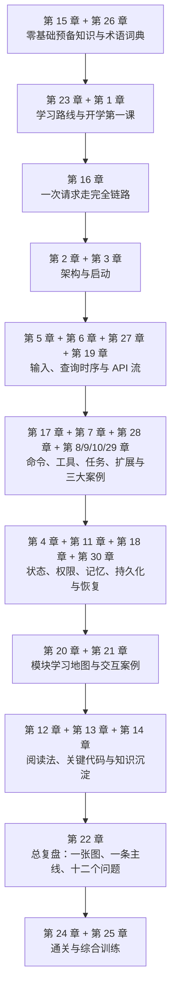
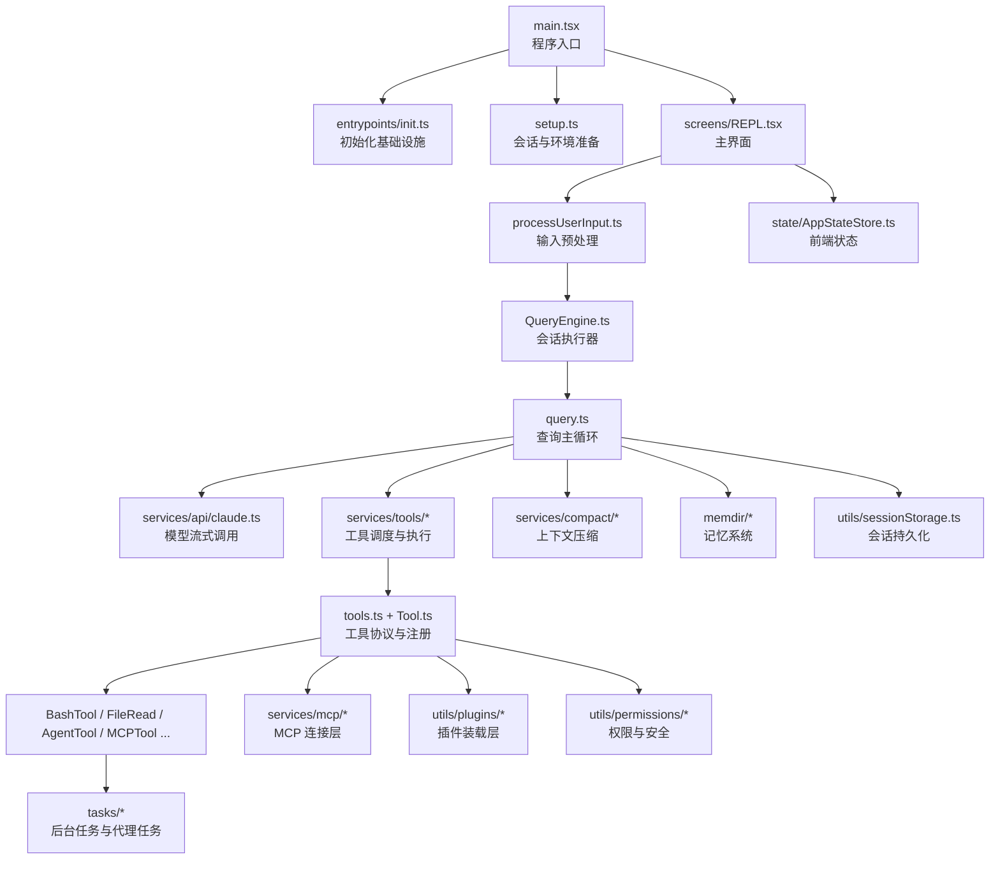

# Anthropic `src` 源码教科书（深度研究版）

> 面向系统阅读、源码深读与长期掌握的 GitBook 教材  
> 分析对象：`src`

## 本版定位

这是“深度研究版”教材。它的目标不只是让读者“知道这个系统大概做了什么”，而是让读者在完成全书之后，能够真正具备下面四种能力：

1. 能说清这个系统的整体定位、分层结构和核心运行机制。
2. 能独立追踪一次用户请求，从输入、建模、工具执行到结果回写完整走通。
3. 能按模块阅读关键源码，并解释关键数据结构、状态变化和模块协作关系。
4. 能在理解现有设计的基础上，继续做扩展、排障和二次开发。

因此，这一版不再把外部使用场景当成中心，而是把“读者如何从零开始，最后真正掌握它”当成中心来组织内容。全书当前共 30 章、约 9200 行正文，采用“先建地图，再走主线，后做模块精读，最后以训练和考核收束”的结构。

这一版的重组不是简单地在原书后面增加几章附录，而是直接改动了教材的组织逻辑：

- 目录顺序改成“阶段式阅读路径”，而不是“作者想到什么就排什么”。
- 核心章节会明确告诉读者“这一章在整个学习路线中的位置”。
- 模块地图不再只按目录平铺，而是按“先读什么、后读什么、哪些暂时别碰”来组织。
- 代码阅读指南不再只是建议，而是变成一套可执行的阅读方法。
- 所有章节都只保留读者真正需要的内容，不再混入与主学习路径无关的附加说明。
- 在主干目录里插入了术语词典、请求时序剖面、工具执行闭环、重量级能力案例、状态与恢复全链路等“深度研究章节”。

同时，这一版已经不再是“部分章节采用新写法、部分章节仍是旧讲义口吻”的混合状态，而是把全书 30 章统一改造成了固定模板的完整版写法：

- 每章开头都有：`本章目标`、`先修关系`、`关键词`、`正文图解`、`关键数据结构`。
- 每章正文都会继续保留本章的位置、误区、阅读抓手、流程分析、关键代码或案例分析。
- 每章结尾都有：`章末小结`、`章末自测`。
- 这样设计的目的，是把“进入本章之前该准备什么、阅读时该抓什么、读完之后该检查什么”全部显式化。

## 本书采用的教材写法

这次重写并不是随意改口吻，而是吸收了通行教材设计里几条非常稳定的方法，然后再按这套源码的实际结构做了本地化改造：

- 先定义目标读者和学习结果，再决定目录顺序。换句话说，先想“读者学完要会什么”，再想“章节怎么排”。
- 章节结构保持稳定。现在每章都会显式交代本章目标、先修关系、关键词、图解、关键数据结构、正文展开、章末小结和章末自测，降低大型工程阅读的认知切换成本。
- 先搭支架，再讲细节。对零基础读者，先给术语、类比、全局图和主链路，再进入具体文件和复杂分支。
- 例子、图和练习嵌在正文里，而不只放在章节末尾。这样读者读到抽象概念时，马上就能看到它如何落到实际源码。
- 正文只保留读者需要的内容，不把额外的组织安排或说明性材料混进主线。
- 从熟悉走向陌生、从全局走向局部、从主线走向横切系统。这样更符合大型系统理解的自然顺序。

因此，你会看到这本书不是按仓库目录顺序“扫文件”，而是按学习依赖来安排：先理解这是什么系统，再看它如何启动和运行，然后再深入工具、任务、扩展、状态和治理能力。

## 这一版为什么更接近 deep research

这本书不是只根据目录名做推测，而是围绕一批关键中枢源码进行反复交叉阅读后整理的。重点取证的主干文件包括但不限于：

- `main.tsx`
- `setup.ts`
- `screens/REPL.tsx`
- `QueryEngine.ts`
- `query.ts`
- `Tool.ts`
- `tools.ts`
- `services/tools/toolOrchestration.ts`
- `services/tools/toolExecution.ts`
- `services/tools/StreamingToolExecutor.ts`
- `tools/BashTool/BashTool.tsx`
- `tools/AgentTool/AgentTool.tsx`
- `services/mcp/client.ts`
- `state/AppStateStore.ts`
- `state/onChangeAppState.ts`
- `utils/processUserInput/processUserInput.ts`
- `utils/sessionStorage.ts`

这样做的目的是让书里的判断尽量建立在“可被源码证明的事实”上，而不是只给一个泛泛的架构印象。

## 这本书解决什么问题

这不是一份“文件注释汇编”，而是一份真正面向普通读者的源码教材。它试图回答四个问题：

1. 这个 `src` 目录整体上在构建一个什么系统？
2. 这个系统是如何从“用户输入”一路运行到“模型响应、工具执行、结果回写”的？
3. 为什么它会拆成 `commands`、`tools`、`tasks`、`services`、`utils`、`ink`、`mcp`、`plugins` 这些层？
4. 如果要系统读懂它，应该按什么顺序阅读，重点抓哪些文件？

为了让读者能逐步进入状态，这本书采用了“先给全局地图，再走一条主链路，最后做模块百科、训练任务和通关考核”的写法。也就是说，读者不需要一上来就懂 `QueryEngine`、`MCP` 或 `Ink`，我们会先解释这些名词为什么会出现、各自解决什么问题，然后再进入代码。

## 分析边界

- 本教材严格围绕 `src` 目录展开。
- 当前可见仓库根目录只有 `src`，没有同时提供 `package.json`、`tsconfig`、测试目录和构建脚本，因此：
  - 启动方式、打包参数、CI 规则等“仓库外层信息”不做强行推断。
  - 对外部构建流程的描述，以 `src` 内部代码能直接证明的内容为准。
- 书中对“产品定位”的判断来自 `main.tsx`、`screens/REPL.tsx`、`tools`、`commands`、`mcp`、`plugins`、`AgentTool` 等文件的综合推断。

## 源码体量概览

为了让读者对学习对象的难度有直观认识，先看本次分析范围 `src` 的代码规模：

- 可计作代码的源码文件共 `1902` 个。
- `.ts` 文件约 `379,997` 行。
- `.tsx` 文件约 `132,667` 行。
- 其它 `.js/.jsx/.mjs/.cjs` 文件约 `21` 行。
- 合计约 `512,685` 行代码。

这意味着本系统绝不是“几天扫一眼目录就能懂”的小项目，而是一套体量很大的终端 Agent 工程。正因为如此，全书采用分阶段推进，而不是文件平铺式讲解。

## 先给出结论

从源码结构看，这是一套“终端中的 AI Agent 操作系统式应用”：

- 它有完整的命令入口层：`commands.ts`
- 它有模型可调用的能力层：`tools.ts`、`Tool.ts`
- 它有对话主循环：`QueryEngine.ts`、`query.ts`
- 它有终端 UI 层：`screens/REPL.tsx`、`ink/`
- 它有任务与后台执行层：`Task.ts`、`tasks/`
- 它有扩展系统：`services/mcp/`、`utils/plugins/`
- 它有记忆、权限、压缩、持久化等横切能力：`memdir/`、`utils/permissions/`、`services/compact/`、`utils/sessionStorage.ts`

换句话说，它不是“调用一次模型 API 的脚本”，而是一个长期运行、可扩展、可恢复、可多代理协作的复杂系统。

## 你应该怎么用这本书

建议按下面六个阶段推进：

1. 基础准备阶段：先读第 15、26、23、1 章，建立概念框架、术语系统和学习路线。
2. 主链路建立阶段：重点读第 16、2、3、5、6、27、19 章，把一次请求从头到尾走通。
3. 核心能力层阶段：重点读第 17、7、28、8、9、10、29 章，理解命令、工具、任务与扩展体系。
4. 运行支撑层阶段：读第 4、11、18、30 章，理解 UI、状态、权限、压缩、持久化与恢复。
5. 全局回看阶段：读第 20、21、12、13、14 章，把“知道发生了什么”升级为“知道为什么这样设计、为什么应该这样读，以及怎样把知识沉淀下来”。
6. 通关训练阶段：先用第 22 章做整书复盘，再完成第 24、25 章里的训练任务、实验题和自测问题。

如果你的目标是“最后能自己改代码”，不要跳过第 24 章和第 25 章。这两章不是附录，而是把“读懂”变成“掌握”的关键环节。

## 这本书现在是怎样组织的

全书现在被重排为六段主学习路径：

1. 第一阶段：建立最小认知框架。
2. 第二阶段：走通一条完整请求主链路，并把它细拆成可追踪的时序阶段。
3. 第三阶段：理解系统最核心的能力协议与执行层，并通过重量级案例真正看懂难点。
4. 第四阶段：补齐状态、权限、记忆、压缩、持久化与恢复等支撑能力。
5. 第五阶段：回到全局，按学习优先级整合目录、交互案例、阅读方法与关键代码。
6. 第六阶段：做整书复盘、通关检查与综合实验，完成从“看懂”到“掌握”的跃迁。

## 建议阅读方式

- 如果你是零基础读者，先读第 15、26、23、1 章，再进入主链路章节。
- 如果你已经有 TypeScript/React/CLI 基础，建议从第 16 章开始，把一次请求先走通，再回读第 2、3、5、6 章。
- 如果你的目标是后续直接改代码，不要跳过第 12、13、14、22、24、25 章，它们负责把“看懂”沉淀成“能复盘、能定位、能修改”。
- 如果你中途迷路了，优先回到第 20 章和第 21 章。前者是模块学习地图，后者是模块交互案例，它们负责把零散理解重新织回系统图。

## 阅读路线图

## 全局架构图

## 建议二刷顺序

1. 先复盘第 16 章，重新把一条请求主链路讲顺。
2. 再回看第 2、3、5、6、19、27 章，确认启动、消息、查询和流式层如何衔接。
3. 接着集中读第 7、8、9、10、17、28、29 章，理解系统的行动能力是怎样建立的。
4. 然后读第 4、11、18、30 章，补齐那些第一次容易忽略的支撑系统。
5. 最后用第 20、21、12、13、14、22、24、25 章做总整合和自测。

## 阅读提醒

- 第一遍阅读的目标不是“记住所有文件名”，而是形成一张稳定的系统地图。
- 第二遍阅读要学会沿着一条请求链追代码，特别注意消息是怎样被构造、流转和回写的。
- 第三遍阅读才进入模块细节，例如 `Tool` 抽象、任务模型、MCP 接入、状态同步。
- 每读完一章，都应该回答三个问题：
  - 这一章解决的核心问题是什么？
  - 这里最关键的数据结构是什么？
  - 它和上一章、下一章是怎么接起来的？

## 给读者的最后提醒

- 第一遍阅读的目标不是记住所有文件名，而是建立一张稳定的系统地图。
- 第二遍阅读要开始追主线，特别注意消息、状态和工具结果是怎样在模块之间流动的。
- 第三遍阅读才适合啃细节，例如 `Tool` 默认值、任务后台化、MCP 去重、持久化边界等深层设计。
- 如果某一章读完以后你还说不出“它解决了什么问题、依赖什么、影响什么”，就说明这章还没有真正掌握。

如果你是第一次接触这类工程，请从 [第 15 章 零基础预备知识](chapters/15-zero-background-primer.md) 开始；如果你已经具备基本背景并希望按阅读计划推进，请先读 [第 23 章 全书总路线与阶段目标](chapters/23-self-study-roadmap.md)。
