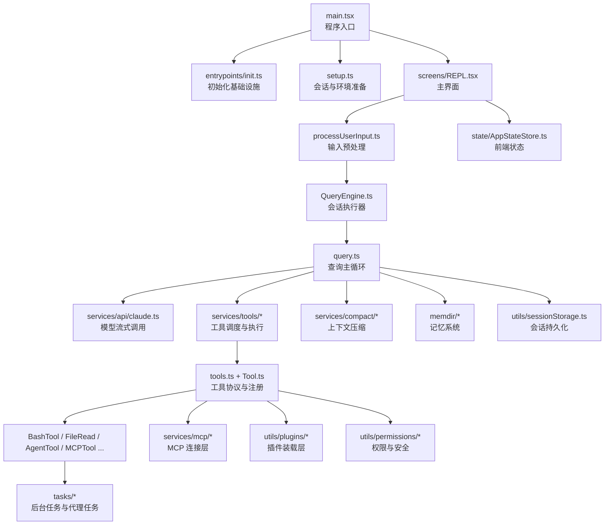

# Anthropic `src` 源码教科书（教师扩展版）

> 面向授课、研讨与源码走读的 GitBook 讲义  
> 分析对象：`src`

## 本版定位

这是“教师扩展版”教材，不再只是给熟悉工程代码的开发者看的阅读提纲，而是尽量按照通用教科书的组织方式来写，目标是让下面三类读者都能进入状态：

1. 从未系统读过大型 TypeScript 工程的学生。
2. 需要拿着讲义直接授课的老师。
3. 想把这套源码当成“AI Agent 系统设计案例”来学习的工程师。

全书当前共 22 章，约 4500 行正文，额外补入了：

- 零基础预备知识
- 一次请求的完整生命周期演练
- 命令系统深度解剖
- 状态、消息与会话同步机制
- API 流式执行层讲解
- 顶层目录模块百科
- 关键交互案例集
- 教师讲稿与课堂板书方案

## 这本书解决什么问题

这不是一份“文件注释汇编”，而是一份面向课堂讲授的源码教材。它试图回答四个问题：

1. 这个 `src` 目录整体上在构建一个什么系统？
2. 这个系统是如何从“用户输入”一路运行到“模型响应、工具执行、结果回写”的？
3. 为什么它会拆成 `commands`、`tools`、`tasks`、`services`、`utils`、`ink`、`mcp`、`plugins` 这些层？
4. 如果要带学生系统读懂它，应该按什么顺序阅读，重点抓哪些文件？

为了让读者能逐步进入状态，这本书采用了“先给全局地图，再走一条主链路，最后做模块百科和专题深潜”的写法。也就是说，读者不需要一上来就懂 `QueryEngine`、`MCP` 或 `Ink`，我们会先解释这些名词为什么会出现、各自解决什么问题，然后再进入代码。

## 分析边界

- 本教材严格围绕 `src` 目录展开。
- 当前可见仓库根目录只有 `src`，没有同时提供 `package.json`、`tsconfig`、测试目录和构建脚本，因此：
  - 启动方式、打包参数、CI 规则等“仓库外层信息”不做强行推断。
  - 对外部构建流程的描述，以 `src` 内部代码能直接证明的内容为准。
- 书中对“产品定位”的判断来自 `main.tsx`、`screens/REPL.tsx`、`tools`、`commands`、`mcp`、`plugins`、`AgentTool` 等文件的综合推断。

## 先给出结论

从源码结构看，这是一套“终端中的 AI Agent 操作系统式应用”：

- 它有完整的命令入口层：`commands.ts`
- 它有模型可调用的能力层：`tools.ts`、`Tool.ts`
- 它有对话主循环：`QueryEngine.ts`、`query.ts`
- 它有终端 UI 层：`screens/REPL.tsx`、`ink/`
- 它有任务与后台执行层：`Task.ts`、`tasks/`
- 它有扩展系统：`services/mcp/`、`utils/plugins/`
- 它有记忆、权限、压缩、持久化等横切能力：`memdir/`、`utils/permissions/`、`services/compact/`、`utils/sessionStorage.ts`

换句话说，它不是“调用一次模型 API 的脚本”，而是一个长期运行、可扩展、可恢复、可多代理协作的复杂系统。

## 全书使用方式

- 如果你要开一门 6 到 8 次课的源码课，请从第 1 章顺序讲到第 10 章。
- 如果你要做一次 90 分钟的专题讲座，请优先讲第 2、3、6、7、8、9 章。
- 如果你要带学生做源码实战，请先看第 12 章“代码阅读指南”，再配合第 13 章“关键代码精讲”。
- 如果学生完全没有相关背景，请先用第 15 章“零基础预备知识”做预热，再进入第 2 章。
- 如果你想把课堂讲得更有故事感，可以把第 16 章作为主线案例，从“用户输入一句话”一路讲到“模型回复、工具执行、状态回写”。
- 如果你要按模块逐章讲授，请把第 20 章当作总索引，它可以帮助学生把顶层目录和职责快速对上号。

## 全局架构图

## 推荐授课顺序

1. 先讲系统地图，建立“这不是普通 CLI”的整体认识。
2. 再讲启动链路，让学生知道程序为什么能进入 REPL。
3. 接着讲一次完整请求生命周期，把核心执行链打通。
4. 然后分别深入工具系统、BashTool、AgentTool。
5. 最后再讲扩展、权限、记忆、压缩、持久化这些高级主题。

## 给教师的提醒

- 本书最大的教学价值，不是记住每个文件，而是训练学生理解“大型 TypeScript 工程如何分层”。
- 讲解时务必反复强调三条主线：
  - 用户线：输入是怎样进入系统的
  - 模型线：系统提示词和消息是怎样构造的
  - 工具线：工具是怎样被注册、授权、执行和回写的

继续阅读请从 [第 1 章 课程导论](chapters/01-course-overview.md) 开始。
