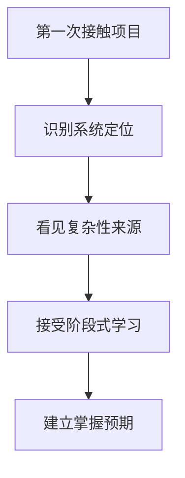

# 第 4 章 系统定位与全书学习路径

## 本章目标
- 理解本书分析对象不是“调用一次模型 API 的脚本”，而是一套运行在终端中的 Agent 平台。
- 看清这套工程为什么难读，难点分别来自产品形态、运行时、UI、扩展体系和横切治理。
- 建立整本书的学习顺序观，知道为什么必须先搭地图、再走主线、最后做通关训练。

## 先修关系
- 可以直接开始；如对术语比较陌生，建议先快速浏览第 1 章和第 2 章。
- 如已读过第 3 章，本章会把路线图重新压缩成“为什么要这样学”的解释。
- 读本章时不要求代码背景，但建议顺手记下三到五个最陌生的词，后面会不断回收。

## 关键词
- `Agent 平台`：模型不只是回答问题，而是调度工具、任务、扩展和状态变化的中心。
- `REPL`：这套系统的主界面不是单次命令入口，而是长期运行的交互式会话外壳。
- `主链路`：全书最重要的阅读方法，是顺着一次请求从输入走到结果回写。
- `横切能力`：权限、记忆、压缩、持久化不会单独存在，而是嵌进多个主流程节点。
- `分阶段学习`：面对 50 万行以上源码，必须按依赖关系分阶段建立理解，而不能平铺扫目录。

## 正文图解

## 关键数据结构
| 结构/对象 | 在本章中的位置 | 阅读时要抓什么 |
| --- | --- | --- |
| `系统定位句` | 用一句话回答这套 `src` 到底在构建什么。 | 它决定后续应当把项目当脚本读，还是当平台读。 |
| `五类复杂性清单` | 把阅读难点分成产品、运行时、UI、扩展和治理五类。 | 后面几乎所有难点都能回到这五类来源。 |
| `目录统计表` | 用文件量和目录分布建立规模感。 | 它有助于避免用小项目的阅读习惯处理大工程。 |
| `六阶段学习路线` | 把全书内容按依赖顺序重新排列。 | 它是后续阅读、复习和回看的总导航。 |

## 本章在整本书中的位置

这一章是正式进入源码之前的总论。  
第 1 章负责补零基础概念，第 3 章负责给出整本书的学习路线，而这一章负责回答更具体的问题：

1. 我们面对的到底是什么系统？
2. 它为什么比普通项目难读？
3. 第一遍阅读时，应该抓住什么，不该急着抓什么？

如果这一章没有读稳，后续很容易陷入“看见一堆文件，但不知道哪些重要”的状态。

## 首次进入本书时最容易出现的三个误区

### 误区一：以为这是一个“调用模型 API 的终端脚本”

如果这样理解，将低估它的复杂度。  
这套系统不是“发请求 -> 收回复”的单次调用器，而是一个持续运行、可扩展、可恢复、可多任务并行的终端 Agent 平台。

### 误区二：以为应该先把目录一个个看完

大型工程最忌讳“目录遍历式阅读”。  
因为将先撞进 `utils/`、`components/` 这种大体量目录，花很多时间，却无法建立主线。

### 误区三：以为只要看懂几个函数就算掌握

真正的掌握不是“我认识这个函数”，而是：

- 我知道它属于哪一层。
- 我知道它为什么在这里。
- 我知道它的输入输出是什么。
- 我知道它和上下游模块如何配合。

## 读这一章时请先完成的两个小动作

### 小动作一：先接受一个事实

现在面对的不是“小项目源码”，而是一套超过 50 万行代码的工程化系统。  
这意味着必须容忍“第一遍不会全懂”，并主动依赖学习路线来控制节奏。

### 小动作二：先建立一个最低限度的判断标准

读完这一章之后，至少应该能回答：

1. 这是一个什么系统？
2. 它的主入口在哪里？
3. 它为什么需要 QueryEngine、Tool、Task、MCP、权限、持久化这些概念？

## 1.1 这到底是一个什么系统

从源码可以直接观察到以下事实：

- 入口文件是 `src/main.tsx`
- 主界面是 `src/screens/REPL.tsx`
- 有自定义的终端渲染层 `src/ink/`
- 有命令系统 `src/commands.ts`
- 有工具系统 `src/tools.ts` 与 `src/Tool.ts`
- 有后台任务系统 `src/Task.ts` 与 `src/tasks/`
- 有多代理相关实现 `src/tools/AgentTool/`、`src/tasks/LocalAgentTask/`
- 有 MCP、插件、技能、记忆、权限、压缩、会话恢复等完整子系统

因此，最合理的定位不是“聊天程序”，而是：

> 一个以 REPL 为主界面、以模型为调度核心、以工具为执行能力、以任务系统承载异步工作、以 MCP/插件扩展生态的终端 Agent 平台。

## 1.2 为什么它难读

这份源码难读，不是因为语法复杂，而是因为它同时叠了五种复杂性：

- 产品复杂性：既有聊天，又有命令，又有工具，又有后台任务，又有远程协作
- 运行时复杂性：既支持同步流程，也支持流式输出、并发工具、后台任务
- UI 复杂性：不是简单日志输出，而是可交互的终端界面
- 扩展复杂性：MCP、插件、技能、命令、工具都可扩展
- 横切复杂性：权限、安全、记忆、压缩、持久化会影响多个模块

## 1.3 目录统计与结构特征

对 `src` 的结构扫描显示，当前共有约 1902 个文件。顶层目录分布如下：

| 顶层目录 | 文件数 | 学习价值 |
| --- | ---: | --- |
| `utils` | 564 | 横切基础设施最密集，体现工程化深度 |
| `components` | 389 | UI 组件非常多，说明交互层并不轻薄 |
| `commands` | 207 | 用户命令面非常宽 |
| `tools` | 184 | 模型可调用能力被系统性抽象 |
| `services` | 130 | 网络、MCP、压缩、分析等服务层丰富 |
| `hooks` | 104 | React/Ink 交互逻辑重度 Hook 化 |
| `ink` | 96 | 存在独立终端渲染子系统 |
| `tasks` | 12 | 任务目录数量不多，但概念非常关键 |

局部热点目录还包括：

| 二级目录 | 文件数 | 说明 |
| --- | ---: | --- |
| `components/permissions` | 51 | 权限 UI 很复杂 |
| `utils/plugins` | 44 | 插件生态是核心特性 |
| `components/messages` | 41 | 消息展示有丰富变体 |
| `utils/permissions` | 24 | 权限逻辑不是单点，而是系统级能力 |
| `services/mcp` | 23 | MCP 是重要扩展总线 |
| `utils/bash` | 23 | Shell/Bash 解析与安全检查很重 |
| `utils/swarm` | 22 | 多代理协作被系统化实现 |
| `services/api` | 20 | 模型 API 层有专门封装 |
| `tools/AgentTool` | 20 | 委派子代理是一级能力 |
| `tools/BashTool` | 18 | Shell 能力是核心执行接口 |

## 1.4 读这份代码时最重要的三个思想

### 思想一：消息是系统的“统一语言”

用户输入、模型输出、工具结果、系统通知、附件、压缩边界，最终都会进入消息流。  
理解消息，就理解了系统数据流。

### 思想二：工具是系统的“统一能力协议”

不管是读文件、搜代码、跑 Bash、问用户、起子代理、连 MCP，本质都被包装成 `Tool`。  
理解 `Tool`，就理解了系统如何把“能力”暴露给模型。

### 思想三：任务是系统的“统一异步运行容器”

长时间运行的 Bash、后台 Agent、远程 Agent、进程内 teammate，都被抽象进任务系统。  
理解任务，就理解了系统如何支持后台化、可恢复、可观察。

## 1.5 本书的阅读策略

全书宜按以下顺序建立理解：

1. `main.tsx` 看入口
2. `entrypoints/init.ts` 与 `setup.ts` 看初始化
3. `screens/REPL.tsx` 看主界面
4. `processUserInput.ts` 看输入如何进入消息流
5. `QueryEngine.ts` 与 `query.ts` 看主循环
6. `Tool.ts` 与 `tools.ts` 看工具协议
7. `BashTool.tsx` 与 `AgentTool.tsx` 看两个重量级工具
8. `services/mcp/`、`utils/plugins/` 看扩展层
9. `memdir/`、`utils/permissions/`、`services/compact/`、`utils/sessionStorage.ts` 看横切系统

## 1.6 读完全章后应当立即形成的三项认识

这一章读完后，不需要马上去背所有目录名，但必须先立住三件事：

1. 这是一套“终端里的 Agent 平台”，不是普通脚本。
2. 这套系统的理解入口一定是主链路和抽象层，而不是零散工具函数。
3. 后续阅读必须围绕“系统地图 -> 请求主线 -> 模块能力 -> 横切系统 -> 训练验证”推进。

如果这三件事没有立住，就不宜急于继续后读；应先将这一章与第 3 章对照再读一遍。

## 重建蓝图：从全书鸟瞰到可运行骨架

### 必须保留的抽象

1. 这套系统至少要被拆成五个稳定部件：启动外壳、交互容器、查询主循环、能力注册中心、状态与持久化层。只要这五个部件仍然存在，具体语言、UI 框架和网络库都可以更换。
2. 启动外壳负责解析环境、建立运行上下文、装配依赖并把控制权交给交互容器；它不应直接承担消息处理或工具执行，否则后续很难迁移到其他宿主环境。
3. 交互容器负责把键盘输入、通知、任务进度、滚动视口等终端行为组织成可视会话；它展示状态，但不应吞掉查询主循环的决策权。
4. 查询主循环是整套系统的运转核心。其职责是把一轮输入演化为一系列状态转移，穿过模型调用、工具执行、结果回写与会话结束。
5. 能力注册中心必须支持动态汇入。内建工具、插件工具、MCP 工具、命令和技能都不是在编译期写死的静态常量，而是在启动期或运行期汇入统一执行面。
6. 状态与持久化层必须区分三种东西：当前界面上正在显示的状态、真正驱动逻辑的运行状态、可恢复会话需要落盘的 durable state。跨语言重写时若不先做这一区分，后续一定会反复返工。

### 最小实现顺序

1. 第一阶段只实现一个最小 CLI 外壳，使程序能够启动、接受一行输入并打印输出。此时不需要工具、插件和后台任务，但必须形成明确的 `main -> setup -> repl` 进入路径。
2. 第二阶段定义规范化消息结构。至少要有消息类型、角色、内容块、唯一标识、时间戳与可选的附加元数据，使“原始输入”先被翻译成“可追踪消息”。
3. 第三阶段实现查询主循环的最小闭环：接收消息、拼装上下文、调用模型、接收流式增量、结束一轮会话。即便先不接工具，也要把状态机骨架搭好。
4. 第四阶段引入统一工具协议，而不是一开始就特判 Bash、Agent 或 MCP。只有先把“能力抽象”稳定下来，后续扩展才不会把主循环拉碎。
5. 第五阶段再接入持久化、后台任务、插件与扩展发现。它们属于系统增强层，不应先于核心闭环出现。
6. 第六阶段补入安全、权限、压缩、记忆与恢复逻辑。这些横切系统并不改变主循环的形状，但决定系统能否稳定长期运行。

### 最容易写错的边界

1. 最常见的错误是把目录结构直接等同于运行时结构。源码中的目录很多，但运行时真正稳定的边界并没有那么多，重写时应按职责而非按文件夹原样搬运。
2. 第二类错误是过早把模型供应商、工具类型或 UI 框架写进核心抽象。正确做法是先定义语言无关的消息、状态和工具协议，再让供应商适配器附着其上。
3. 第三类错误是把“能跑起来”误当成“架构已经成立”。如果一个最小版本只能处理单轮文本，却没有为工具回环、状态恢复和会话持久化预留接口，那么它只能算原型，不算可迁移骨架。
4. 第四类错误是从单个大文件开始重写，试图按源码顺序抄过去。更稳定的策略是先写系统约束，再写模块接口，最后才填具体行为。

## 章末小结
- 本章围绕“系统定位、复杂性来源和全书学习路线”重建了一层稳定理解，避免只记零散函数名或目录名。
- 真正需要沉淀下来的，不只是 `Agent 平台`、`REPL`、`主链路` 这几个词，而是它们在 `系统定位句`、`五类复杂性清单`、`目录统计表` 里的相互位置。
- 如后续在 第 6 章和第 5 章 中再次迷路，优先回看本章的“先修关系、正文图解、关键数据结构”三部分。

## 章末自测
1. 不看原文，用自己的话重述本章围绕“系统定位、复杂性来源和全书学习路线”到底解决了什么问题。
2. 结合“正文图解”，把 `识别系统定位` 到 `接受阶段式学习` 之间的连接关系重新讲一遍。
3. 对比 `系统定位句` 与 `五类复杂性清单`：它们分别回答什么问题，边界为什么不能混掉？
4. 在 `Agent 平台`、`REPL`、`主链路` 中任选两个，说明它们在本章中是如何互相作用的。
5. 如果后续要继续读 第 6 章和第 5 章，本章哪一部分最值得先回看？为什么？
