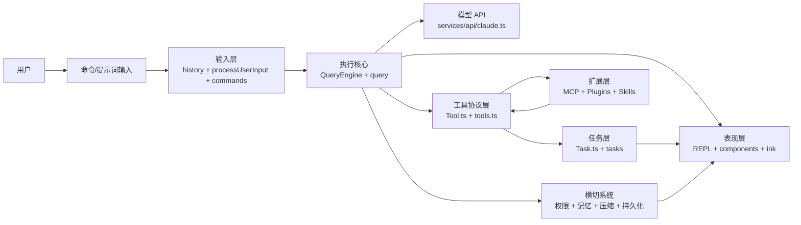

# 第 2 章 系统架构全景

## 学习目标

- 识别这套源码的主要分层
- 理解各层之间的调用关系
- 建立“主干层 + 扩展层 + 横切层”的整体视图

## 2.1 分层视角

如果用教科书式的方法归纳，这套系统可以分成九层：

| 层次 | 代表文件/目录 | 职责 |
| --- | --- | --- |
| 入口层 | `main.tsx`、`entrypoints/init.ts`、`setup.ts` | 启动、参数、生存期准备 |
| 表现层 | `screens/REPL.tsx`、`components/`、`ink/` | 终端 UI、交互、渲染 |
| 状态层 | `state/`、`context/`、`bootstrap/state.ts` | 会话状态、UI 状态、全局状态 |
| 输入层 | `history.ts`、`utils/processUserInput/`、`commands.ts` | 解析用户输入与命令 |
| 执行核心层 | `QueryEngine.ts`、`query.ts`、`services/api/claude.ts` | 对话主循环、模型调用、流式处理 |
| 能力协议层 | `Tool.ts`、`tools.ts`、`services/tools/` | 工具协议、调度、执行回写 |
| 异步任务层 | `Task.ts`、`tasks/` | 后台 Bash、后台 Agent、远程任务 |
| 扩展集成层 | `services/mcp/`、`utils/plugins/`、`skills/` | 外部能力接入与扩展 |
| 横切系统层 | `memdir/`、`utils/permissions/`、`services/compact/`、`utils/sessionStorage.ts` | 安全、记忆、压缩、持久化 |

## 2.2 架构总图

## 2.3 主干调用链

最核心的主干调用链可以概括为：

1. `main.tsx` 启动程序并准备运行环境
2. `screens/REPL.tsx` 接管交互
3. `processUserInput.ts` 将用户输入转成规范化消息
4. `QueryEngine.ts` 管理会话级状态
5. `query.ts` 驱动一轮完整的模型请求与工具回路
6. `services/tools/toolOrchestration.ts` 执行工具
7. 工具结果再回到消息流和 UI

这条链是整个项目的“主脊柱”。

## 2.4 这套架构最鲜明的四个特征

### 特征一：协议化

`Tool.ts` 并不是一个简单的接口文件，而是一整套协议定义：

- 工具输入/输出 schema
- 权限检查
- UI 渲染
- 并发安全
- 只读/破坏性标记
- 自动分类器输入
- 搜索/读取命令折叠提示

这说明系统并不是把工具当“普通函数”用，而是把工具当“一等公民协议对象”。

### 特征二：注册中心化

你会在多个关键地方看到“统一注册中心”模式：

- `commands.ts` 是命令注册中心
- `tools.ts` 是工具注册中心
- `tasks.ts` 是任务注册中心

这类模式适合大型系统，因为它把“可用能力清单”集中管理了。

### 特征三：运行时可扩展

系统不只靠静态内建能力，还会把外部能力并入主系统：

- 插件可以贡献命令、技能、MCP 配置
- MCP 可以贡献工具、资源、提示词
- 技能可以进入命令与上下文系统

所以它不是封闭架构，而是可拼装架构。

### 特征四：横切系统非常强

很多系统不是功能模块，而是全局规则：

- 权限系统会影响几乎所有工具
- 压缩系统会影响消息历史
- 持久化系统会影响恢复与后台任务
- 记忆系统会影响提示词构造

这也是为什么只看单个业务模块容易迷路。

## 2.5 从教学角度如何解释这套架构

建议把它类比成一个“终端版微内核”：

- `main.tsx` 像引导程序
- `REPL.tsx` 像交互壳层
- `query.ts` 像调度内核
- `Tool` 像设备驱动协议
- `Task` 像进程/作业系统
- `MCP/Plugin` 像外设与扩展总线
- `Permission/Memory/Compact/SessionStorage` 像内核中的安全、内存与文件系统策略

这个类比很适合课堂，因为它能把学生从“文件夹视角”拉回到“系统视角”。

## 本章小结

本章最重要的结论是：

> 这套代码不是按页面拆分的前端项目，也不是按请求拆分的后端项目，而是一个围绕“终端交互式智能体”构建的运行平台。

## 思考题

1. 为什么 `Tool` 和 `Task` 必须是两个独立抽象？
2. 为什么扩展层不是直接接到 UI，而是接到工具协议层？
3. 横切系统为什么比普通模块更难维护？
