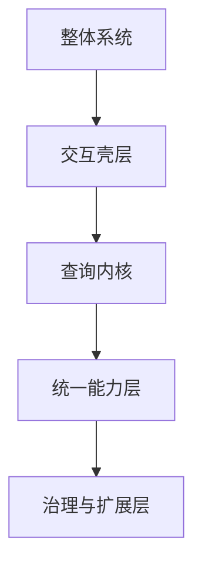
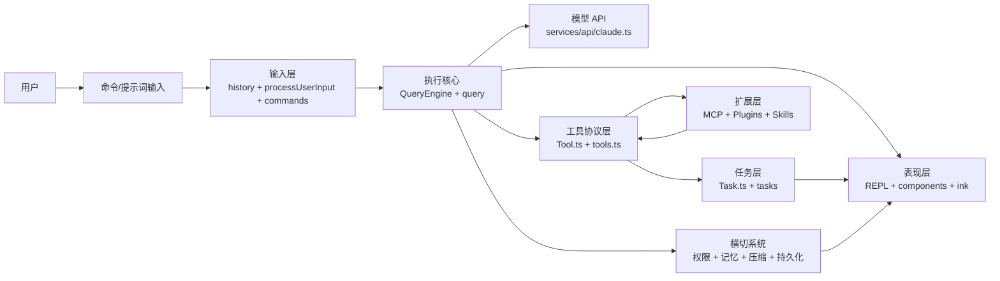
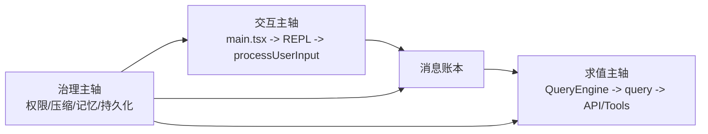

# 第 6 章 先搭地图：系统架构全景

## 本章目标
- 建立整套系统的分层地图，知道交互壳层、查询内核、能力层和治理层分别在哪里。
- 理解为什么目录层次不等于运行时层次，避免把文件夹当作系统本体。
- 学会用“终端版微内核”这类结构类比来压缩大型系统的整体形态。

## 先修关系
- 建议先读第 4 章，至少要知道这不是普通 CLI 脚本。
- 如果第 1 章和第 2 章已经读过，将更容易理解 REPL、Tool、Task、MCP 这些词。
- 本章不要求立即进入具体实现，而要求先暂时克制对细节的追逐。

## 关键词
- `分层`：本章讨论的是系统如何按职责分成若干层，而不是文件怎么摆放。
- `壳层`：REPL 与 UI 相关模块像系统外壳，负责与用户交互。
- `调度内核`：`QueryEngine + query` 负责把消息、模型和工具调用编排成闭环。
- `扩展总线`：MCP、插件、技能等能力最终都要汇入统一协议面。
- `横切治理`：权限、压缩、记忆、持久化不是“附加功能”，而是平台稳定性的地基。

## 正文图解

## 关键数据结构
| 结构/对象 | 在本章中的位置 | 阅读时要抓什么 |
| --- | --- | --- |
| `九层架构图` | 把系统拆成若干稳定阅读层级。 | 后续每一章都能挂回这张总图。 |
| `Tool 协议` | 能力层最核心的统一抽象。 | 它解释为什么本地能力、远程能力和代理能力能被同一套机制调度。 |
| `Task 容器` | 长时执行与后台工作的统一宿主。 | 它有助于区分“能力本身”和“能力的生命周期”。 |
| `横切系统簇` | 权限、记忆、压缩、持久化等系统的集合。 | 它解释平台为什么能长期运行而不只是一轮轮请求。 |

## 本章在阅读路线中的位置

这一章属于全书第二阶段，也就是“走通主链路”之前必须建立的地图课。
读者在这一章不需要背下每一层的全部细节，但必须建立这样一种能力：

- 听到一个模块名，就知道它大致属于哪一层。
- 看到一个目录，就能判断它更接近主链路、支撑层还是扩展层。
- 读后续章节时，不再把每个文件当孤立碎片。

## 学架构时先别做的三件事

### 第一，不要急着钻实现细节

架构图阶段最重要的是关系，不是细枝末节。
如在还没搞清“谁调谁”的时候，就开始追具体函数，十有八九会迷路。

### 第二，不要把目录层次误认为运行时层次

目录是物理组织方式，运行时链路是动态协作方式。
例如 `services/` 里的代码不一定总是“比 screens 更底层”，需要回到调用链理解。

### 第三，不要一上来就试图解释所有边缘目录

像 `voice/`、`buddy/`、`upstreamproxy/` 这些目录，在第一轮学习中不是核心。
读者应该先抓住主骨架，再回来理解边缘扩展。

## 读者在本章最需要带着的两个问题

1. 如果我要向别人说明“这个系统怎么工作”，我应该先讲哪几个层次？
2. 如果我只给自己 10 个关键文件，我会把名额给谁？

## 2.1 分层视角

如果用教科书式的方法归纳，这套系统可以分成九层：

| 层次 | 代表文件/目录 | 职责 |
| --- | --- | --- |
| 入口层 | `main.tsx`、`entrypoints/init.ts`、`setup.ts` | 启动、参数、生存期准备 |
| 表现层 | `screens/REPL.tsx`、`components/`、`ink/` | 终端 UI、交互、渲染 |
| 状态层 | `state/`、`context/`、`bootstrap/state.ts` | 会话状态、UI 状态、全局状态 |
| 输入层 | `history.ts`、`utils/processUserInput/`、`commands.ts` | 解析用户输入与命令 |
| 执行核心层 | `QueryEngine.ts`、`query.ts`、`services/api/claude.ts` | 对话主循环、模型调用、流式处理 |
| 能力协议层 | `Tool.ts`、`tools.ts`、`services/tools/` | 工具协议、调度、执行回写 |
| 异步任务层 | `Task.ts`、`tasks/` | 后台 Bash、后台 Agent、远程任务 |
| 扩展集成层 | `services/mcp/`、`utils/plugins/`、`skills/` | 外部能力接入与扩展 |
| 横切系统层 | `memdir/`、`utils/permissions/`、`services/compact/`、`utils/sessionStorage.ts` | 安全、记忆、压缩、持久化 |

## 2.2 架构总图

## 2.3 主干调用链

最核心的主干调用链可以概括为：

1. `main.tsx` 启动程序并准备运行环境
2. `screens/REPL.tsx` 接管交互
3. `processUserInput.ts` 将用户输入转成规范化消息
4. `QueryEngine.ts` 管理会话级状态
5. `query.ts` 驱动一轮完整的模型请求与工具回路
6. `services/tools/toolOrchestration.ts` 执行工具
7. 工具结果再回到消息流和 UI

这条链是整个项目的“主脊柱”。

## 2.4 这套架构最鲜明的四个特征

### 特征一：协议化

`Tool.ts` 并不是一个简单的接口文件，而是一整套协议定义：

- 工具输入/输出 schema
- 权限检查
- UI 渲染
- 并发安全
- 只读/破坏性标记
- 自动分类器输入
- 搜索/读取命令折叠提示

这说明系统并不是把工具当“普通函数”用，而是把工具当“一等公民协议对象”。

### 特征二：注册中心化

将在多个关键地方看到“统一注册中心”模式：

- `commands.ts` 是命令注册中心
- `tools.ts` 是工具注册中心
- `tasks.ts` 是任务注册中心

这类模式适合大型系统，因为它把“可用能力清单”集中管理了。

### 特征三：运行时可扩展

系统不只靠静态内建能力，还会把外部能力并入主系统：

- 插件可以贡献命令、技能、MCP 配置
- MCP 可以贡献工具、资源、提示词
- 技能可以进入命令与上下文系统

所以它不是封闭架构，而是可拼装架构。

### 特征四：横切系统非常强

很多系统不是功能模块，而是全局规则：

- 权限系统会影响几乎所有工具
- 压缩系统会影响消息历史
- 持久化系统会影响恢复与后台任务
- 记忆系统会影响提示词构造

这也是为什么只看单个业务模块容易迷路。

### 运行时结构并不是一条直线，而是三条同时存在的主轴

如果只看前面的九层表格，很容易形成一种过于整齐的印象，仿佛系统总是按照“入口层 -> 表现层 -> 状态层 -> 输入层 -> 执行核心层”的线性顺序运行。源码并不是这样工作的。实际运行时，更接近三条相互缠绕的主轴：

1. 交互主轴：从 `main.tsx`、`screens/REPL.tsx`、`utils/processUserInput/` 一路进入消息系统。
2. 求值主轴：从 `QueryEngine.ts`、`query.ts`、`services/api/claude.ts` 形成“消息 -> 模型 -> 工具 -> 消息”的求值回路。
3. 治理主轴：从 `utils/permissions/`、`services/compact/`、`utils/sessionStorage.ts`、`memdir/` 等处持续介入前两条主轴，对其施加限制、压缩、补充和持久化。

这三条主轴的关系，可以借助下图理解：

这张图传达的重点只有一句话：

> 交互层负责把请求送入系统，求值层负责把请求算完，治理层负责保证这套过程长期可运行、可恢复、可控制。

### 关键目录与运行时层次的对照表

下表不是目录说明书，而是一张“目录如何落到运行时职责”的对照图。阅读大仓库时，这种表比单纯记住文件夹名称更有价值。

| 目录/文件簇 | 运行时角色 | 为什么重要 |
| --- | --- | --- |
| `src/main.tsx`、`src/entrypoints/`、`src/setup.ts` | 启动与装配平面 | 决定系统以什么配置、什么环境、什么会话坐标进入运行态。 |
| `src/screens/`、`src/components/`、`src/context/` | 交互与展示平面 | 决定系统怎样接收输入、展示消息、呈现任务与工具进度。 |
| `src/utils/processUserInput/`、`src/history.ts`、`src/commands.ts` | 输入规范化平面 | 把原始输入事件翻译成消息、命令或附件。 |
| `src/QueryEngine.ts`、`src/query.ts`、`src/query/` | 会话执行与单轮求值平面 | 决定一轮请求如何组织上下文、发起模型调用并进入工具回路。 |
| `src/Tool.ts`、`src/tools.ts`、`src/services/tools/` | 能力协议与执行平面 | 规定工具如何被声明、如何被装配、如何被执行和回写。 |
| `src/tasks/`、`src/Task.ts`、`src/tools/AgentTool/` | 长时任务平面 | 承载后台代理、远程代理和可延续的异步工作。 |
| `src/services/mcp/`、`src/utils/plugins/`、`src/skills/` | 扩展接入平面 | 让外部能力在不破坏核心协议的前提下进入系统。 |
| `src/utils/permissions/`、`src/services/compact/`、`src/utils/sessionStorage.ts`、`src/memdir/` | 治理与恢复平面 | 约束执行副作用，控制上下文规模，并保证会话可恢复。 |

### 一次请求穿越架构的真实路径

用“一次请求穿越哪些层”来验证对架构的理解，通常比背分层名称更有效。按照源码主线，一次请求至少会依次经过以下阶段：

1. 交互壳层接收输入，可能来自终端输入、命令、桥接消息或系统注入。
2. 输入规范化层把输入翻译成结构化消息，并决定是否需要真正进入模型求值。
3. 会话执行层把这批新消息并入当前会话的历史状态，补齐系统提示词、权限上下文和读文件缓存等会话级信息。
4. 单轮求值层对消息做压缩、记忆补充、工具池刷新、模型选择和流式请求发起。
5. 若模型输出 `tool_use`，能力协议层接管，把工具调用翻译成真实执行动作。
6. 若工具产生结果，结果会先被重新编码为消息，再回到求值层继续迭代。
7. 若本轮结束，治理层会负责转录写入、状态收束、预算累计和恢复边界维护。

这一过程说明，系统中的“模块边界”并不是为了好看，而是为了保证以下四种不同性质的工作不会缠成一团：

- 交互工作
- 求值工作
- 扩展接入工作
- 治理与持久化工作

### 架构层之间有哪些不能打破的边界

从 `QueryEngine.ts`、`query.ts`、`Tool.ts` 与 `utils/sessionStorage.ts` 的分工来看，至少有五条边界是刻意设计出来的：

#### 第一条边界：输入解释与求值执行分离

输入层负责回答“这段输入在语义上是什么”，求值层负责回答“这段输入在当前会话中应如何被执行”。
如果把这两层合并，Slash Command、meta 输入、hook 注入与普通 prompt 将会纠缠在一起。

#### 第二条边界：会话状态与单轮状态分离

`QueryEngine` 持有跨轮会话状态，`query()` 持有单轮状态机。
这种边界使压缩恢复、token budget、tool summary、流式 fallback 等逻辑可以只影响当前轮次，而不会污染整个会话。

#### 第三条边界：能力定义与能力执行分离

`Tool.ts` 只定义能力协议，`services/tools/` 负责执行编排。
如果工具定义对象自己兼任调度器，那么权限、并发、遥测、结果治理将散落到每个工具实现中，平台一致性会立刻下降。

#### 第四条边界：扩展接入与核心协议分离

MCP、插件、技能都可以扩展能力面，但必须通过工具协议、命令协议或附件协议进入主系统。
这条边界的意义在于，外部能力再多，也不能绕开统一权限门和统一消息账本。

#### 第五条边界：UI 视图与恢复事实分离

`progress` 可以出现在 UI 中，却通常不进入 transcript 主链；compact boundary 可以改变恢复语义，却未必对应显眼的屏幕变化。
这说明系统刻意区分了“当前看见什么”和“未来恢复时必须知道什么”。

## 2.5 用一个类比把架构记住

建议把它类比成一个“终端版微内核”：

- `main.tsx` 像引导程序
- `REPL.tsx` 像交互壳层
- `query.ts` 像调度内核
- `Tool` 像设备驱动协议
- `Task` 像进程/作业系统
- `MCP/Plugin` 像外设与扩展总线
- `Permission/Memory/Compact/SessionStorage` 像内核中的安全、内存与文件系统策略

这个类比的价值在于：它能把观察角度从“文件夹视角”拉回到“系统视角”。

## 2.6 本章的理解判据

如真的看懂了本章，应该能够做到下面四件事：

1. 不看书，画出九层结构中的大致关系。
2. 指出哪几层属于主链路，哪几层属于支撑系统，哪几层属于扩展系统。
3. 解释为什么 `Tool` 和 `Task` 都重要，但又不能合并成一个抽象。
4. 解释为什么权限、记忆、压缩、持久化都属于“横切能力”。

如果做不到，不要把问题归因于“自己记性差”。
大概率只是因为“产品视角”和“运行时视角”尚未真正切换过来。

## 2.7 语言无关重建视角

若要以其他语言重写该系统，本章给出的并不是一份“目录翻译表”，而是一份结构骨架。源码表明，至少有九类抽象必须保留：

1. 启动装配层：负责读取环境、装配全局依赖、建立会话坐标。
2. 交互壳层：负责接收输入、展示输出、维护交互节奏。
3. 输入规范化层：把原始输入翻译成内部消息或命令。
4. 会话执行层：管理跨轮状态、消息历史、预算、权限拒绝与终止控制。
5. 单轮调度层：在“模型 -> 工具 -> 模型”的循环中推进一次求值。
6. 能力协议层：用统一的 Tool 抽象表达模型可调用能力。
7. 长时任务层：承载后台执行、异步代理、远程代理与输出跟踪。
8. 扩展总线层：把插件、MCP、技能等外部能力并入主系统。
9. 横切治理层：统一处理权限、记忆、压缩、持久化、恢复与审计。

### 需要保留的边界

从 `main.tsx`、`QueryEngine.ts`、`query.ts`、`Tool.ts` 与 `utils/sessionStorage.ts` 的分工看，以下边界不宜混淆：

- 交互壳层不直接关心 provider 细节，provider 适配应留在 API 层。
- 会话执行层不直接实现工具逻辑，工具逻辑应通过统一协议外包给能力层。
- 工具层不自行承担长期生命周期管理，长时工作应委托给任务层。
- 扩展系统不能绕过统一协议，否则权限、日志、预算与 UI 将失去一致性。
- 持久化层不等于 UI 截图；其职责是保存可恢复、可解释的事实集合。

### 最小重建顺序

若要最小规模地重新实现这套架构，可按下面顺序推进：

1. 先定义核心类型：`Message`、`Tool`、`Task`、`AppState`、`SessionRecord`。
2. 再建立启动装配层，把配置、环境、模型设置与根状态装配出来。
3. 实现交互壳层与输入规范化层，使字符串输入可以稳定转成消息。
4. 实现会话执行器与单轮调度循环，确保“消息 -> 模型 -> 工具 -> 消息”闭环成立。
5. 补入统一工具协议与工具池装配逻辑。
6. 引入任务系统，使长时 Bash、代理与远程执行获得生命周期容器。
7. 接入扩展总线，使 MCP、插件、技能等外部能力能进入统一能力面。
8. 最后补齐权限、压缩、持久化、恢复与观测能力。

### 重建时最容易犯的架构错误

- 把 `Command` 与 `Tool` 合并，导致“用户入口”和“模型动作”语义混乱。
- 把 `QueryEngine` 与 `query()` 合并，导致跨轮状态和单轮状态纠缠在一起。
- 让扩展系统直接注入任意执行逻辑，绕过统一权限与日志框架。
- 把 transcript 当成 UI 输出录像，而不是会话事实账本。
- 把所有状态都塞进一个大 store，导致启动态、界面态、消息态失去边界。

## 重建蓝图：把架构图落成可迁移系统

### 必须保留的抽象

1. 跨语言重写时，至少要保留“外壳层、会话编排层、能力层、扩展层、持久化层”五层分工。它们可以落成不同语言中的 package、namespace 或 service module，但边界不宜坍塌。
2. 会话编排层必须拥有单独的会话上下文对象。这个对象至少保存当前会话标识、消息历史引用、运行配置、工具池引用、外部服务句柄与生命周期控制器。
3. 能力层必须通过统一协议被装配进系统，而不是由主循环通过 `if/else` 知道所有工具细节。工具、命令、插件能力、MCP 能力都应该表现为“可发现、可验证、可执行”的能力单元。
4. 持久化层必须既能记住长期状态，又不能反过来支配实时执行。也就是说，持久化对象是执行层的外部依赖，不是执行层的直接替身。
5. 扩展层必须被设计成失败隔离区。无论是配置错误、外部服务器断开，还是插件贡献了异常命令，主系统都不应因某一个扩展组件崩塌。

### 最小实现顺序

1. 先用一页架构约束定义层与层之间允许发生的调用方向。例如：UI 可以调用编排层，编排层可以调用能力层和持久化层，能力层不得反向依赖 UI。
2. 再定义核心跨层数据：消息、查询配置、工具描述、执行上下文、状态快照。架构能否迁移，最终取决于这些数据结构是否稳定。
3. 第三步实现编排层与供应商适配器之间的 port。此 port 不应暴露厂商专有名词，而应只返回内部可消费的流式事件与错误结构。
4. 第四步实现能力层端口，使工具执行器只需要知道名称、参数 schema、上下文和结果信封，不需要知道 BashTool 或 AgentTool 的内部细节。
5. 第五步再引入 UI 适配器和持久化适配器。它们都属于“依赖核心、但不污染核心”的外层接口。

### 最容易写错的边界

1. 若把 REPL 或界面组件写成业务编排中心，系统就会失去迁移能力。移植到 Web、TUI、GUI 或服务端守护进程时会被迫连核心逻辑一起拆掉。
2. 若把工具池设计成静态常量，插件与 MCP 将只能通过重启或重新编译加入系统，原工程中那种动态汇入能力就会消失。
3. 若把持久化对象直接拿来当运行态对象，会导致恢复逻辑和实时更新逻辑互相污染。正确做法是“状态快照可序列化，运行对象可操作”，两者之间通过投影转换。
4. 若忽略扩展失败隔离，MCP 认证失败、插件缺配置、命令冲突等问题都会直接打断主线程，这与原工程的稳态设计相冲突。

## 章末小结
- 本章围绕“分层地图、核心抽象和架构类比”重建了一层稳定理解，避免只记零散函数名或目录名。
- 真正需要沉淀下来的，不只是 `分层`、`壳层`、`调度内核` 这几个词，而是它们在 `九层架构图`、`Tool 协议`、`Task 容器` 里的相互位置。
- 如后续在 第 7 章、第 9 章和第 23 章 中再次迷路，优先回看本章的“先修关系、正文图解、关键数据结构”三部分。

## 章末自测
1. 不看原文，用自己的话重述本章围绕“分层地图、核心抽象和架构类比”到底解决了什么问题。
2. 结合“正文图解”，把 `交互壳层` 到 `统一能力层` 之间的连接关系重新讲一遍。
3. 对比 `九层架构图` 与 `Tool 协议`：它们分别回答什么问题，边界为什么不能混掉？
4. 在 `分层`、`壳层`、`调度内核` 中任选两个，说明它们在本章中是如何互相作用的。
5. 如果后续要继续读 第 7 章、第 9 章和第 23 章，本章哪一部分最值得先回看？为什么？
