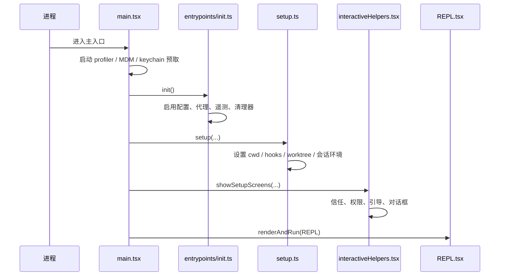

# 第 3 章 启动链路与初始化过程

## 学习目标

- 理解程序从入口到进入 REPL 的完整启动过程
- 认识启动阶段为何要拆成 `main.tsx`、`init.ts`、`setup.ts`、`interactiveHelpers.tsx`
- 学会识别大型 CLI 应用中的“冷启动优化”写法

## 本章在学习路线中的位置

这一章属于第二阶段，是“把系统真正跑起来”必须先跨过去的一步。  
如果学生不知道程序如何从入口文件一路走到 REPL，那么后面看到 `QueryEngine`、`Tool`、`AppState` 时，就会像是在看一台已经发动起来的机器，却不知道发动机是怎么点火的。

## 学生在这一章最容易看漏的三件事

### 第一，不要把启动理解成“找到 main 函数”

在这套系统里，启动过程不只是执行入口文件，而是包括：

- 冷启动性能优化
- 全局配置和环境准备
- 会话与目录状态确定
- REPL 交互环境建立

### 第二，不要把 `main.tsx` 看成普通页面入口

它在这里更像一名总装工程师，负责把命令行参数、配置、MCP、插件、状态、启动策略和最终界面装配到一起。

### 第三，不要忽略启动阶段里的“工程化意图”

像 profiler、keychain prefetch、lazy require、feature gate 这些写法，都是工程系统非常值得学生学习的部分。

## 建议的阅读顺序

读这一章时，建议按下面顺序推进：

1. 先看 `main.tsx` 开头的启动前置动作。
2. 再看 `entrypoints/init.ts` 做了哪些全局初始化。
3. 再看 `setup.ts` 如何为当前会话准备工作目录、worktree、tmux、hooks 等环境。
4. 最后回到 `interactiveHelpers.tsx` 和 `REPL.tsx`，理解“启动完成”在系统里意味着什么。

## 3.1 启动相关核心文件

| 文件 | 角色 |
| --- | --- |
| `src/main.tsx` | 程序主入口，做启动编排 |
| `src/entrypoints/init.ts` | 初始化全局基础设施 |
| `src/setup.ts` | 会话启动前准备 |
| `src/interactiveHelpers.tsx` | 把启动前后的交互流程包装成统一帮助函数 |
| `src/screens/REPL.tsx` | 真正的主交互界面 |

## 3.2 `main.tsx` 的职责

`main.tsx` 的代码量非常大，原因不是“写得乱”，而是它承担了真正的装配中心职责。  
从源码开头可以直接看出三个重要特点：

1. 它非常重视冷启动性能  
   开头先执行 `profileCheckpoint`、`startMdmRawRead()`、`startKeychainPrefetch()`，明显是在把慢操作前移并并行化。

2. 它非常重视特性裁剪  
   大量使用 `feature('...')` 和惰性 `require()`，说明构建产物会按特性裁剪代码。

3. 它是系统装配器  
   命令、工具、MCP、设置、策略、模型、会话恢复、远程连接等都在这里汇总。

## 3.3 `entrypoints/init.ts` 的职责

`init.ts` 负责做“全局基础设施初始化”，它更像内核初始化而不是业务初始化。典型动作包括：

- 启用配置系统
- 应用安全环境变量
- 预处理 CA 证书与代理
- 预连 Anthropic API
- 初始化遥测与一方事件日志
- 初始化远程设置与策略加载 Promise
- 注册清理逻辑
- 初始化 scratchpad 目录

一个重要观察是：  
`init()` 不是把所有事情同步做完，而是把“必须阻塞的事情”和“可以后台预热的事情”区分开了。

## 3.4 `setup.ts` 的职责

如果说 `init.ts` 解决“全局系统是否就绪”，那么 `setup.ts` 解决的是“当前会话是否就绪”。  
它主要处理：

- Node 版本检查
- 会话 ID 切换
- UDS 消息服务器启动
- teammate 快照
- 终端备份恢复
- cwd 设置
- hooks 快照与监听
- worktree/tmux 创建

这说明系统把“程序级初始化”和“会话级初始化”分离得很清楚。

## 3.5 启动时序图

## 3.6 启动优化值得学生注意的地方

### 1. 提前触发慢 I/O

`main.tsx` 一开始就触发 MDM 与 keychain 读取，这是一种典型的“隐藏延迟”设计。  
教师可以强调：优化不一定是“算法更快”，也可能是“启动更早”。

### 2. 惰性加载重模块

很多模块并不在顶层立即引入，而是等到对应功能真的打开时再 `require()`。  
这能降低首屏负担，也能避免循环依赖。

### 3. 先安全、后完全

`init.ts` 里先调用 `applySafeConfigEnvironmentVariables()`，而完整环境变量要等信任流程通过后再应用。  
这体现出安全边界先于便利性。

### 4. 初始化与运行拆分

`interactiveHelpers.tsx` 把“显示引导对话框”“渲染主界面”“退出时清理”这些模式统一封装，避免主流程散乱。

## 3.7 课堂讲解建议

讲这一章时，可以让学生先回答两个问题：

1. 为什么不把所有逻辑都写进 `main.tsx`？
2. 为什么启动流程里会出现这么多“并行预热”和“惰性导入”？

如果学生能回答：

- 为了分离程序级初始化和会话级初始化
- 为了加快冷启动并减少模块耦合

那么他们已经真正理解了这段启动链。

## 本章小结

启动链路的核心不是“先后调用了哪些函数”，而是：

> 系统在启动阶段就已经体现出工程目标：快启动、可裁剪、可扩展、受信任、可恢复。

## 思考题

1. 为什么 `init()` 中有些任务要 fire-and-forget，而有些必须 `await`？
2. 如果把 `setup.ts` 的逻辑放回 `main.tsx`，会带来哪些维护问题？
3. 你还能在这条启动链上识别出哪些“防止循环依赖”的设计？
