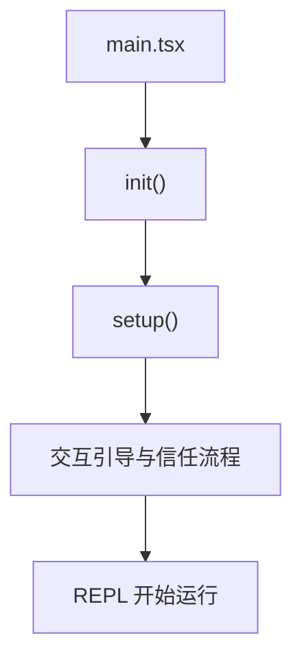
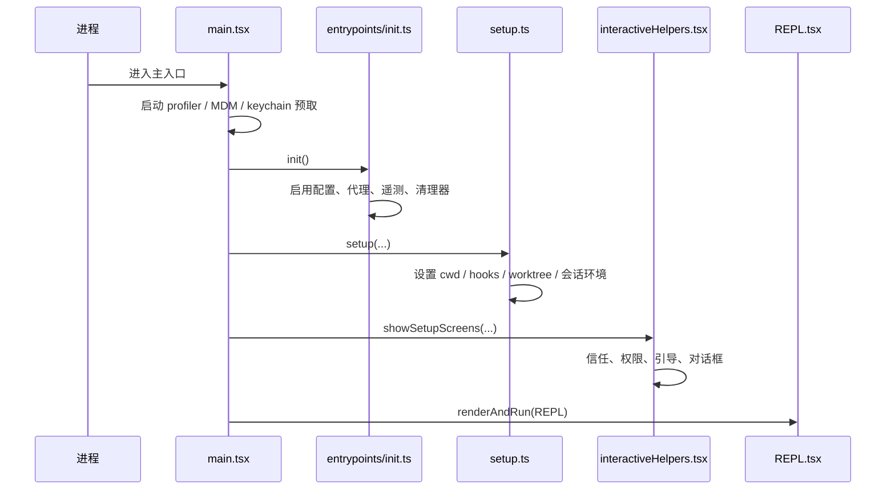

# 第 7 章 启动链路与初始化过程

## 本章目标
- 看清程序从 `main.tsx` 进入可交互状态之前，究竟做了哪些准备工作。
- 理解启动阶段为什么同时关心安全边界、冷启动体验、配置预热和会话环境。
- 学会从启动链读出作者的工程偏好，而不是只记函数先后顺序。

## 先修关系
- 建议先读第 6 章，至少已经知道启动链属于总装配层。
- 如已看过第 1 章，看到 REPL、会话环境、信任流程会更自然。
- 本章最好和第 5 章对照着读，这样能同时看到“启动前”和“请求时”的区别。

## 关键词
- `main.tsx`：这是程序装配入口，不是普通页面入口文件。
- `init`：程序级初始化逻辑，负责配置、遥测、预热和清理器注册。
- `setup`：把工作目录、会话、hook 和信任上下文整理成可运行状态。
- `预热`：启动阶段会主动触发一批慢 I/O，以缩短用户真正开始交互时的等待。
- `惰性加载`：不是所有模块都在启动瞬间载入，重模块会按需导入以控制冷启动成本。

## 正文图解

## 关键数据结构
| 结构/对象 | 在本章中的位置 | 阅读时要抓什么 |
| --- | --- | --- |
| `启动链` | 从进程入口到 REPL 渲染之间的调用主线。 | 这是后续理解整个运行时的第一层入口。 |
| `安全配置阶段` | 先应用安全环境，再等待信任与完整配置放开。 | 它体现“先安全后便利”的启动策略。 |
| `会话环境对象` | 工作目录、projectRoot、hooks 等启动期产物。 | 这些对象会被后续查询与工具系统反复读取。 |
| `惰性导入点` | 真正重量级模块不会在顶层全部拉进来。 | 它有助于理解启动优化和耦合控制。 |

## 本章在学习路线中的位置

这一章属于第二阶段，是“把系统真正跑起来”必须先跨过去的一步。
如果读者不知道程序如何从入口文件一路走到 REPL，那么后面看到 `QueryEngine`、`Tool`、`AppState` 时，就会像是在看一台已经发动起来的机器，却不知道发动机是怎么点火的。

## 读者在这一章最容易看漏的三件事

### 第一，不要把启动理解成“找到 main 函数”

在这套系统里，启动过程不只是执行入口文件，而是包括：

- 冷启动性能优化
- 全局配置和环境准备
- 会话与目录状态确定
- REPL 交互环境建立

### 第二，不要把 `main.tsx` 看成普通页面入口

它在这里更像一名总装工程师，负责把命令行参数、配置、MCP、插件、状态、启动策略和最终界面装配到一起。

### 第三，不要忽略启动阶段里的“工程化意图”

像 profiler、keychain prefetch、lazy require、feature gate 这些写法，都是工程系统非常值得读者学习的部分。

## 建议的阅读顺序

读这一章时，建议按下面顺序推进：

1. 先看 `main.tsx` 开头的启动前置动作。
2. 再看 `entrypoints/init.ts` 做了哪些全局初始化。
3. 再看 `setup.ts` 如何为当前会话准备工作目录、worktree、tmux、hooks 等环境。
4. 最后回到 `interactiveHelpers.tsx` 和 `REPL.tsx`，理解“启动完成”在系统里意味着什么。

## 3.1 启动相关核心文件

| 文件 | 角色 |
| --- | --- |
| `src/main.tsx` | 程序主入口，做启动编排 |
| `src/entrypoints/init.ts` | 初始化全局基础设施 |
| `src/setup.ts` | 会话启动前准备 |
| `src/interactiveHelpers.tsx` | 把启动前后的交互流程包装成统一帮助函数 |
| `src/screens/REPL.tsx` | 真正的主交互界面 |

## 3.2 `main.tsx` 的职责

`main.tsx` 的代码量非常大，原因不是“写得乱”，而是它承担了真正的装配中心职责。
从源码开头可以直接看出三个重要特点：

1. 它非常重视冷启动性能
   开头先执行 `profileCheckpoint`、`startMdmRawRead()`、`startKeychainPrefetch()`，明显是在把慢操作前移并并行化。

2. 它非常重视特性裁剪
   大量使用 `feature('...')` 和惰性 `require()`，说明构建产物会按特性裁剪代码。

3. 它是系统装配器
   命令、工具、MCP、设置、策略、模型、会话恢复、远程连接等都在这里汇总。

## 3.3 `entrypoints/init.ts` 的职责

`init.ts` 负责做“全局基础设施初始化”，它更像内核初始化而不是业务初始化。典型动作包括：

- 启用配置系统
- 应用安全环境变量
- 预处理 CA 证书与代理
- 预连 Anthropic API
- 初始化遥测与一方事件日志
- 初始化远程设置与策略加载 Promise
- 注册清理逻辑
- 初始化 scratchpad 目录

一个重要观察是：
`init()` 不是把所有事情同步做完，而是把“必须阻塞的事情”和“可以后台预热的事情”区分开了。

## 3.4 `setup.ts` 的职责

如果说 `init.ts` 解决“全局系统是否就绪”，那么 `setup.ts` 解决的是“当前会话是否就绪”。
它主要处理：

- Node 版本检查
- 会话 ID 切换
- UDS 消息服务器启动
- teammate 快照
- 终端备份恢复
- cwd 设置
- hooks 快照与监听
- worktree/tmux 创建

这说明系统把“程序级初始化”和“会话级初始化”分离得很清楚。

## 3.5 启动时序图

### `main.tsx`、`init()` 与 `setup()` 的输入输出边界

源码中的启动链之所以清晰，不是因为文件少，而是因为三个关键阶段的输入输出边界比较明确。

| 阶段 | 主要输入 | 主要输出 | 本质职责 |
| --- | --- | --- | --- |
| `main.tsx` | 命令行参数、环境变量、启动模式、上次会话信息 | 已装配的顶层依赖、要进入的启动分支 | 做“总装配决策” |
| `entrypoints/init.ts` | 全局配置、平台能力、网络与证书配置 | 已准备好的全局基础设施 | 做“全局初始化” |
| `setup.ts` | cwd、sessionId、权限模式、worktree/tmux 参数 | 已就绪的当前会话环境 | 做“本次会话落地” |

这张表看似简单，但它解释了一个很重要的问题：

> 启动链之所以要拆成多个文件，不是为了目录好看，而是为了让“全局问题”和“当前会话问题”分开收束。

### `main.tsx` 最早做的事情透露了启动策略

在这套系统里，入口文件最早做的并不是界面渲染，而是冷启动优化与前置探测。源码已经表明，`main.tsx` 会在很早的阶段启动 profiler、凭据相关预取或其它慢 I/O。这样做有三重意义：

1. 尽早把不可避免的慢操作并行化。
2. 在真正进入交互前完成尽可能多的后台准备。
3. 把启动阶段的性能成本暴露为可观测对象，而不是“感觉有点慢”的黑盒体验。

这类写法代表的是一种成熟的终端应用工程观：
启动链不是单纯的“执行顺序”，而是“延迟如何被隐藏”和“风险如何被前置”的设计问题。

### `init()` 真正做的是“全局基础设施就绪”

`entrypoints/init.ts` 中最关键的不是某个单独 API 调用，而是它体现出的阶段划分。根据源码，可把它概括成六类工作：

1. 配置系统就绪：启用配置、处理安全环境变量、应用额外 CA 证书。
2. 退出语义就绪：注册优雅关闭逻辑，确保后续缓冲写入和清理器有机会运行。
3. 后台预热就绪：异步启动一方事件日志、OAuth 账户补全、JetBrains 探测、仓库探测、远程设置与策略加载 Promise。
4. 网络栈就绪：配置 mTLS、代理代理、API preconnect，以及远程模式下的 upstream proxy。
5. 平台适配就绪：处理 Windows shell、LSP 清理器、scratchpad 目录等平台相关事项。
6. 错误分流就绪：对配置错误和非配置错误采取不同的处理路径。

这六类工作里，只有一部分必须阻塞当前启动；其余部分会被主动改写成后台 Promise 或 fire-and-forget 预热任务。
这正是教材中应特别强调的工程意识：启动阶段的关键不只是“做了什么”，更是“哪些必须先做，哪些可以并行做”。

### `setup.ts` 真正做的是“把这次会话安放到具体环境里”

`setup.ts` 很容易被误读成一个杂项文件，因为里面既有 Node 版本检查，也有 worktree、tmux、terminal backup、UDS messaging。
实际上，这些工作都指向同一个目标：把“抽象的全局程序”落到“这一次具体会话”的工作现场中。

从源码顺序看，`setup.ts` 至少完成了以下几项关键动作：

1. 确认当前运行时是否满足最低版本要求。
2. 处理 sessionId 切换，使后续所有日志、转录与恢复路径都落到正确会话上。
3. 在需要时启动 UDS 消息服务，为 hook、队列消息和同进程/跨进程协调提供通信坐标。
4. 恢复可能被上次异常中断的终端设置，避免本次会话建立在损坏的环境上。
5. 尽早调用 `setCwd(cwd)`，使后续 hook、Git 检测、工作目录计算全部建立在正确目录上。
6. 捕获 hooks 配置快照并启动文件变更监听器，为后续 SessionStart、FileChanged 等钩子提供稳定基线。
7. 在需要时创建 worktree、tmux 会话，并把当前会话迁移到新的工程现场。

这里最值得强调的一点是顺序敏感性。
例如 `setCwd(cwd)` 之所以必须很早发生，是因为后面的 hook 快照与 Git/worktree 逻辑都依赖于它。一旦顺序颠倒，配置快照和环境快照就会从错误目录读取，后果不是“少一个优化”，而是“整个会话落到错误的项目语境中”。

### 启动阶段其实在构造一个“可运行前提集合”

如果把启动链看成一条长函数，很容易只关注先后顺序。更准确的视角是：启动阶段在为后续所有模块构造一组必须成立的前提条件。
至少包括：

- 当前工作目录已经确定。
- 当前会话 ID 已经确定。
- 权限模式与信任边界已经建立。
- 配置系统已经启用。
- 网络栈和证书栈已经进入可用状态。
- 会话相关的 hook、watcher、worktree 或 tmux 已经按需建立。
- REPL 所依赖的顶层状态与渲染上下文已经准备好。

只要这组前提里有一项不成立，后面的主循环、工具系统或恢复系统都可能在完全不同的地方暴露出问题。
因此，启动代码虽然看起来像“准备工作”，但它实际上在决定整套系统的正确运行边界。

## 3.6 启动优化值得读者注意的地方

### 1. 提前触发慢 I/O

`main.tsx` 一开始就触发 MDM 与 keychain 读取，这是一种典型的“隐藏延迟”设计。
这里最值得记住的一句话是：优化不一定是“算法更快”，也可能是“启动更早”。

### 2. 惰性加载重模块

很多模块并不在顶层立即引入，而是等到对应功能真的打开时再 `require()`。
这能降低首屏负担，也能避免循环依赖。

### 3. 先安全、后完全

`init.ts` 里先调用 `applySafeConfigEnvironmentVariables()`，而完整环境变量要等信任流程通过后再应用。
这体现出安全边界先于便利性。

### 4. 初始化与运行拆分

`interactiveHelpers.tsx` 把“显示引导对话框”“渲染主界面”“退出时清理”这些模式统一封装，避免主流程散乱。

## 3.7 本章复盘提示

读完这一章后，先回答两个问题：

1. 为什么不把所有逻辑都写进 `main.tsx`？
2. 为什么启动流程里会出现这么多“并行预热”和“惰性导入”？

如能回答：

- 为了分离程序级初始化和会话级初始化
- 为了加快冷启动并减少模块耦合

那么这段启动链就已经被真正理解。

## 3.8 语言无关重建视角

启动链是整套系统的“前置约束生成器”。无论改用 Go、Rust、Python 还是 Java，实现时都需要保留四个阶段：

1. 进程级预热：尽早触发慢 I/O，例如配置读取、凭据预取、设备或策略探测。
2. 全局初始化：建立日志、遥测、代理、清理器、默认设置与全局 feature gates。
3. 会话初始化：解析 cwd、sessionId、worktree、hooks、权限模式与恢复信息。
4. 交互接管：进入信任流程、引导对话框、REPL 渲染与事件循环。

`main.tsx`、`entrypoints/init.ts` 与 `setup.ts` 的价值就在于把这四类工作拆开，从而避免“所有启动代码挤在一个入口函数里”。

### 输入输出契约

从实现角度看，启动链的输入不是单一配置文件，而是一组异质信息源：

- 命令行参数
- 环境变量
- 本地与远程设置
- 平台能力探测结果
- 上次会话的恢复信息
- 当前工作目录与 Git 环境

输出也不是“启动成功”这么简单，而是一组稳定的运行前提：

- 已初始化的全局配置
- 已确定的 session 坐标
- 已建立的权限模式与安全边界
- 已准备好的根状态与根渲染上下文
- 已可进入交互的 REPL 主界面

### 必须保留的设计约束

从源码可归纳出三条不可删减的启动约束：

- 安全先于便利：安全环境变量与信任流程优先于完整功能加载。
- 预热先于阻塞：可并行的慢操作应当尽量前置，以压缩首交互延迟。
- 初始化先于运行：环境装配与会话执行不可混成一个阶段，否则恢复、worktree、权限与 UI 很快会互相污染。

### 最小实现顺序

若在另一种语言中重写启动层，建议按以下顺序实现：

1. 构建 `BootstrapConfig` 与 `SessionConfig` 两个层级的配置对象。
2. 实现平台探测与凭据预热，使慢 I/O 可与模块加载并行。
3. 实现全局初始化器，统一处理日志、代理、设置与清理注册表。
4. 实现会话初始化器，统一处理 cwd、sessionId、恢复信息与 worktree。
5. 实现交互入口，让 REPL 或 headless 模式在同一启动骨架下切换。
6. 最后再补充延迟加载、恢复分支与对话框分支等优化逻辑。

## 重建蓝图：把启动过程写成稳定的装配流水线

### 必须保留的抽象

1. 启动过程至少分成五个阶段：环境解析、配置装配、服务初始化、状态恢复、交互容器挂载。跨语言重写时，哪怕文件数量减少，也不应把这五步混成一个大函数。
2. 启动上下文对象必须显式存在。它至少携带 cwd、权限模式、模型配置、插件/技能发现结果、持久化句柄与初始 UI 状态。
3. 初始化函数应当是幂等且可失败回滚的。某一个子系统初始化失败时，系统应能停在清晰的错误状态，而不是让 REPL 一半可用、一半未初始化。
4. 配置解析与界面启动必须解耦。前者决定系统能否运行，后者决定系统如何呈现，两者应通过共享上下文连接而不是交叉嵌套。

### 最小实现顺序

1. 先写一个纯函数式的配置构造器，把环境变量、启动参数和默认配置合并为稳定配置对象。这一步应尽量不产生副作用，便于测试。
2. 再写服务装配器，负责创建模型客户端、持久化句柄、扩展发现器、工具池依赖和状态存储器。它返回“已准备好的依赖集合”。
3. 第三步写状态恢复器。它根据启动参数判断是否载入历史会话、是否恢复任务上下文、是否注入已有 transcript。
4. 第四步再挂载交互容器，把上文得到的依赖与初始状态交给 REPL。到这里界面才真正可渲染。
5. 最后补入启动横切逻辑，例如欢迎信息、版本检查、首次运行提示、背景任务恢复提示等。这些逻辑属于启动末端增强，不应反客为主。

### 最容易写错的边界

1. 最常见的错误是在渲染函数内部做异步初始化，导致界面已经进入事件循环，但服务尚未准备好。原工程通过明确的启动序列避免了这一点。
2. 第二类错误是在状态恢复之前就向用户宣告“系统已可用”。如果 transcript、工具池或命令注册尚未就绪，之后的第一条输入往往会出现难以诊断的异常。
3. 第三类错误是将插件加载放到首次请求时再做。这样做表面上缩短了启动时间，实际上会让第一次请求承担额外的不确定性，并破坏命令与工具视图的一致性。
4. 第四类错误是没有把启动失败当成一级设计对象。跨语言实现时，应明确哪些异常可以降级、哪些异常必须阻断程序进入交互状态。

## 章末小结
- 本章围绕“启动链、预热策略和安全边界”重建了一层稳定理解，避免只记零散函数名或目录名。
- 真正需要沉淀下来的，不只是 `main.tsx`、`init`、`setup` 这几个词，而是它们在 `启动链`、`安全配置阶段`、`会话环境对象` 里的相互位置。
- 如后续在 第 19 章和第 5 章 中再次迷路，优先回看本章的“先修关系、正文图解、关键数据结构”三部分。

## 章末自测
1. 不看原文，用自己的话重述本章围绕“启动链、预热策略和安全边界”到底解决了什么问题。
2. 结合“正文图解”，把 `init()` 到 `交互引导与信任流程` 之间的连接关系重新讲一遍。
3. 对比 `启动链` 与 `安全配置阶段`：它们分别回答什么问题，边界为什么不能混掉？
4. 在 `main.tsx`、`init`、`setup` 中任选两个，说明它们在本章中是如何互相作用的。
5. 如果后续要继续读 第 19 章和第 5 章，本章哪一部分最值得先回看？为什么？
