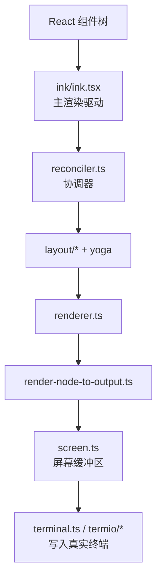

# 第 4 章 REPL、Ink 与状态管理

## 学习目标

- 理解这套系统的 UI 为什么不只是“打印文本”
- 认识 `REPL.tsx`、`AppStateStore.ts`、`ink/` 三者的关系
- 学会从状态切片视角理解复杂交互界面

## 4.1 表现层的三根支柱

这一层主要由三部分构成：

| 组成 | 代表文件 | 作用 |
| --- | --- | --- |
| REPL 编排层 | `src/screens/REPL.tsx` | 主界面、输入、消息、任务、通知统一装配 |
| 状态层 | `src/state/AppStateStore.ts`、`src/state/AppState.tsx` | 管理会话与 UI 状态 |
| 终端渲染层 | `src/ink.ts`、`src/ink/` | 自定义终端渲染引擎 |

## 4.2 `REPL.tsx` 为什么这么大

`REPL.tsx` 很长，不代表它只是“一个大组件”，而是因为它承担了终端主界面的总控职责：

- 接收用户输入
- 展示消息列表
- 挂接权限弹窗、提示弹窗、MCP 弹窗
- 管理任务列表与 teammate 视图
- 组合工具池、命令池、MCP 客户端
- 驱动查询主循环
- 处理远程会话、IDE 集成、队列处理、通知、快捷键

可以把它理解为“终端应用的 Shell 层”。

## 4.3 `AppStateStore.ts` 告诉我们的事

`AppState` 的字段非常多，但它们不是杂乱堆积，而是可以分成若干类：

| 状态类别 | 典型字段 |
| --- | --- |
| 基础会话状态 | `settings`、`verbose`、`mainLoopModel` |
| 视图状态 | `expandedView`、`footerSelection`、`viewSelectionMode` |
| 远程/桥接状态 | `remoteConnectionStatus`、`replBridgeEnabled` |
| 任务状态 | `tasks`、`foregroundedTaskId`、`viewingAgentTaskId` |
| 扩展状态 | `mcp`、`plugins`、`agentDefinitions` |
| 安全状态 | `toolPermissionContext` |
| 辅助能力状态 | `todos`、`notifications`、`elicitation`、`thinkingEnabled` |

这说明作者并没有把状态只看成 React 局部状态，而是把它当作“会话操作系统的运行态”。

## 4.4 为什么要自定义 `ink`

`src/ink.ts` 与 `src/ink/` 的存在表明，这个项目没有满足于直接使用标准 CLI 渲染层。  
从 `ink/ink.tsx`、`ink/renderer.ts`、`ink/render-to-screen.ts` 可以看出它做了很多底层控制：

- 自己管理 React Reconciler 容器
- 自己做 Yoga 布局计算
- 自己维护 screen buffer、style pool、char pool
- 自己做 frame diff
- 支持 alt screen、搜索高亮、选择、鼠标事件、光标定位

这意味着它更像一个“终端图形界面引擎”。

## 4.5 Ink 子系统的结构

## 4.6 这套 UI 设计对课堂最有价值的地方

### 1. 终端应用也有“前端架构”

很多学生会误以为终端程序就是命令行输入输出。  
这份代码很好地说明：终端也可以有组件树、状态树、事件系统、布局引擎和渲染优化。

### 2. 状态不是为了“刷新页面”，而是为了“组织复杂交互”

例如：

- 后台任务要不要出现在主视图
- 当前是否正在看 teammate 视图
- 权限弹窗和 elicitation 弹窗谁优先
- 工具池是否因 MCP 变化而刷新

这些问题都不是单个组件能独立处理的。

### 3. REPL 是“控制台 Shell”，不是普通页面

`REPL.tsx` 汇集了大量 Hook 和子系统，是因为它要像桌面应用的 shell 一样协调整个运行时。

## 4.7 建议学生重点观察的文件

- `src/screens/REPL.tsx`：看主界面如何装配所有能力
- `src/state/AppStateStore.ts`：看状态空间如何定义
- `src/state/AppState.tsx`：看状态如何暴露给组件
- `src/ink/ink.tsx`：看渲染循环如何实现
- `src/ink/renderer.ts`：看布局到屏幕缓冲区的转换
- `src/ink/render-to-screen.ts`：看搜索/高亮等离屏渲染策略

## 本章小结

这一章最关键的认识是：

> 这套系统的前端不是 Web 前端，但它仍然拥有完整的前端工程结构，只不过渲染目标从浏览器 DOM 变成了终端屏幕缓冲区。

## 思考题

1. 为什么 `REPL.tsx` 适合作为“系统 Shell”而不是普通页面组件？
2. `AppState` 字段很多，这是一种坏味道吗？为什么？
3. 如果没有自定义 `ink`，这个系统最可能失去哪些能力？
