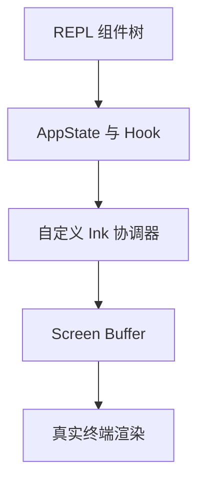
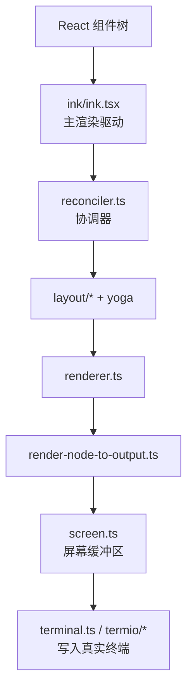

# 第 4 章 REPL、Ink 与状态管理

## 本章目标
- 理解这套系统为什么必须把终端当作真正的交互界面，而不是命令输出窗口。
- 看清 REPL、AppState、Hooks 和自定义 Ink 渲染栈之间的协作关系。
- 建立“终端前端架构”意识，知道状态复杂度为什么会在这里爆炸。

## 先修关系
- 建议先读第 2 章和第 3 章，先知道 UI 壳层在系统总图中的位置。
- 如已读过第 15 章，REPL 和终端渲染的概念门槛会更低。
- 本章适合与第 18 章配合阅读，前者看 UI 状态，后者看全系统状态层次。

## 关键词
- `REPL`：它是整套终端应用的交互外壳，而不是只负责收输入的组件。
- `AppState`：一个很大的应用状态树，承载模型、任务、MCP、通知、权限等状态。
- `Ink 渲染栈`：项目没有停留在普通库使用层，而是深度控制了终端渲染行为。
- `选择器与 Hook`：复杂 UI 逻辑被拆散成可复用的状态切片和交互逻辑。
- `屏幕缓冲区`：终端最终不是直接打印字符串，而是经过布局、diff 和 buffer 再写屏。

## 正文图解

## 关键数据结构
| 结构/对象 | 在本章中的位置 | 阅读时要抓什么 |
| --- | --- | --- |
| `AppState` | UI 与运行时交汇处的主状态树。 | 它是理解界面复杂度的第一入口。 |
| `Render Pipeline` | 组件树经过布局与 diff 才会落到屏幕。 | 它解释终端 UI 为什么也有前端工程味。 |
| `Task 状态切片` | 后台任务、agent 任务和前台视图共享同一应用状态。 | 它决定任务如何可见、可切换、可恢复。 |
| `交互通道` | 键盘、通知、弹窗、搜索和选择高亮等事件入口。 | 这些通道说明 REPL 是一个长期交互壳层。 |

## 本章在学习路线中的位置

这一章位于第四阶段，也就是读者在已经理解了主链路和能力层之后，回头补“系统是怎么被用户真正看见和操作的”。  
如果没有这一章，读者会知道请求怎么跑，却不知道系统为什么能呈现出如此复杂的终端交互效果。

## 读者最容易误判的地方

### 误判一：以为 UI 只是外壳

在这套系统里，REPL 不只是显示层，它还是输入调度、权限弹窗、任务视图、通知、命令和工具上下文的装配器。

### 误判二：以为终端 UI 不需要复杂状态

恰恰相反。  
终端界面越是交互式、越是带任务和多代理，状态问题越复杂。

### 误判三：以为 `ink/` 只是 React 的一个薄包装

源码表明这里有一整套较重的终端渲染子系统，这正是项目理解门槛的重要来源之一。

## 读这一章时要同时抓住的两条线

1. 看得见的 UI 线：消息、输入框、弹窗、任务面板、通知是怎么组合出来的。
2. 看不见的状态线：这些界面元素分别依赖哪些状态切片，状态变化又怎样传回系统其它层。

## 4.1 表现层的三根支柱

这一层主要由三部分构成：

| 组成 | 代表文件 | 作用 |
| --- | --- | --- |
| REPL 编排层 | `src/screens/REPL.tsx` | 主界面、输入、消息、任务、通知统一装配 |
| 状态层 | `src/state/AppStateStore.ts`、`src/state/AppState.tsx` | 管理会话与 UI 状态 |
| 终端渲染层 | `src/ink.ts`、`src/ink/` | 自定义终端渲染引擎 |

## 4.2 `REPL.tsx` 为什么这么大

`REPL.tsx` 很长，不代表它只是“一个大组件”，而是因为它承担了终端主界面的总控职责：

- 接收用户输入
- 展示消息列表
- 挂接权限弹窗、提示弹窗、MCP 弹窗
- 管理任务列表与 teammate 视图
- 组合工具池、命令池、MCP 客户端
- 驱动查询主循环
- 处理远程会话、IDE 集成、队列处理、通知、快捷键

可以把它理解为“终端应用的 Shell 层”。

## 4.3 `AppStateStore.ts` 告诉我们的事

`AppState` 的字段非常多，但它们不是杂乱堆积，而是可以分成若干类：

| 状态类别 | 典型字段 |
| --- | --- |
| 基础会话状态 | `settings`、`verbose`、`mainLoopModel` |
| 视图状态 | `expandedView`、`footerSelection`、`viewSelectionMode` |
| 远程/桥接状态 | `remoteConnectionStatus`、`replBridgeEnabled` |
| 任务状态 | `tasks`、`foregroundedTaskId`、`viewingAgentTaskId` |
| 扩展状态 | `mcp`、`plugins`、`agentDefinitions` |
| 安全状态 | `toolPermissionContext` |
| 辅助能力状态 | `todos`、`notifications`、`elicitation`、`thinkingEnabled` |

这说明作者并没有把状态只看成 React 局部状态，而是把它当作“会话操作系统的运行态”。

## 4.4 为什么要自定义 `ink`

`src/ink.ts` 与 `src/ink/` 的存在表明，这个项目没有满足于直接使用标准 CLI 渲染层。  
从 `ink/ink.tsx`、`ink/renderer.ts`、`ink/render-to-screen.ts` 可以看出它做了很多底层控制：

- 自己管理 React Reconciler 容器
- 自己做 Yoga 布局计算
- 自己维护 screen buffer、style pool、char pool
- 自己做 frame diff
- 支持 alt screen、搜索高亮、选择、鼠标事件、光标定位

这意味着它更像一个“终端图形界面引擎”。

## 4.5 Ink 子系统的结构

## 4.6 这套 UI 设计最值得记住的地方

### 1. 终端应用也有“前端架构”

很多读者会误以为终端程序就是命令行输入输出。  
这份代码很好地说明：终端也可以有组件树、状态树、事件系统、布局引擎和渲染优化。

### 2. 状态不是为了“刷新页面”，而是为了“组织复杂交互”

例如：

- 后台任务要不要出现在主视图
- 当前是否正在看 teammate 视图
- 权限弹窗和 elicitation 弹窗谁优先
- 工具池是否因 MCP 变化而刷新

这些问题都不是单个组件能独立处理的。

### 3. REPL 是“控制台 Shell”，不是普通页面

`REPL.tsx` 汇集了大量 Hook 和子系统，是因为它要像桌面应用的 shell 一样协调整个运行时。

## 4.7 建议读者重点观察的文件

- `src/screens/REPL.tsx`：看主界面如何装配所有能力
- `src/state/AppStateStore.ts`：看状态空间如何定义
- `src/state/AppState.tsx`：看状态如何暴露给组件
- `src/ink/ink.tsx`：看渲染循环如何实现
- `src/ink/renderer.ts`：看布局到屏幕缓冲区的转换
- `src/ink/render-to-screen.ts`：看搜索/高亮等离屏渲染策略

## 重建蓝图：把界面层还原为状态投影系统

### 必须保留的抽象

1. 重写时必须坚持“UI 是状态投影，不是业务中枢”。`REPL.tsx` 之所以巨大，是因为它承担了显示、输入、滚动、通知、任务面板等容器职责，而不是因为它在替代 QueryEngine 做决策。
2. 至少要把状态拆成三类：渲染态、执行态、持久态。渲染态服务于组件显示，执行态驱动会话与工具逻辑，持久态决定进程重启后可以恢复什么。
3. AppStateStore 必须表现为单一的状态入口与订阅源。无论底层语言用 signal、observable、event emitter 还是 reducer，其外部契约都应保持“集中修改、可订阅、可快照”。
4. 视口系统应被视为单独的基础设施。原工程自定义 Ink 组件的原因，在于终端渲染与 Web UI 不同，滚动、测量和重排本身就是一套运行时。

### 最小实现顺序

1. 先定义 `AppState` 的最小形状，包括消息列表、输入框状态、当前任务、通知、模式切换与会话元数据。若这一步含糊，后续所有组件都会各自保存私有副本。
2. 第二步实现 Store 的基本 API：读取当前值、原子更新、订阅变化、派生快照。任何组件都不应绕过这组 API 直接共享可变对象。
3. 第三步实现 REPL 容器，将输入组件、消息列表、状态栏、任务区域组合起来。此时即便只显示静态假数据，也要先把界面骨架立住。
4. 第四步接入执行态事件流，让 QueryEngine、工具执行器、后台任务管理器都只通过 Store 反映状态变化，而不是直接操纵界面组件。
5. 第五步再优化滚动、焦点、搜索、高亮与性能细节。这些属于表现层增强，应建立在状态投影正确之上。

### 最容易写错的边界

1. 最危险的错误是把消息列表既当作渲染源，又当作持久化真相源，还当作 QueryEngine 可随意修改的临时缓冲区。正确做法是明确谁拥有写入权、谁只做投影。
2. 第二类错误是把进度条、临时通知、滚动位置等短生命周期数据落入 durable store。这样会让恢复逻辑变得怪异，并放大状态污染。
3. 第三类错误是忽略终端渲染的约束，直接照搬 Web UI 的思路。终端界面的滚动、光标、重绘节奏、宽度计算都与浏览器截然不同，因此原工程才需要 Ink 子系统与 ScrollBox 一类底层部件。
4. 第四类错误是由组件直接订阅外部服务而不经 Store，这会造成状态源头分裂，最终难以判定谁代表“当前真实会话”。

## 章末小结
- 本章围绕“REPL 壳层、AppState 树与终端渲染管线”重建了一层稳定理解，避免只记零散函数名或目录名。
- 真正需要沉淀下来的，不只是 `REPL`、`AppState`、`Ink 渲染栈` 这几个词，而是它们在 `AppState`、`Render Pipeline`、`Task 状态切片` 里的相互位置。
- 如后续在 第 18 章和第 30 章 中再次迷路，优先回看本章的“先修关系、正文图解、关键数据结构”三部分。

## 章末自测
1. 不看原文，用自己的话重述本章围绕“REPL 壳层、AppState 树与终端渲染管线”到底解决了什么问题。
2. 结合“正文图解”，把 `AppState 与 Hook` 到 `Screen Buffer` 之间的连接关系重新讲一遍。
3. 对比 `AppState` 与 `Render Pipeline`：它们分别回答什么问题，边界为什么不能混掉？
4. 在 `REPL`、`AppState`、`Ink 渲染栈` 中任选两个，说明它们在本章中是如何互相作用的。
5. 如果后续要继续读 第 18 章和第 30 章，本章哪一部分最值得先回看？为什么？
