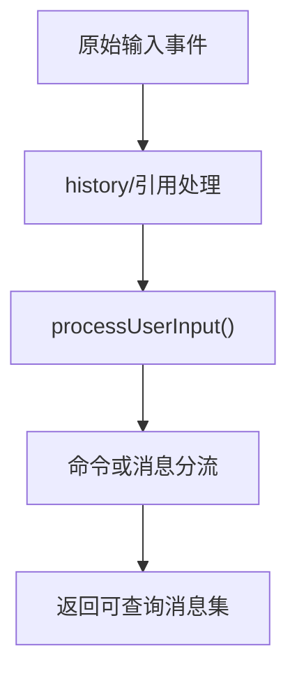
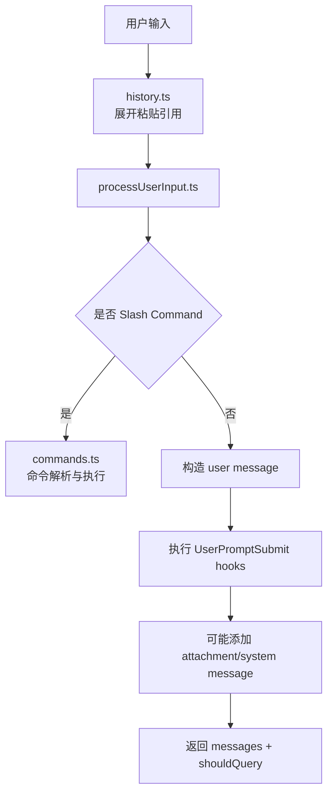

# 第 5 章 输入处理与消息模型

## 本章目标
- 理解用户输入为什么不会直接进入模型，而是要先被规范化成消息系统里的对象。
- 看清文本输入、附件、引用展开、Slash Command 和 Hook 是怎样在输入层分流的。
- 建立“消息是系统内部通用语言”的认知，为后面读 Query 主循环打基础。

## 先修关系
- 建议先读第 15 章，先熟悉 REPL、CLI、流式输出等基本词汇。
- 如已浏览过第 16 章，会更容易把本章内容挂到完整请求主线上。
- 本章和第 6 章是强耦合关系：前者讲消息怎么进系统，后者讲消息怎么在系统里流动。

## 关键词
- `processUserInput`：输入预处理的核心文件，负责把用户事件转成系统能消费的结构。
- `message`：系统内部真正流动的不是原始字符串，而是结构化消息对象。
- `attachment`：图片、文件和其它附加材料需要被包装成单独消息或消息片段。
- `Slash Command`：以 `/` 开头的输入不一定进入模型，可能会先走命令系统。
- `输入 Hook`：输入层可以在进入主循环前被插入额外逻辑、上下文或阻断条件。

## 正文图解

## 关键数据结构
| 结构/对象 | 在本章中的位置 | 阅读时要抓什么 |
| --- | --- | --- |
| `ProcessUserInputResult` | 输入层最重要的返回结构。 | 它决定后面是否发起查询、允许哪些工具、产生哪些消息。 |
| `Message 对象` | 用户消息、系统消息、附件消息等统一表示。 | 它是后续 Query、持久化和 UI 共用的数据协议。 |
| `Attachment Message` | 把非纯文本内容变成可跟随会话流动的结构化单元。 | 没有它，多模态能力很难自然接入主链路。 |
| `Command Parse Result` | Slash Command 的匹配与执行结果。 | 它解释为什么“输入层”已经承担了一部分控制流分派职责。 |

## 本章在主链路中的位置

这一章是第二阶段的关键过桥章。
第 3 章解释系统如何启动，第 6 章解释系统如何运行主循环，而这一章解释“用户说的话”到底是怎样变成系统可处理对象的。

## 读者最容易低估的难点

很多读者会以为输入处理只有两步：

1. 读字符串
2. 发给模型

但从源码看，中间至少还有：

- 历史记录
- slash 命令分流
- meta 输入
- 图片和附件
- pasted contents
- IDE 选择上下文
- hook 注入
- 消息对象构造

所以，本章真正要学会的不是“字符串怎么传递”，而是“输入如何正规化”。

## 本章的阅读抓手

读这一章时，请强制自己围绕三个问题看代码：

1. 输入原始形态是什么？
2. 中间消息对象长什么样？
3. 哪些输入根本不会进入模型主循环？

## 5.1 输入层的关键文件

| 文件 | 作用 |
| --- | --- |
| `src/history.ts` | 管理输入历史、粘贴内容引用、历史回放 |
| `src/utils/processUserInput/processUserInput.ts` | 把用户输入转成结构化消息 |
| `src/commands.ts` | 决定哪些 `/命令` 可以被识别 |
| `src/utils/messages.ts` | 构造、规范化和解释消息 |
| `src/utils/sessionStorage.ts` | 把关键消息落盘到会话日志 |

## 5.2 输入并不是“字符串”，而是“待规范化事件”

`processUserInput.ts` 的设计告诉我们：
系统并不把用户输入简单视为一个字符串，而是视为一个待处理事件，它可能包含：

- 纯文本提示词
- Slash command
- 已粘贴的文本引用
- 图片或附件
- IDE 选择内容
- 系统生成但用户不可见的 meta 输入

因此，输入层的任务不是“传给模型”，而是“分类、补全、展开、转换”。

## 5.3 `history.ts` 的意义

`history.ts` 不是普通的命令行历史记录，而是做了两件更高级的事：

### 1. 维护粘贴引用协议

源码里可以看到这类引用：

- `[Pasted text #1]`
- `[Pasted text #1 +10 lines]`
- `[Image #2]`

这意味着系统不会总是把大段粘贴内容直接塞进输入框，而是先把它们外存化，再通过引用回填。

### 2. 区分当前会话与项目级历史

它既支持当前会话优先，也支持跨会话、同项目的历史读取。
这很适合终端 Agent 的使用场景，因为用户会反复在同一项目中工作。

## 5.4 `processUserInput.ts` 的主流程

`processUserInput()` 的核心职责可以概括为五步：

1. 先把用户输入即时显示到 UI
2. 调用 `processUserInputBase()` 判断它是普通 prompt 还是命令
3. 如果需要进入模型流程，再执行 `UserPromptSubmit` hooks
4. 如果 hooks 增加了上下文，就把它们变成 attachment message
5. 最终返回一组消息以及 `shouldQuery` 标志

这个设计很重要，因为它把“输入预处理”和“真正发起模型请求”分离开了。

### 从函数签名看，输入层处理的根本不是一个字符串

`processUserInput()` 的参数列表本身就已经暴露出输入层的真实复杂度。源码中，它不仅接受 `input`，还可能同时接受：

- `preExpansionInput`：用于在展开粘贴引用之前保留原始文本语义。
- `pastedContents`：用户粘贴的大段文本或图片集合。
- `ideSelection`：来自 IDE 的选区上下文。
- `messages`：当前会话已有消息，用于做增量处理或 hook 判断。
- `querySource`：本次输入来自 REPL、SDK、桥接还是其它入口。
- `skipSlashCommands`、`bridgeOrigin`：控制远程或桥接输入是否允许本地命令短路。
- `isMeta`：标记这条输入是否为系统可见但用户隐藏的元输入。
- `skipAttachments`：控制是否自动注入附件。

这组参数说明，输入层的真实输入对象应理解为：

> 一次包含来源、文本、附件、上下文、执行策略和可见性规则的输入事件。

一旦把输入理解成“事件”而不是“字符串”，后面的设计就会自然很多。
例如，图片缩放、hook 注入、bridge 安全控制和 Slash Command 短路，就都不再显得突兀。

### `ProcessUserInputBaseResult` 逐字段解释

源码里的 `ProcessUserInputBaseResult` 是本章最值得精读的结构之一。它至少回答了七个关键问题：

| 字段 | 作用 | 为什么不能省略 |
| --- | --- | --- |
| `messages` | 本次输入最终生成的消息集合 | 输入层的核心产出不是字符串，而是消息对象。 |
| `shouldQuery` | 是否进入后续模型求值主循环 | 命令短路与普通 prompt 的分界线在这里。 |
| `allowedTools` | 本次输入可能带来的工具权限变更 | 某些 Slash Command 会直接改写工具可用规则。 |
| `model` | 本次输入是否显式切换主模型 | 输入层不仅能构造消息，还能改变本轮执行策略。 |
| `effort` | 是否调节思考深度或同类执行参数 | 说明输入层会影响求值层的运行强度。 |
| `resultText` | 在无需查询时直接返回的文本结果 | 这解释了为什么某些命令不需要走模型也能产出最终结果。 |
| `nextInput` / `submitNextInput` | 是否要预填或自动提交下一条输入 | 说明输入层本身就能触发“链式输入”行为。 |

从重建视角看，这个结构的重要性在于：
它把输入处理的结果从“模糊的副作用”提升为“可序列化、可测试、可解释的契约对象”。

### `processUserInputBase()` 的内部阶段比表面多得多

如果继续往下读 `processUserInputBase()`，会发现它并不是简单的命令解析器，而是一条多阶段的规范化流水线。按照源码顺序，可以将其概括为八个阶段：

1. 识别输入的基本形态：区分字符串输入与内容块输入。
2. 预处理图片块：对输入中的 `image` block 进行缩放、降采样和元数据提取。
3. 处理粘贴图片：把 pasted image 存盘，构造成标准图片块，并记录来源路径与尺寸信息。
4. 还原主文本和前置内容块：把“最后一个文本块”和前面的图片/文本块区分开，形成规范化输入。
5. 处理 Slash Command 或普通 prompt 分流。
6. 生成 user/system/attachment 等消息对象。
7. 视情况执行 hook、注入额外上下文，并把这些上下文改写为 attachment message。
8. 产出 `ProcessUserInputBaseResult`，把是否继续查询、是否切换模型、是否附带后续输入一起返回。

这条流水线很像编译器前端：

- 原始输入相当于源文本。
- 历史展开、图片处理与命令分流相当于词法/预处理阶段。
- 消息对象构造相当于形成内部中间表示。
- `shouldQuery` 与 `allowedTools` 则相当于生成执行控制信息。

### 图片与附件不是旁路能力，而是输入协议的一部分

源码有一个很容易被忽视的细节：
无论图片来自“直接内容块”还是“粘贴内容”，都会先经过尺寸治理与元数据构造，再被转换为系统内部统一的消息/内容块表示。

这背后至少有四层目的：

1. 满足 API 对图片尺寸和体积的限制。
2. 保留图片来源路径，便于后续工具或输出引用真实文件。
3. 让图片也能进入统一的消息系统，而不是挂在输入对象旁边的特例字段。
4. 让 `isMeta` 场景下的系统输入也能带着图片元数据参与后续求值。

因此，附件系统并不是“文本系统之外额外补一个数组”，而是消息协议本身的一部分。

### Hook 在输入层扮演的是“第二道语义分流器”

`processUserInput()` 在 `processUserInputBase()` 之后还会执行 `UserPromptSubmit` hooks。
这意味着输入层的分流其实有两道闸门：

1. 第一道闸门是命令/普通 prompt 分流。
2. 第二道闸门是 hook 对继续执行、中止执行或补充上下文的再判定。

根据源码，hook 至少可能产生四类结果：

- 直接阻断本次继续执行，并返回系统级 warning。
- `preventContinuation`，保留上下文但终止本轮进一步查询。
- `additionalContexts`，把外部补充信息包装成 `hook_additional_context` 附件。
- 一条普通的 hook 附件消息，例如成功说明或额外提示。

这意味着 hook 在这里并不是“锦上添花的外挂”，而是输入协议的一等组成部分。
没有这层机制，很多产品级的组织策略、合规策略和自动化上下文补充都无处安放。

### `shouldQuery = false` 的几种典型场景

教材中最容易被忽略的，是那些“不进入 query 主循环”的输入。根据源码和整体主链路，可以把它们概括为以下几类：

1. 本地命令已经在输入层完成，例如某些 Slash Command 直接产出本地结果。
2. Hook 明确阻断继续执行。
3. Hook 要求保留上下文但停止继续求值。
4. 输入本身只是系统级 meta 操作，目的是向消息历史插入一条控制信息。

这一点非常关键，因为它解释了为什么“输入层”和“执行层”必须分开：
并不是所有输入都值得动用完整的模型和工具主循环。

### 消息对象必须承载比显示文本更多的语义

很多人在初读时会把消息理解为“聊天气泡的数据结构”。源码并不支持这种理解。
一个能支撑整个系统运行的消息对象，至少还要承载以下语义：

- 唯一标识：例如 `uuid`，用于转录、恢复、去重和父链维护。
- 来源语义：是用户输入、系统消息、工具结果还是附件。
- 可见性语义：是否为 `isMeta`，是否只进入转录或只进入模型。
- 内容块语义：不仅能放纯文本，也能放 `tool_result`、image block 等结构化内容。
- 回路语义：某些 user message 其实是工具结果回写，而不是用户真正手打的文字。

只有消息对象足够“厚”，后面的 Query 主循环、工具系统和 sessionStorage 才能在同一套协议上协同工作。

## 5.5 消息为什么是系统中枢

从 `utils/messages.ts` 能看到，系统中存在大量消息变体：

- `user`
- `assistant`
- `system`
- `attachment`
- `progress`
- `tool use summary`
- `request start`
- `compact boundary`
- `tombstone`

这说明“消息”不是聊天专属对象，而是系统统一的数据交换载体。

## 5.6 消息的三种典型来源

### 来源一：用户输入

来自 `processUserInput.ts`，会被转成 `user` 或命令相关消息。

### 来源二：模型输出

来自 `query.ts` 与 `services/api/claude.ts` 的流式结果，会变成 `assistant` 消息以及工具调用块。

### 来源三：系统内部事件

例如：

- 权限拒绝
- 任务通知
- 压缩边界
- 提示词补充
- 附件注入

这些也会被包装进消息流。

## 5.7 输入到消息的流程图

## 5.8 为什么这层设计得这么厚

读者读到这一层时经常会疑惑：
“为什么输入处理要搞这么多逻辑？”

原因是这个产品的输入不是单一入口，而是多模态、多来源、可扩展、可自动触发的：

- 用户可以手敲
- 用户可以贴图
- 命令可以生成后续输入
- 钩子可以中断或补充上下文
- 远程系统也可能注入消息

输入层薄不了。

## 5.9 本章最该反复提醒自己的一句话

这里请先记住一句话：

> 输入不会直接进入模型，而是先进入消息系统。

只有读者真正理解这一点，后面的 QueryEngine、工具调用、会话持久化才会串起来。

## 5.10 语言无关重建视角

从重写角度看，本章描述的不是“某个输入处理函数”，而是一条稳定的输入协议。该协议至少要保留四个抽象：

1. 原始输入事件：文本、附件、命令、IDE 上下文、系统注入内容。
2. 规范化结果：是否命中命令、是否需要查询、需要生成哪些消息。
3. 统一消息对象：用户消息、助手消息、系统消息、附件消息、进度消息。
4. 输入副作用：历史扩展、hook 执行、附件插入、命令短路。

`processUserInput.ts` 与 `utils/messages.ts` 的核心价值，就是把上面四类问题拆清楚。

### 输入输出契约

在跨语言实现时，输入层至少应当提供一个类似 `ProcessUserInputResult` 的结构，明确回答以下问题：

- 本次输入是否属于命令。
- 若不是命令，应生成哪些消息对象。
- 是否需要进入查询主循环。
- 是否附带附件、系统补充信息或中断信号。

消息层则需要提供稳定的对象模型。该模型不应只保存“显示文本”，还应保存：

- 消息类型
- 内容块数组
- UUID 与父链信息
- 来源类型
- 是否为工具结果
- 是否可持久化

### 最小实现顺序

建议按以下顺序构建这一层：

1. 定义 `Message` 总类型及其子类型。
2. 定义输入规范化结果对象，例如 `messages + shouldQuery + commandResult`。
3. 实现原始输入到消息的翻译函数。
4. 实现命令分流与 hook 机制。
5. 实现附件与系统消息注入。
6. 最后再补齐历史扩展、引用展开与 IDE 上下文等增强路径。

### 重建时最容易丢失的语义

- 把消息当作字符串数组，导致工具结果、系统边界与附件无法统一表达。
- 把命令系统并入普通输入，导致 slash 命令无法稳定短路。
- 省略消息 UUID 与父链关系，后续 transcript 恢复会变得脆弱。
- 省略输入 hook 与附件注入点，系统会失去大量产品级可扩展性。

## 重建蓝图：把输入系统还原成消息工厂

### 必须保留的抽象

1. 输入层不应只接受字符串，而应接受“交互事件”。一条终端输入可能是普通 prompt、slash 命令、历史重放、文件附加、插件命令或恢复后的隐式消息，因此统一事件入口是必要前提。
2. 消息模型必须是系统中最稳定的数据结构之一。它至少要表示角色、内容块、来源、唯一标识、时间戳，以及与工具调用、附件、压缩、恢复相关的元数据。
3. 消息一旦进入主循环，应尽量视为不可变对象。后续模块可以围绕它追加结果、生成衍生消息或回写 transcript，但不应任意篡改既有语义字段。
4. Transcript 记录与 UI 装饰必须分离。界面可以给消息加颜色、高亮和搜索命中信息，但持久化日志只应保存重建会话所必需的规范化内容。

### 最小实现顺序

1. 第一阶段先定义统一消息 schema，并写出创建用户消息、助手消息、工具消息、系统消息的工厂函数。跨语言重写时，这一步最好先用类型定义或代数数据类型固定下来。
2. 第二阶段实现输入规范化流水线：原始文本进入解析器，先识别 slash 命令，再展开提及、附件和特殊前缀，最后生成 canonical message。
3. 第三阶段实现 transcript 追加协议。用户消息何时写入、写入哪些字段、失败后是否回滚，必须先写清楚，否则恢复时很容易出现“界面看见了、日志没有”的不一致。
4. 第四阶段再接入历史、快捷输入、插件注入命令与恢复消息。它们都是对统一消息工厂的补充，而不是另一套平行输入系统。

### 最容易写错的边界

1. 最常见的错误是让输入解析器直接调用模型或工具。正确结构应当是“解析器产出消息，编排层消费消息”，这样输入层才保持可测试、可替换。
2. 第二类错误是把 UI 专用字段写进消息真相结构，例如临时展开状态、搜索高亮、渲染宽度等。这会把表现层噪声带进持久化与恢复。
3. 第三类错误是把所有输入都当成普通文本，忽略 slash 命令与插件命令的前置分流。原工程的输入系统之所以较厚，正是因为它需要先判断输入属于哪条处理路径。
4. 第四类错误是把消息 ID、顺序和时间戳交给多个模块各自生成。跨语言重写时，最好由消息工厂或统一 ID 服务集中负责这些元数据。

## 章末小结
- 本章围绕“输入规范化、消息对象和命令分流”重建了一层稳定理解，避免只记零散函数名或目录名。
- 真正需要沉淀下来的，不只是 `processUserInput`、`message`、`attachment` 这几个词，而是它们在 `ProcessUserInputResult`、`Message 对象`、`Attachment Message` 里的相互位置。
- 如后续在 第 6 章、第 16 章和第 27 章 中再次迷路，优先回看本章的“先修关系、正文图解、关键数据结构”三部分。

## 章末自测
1. 不看原文，用自己的话重述本章围绕“输入规范化、消息对象和命令分流”到底解决了什么问题。
2. 结合“正文图解”，把 `history/引用处理` 到 `命令或消息分流` 之间的连接关系重新讲一遍。
3. 对比 `ProcessUserInputResult` 与 `Message 对象`：它们分别回答什么问题，边界为什么不能混掉？
4. 在 `processUserInput`、`message`、`attachment` 中任选两个，说明它们在本章中是如何互相作用的。
5. 如果后续要继续读 第 6 章、第 16 章和第 27 章，本章哪一部分最值得先回看？为什么？
