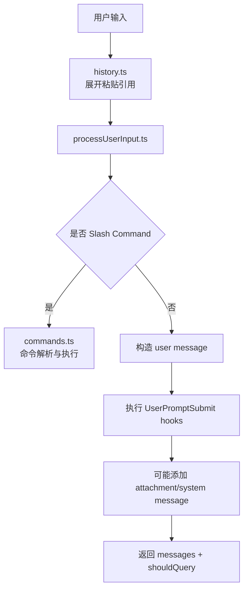

# 第 5 章 输入处理与消息模型

## 学习目标

- 理解用户输入如何被转换成系统内部消息
- 认识消息模型为什么是整个系统的中枢
- 学会沿着 `history.ts -> processUserInput.ts -> utils/messages.ts` 追踪数据流

## 5.1 输入层的关键文件

| 文件 | 作用 |
| --- | --- |
| `src/history.ts` | 管理输入历史、粘贴内容引用、历史回放 |
| `src/utils/processUserInput/processUserInput.ts` | 把用户输入转成结构化消息 |
| `src/commands.ts` | 决定哪些 `/命令` 可以被识别 |
| `src/utils/messages.ts` | 构造、规范化和解释消息 |
| `src/utils/sessionStorage.ts` | 把关键消息落盘到会话日志 |

## 5.2 输入并不是“字符串”，而是“待规范化事件”

`processUserInput.ts` 的设计告诉我们：  
系统并不把用户输入简单视为一个字符串，而是视为一个待处理事件，它可能包含：

- 纯文本提示词
- Slash command
- 已粘贴的文本引用
- 图片或附件
- IDE 选择内容
- 系统生成但用户不可见的 meta 输入

因此，输入层的任务不是“传给模型”，而是“分类、补全、展开、转换”。

## 5.3 `history.ts` 的意义

`history.ts` 不是普通的命令行历史记录，而是做了两件更高级的事：

### 1. 维护粘贴引用协议

源码里可以看到这类引用：

- `[Pasted text #1]`
- `[Pasted text #1 +10 lines]`
- `[Image #2]`

这意味着系统不会总是把大段粘贴内容直接塞进输入框，而是先把它们外存化，再通过引用回填。

### 2. 区分当前会话与项目级历史

它既支持当前会话优先，也支持跨会话、同项目的历史读取。  
这很适合终端 Agent 的使用场景，因为用户会反复在同一项目中工作。

## 5.4 `processUserInput.ts` 的主流程

`processUserInput()` 的核心职责可以概括为五步：

1. 先把用户输入即时显示到 UI
2. 调用 `processUserInputBase()` 判断它是普通 prompt 还是命令
3. 如果需要进入模型流程，再执行 `UserPromptSubmit` hooks
4. 如果 hooks 增加了上下文，就把它们变成 attachment message
5. 最终返回一组消息以及 `shouldQuery` 标志

这个设计很重要，因为它把“输入预处理”和“真正发起模型请求”分离开了。

## 5.5 消息为什么是系统中枢

从 `utils/messages.ts` 能看到，系统中存在大量消息变体：

- `user`
- `assistant`
- `system`
- `attachment`
- `progress`
- `tool use summary`
- `request start`
- `compact boundary`
- `tombstone`

这说明“消息”不是聊天专属对象，而是系统统一的数据交换载体。

## 5.6 消息的三种典型来源

### 来源一：用户输入

来自 `processUserInput.ts`，会被转成 `user` 或命令相关消息。

### 来源二：模型输出

来自 `query.ts` 与 `services/api/claude.ts` 的流式结果，会变成 `assistant` 消息以及工具调用块。

### 来源三：系统内部事件

例如：

- 权限拒绝
- 任务通知
- 压缩边界
- 提示词补充
- 附件注入

这些也会被包装进消息流。

## 5.7 输入到消息的流程图

## 5.8 为什么这层设计得这么厚

学生读到这一层时经常会疑惑：  
“为什么输入处理要搞这么多逻辑？”

原因是这个产品的输入不是单一入口，而是多模态、多来源、可扩展、可自动触发的：

- 用户可以手敲
- 用户可以贴图
- 命令可以生成后续输入
- 钩子可以中断或补充上下文
- 远程系统也可能注入消息

输入层薄不了。

## 5.9 课堂讲解重点

教师最好反复强调一句话：

> 输入不会直接进入模型，而是先进入消息系统。

只有学生真正理解这一点，后面的 QueryEngine、工具调用、会话持久化才会串起来。

## 本章小结

这一章最重要的认识是：

> 在这套系统里，消息不是 UI 展示格式，而是整个运行时的通用数据协议。

## 思考题

1. 为什么系统要把大段粘贴内容做成引用，而不是总是直接展开？
2. 如果没有 attachment message，这套系统会失去哪些能力？
3. 你能否把 `processUserInput()` 理解成“输入编译器”？为什么？
