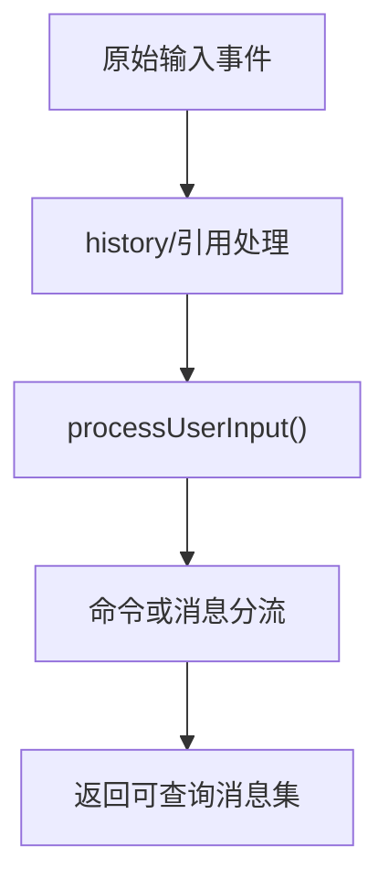
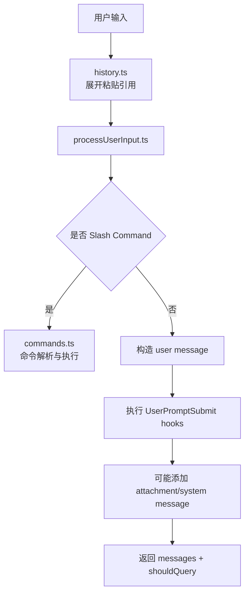

# 第 5 章 输入处理与消息模型

## 本章目标
- 理解用户输入为什么不会直接进入模型，而是要先被规范化成消息系统里的对象。
- 看清文本输入、附件、引用展开、Slash Command 和 Hook 是怎样在输入层分流的。
- 建立“消息是系统内部通用语言”的认知，为后面读 Query 主循环打基础。

## 先修关系
- 建议先读第 15 章，先熟悉 REPL、CLI、流式输出等基本词汇。
- 如果你已经浏览过第 16 章，会更容易把本章内容挂到完整请求主线上。
- 本章和第 6 章是强耦合关系：前者讲消息怎么进系统，后者讲消息怎么在系统里流动。

## 关键词
- `processUserInput`：输入预处理的核心文件，负责把用户事件转成系统能消费的结构。
- `message`：系统内部真正流动的不是原始字符串，而是结构化消息对象。
- `attachment`：图片、文件和其它附加材料需要被包装成单独消息或消息片段。
- `Slash Command`：以 `/` 开头的输入不一定进入模型，可能会先走命令系统。
- `输入 Hook`：输入层可以在进入主循环前被插入额外逻辑、上下文或阻断条件。

## 正文图解

## 关键数据结构
| 结构/对象 | 在本章中的位置 | 阅读时要抓什么 |
| --- | --- | --- |
| `ProcessUserInputResult` | 输入层最重要的返回结构。 | 它决定后面是否发起查询、允许哪些工具、产生哪些消息。 |
| `Message 对象` | 用户消息、系统消息、附件消息等统一表示。 | 它是后续 Query、持久化和 UI 共用的数据协议。 |
| `Attachment Message` | 把非纯文本内容变成可跟随会话流动的结构化单元。 | 没有它，多模态能力很难自然接入主链路。 |
| `Command Parse Result` | Slash Command 的匹配与执行结果。 | 它解释为什么“输入层”已经承担了一部分控制流分派职责。 |

## 本章在主链路中的位置

这一章是第二阶段的关键过桥章。  
第 3 章解释系统如何启动，第 6 章解释系统如何运行主循环，而这一章解释“用户说的话”到底是怎样变成系统可处理对象的。

## 学生最容易低估的难点

很多学生会以为输入处理只有两步：

1. 读字符串
2. 发给模型

但从源码看，中间至少还有：

- 历史记录
- slash 命令分流
- meta 输入
- 图片和附件
- pasted contents
- IDE 选择上下文
- hook 注入
- 消息对象构造

所以，本章真正要学会的不是“字符串怎么传递”，而是“输入如何正规化”。

## 本章的阅读抓手

读这一章时，请强制自己围绕三个问题看代码：

1. 输入原始形态是什么？
2. 中间消息对象长什么样？
3. 哪些输入根本不会进入模型主循环？

## 5.1 输入层的关键文件

| 文件 | 作用 |
| --- | --- |
| `src/history.ts` | 管理输入历史、粘贴内容引用、历史回放 |
| `src/utils/processUserInput/processUserInput.ts` | 把用户输入转成结构化消息 |
| `src/commands.ts` | 决定哪些 `/命令` 可以被识别 |
| `src/utils/messages.ts` | 构造、规范化和解释消息 |
| `src/utils/sessionStorage.ts` | 把关键消息落盘到会话日志 |

## 5.2 输入并不是“字符串”，而是“待规范化事件”

`processUserInput.ts` 的设计告诉我们：  
系统并不把用户输入简单视为一个字符串，而是视为一个待处理事件，它可能包含：

- 纯文本提示词
- Slash command
- 已粘贴的文本引用
- 图片或附件
- IDE 选择内容
- 系统生成但用户不可见的 meta 输入

因此，输入层的任务不是“传给模型”，而是“分类、补全、展开、转换”。

## 5.3 `history.ts` 的意义

`history.ts` 不是普通的命令行历史记录，而是做了两件更高级的事：

### 1. 维护粘贴引用协议

源码里可以看到这类引用：

- `[Pasted text #1]`
- `[Pasted text #1 +10 lines]`
- `[Image #2]`

这意味着系统不会总是把大段粘贴内容直接塞进输入框，而是先把它们外存化，再通过引用回填。

### 2. 区分当前会话与项目级历史

它既支持当前会话优先，也支持跨会话、同项目的历史读取。  
这很适合终端 Agent 的使用场景，因为用户会反复在同一项目中工作。

## 5.4 `processUserInput.ts` 的主流程

`processUserInput()` 的核心职责可以概括为五步：

1. 先把用户输入即时显示到 UI
2. 调用 `processUserInputBase()` 判断它是普通 prompt 还是命令
3. 如果需要进入模型流程，再执行 `UserPromptSubmit` hooks
4. 如果 hooks 增加了上下文，就把它们变成 attachment message
5. 最终返回一组消息以及 `shouldQuery` 标志

这个设计很重要，因为它把“输入预处理”和“真正发起模型请求”分离开了。

## 5.5 消息为什么是系统中枢

从 `utils/messages.ts` 能看到，系统中存在大量消息变体：

- `user`
- `assistant`
- `system`
- `attachment`
- `progress`
- `tool use summary`
- `request start`
- `compact boundary`
- `tombstone`

这说明“消息”不是聊天专属对象，而是系统统一的数据交换载体。

## 5.6 消息的三种典型来源

### 来源一：用户输入

来自 `processUserInput.ts`，会被转成 `user` 或命令相关消息。

### 来源二：模型输出

来自 `query.ts` 与 `services/api/claude.ts` 的流式结果，会变成 `assistant` 消息以及工具调用块。

### 来源三：系统内部事件

例如：

- 权限拒绝
- 任务通知
- 压缩边界
- 提示词补充
- 附件注入

这些也会被包装进消息流。

## 5.7 输入到消息的流程图

## 5.8 为什么这层设计得这么厚

学生读到这一层时经常会疑惑：  
“为什么输入处理要搞这么多逻辑？”

原因是这个产品的输入不是单一入口，而是多模态、多来源、可扩展、可自动触发的：

- 用户可以手敲
- 用户可以贴图
- 命令可以生成后续输入
- 钩子可以中断或补充上下文
- 远程系统也可能注入消息

输入层薄不了。

## 5.9 本章最该反复提醒自己的一句话

这里请先记住一句话：

> 输入不会直接进入模型，而是先进入消息系统。

只有学生真正理解这一点，后面的 QueryEngine、工具调用、会话持久化才会串起来。

## 章末小结
- 本章围绕“输入规范化、消息对象和命令分流”重建了一层稳定理解，不让你只记零散函数名或目录名。
- 真正需要沉淀下来的，不只是 `processUserInput`、`message`、`attachment` 这几个词，而是它们在 `ProcessUserInputResult`、`Message 对象`、`Attachment Message` 里的相互位置。
- 如果你后续在 第 6 章、第 16 章和第 27 章 中再次迷路，优先回看本章的“先修关系、正文图解、关键数据结构”三部分。

## 章末自测
1. 不看原文，用自己的话重述本章围绕“输入规范化、消息对象和命令分流”到底解决了什么问题。
2. 结合“正文图解”，把 `history/引用处理` 到 `命令或消息分流` 之间的连接关系重新讲一遍。
3. 对比 `ProcessUserInputResult` 与 `Message 对象`：它们分别回答什么问题，边界为什么不能混掉？
4. 在 `processUserInput`、`message`、`attachment` 中任选两个，说明它们在本章中是如何互相作用的。
5. 如果后续要继续读 第 6 章、第 16 章和第 27 章，本章哪一部分最值得先回看？为什么？
