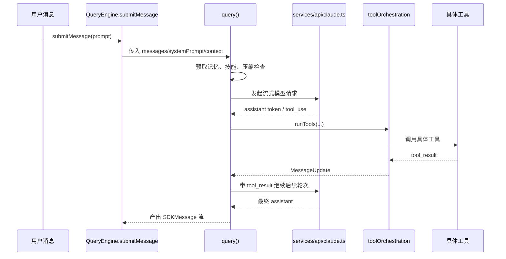

# 第 6 章 QueryEngine 与查询主循环

## 学习目标

- 理解会话执行器与单轮查询主循环的分工
- 掌握一次用户请求从消息到模型再到工具的完整运行过程
- 学会阅读 `QueryEngine.ts` 与 `query.ts` 这种“流式状态机”代码

## 6.1 为什么要同时存在 `QueryEngine.ts` 与 `query.ts`

这两个文件看起来很像，实际上职责不同：

| 文件 | 角色 |
| --- | --- |
| `src/QueryEngine.ts` | 会话级执行器，维护跨轮次状态 |
| `src/query.ts` | 单轮查询主循环，负责一次请求的流式执行 |

可以把它类比为：

- `QueryEngine` 是“会话控制器”
- `query()` 是“单轮求值器”

## 6.2 `QueryEngine.ts` 的职责

从构造函数和 `submitMessage()` 可以看到，它维护的不是一次请求，而是整个会话级状态：

- `mutableMessages`
- `abortController`
- `permissionDenials`
- `totalUsage`
- `readFileState`
- 每轮技能发现集合

这说明 `QueryEngine` 的价值在于：

1. 让多轮对话共享状态
2. 把 REPL 与 SDK/headless 两种调用方式统一到同一个执行内核
3. 在会话级追踪消息、成本、权限拒绝、文件缓存等信息

## 6.3 `query.ts` 的职责

`query.ts` 更像一台流式状态机。  
它每次接收：

- 当前消息列表
- 系统提示词
- 用户/系统上下文
- 工具集合
- 权限上下文
- 回退模型、最大轮数、任务预算等控制信息

然后驱动一次完整的请求循环。

## 6.4 `query.ts` 的主流程

根据代码结构，可以把主循环归纳为下面这些阶段：

1. 初始化 `State` 与 `QueryConfig`
2. 预取记忆与技能信息
3. 对消息做工具结果预算、snip、microcompact、context collapse
4. 必要时自动 compact
5. 构造最终系统提示词与消息列表
6. 发起模型流式请求
7. 收集 assistant message 与 tool use blocks
8. 如果出现工具调用，则走工具执行环
9. 将工具结果重新放回消息流，继续下一轮
10. 若没有后续工具，则正常结束本轮查询

## 6.5 查询主循环时序图

## 6.6 为什么这段代码难

`query.ts` 难读，主要是因为它把多个“横切能力”全都织进主循环了：

- token budget
- auto compact
- session memory
- snip
- context collapse
- streaming tool execution
- stop hooks
- tool summary
- fallback model

这类代码不是“算法难”，而是“控制流复杂”。

## 6.7 如何读这种流式状态机

给学生的建议是：

### 先找“状态结构”

`State` 里有哪些字段，决定了主循环维护什么。

### 再找“循环内的阶段块”

例如：

- setup
- compact
- request
- tool execution
- continue

### 最后找“continue 点”和“yield 点”

流式代码真正难的地方不是函数调用，而是：

- 它在哪些地方 `yield`
- 它在哪些地方 `continue`
- 哪些字段跨轮次保留，哪些字段只在单轮中有效

## 6.8 `buildQueryConfig()` 的价值

`query/config.ts` 看起来很小，但非常有教学价值。  
它把 session、env、statsig gate 这些“每轮固定配置”集中快照下来，避免循环中多次动态读取。

这是一种很典型的工程技巧：

> 把“本轮固定不变的配置”与“循环中可变的状态”分开。

## 6.9 `services/api/claude.ts` 的位置

`query.ts` 自己不直接关心 HTTP 细节，而把模型调用交给 `services/api/claude.ts`。  
后者负责：

- 组装 API schema
- 处理 beta headers
- 选择模型
- 处理流式事件
- 记录 usage/cost
- 处理错误与重试

这说明 `query.ts` 是调度层，而 `claude.ts` 是通信层。

## 6.10 教学时应突出什么

讲这章时，最应该让学生明白的是：

- 一轮查询不等于一次 API 调用
- 有工具调用时，会形成“模型 -> 工具 -> 模型”的回路
- QueryEngine 管会话，query() 管一轮
- 消息列表是整个回路中最重要的共享对象

## 本章小结

这一章最核心的结论是：

> `query.ts` 不是简单的“请求函数”，而是系统的运行时内核；`QueryEngine.ts` 则是把这个内核嵌入会话生命周期的外层执行器。

## 思考题

1. 为什么 `query.ts` 更像状态机而不是普通函数？
2. 为什么自动压缩必须织入主循环，而不能做成外部独立模块？
3. `QueryEngine` 和 `query()` 的分层，给 SDK 化带来了什么好处？
