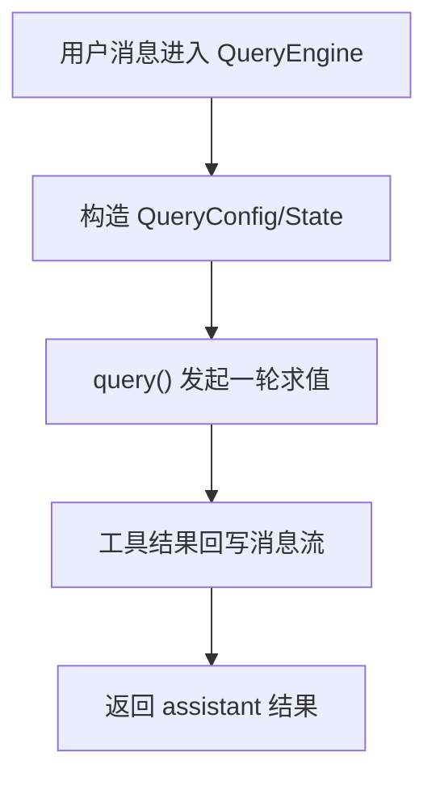
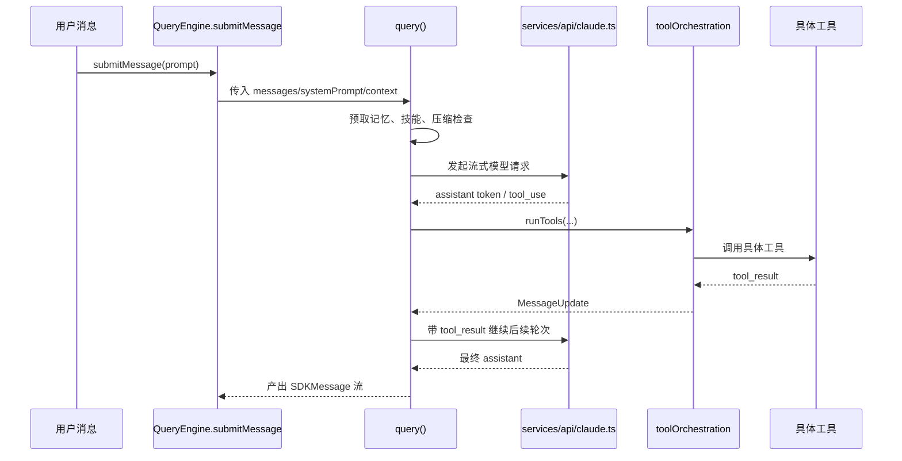

# 第 9 章 抓住心脏：QueryEngine 与查询主循环

## 本章目标
- 抓住会话执行器与单轮主循环这两个核心对象，理解它们如何分工协作。
- 理解复杂循环代码中“固定配置”和“可变状态”为什么必须拆开。
- 学会把 `query()` 压缩成状态机骨架，而不是逐行陷入实现细节。

## 先修关系
- 建议先读第 8 章和第 5 章，先知道消息从哪里来、一次请求大致怎么走。
- 如果第 6 章和第 7 章已经读过，将更容易把 QueryEngine 放回装配层与运行层的边界上。
- 本章适合和第 11、10、14 章形成三角阅读：请求循环、流式层、工具执行层。

## 关键词
- `QueryEngine`：会话级执行器，负责整合上下文、系统提示词、用户输入与主循环调用。
- `query()`：单轮求值主循环，是模型交互、工具调度和消息回写的核心状态机。
- `QueryConfig`：本轮固定不变的配置快照。
- `State`：循环中不断变化的运行状态，通常比配置更容易失控。
- `continue 点`：复杂循环的阅读关键，是找清楚每一轮为什么继续、为什么退出。

## 正文图解

## 关键数据结构
| 结构/对象 | 在本章中的位置 | 阅读时要抓什么 |
| --- | --- | --- |
| `QueryEngine 上下文` | 会话级对象，保存与当前会话持续相关的信息。 | 它决定“谁来发起一轮 query”。 |
| `QueryConfig` | 每轮固定不变的配置快照。 | 它把环境、session、gate 等静态条件和动态状态分离开。 |
| `State` | 主循环中的可变运行状态。 | 真正难读的部分几乎都体现在它如何跨阶段变化。 |
| `Assistant/ToolUse 配对` | 模型输出既可能是文本，也可能夹带结构化工具请求。 | 它解释 query 为什么天然要支持回路而不是单次返回。 |

## 本章在主链路中的位置

如果说第 6 章是在搭地图，第 7 章是在看程序怎样启动，第 8 章是在看输入怎样进入系统，那么这一章就是整条主链路的核心。
读者常常会在这里第一次真正感受到“大型 Agent 系统的执行心脏是什么样子的”。

读这一章时要记住一句话：

> `QueryEngine.ts` 和 `query.ts` 不是普通业务文件，它们是整个系统最接近“运行时内核”的地方。

## 为什么读者最容易在这一章迷路

### 原因一：这里的难点不是语法，而是控制流

很多读者会说“代码我都认识，为什么还是看不懂”。
原因在于这一章难的不是 TypeScript 语法，而是多阶段、流式、可中断、可回写的控制流。

### 原因二：这里同时夹带了很多横切能力

在同一条查询主循环里，将同时遇到：

- 消息处理
- 模型调用
- 工具执行
- 自动压缩
- 权限决策
- 记忆注入
- 流式回写

如果没有分层阅读方法，就会觉得所有逻辑混在一起。

### 原因三：读者容易把“会话状态”和“单轮状态”混为一谈

这是这一章最典型的概念错误。
`QueryEngine` 关心的是多轮会话级状态，`query()` 关心的是一次请求内部的执行循环。
只要这个边界混了，后面看工具回写和上下文累积就会反复出错。

## 学这一章的正确顺序

建议按下面四步走，而不是从上到下死读文件：

1. 先找输入和输出，问自己“这个文件吃什么、吐什么”。
2. 再找核心状态对象，问自己“它在记住什么”。
3. 再把主循环拆成阶段，问自己“每一阶段要解决什么问题”。
4. 最后才追细节分支，例如 auto compact、fallback model、tool summary。

这样读，将把这章看成一个状态机，而不是一段很长的函数。

## 6.1 为什么要同时存在 `QueryEngine.ts` 与 `query.ts`

这两个文件看起来很像，实际上职责不同：

| 文件 | 角色 |
| --- | --- |
| `src/QueryEngine.ts` | 会话级执行器，维护跨轮次状态 |
| `src/query.ts` | 单轮查询主循环，负责一次请求的流式执行 |

可以把它类比为：

- `QueryEngine` 是“会话控制器”
- `query()` 是“单轮求值器”

## 6.2 `QueryEngine.ts` 的职责

从构造函数和 `submitMessage()` 可以看到，它维护的不是一次请求，而是整个会话级状态：

- `mutableMessages`
- `abortController`
- `permissionDenials`
- `totalUsage`
- `readFileState`
- 每轮技能发现集合

这说明 `QueryEngine` 的价值在于：

1. 让多轮对话共享状态
2. 把 REPL 与 SDK/headless 两种调用方式统一到同一个执行内核
3. 在会话级追踪消息、成本、权限拒绝、文件缓存等信息

## 6.3 `query.ts` 的职责

`query.ts` 更像一台流式状态机。
它每次接收：

- 当前消息列表
- 系统提示词
- 用户/系统上下文
- 工具集合
- 权限上下文
- 回退模型、最大轮数、任务预算等控制信息

然后驱动一次完整的请求循环。

## 6.4 `query.ts` 的主流程

根据代码结构，可以把主循环归纳为下面这些阶段：

1. 初始化 `State` 与 `QueryConfig`
2. 预取记忆与技能信息
3. 对消息做工具结果预算、snip、microcompact、context collapse
4. 必要时自动 compact
5. 构造最终系统提示词与消息列表
6. 发起模型流式请求
7. 收集 assistant message 与 tool use blocks
8. 如果出现工具调用，则走工具执行环
9. 将工具结果重新放回消息流，继续下一轮
10. 若没有后续工具，则正常结束本轮查询

### `QueryEngine` 持有的会话级状态必须按字段理解

`QueryEngine.ts` 最值得细读的不是某个工具分支，而是类字段本身。它们几乎就是一份“会话级运行时规格”：

| 字段 | 作用 | 设计含义 |
| --- | --- | --- |
| `mutableMessages` | 当前会话内持续增长的消息账本 | 会话不是一次请求，而是一条持续累积的事实链。 |
| `abortController` | 当前会话共享的中断控制器 | 中断不是局部函数行为，而是贯穿模型、工具和流式输出的会话级控制。 |
| `permissionDenials` | 收集本轮及历史工具拒绝信息 | 最终结果需要知道哪些动作被拒绝过，而不只是当前消息内容。 |
| `totalUsage` | 累积 token/cost 使用量 | 成本统计是会话级的，而不是只看最后一次响应。 |
| `readFileState` | 读文件缓存与文件状态信息 | 后续记忆注入、文件快照、重复读取规避都会依赖这类缓存。 |
| `discoveredSkillNames` | 本轮发现过的技能名集合 | 这是一个典型的“跨两个阶段但不跨全部会话”的辅助状态。 |
| `loadedNestedMemoryPaths` | 已注入的 nested memory 路径集合 | 用于避免在长会话里重复注入同一批 memory 文件。 |

这张表给出的启发非常重要：
`QueryEngine` 并不是“包一层函数调用”的轻量包装器，而是把多轮对话里那些不能丢失、又不适合塞进单轮状态机的内容集中存放起来。

### `submitMessage()` 不是单步动作，而是完整的会话入口

阅读 `submitMessage()` 时，最容易忽略它的阶段数量。根据源码，它至少做了以下十件事：

1. 从配置中提取本轮所需的命令、工具、MCP 客户端、预算和中断配置。
2. 重新设置当前 cwd，并初始化本轮技能发现集合。
3. 包装 `canUseTool`，把工具权限拒绝统一收集到 `permissionDenials`。
4. 构造 `processUserInputContext`，把工具池、AppState 读写器、读文件缓存等会话依赖打包好。
5. 处理 orphaned permission 等特殊恢复路径。
6. 调用 `processUserInput()`，把原始输入规范化成消息集合与控制信息。
7. 先把用户消息并入 `mutableMessages`，再在必要时立即写入 transcript。
8. 根据 Slash Command 或其它输入副作用更新 `toolPermissionContext`、主模型或技能/插件缓存。
9. 先产出 system init message，让外部消费者知道本轮工具池、模型、权限模式与插件状态。
10. 若 `shouldQuery` 为真，再进入 `query()` 主循环，持续消费流式事件、工具结果和最终终止原因。

从系统设计角度看，`submitMessage()` 相当于把三个原本容易散开的阶段强行绑成了一个正式入口：

- 输入规范化阶段
- 会话状态落账阶段
- 单轮求值启动阶段

少了任何一个阶段，后面的恢复语义或执行语义都会出现裂缝。

### 为什么“用户消息先写 transcript 再进 query”是硬约束

源码里有一段非常值得作为教材重点讲解的注释：
在进入 `for await (const message of query(...))` 之前，`QueryEngine` 会在持久化开启的情况下先把用户新消息写入 transcript。

这一步不是性能优化，而是恢复语义保护。它解决的是这样一个问题：

1. 用户已经提交输入。
2. 系统已经接受输入并开始准备查询。
3. 但是 API 还没来得及回任何 token，进程就被杀掉了。

如果这时 transcript 里还没有这条用户消息，恢复系统会误以为“这一轮从未发生过”。
而先写 transcript 后，即使还没有任何 assistant 输出，也能明确保留“系统已经接受了这条用户输入”的事实。

这一点非常适合作为跨语言重建时的设计约束：

> 只要系统已经接受了用户输入，这一事实就应尽早进入可恢复账本，而不应把它与 API 成功返回绑定在一起。

### `query.ts` 中的 `State` 是单轮状态机的真正核心

教材里如果只说“`State` 是运行状态”，远远不够。源码中的 `State` 字段各有明确职责：

| 字段 | 含义 | 为什么存在 |
| --- | --- | --- |
| `messages` | 本轮当前使用的消息窗口 | 它会被 compact、tool result 回写和 continuation 提示不断改写。 |
| `toolUseContext` | 本轮工具上下文 | 工具池、AppState、读文件缓存、queryTracking 都在这里汇聚。 |
| `autoCompactTracking` | 自动压缩跟踪状态 | 用于记录已 compact 的轮次和后续统计。 |
| `maxOutputTokensRecoveryCount` | `max_output_tokens` 恢复计数 | 防止恢复路径无限重试。 |
| `hasAttemptedReactiveCompact` | 是否已尝试响应式压缩 | 防止 prompt-too-long 和 stop hook 形成死循环。 |
| `maxOutputTokensOverride` | 当前轮输出 token 上限覆盖值 | 支撑“先 8k，再 64k”这类升级重试策略。 |
| `pendingToolUseSummary` | 异步生成中的工具摘要 Promise | 允许摘要生成与下一轮 API 调用并行进行。 |
| `stopHookActive` | 停止 hook 是否处于生效态 | 用于区分正常收尾与 hook 触发后的阻塞继续。 |
| `turnCount` | 当前单轮递归中的逻辑 turn 数 | 用于 maxTurns、附件统计与 continuation 逻辑。 |
| `transition` | 上一次继续的原因 | 让调试和测试能知道是何种恢复路径触发了继续。 |

这张表说明，`State` 不是一个“随便塞些布尔值”的杂项对象，而是一份精心切分的控制平面。

### `transition.reason` 列表就是主循环的恢复地图

源码里多次出现 `state = { ... transition: { reason: ... } }`。
这类字段非常值得在教材中单独强调，因为它们把复杂控制流变成了可解释的“继续原因”集合。已出现的重要原因包括：

- `collapse_drain_retry`
- `reactive_compact_retry`
- `max_output_tokens_escalate`
- `max_output_tokens_recovery`
- `stop_hook_blocking`
- `token_budget_continuation`
- `next_turn`

这些名字的价值不在于词面，而在于它们把“为什么这一轮没有结束”记录成了显式状态。
对于需要跨语言重写的人来说，这是一个非常重要的经验：
复杂状态机最怕隐式继续；把继续原因结构化，调试、测试和恢复都会轻松很多。

### `buildQueryConfig()` 的真正价值不是小，而是“冻结”

`query/config.ts` 只有很短一段代码，但它的设计意义远超文件长度。
源码表明，`buildQueryConfig()` 会在进入 `query()` 时一次性快照：

- `sessionId`
- `streamingToolExecution`
- `emitToolUseSummaries`
- `isAnt`
- `fastModeEnabled`

这说明它承担的是“冻结本轮不可变环境”的职责。
一旦把这些值混进 `State`，或者在循环内部随取随用，就会出现两类问题：

1. 本轮执行过程中环境变化导致行为不一致。
2. 状态机测试难以复现，因为同一输入可能在循环中途读到不同外部值。

因此，`QueryConfig` 不是代码整理技巧，而是稳定状态机的必要条件。

### `query()` 更像“可重启求值器”，而不是“一次 API 调用”

把 `query()` 错看成“封装 API 请求的异步函数”，是理解整个系统时最常见的偏差。
从源码可知，它至少具备以下四种“可重启”机制：

1. 因 compact 或 context collapse 而重新组织消息窗口后重试。
2. 因 `max_output_tokens` 而插入 meta message 后继续。
3. 因工具调用而把 `tool_result` 回写后进入下一 turn。
4. 因 stop hook 或 token budget 提示而重新追加消息再继续。

这意味着 `query()` 的正确类比对象不是“请求函数”，而是“带显式过渡条件的求值循环”。

### `yield` 与 `recordTranscript` 的配合关系

`QueryEngine` 与 `query()` 的配合里，还有一层很细但很关键的机制：
不是所有消息都以同样的时机被记入 `mutableMessages` 和 transcript。

源码可以概括出以下原则：

- assistant、user、compact boundary 这类核心消息会驱动正式的 transcript 落账。
- progress 与 attachment 也可能在特定场景下被立即并入 `messages` 并 fire-and-forget 持久化，目的是保证 dedupe 与后续 parent 链正确。
- tombstone 属于控制信号，不是正常对话内容。
- stream_event 主要承担流式增量和 usage 累积职责，不直接等同于 transcript 事实。

这再次说明：

> 系统内部的“消息流”与磁盘上的“恢复账本”既高度相关，又不能简单画等号。

## 6.5 查询主循环时序图

## 6.6 为什么这段代码难

`query.ts` 难读，主要是因为它把多个“横切能力”全都织进主循环了：

- token budget
- auto compact
- session memory
- snip
- context collapse
- streaming tool execution
- stop hooks
- tool summary
- fallback model

这类代码不是“算法难”，而是“控制流复杂”。

## 6.7 如何读这种流式状态机

给读者的建议是：

### 先找“状态结构”

`State` 里有哪些字段，决定了主循环维护什么。

### 再找“循环内的阶段块”

例如：

## 6.8 读者通关标准

这一章真正学会之后，应当能够：

1. 不看书，解释 `QueryEngine` 和 `query()` 的分工。
2. 画出单轮查询循环的阶段图。
3. 指出工具调用是怎样把控制流“打断再接回”的。
4. 解释为什么这段代码会同时牵扯消息、工具、权限、压缩和流式输出。

如只能复述“`query.ts` 很重要”，但说不清它如何运转，那还不算掌握。

- setup
- compact
- request
- tool execution
- continue

### 最后找“continue 点”和“yield 点”

流式代码真正难的地方不是函数调用，而是：

- 它在哪些地方 `yield`
- 它在哪些地方 `continue`
- 哪些字段跨轮次保留，哪些字段只在单轮中有效

## 6.8 `buildQueryConfig()` 的价值

`query/config.ts` 看起来很小，但非常有阅读价值。
它把 session、env、statsig gate 这些“每轮固定配置”集中快照下来，避免循环中多次动态读取。

这是一种很典型的工程技巧：

> 把“本轮固定不变的配置”与“循环中可变的状态”分开。

## 6.9 `services/api/claude.ts` 的位置

`query.ts` 自己不直接关心 HTTP 细节，而把模型调用交给 `services/api/claude.ts`。
后者负责：

- 组装 API schema
- 处理 beta headers
- 选择模型
- 处理流式事件
- 记录 usage/cost
- 处理错误与重试

这说明 `query.ts` 是调度层，而 `claude.ts` 是通信层。

## 6.10 本章最该记住什么

读这章时，最应该让自己明白的是：

- 一轮查询不等于一次 API 调用
- 有工具调用时，会形成“模型 -> 工具 -> 模型”的回路
- QueryEngine 管会话，query() 管一轮
- 消息列表是整个回路中最重要的共享对象

## 6.11 语言无关重建视角

如果要把该系统迁移到其他语言，`QueryEngine.ts` 与 `query.ts` 提供的是最重要的运行时规格。源码显示，至少要保留两层执行抽象：

- 会话执行器：跨轮持有消息历史、读文件缓存、总 usage、权限拒绝、AbortController 与会话级配置。
- 单轮状态机：在一次请求内部维护当前消息窗口、工具上下文、压缩状态、恢复计数、turnCount 与本轮过渡原因。

这种两层拆分不是风格问题，而是系统复杂度达到一定规模后的必要条件。

### 输入输出契约

从 `QueryEngineConfig` 与 `QueryParams` 可以抽出一组清晰的跨语言契约：

- 会话执行器输入：工具池、命令池、MCP 客户端、agent 定义、AppState 读写器、读文件缓存、系统提示词配置、模型设置、预算与中断控制器。
- 单轮循环输入：消息列表、systemPrompt、userContext、systemContext、canUseTool、toolUseContext、querySource、fallbackModel、maxTurns。
- 单轮循环输出：流式事件、消息增量、工具结果、tombstone 控制消息与终止原因。

换言之，`query()` 不是简单地“返回一个字符串”，而是返回一条逐步展开的事件流。

### 必须保留的状态对象

`query.ts` 中的 `State` 已经非常接近一份可迁移的数据结构定义。跨语言重写时，以下字段不宜省略：

- `messages`
- `toolUseContext`
- `autoCompactTracking`
- `maxOutputTokensRecoveryCount`
- `hasAttemptedReactiveCompact`
- `maxOutputTokensOverride`
- `pendingToolUseSummary`
- `stopHookActive`
- `turnCount`
- `transition`

这些字段对应的不是单纯的实现细节，而是主循环中的关键控制点。

### 最小实现顺序

1. 先实现消息账本与会话执行器。
2. 再实现单轮 `query()` 事件循环，使其能与模型 API 建立基本往返。
3. 接着引入工具调用识别与工具结果回写。
4. 再补入压缩、预算、记忆预取与中断等横切能力。
5. 最后实现恢复路径、tombstone、tool summary 与异常恢复分支。

### 最容易重写失败的地方

- 把一次用户请求错误地实现成一次 API 调用，忽略“模型 -> 工具 -> 模型”的回路。
- 不区分会话状态与单轮状态，导致历史消息、预算与恢复计数互相污染。
- 省略“用户消息先写 transcript 再进 query”的顺序约束，导致恢复语义断裂。
- 把工具结果直接塞入某个返回值，而不是重新翻译成消息对象，导致模型无法继续基于结果推理。

## 重建蓝图：把主循环写成可证明的状态机

### 必须保留的抽象

1. QueryEngine 与 `query()` 的拆分必须被保留。前者负责会话级协调、依赖装配与外部接口，后者负责单轮查询状态机。若把两者重新糅在一起，代码规模稍一增长就会失控。
2. 查询状态必须显式表示，而不是散落在局部变量中。至少要有当前消息输入、模型流状态、工具执行状态、预算/压缩状态、终止原因和下一轮转移原因。
3. 流式响应必须被抽象为内部统一事件，而不是让上层直接处理供应商返回的原始 chunk。这样才能跨厂商迁移，也才能让工具闭环插入同一状态机。
4. 工具结果必须回到同一条消息演化链上，而不是另起一套“工具执行线程”的逻辑语义。原工程最重要的特征之一，就是工具执行是查询状态机的一部分。

### 最小实现顺序

1. 先定义 `QueryConfig` 与 `State`。这两个结构决定了单轮查询到底依赖什么、维护什么，也是后续所有测试的稳定入口。
2. 第二步实现纯状态转移骨架，即使先用假数据代替模型响应，也要让 `init -> streaming -> tool dispatch -> continue/finish` 的转移关系成立。
3. 第三步接入模型适配器，把流式 chunk 翻译为内部事件，再驱动状态转移。此时不必一次支持所有事件类型，但需要先有统一事件枚举。
4. 第四步接入工具执行器，使 `tool_use` 能被识别、调度、回写，并继续进入下一轮模型调用。
5. 第五步补入预算、压缩、取消、错误恢复与 transcript 持久化。这些横切逻辑都应围绕同一状态机扩展，而不是绕开它另写旁路。

### 最容易写错的边界

1. 若让 UI 直接消费 provider stream，QueryEngine 就会失去对顺序、一致性和错误修复的控制权。跨语言重写时必须坚持“provider stream 先规范化，再广播”。
2. 若没有显式的 transition reason，就很难区分为什么会继续下一轮、为什么触发 compact、为什么因为工具结果而重新发起请求。原工程在这方面做得非常细。
3. 若把工具结果写进另一个异步队列，而不是回到当前查询状态，便会出现消息顺序错乱、usage 统计漂移、会话恢复困难等连锁问题。
4. 若没有把“终止”也视为状态的一部分，而只是 `return` 出去，那么取消、中断、错误与正常结束就无法统一处理。

## 章末小结
- 本章围绕“会话执行器、单轮状态机和配置/状态分离”重建了一层稳定理解，避免只记零散函数名或目录名。
- 真正需要沉淀下来的，不只是 `QueryEngine`、`query()`、`QueryConfig` 这几个词，而是它们在 `QueryEngine 上下文`、`QueryConfig`、`State` 里的相互位置。
- 如后续在 第 11 章、第 10 章和第 14 章 中再次迷路，优先回看本章的“先修关系、正文图解、关键数据结构”三部分。

## 章末自测
1. 不看原文，用自己的话重述本章围绕“会话执行器、单轮状态机和配置/状态分离”到底解决了什么问题。
2. 结合“正文图解”，把 `构造 QueryConfig/State` 到 `工具结果回写消息流` 之间的连接关系重新讲一遍。
3. 对比 `QueryEngine 上下文` 与 `QueryConfig`：它们分别回答什么问题，边界为什么不能混掉？
4. 在 `QueryEngine`、`query()`、`QueryConfig` 中任选两个，说明它们在本章中是如何互相作用的。
5. 如果后续要继续读 第 11 章、第 10 章和第 14 章，本章哪一部分最值得先回看？为什么？
