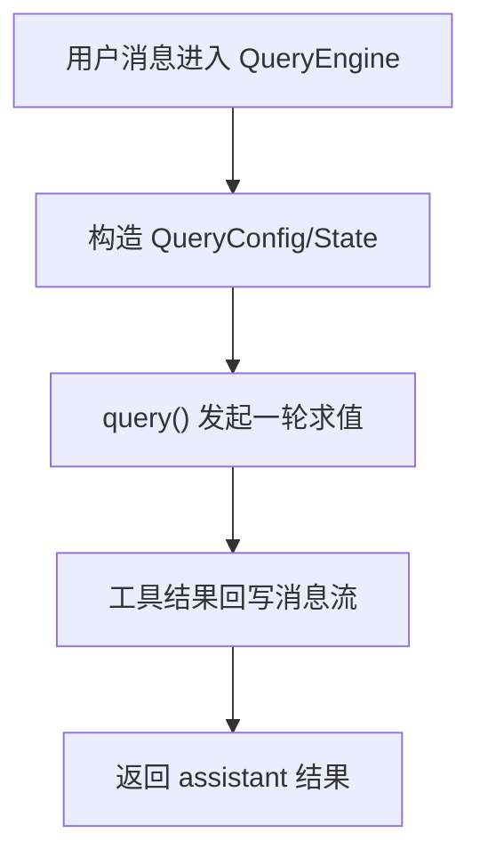
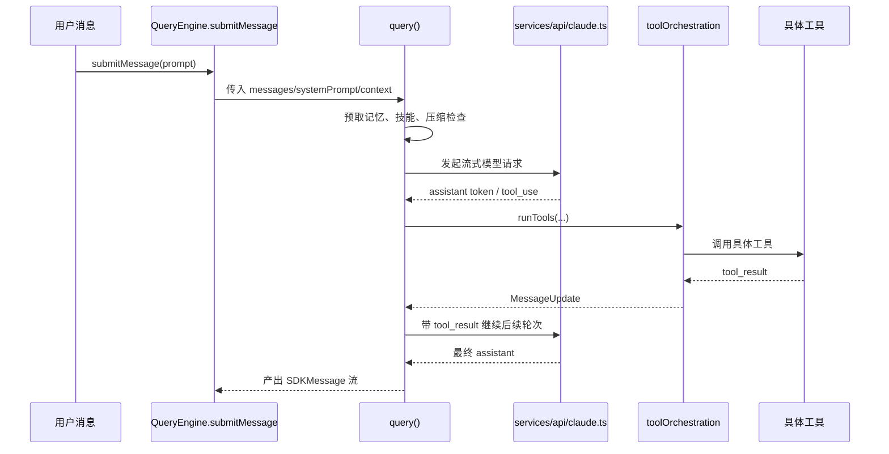

# 第 6 章 抓住心脏：QueryEngine 与查询主循环

## 本章目标
- 抓住会话执行器与单轮主循环这两个核心对象，理解它们如何分工协作。
- 理解复杂循环代码中“固定配置”和“可变状态”为什么必须拆开。
- 学会把 `query()` 压缩成状态机骨架，而不是逐行陷入实现细节。

## 先修关系
- 建议先读第 5 章和第 16 章，先知道消息从哪里来、一次请求大致怎么走。
- 如果第 2 章和第 3 章已经读过，将更容易把 QueryEngine 放回装配层与运行层的边界上。
- 本章适合和第 19、27、28 章形成三角阅读：请求循环、流式层、工具执行层。

## 关键词
- `QueryEngine`：会话级执行器，负责整合上下文、系统提示词、用户输入与主循环调用。
- `query()`：单轮求值主循环，是模型交互、工具调度和消息回写的核心状态机。
- `QueryConfig`：本轮固定不变的配置快照。
- `State`：循环中不断变化的运行状态，通常比配置更容易失控。
- `continue 点`：复杂循环的阅读关键，是找清楚每一轮为什么继续、为什么退出。

## 正文图解

## 关键数据结构
| 结构/对象 | 在本章中的位置 | 阅读时要抓什么 |
| --- | --- | --- |
| `QueryEngine 上下文` | 会话级对象，保存与当前会话持续相关的信息。 | 它决定“谁来发起一轮 query”。 |
| `QueryConfig` | 每轮固定不变的配置快照。 | 它把环境、session、gate 等静态条件和动态状态分离开。 |
| `State` | 主循环中的可变运行状态。 | 真正难读的部分几乎都体现在它如何跨阶段变化。 |
| `Assistant/ToolUse 配对` | 模型输出既可能是文本，也可能夹带结构化工具请求。 | 它解释 query 为什么天然要支持回路而不是单次返回。 |

## 本章在主链路中的位置

如果说第 2 章是在搭地图，第 3 章是在看程序怎样启动，第 5 章是在看输入怎样进入系统，那么这一章就是整条主链路的核心。  
读者常常会在这里第一次真正感受到“大型 Agent 系统的执行心脏是什么样子的”。

读这一章时要记住一句话：

> `QueryEngine.ts` 和 `query.ts` 不是普通业务文件，它们是整个系统最接近“运行时内核”的地方。

## 为什么读者最容易在这一章迷路

### 原因一：这里的难点不是语法，而是控制流

很多读者会说“代码我都认识，为什么还是看不懂”。  
原因在于这一章难的不是 TypeScript 语法，而是多阶段、流式、可中断、可回写的控制流。

### 原因二：这里同时夹带了很多横切能力

在同一条查询主循环里，将同时遇到：

- 消息处理
- 模型调用
- 工具执行
- 自动压缩
- 权限决策
- 记忆注入
- 流式回写

如果没有分层阅读方法，就会觉得所有逻辑混在一起。

### 原因三：读者容易把“会话状态”和“单轮状态”混为一谈

这是这一章最典型的概念错误。  
`QueryEngine` 关心的是多轮会话级状态，`query()` 关心的是一次请求内部的执行循环。  
只要这个边界混了，后面看工具回写和上下文累积就会反复出错。

## 学这一章的正确顺序

建议按下面四步走，而不是从上到下死读文件：

1. 先找输入和输出，问自己“这个文件吃什么、吐什么”。
2. 再找核心状态对象，问自己“它在记住什么”。
3. 再把主循环拆成阶段，问自己“每一阶段要解决什么问题”。
4. 最后才追细节分支，例如 auto compact、fallback model、tool summary。

这样读，将把这章看成一个状态机，而不是一段很长的函数。

## 6.1 为什么要同时存在 `QueryEngine.ts` 与 `query.ts`

这两个文件看起来很像，实际上职责不同：

| 文件 | 角色 |
| --- | --- |
| `src/QueryEngine.ts` | 会话级执行器，维护跨轮次状态 |
| `src/query.ts` | 单轮查询主循环，负责一次请求的流式执行 |

可以把它类比为：

- `QueryEngine` 是“会话控制器”
- `query()` 是“单轮求值器”

## 6.2 `QueryEngine.ts` 的职责

从构造函数和 `submitMessage()` 可以看到，它维护的不是一次请求，而是整个会话级状态：

- `mutableMessages`
- `abortController`
- `permissionDenials`
- `totalUsage`
- `readFileState`
- 每轮技能发现集合

这说明 `QueryEngine` 的价值在于：

1. 让多轮对话共享状态
2. 把 REPL 与 SDK/headless 两种调用方式统一到同一个执行内核
3. 在会话级追踪消息、成本、权限拒绝、文件缓存等信息

## 6.3 `query.ts` 的职责

`query.ts` 更像一台流式状态机。  
它每次接收：

- 当前消息列表
- 系统提示词
- 用户/系统上下文
- 工具集合
- 权限上下文
- 回退模型、最大轮数、任务预算等控制信息

然后驱动一次完整的请求循环。

## 6.4 `query.ts` 的主流程

根据代码结构，可以把主循环归纳为下面这些阶段：

1. 初始化 `State` 与 `QueryConfig`
2. 预取记忆与技能信息
3. 对消息做工具结果预算、snip、microcompact、context collapse
4. 必要时自动 compact
5. 构造最终系统提示词与消息列表
6. 发起模型流式请求
7. 收集 assistant message 与 tool use blocks
8. 如果出现工具调用，则走工具执行环
9. 将工具结果重新放回消息流，继续下一轮
10. 若没有后续工具，则正常结束本轮查询

## 6.5 查询主循环时序图

## 6.6 为什么这段代码难

`query.ts` 难读，主要是因为它把多个“横切能力”全都织进主循环了：

- token budget
- auto compact
- session memory
- snip
- context collapse
- streaming tool execution
- stop hooks
- tool summary
- fallback model

这类代码不是“算法难”，而是“控制流复杂”。

## 6.7 如何读这种流式状态机

给读者的建议是：

### 先找“状态结构”

`State` 里有哪些字段，决定了主循环维护什么。

### 再找“循环内的阶段块”

例如：

## 6.8 读者通关标准

这一章真正学会之后，应当能够：

1. 不看书，解释 `QueryEngine` 和 `query()` 的分工。
2. 画出单轮查询循环的阶段图。
3. 指出工具调用是怎样把控制流“打断再接回”的。
4. 解释为什么这段代码会同时牵扯消息、工具、权限、压缩和流式输出。

如只能复述“`query.ts` 很重要”，但说不清它如何运转，那还不算掌握。

- setup
- compact
- request
- tool execution
- continue

### 最后找“continue 点”和“yield 点”

流式代码真正难的地方不是函数调用，而是：

- 它在哪些地方 `yield`
- 它在哪些地方 `continue`
- 哪些字段跨轮次保留，哪些字段只在单轮中有效

## 6.8 `buildQueryConfig()` 的价值

`query/config.ts` 看起来很小，但非常有阅读价值。  
它把 session、env、statsig gate 这些“每轮固定配置”集中快照下来，避免循环中多次动态读取。

这是一种很典型的工程技巧：

> 把“本轮固定不变的配置”与“循环中可变的状态”分开。

## 6.9 `services/api/claude.ts` 的位置

`query.ts` 自己不直接关心 HTTP 细节，而把模型调用交给 `services/api/claude.ts`。  
后者负责：

- 组装 API schema
- 处理 beta headers
- 选择模型
- 处理流式事件
- 记录 usage/cost
- 处理错误与重试

这说明 `query.ts` 是调度层，而 `claude.ts` 是通信层。

## 6.10 本章最该记住什么

读这章时，最应该让自己明白的是：

- 一轮查询不等于一次 API 调用
- 有工具调用时，会形成“模型 -> 工具 -> 模型”的回路
- QueryEngine 管会话，query() 管一轮
- 消息列表是整个回路中最重要的共享对象

## 6.11 语言无关重建视角

如果要把该系统迁移到其他语言，`QueryEngine.ts` 与 `query.ts` 提供的是最重要的运行时规格。源码显示，至少要保留两层执行抽象：

- 会话执行器：跨轮持有消息历史、读文件缓存、总 usage、权限拒绝、AbortController 与会话级配置。
- 单轮状态机：在一次请求内部维护当前消息窗口、工具上下文、压缩状态、恢复计数、turnCount 与本轮过渡原因。

这种两层拆分不是风格问题，而是系统复杂度达到一定规模后的必要条件。

### 输入输出契约

从 `QueryEngineConfig` 与 `QueryParams` 可以抽出一组清晰的跨语言契约：

- 会话执行器输入：工具池、命令池、MCP 客户端、agent 定义、AppState 读写器、读文件缓存、系统提示词配置、模型设置、预算与中断控制器。
- 单轮循环输入：消息列表、systemPrompt、userContext、systemContext、canUseTool、toolUseContext、querySource、fallbackModel、maxTurns。
- 单轮循环输出：流式事件、消息增量、工具结果、tombstone 控制消息与终止原因。

换言之，`query()` 不是简单地“返回一个字符串”，而是返回一条逐步展开的事件流。

### 必须保留的状态对象

`query.ts` 中的 `State` 已经非常接近一份可迁移的数据结构定义。跨语言重写时，以下字段不宜省略：

- `messages`
- `toolUseContext`
- `autoCompactTracking`
- `maxOutputTokensRecoveryCount`
- `hasAttemptedReactiveCompact`
- `maxOutputTokensOverride`
- `pendingToolUseSummary`
- `stopHookActive`
- `turnCount`
- `transition`

这些字段对应的不是单纯的实现细节，而是主循环中的关键控制点。

### 最小实现顺序

1. 先实现消息账本与会话执行器。
2. 再实现单轮 `query()` 事件循环，使其能与模型 API 建立基本往返。
3. 接着引入工具调用识别与工具结果回写。
4. 再补入压缩、预算、记忆预取与中断等横切能力。
5. 最后实现恢复路径、tombstone、tool summary 与异常恢复分支。

### 最容易重写失败的地方

- 把一次用户请求错误地实现成一次 API 调用，忽略“模型 -> 工具 -> 模型”的回路。
- 不区分会话状态与单轮状态，导致历史消息、预算与恢复计数互相污染。
- 省略“用户消息先写 transcript 再进 query”的顺序约束，导致恢复语义断裂。
- 把工具结果直接塞入某个返回值，而不是重新翻译成消息对象，导致模型无法继续基于结果推理。

## 章末小结
- 本章围绕“会话执行器、单轮状态机和配置/状态分离”重建了一层稳定理解，避免只记零散函数名或目录名。
- 真正需要沉淀下来的，不只是 `QueryEngine`、`query()`、`QueryConfig` 这几个词，而是它们在 `QueryEngine 上下文`、`QueryConfig`、`State` 里的相互位置。
- 如后续在 第 19 章、第 27 章和第 28 章 中再次迷路，优先回看本章的“先修关系、正文图解、关键数据结构”三部分。

## 章末自测
1. 不看原文，用自己的话重述本章围绕“会话执行器、单轮状态机和配置/状态分离”到底解决了什么问题。
2. 结合“正文图解”，把 `构造 QueryConfig/State` 到 `工具结果回写消息流` 之间的连接关系重新讲一遍。
3. 对比 `QueryEngine 上下文` 与 `QueryConfig`：它们分别回答什么问题，边界为什么不能混掉？
4. 在 `QueryEngine`、`query()`、`QueryConfig` 中任选两个，说明它们在本章中是如何互相作用的。
5. 如果后续要继续读 第 19 章、第 27 章和第 28 章，本章哪一部分最值得先回看？为什么？
