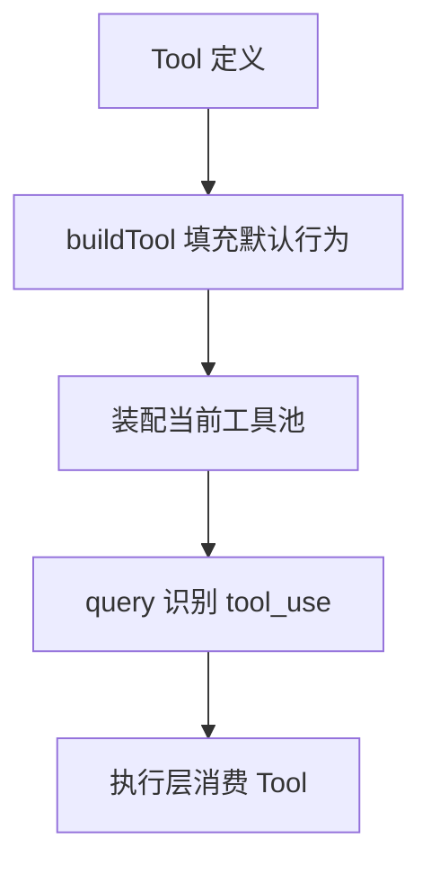
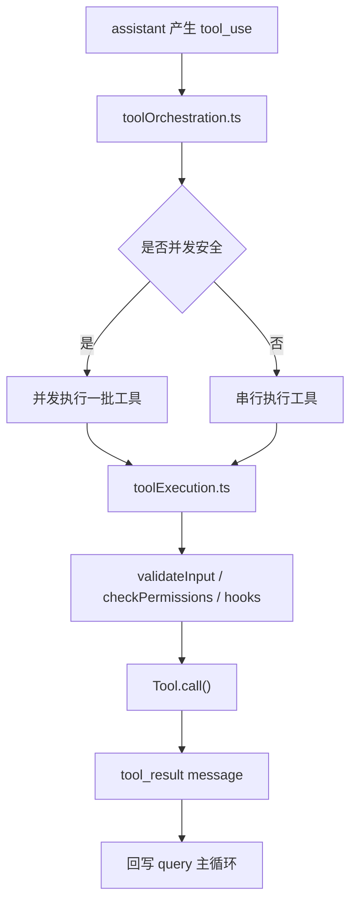

# 第 7 章 工具系统设计

## 本章目标
- 理解为什么 Tool 是统一能力协议，而不是若干零散函数的总和。
- 看清 `buildTool()`、`tools.ts` 和 `assembleToolPool()` 这三个位置各自承担什么责任。
- 建立工具系统的“协议层—注册层—装配层—执行层”认知框架。

## 先修关系
- 建议先读第 6 章，至少要知道主循环会产生 `tool_use`。
- 如果第 5 章已经读过，你会更容易把工具结果消息和普通消息区分开。
- 本章与第 28 章是配套关系：本章讲 Tool 是什么，第 28 章讲 Tool 怎么跑。

## 关键词
- `Tool 协议`：工具并不只定义 `call()`，还定义权限、并发性、只读性和 UI 展示方式。
- `buildTool`：统一给工具填充默认行为的协议工厂。
- `ToolUseContext`：工具执行时可见的完整运行现场。
- `工具池`：当前会话允许模型看到和调用的工具集合。
- `权限门`：每个工具能否执行，不只取决于名字匹配，还取决于上下文和权限模式。

## 正文图解

## 关键数据结构
| 结构/对象 | 在本章中的位置 | 阅读时要抓什么 |
| --- | --- | --- |
| `Tool 定义对象` | 描述工具名称、schema、执行方法和治理规则。 | 这是理解工具系统的第一关键结构。 |
| `ToolUseContext` | 把 app state、消息、命令、MCP client 等环境交给工具。 | 它解释为什么工具执行并不孤立。 |
| `Built-in Tool Pool` | 内建工具的主注册表。 | 它决定基础能力面有哪些。 |
| `Assembled Tool Pool` | 按权限、模式和 MCP 配置拼出来的最终工具池。 | 模型看到的是这个结果，而不是所有定义的总和。 |

## 本章在能力层中的位置

这一章是第三阶段真正的转折点。  
读者在这里会第一次明确看到：这套系统不是“先有很多功能，再把它们拼起来”，而是“先定义统一能力协议，再让所有功能按协议接入”。

## 为什么很多读者会在这一章第一次感到“工程味”

因为 `Tool.ts` 展现出来的不是业务逻辑，而是协议设计。  
一旦开始讲协议、schema、权限接口、并发标记、结果上限和渲染接口，项目就从“功能堆叠”变成了“平台设计”。

## 读这一章时要抓住的三个对象

1. `Tool`：一个能力对象到底要声明哪些规则。
2. `tools.ts`：系统如何维护一个统一工具池。
3. `services/tools/*`：工具从被模型点名到真正执行，中间还要经过哪些治理层。

## 7.1 `Tool.ts` 不是接口文件，而是协议中心

`Tool.ts` 的信息量非常大，因为它同时定义了：

- 工具输入输出 schema
- 工具调用签名
- 权限检查接口
- UI 渲染接口
- 并发安全标记
- 只读/破坏性标记
- 搜索/读取命令折叠提示
- hook 匹配能力
- 自动分类器输入

换言之，`Tool` 在这里不是“函数封装”，而是“系统级能力对象”。

## 7.2 `buildTool()` 的设计价值

在 `Tool.ts` 下半部分，`buildTool()` 做了一件非常关键的事：  
给工具定义补上安全默认值。

默认值包括：

- `isEnabled -> true`
- `isConcurrencySafe -> false`
- `isReadOnly -> false`
- `isDestructive -> false`
- `checkPermissions -> allow`
- `toAutoClassifierInput -> ''`
- `userFacingName -> tool.name`

这里最值得讲给读者听的是 `false` 的方向：

- 默认不认为自己是并发安全的
- 默认不认为自己是只读的

这体现了明显的“保守默认、显式声明”思想。

## 7.3 `tools.ts` 的职责

`tools.ts` 不是单纯导出一个数组，而是负责：

- 汇总所有内建工具
- 根据 feature gate 与环境条件裁剪工具
- 根据 deny rules 过滤工具
- 根据 REPL/simple mode 调整工具可见性
- 将内建工具与 MCP 工具装配为完整工具池

它是工具系统的注册中心和装配中心。

## 7.4 工具池是怎么拼出来的

`assembleToolPool()` 的逻辑很适合拿来拆解：

1. 先拿到当前权限上下文下的内建工具
2. 再引入 MCP 工具
3. 对两者进行 deny 过滤
4. 排序并按名字去重

其中一个细节很值得注意：  
它会保持 built-in tools 作为连续前缀，以维持 prompt cache 稳定性。  
这表明工具列表不仅影响功能，也影响缓存命中率。

## 7.5 工具系统的三重面向

一个 `Tool` 同时面向三类消费者：

### 面向模型

- 名称
- 描述
- 输入 schema
- 输出 schema
- 提示词文本

### 面向执行系统

- `call()`
- `checkPermissions()`
- `isConcurrencySafe()`
- `isReadOnly()`

### 面向 UI

- `renderToolUseMessage()`
- `renderToolResultMessage()`
- `renderToolUseProgressMessage()`
- `userFacingName()`

这也是为什么工具抽象会变得很厚。

## 7.6 `services/tools/` 的作用

光有工具协议还不够，还需要执行层来调度它们。  
这部分主要由：

| 文件 | 作用 |
| --- | --- |
| `toolOrchestration.ts` | 工具调用分批、并发与串行调度 |
| `toolExecution.ts` | 单次工具执行、权限、hook、错误分类 |
| `toolHooks.ts` | 工具前后 hook 流程 |

### 并发策略

`toolOrchestration.ts` 的设计很清晰：

- 先按 `isConcurrencySafe()` 把工具调用分区
- 连续只读/并发安全工具可并发跑
- 非只读或不安全工具串行跑

这是一种非常实用的工程折中：

- 既利用并发
- 又不破坏状态一致性

## 7.7 工具执行流程图

## 7.8 本章的关键观察

### 观察一：工具是“统一能力外壳”

这套系统把差异极大的能力统一为一个协议：

- 本地 Bash
- 文件读写
- Web/MCP
- 代理创建
- 计划模式切换
- 任务操作

这就是架构抽象的力量。

### 观察二：UI 不是附属品

在这里，工具不是“只执行不展示”，而是从一开始就把 UI 渲染当成协议的一部分。

### 观察三：权限不是外围逻辑

工具对象自己就参与权限协议，这说明安全从一开始就是系统内生设计，而不是后补。

## 章末小结
- 本章围绕“统一能力协议、工具池装配与执行前置条件”重建了一层稳定理解，不让你只记零散函数名或目录名。
- 真正需要沉淀下来的，不只是 `Tool 协议`、`buildTool`、`ToolUseContext` 这几个词，而是它们在 `Tool 定义对象`、`ToolUseContext`、`Built-in Tool Pool` 里的相互位置。
- 如果你后续在 第 8 章、第 10 章和第 28 章 中再次迷路，优先回看本章的“先修关系、正文图解、关键数据结构”三部分。

## 章末自测
1. 不看原文，用自己的话重述本章围绕“统一能力协议、工具池装配与执行前置条件”到底解决了什么问题。
2. 结合“正文图解”，把 `buildTool 填充默认行为` 到 `query 识别 tool_use` 之间的连接关系重新讲一遍。
3. 对比 `Tool 定义对象` 与 `ToolUseContext`：它们分别回答什么问题，边界为什么不能混掉？
4. 在 `Tool 协议`、`buildTool`、`ToolUseContext` 中任选两个，说明它们在本章中是如何互相作用的。
5. 如果后续要继续读 第 8 章、第 10 章和第 28 章，本章哪一部分最值得先回看？为什么？
