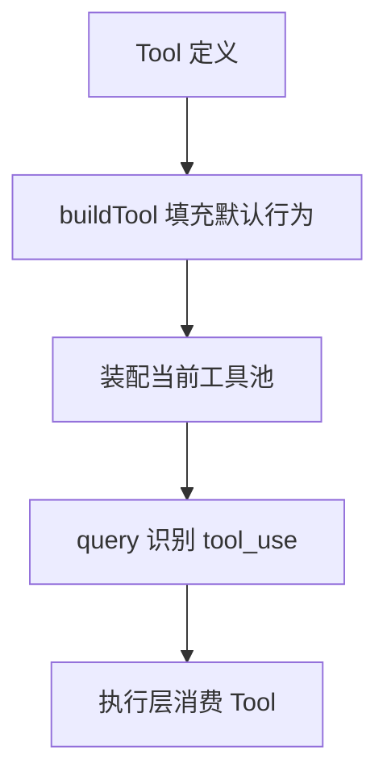
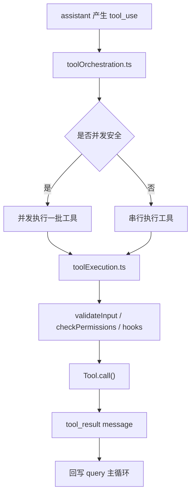

# 第 7 章 工具系统设计

## 本章目标
- 理解为什么 Tool 是统一能力协议，而不是若干零散函数的总和。
- 看清 `buildTool()`、`tools.ts` 和 `assembleToolPool()` 这三个位置各自承担什么责任。
- 建立工具系统的“协议层—注册层—装配层—执行层”认知框架。

## 先修关系
- 建议先读第 6 章，至少要知道主循环会产生 `tool_use`。
- 如果第 5 章已经读过，将更容易把工具结果消息和普通消息区分开。
- 本章与第 28 章是配套关系：本章讲 Tool 是什么，第 28 章讲 Tool 怎么跑。

## 关键词
- `Tool 协议`：工具并不只定义 `call()`，还定义权限、并发性、只读性和 UI 展示方式。
- `buildTool`：统一给工具填充默认行为的协议工厂。
- `ToolUseContext`：工具执行时可见的完整运行现场。
- `工具池`：当前会话允许模型看到和调用的工具集合。
- `权限门`：每个工具能否执行，不只取决于名字匹配，还取决于上下文和权限模式。

## 正文图解

## 关键数据结构
| 结构/对象 | 在本章中的位置 | 阅读时要抓什么 |
| --- | --- | --- |
| `Tool 定义对象` | 描述工具名称、schema、执行方法和治理规则。 | 这是理解工具系统的第一关键结构。 |
| `ToolUseContext` | 把 app state、消息、命令、MCP client 等环境交给工具。 | 它解释为什么工具执行并不孤立。 |
| `Built-in Tool Pool` | 内建工具的主注册表。 | 它决定基础能力面有哪些。 |
| `Assembled Tool Pool` | 按权限、模式和 MCP 配置拼出来的最终工具池。 | 模型看到的是这个结果，而不是所有定义的总和。 |

## 本章在能力层中的位置

这一章是第三阶段真正的转折点。
读者在这里会第一次明确看到：这套系统不是“先有很多功能，再把它们拼起来”，而是“先定义统一能力协议，再让所有功能按协议接入”。

## 为什么很多读者会在这一章第一次感到“工程味”

因为 `Tool.ts` 展现出来的不是业务逻辑，而是协议设计。
一旦开始讲协议、schema、权限接口、并发标记、结果上限和渲染接口，项目就从“功能堆叠”变成了“平台设计”。

## 读这一章时要抓住的三个对象

1. `Tool`：一个能力对象到底要声明哪些规则。
2. `tools.ts`：系统如何维护一个统一工具池。
3. `services/tools/*`：工具从被模型点名到真正执行，中间还要经过哪些治理层。

## 7.1 `Tool.ts` 不是接口文件，而是协议中心

`Tool.ts` 的信息量非常大，因为它同时定义了：

- 工具输入输出 schema
- 工具调用签名
- 权限检查接口
- UI 渲染接口
- 并发安全标记
- 只读/破坏性标记
- 搜索/读取命令折叠提示
- hook 匹配能力
- 自动分类器输入

换言之，`Tool` 在这里不是“函数封装”，而是“系统级能力对象”。

## 7.2 `buildTool()` 的设计价值

在 `Tool.ts` 下半部分，`buildTool()` 做了一件非常关键的事：
给工具定义补上安全默认值。

默认值包括：

- `isEnabled -> true`
- `isConcurrencySafe -> false`
- `isReadOnly -> false`
- `isDestructive -> false`
- `checkPermissions -> allow`
- `toAutoClassifierInput -> ''`
- `userFacingName -> tool.name`

这里最值得讲给读者听的是 `false` 的方向：

- 默认不认为自己是并发安全的
- 默认不认为自己是只读的

这体现了明显的“保守默认、显式声明”思想。

## 7.3 `tools.ts` 的职责

`tools.ts` 不是单纯导出一个数组，而是负责：

- 汇总所有内建工具
- 根据 feature gate 与环境条件裁剪工具
- 根据 deny rules 过滤工具
- 根据 REPL/simple mode 调整工具可见性
- 将内建工具与 MCP 工具装配为完整工具池

它是工具系统的注册中心和装配中心。

## 7.4 工具池是怎么拼出来的

`assembleToolPool()` 的逻辑很适合拿来拆解：

1. 先拿到当前权限上下文下的内建工具
2. 再引入 MCP 工具
3. 对两者进行 deny 过滤
4. 排序并按名字去重

其中一个细节很值得注意：
它会保持 built-in tools 作为连续前缀，以维持 prompt cache 稳定性。
这表明工具列表不仅影响功能，也影响缓存命中率。

### `Tool` 协议应按字段族来理解

如果把 `Tool.ts` 从头到尾通读一遍，会发现一个工具对象包含的字段非常多。
为了防止陷入“字段清单记忆”，可以把它们分成六个字段族：

| 字段族 | 典型字段 | 回答的问题 |
| --- | --- | --- |
| 身份族 | `name`、`aliases`、`searchHint`、`userFacingName()` | 这个能力对模型和界面分别叫什么。 |
| 契约族 | `inputSchema`、`inputJSONSchema`、`outputSchema` | 这个能力接收什么、返回什么。 |
| 执行族 | `call()`、`inputsEquivalent()` | 真正执行时要做什么。 |
| 治理族 | `validateInput()`、`checkPermissions()`、`isReadOnly()`、`isDestructive()`、`interruptBehavior()` | 在什么条件下允许执行，以及执行的风险轮廓是什么。 |
| 并发与预算族 | `isConcurrencySafe()`、`maxResultSizeChars`、`toAutoClassifierInput()` | 是否能并发、结果多大算超限、如何进入安全分类器。 |
| 展示族 | `description()`、`getToolUseSummary()`、`getActivityDescription()`、渲染函数 | 执行前、执行中、执行后如何向模型与 UI 解释自己。 |

按这六组来理解，会更容易看出一个事实：
Tool 在这里不是“业务函数 + 参数校验”，而是一份同时面向模型、调度器、安全系统和 UI 的完整能力声明。

### `buildTool()` 的默认值体现的是“保守默认”哲学

源码中的 `TOOL_DEFAULTS` 很值得全文讲解，因为每一个默认值都带着明确态度：

| 默认值 | 含义 | 工程意义 |
| --- | --- | --- |
| `isEnabled -> true` | 默认可启用 | 工具作者若不特别关闭，能力默认进入可用候选。 |
| `isConcurrencySafe -> false` | 默认不允许并发 | 并发必须靠显式证明，而不是乐观假设。 |
| `isReadOnly -> false` | 默认不认定为只读 | 系统宁可高估风险，也不低估风险。 |
| `isDestructive -> false` | 默认不认定为破坏性 | 真正破坏性工具需要显式声明，以便治理系统单独处理。 |
| `checkPermissions -> allow + updatedInput` | 默认把工具交给通用权限系统 | 工具自身如无特殊规则，则落入统一权限框架。 |
| `toAutoClassifierInput -> ''` | 默认不进入自动分类器转录 | 只有安全相关工具才需要主动暴露分类器输入。 |
| `userFacingName -> name` | 默认界面名等于工具名 | 降低工具定义的样板负担。 |

这里最有教材价值的是前两个 `false`：

- 默认不并发。
- 默认不只读。

这是一种典型的“安全方向默认保守”设计。
对于具有外部副作用的能力系统而言，这比“所有工具默认可并发、默认只读，作者自己再来纠正”要稳健得多。

### `ToolUseContext` 其实是一个缩小版运行时

很多人在初读时只把 `ToolUseContext` 当成“工具执行时传进去的环境参数”。源码表明，它远不止此。
这个对象可以按四个部分理解：

1. 运行配置面：`options.commands`、`options.tools`、`options.mainLoopModel`、`options.mcpClients`、`options.refreshTools`。
2. 状态读写面：`getAppState()`、`setAppState()`、`setAppStateForTasks()`、`updateFileHistoryState()`、`updateAttributionState()`。
3. 控制与中断面：`abortController`、`setInProgressToolUseIDs()`、`setHasInterruptibleToolInProgress()`、`requestPrompt()`。
4. 会话现场面：`messages`、`readFileState`、`loadedNestedMemoryPaths`、`discoveredSkillNames`、`contentReplacementState`、`queryTracking`。

之所以说它像一个“缩小版运行时”，是因为一个工具在执行时所需的绝大多数环境，都已经被压缩到这个对象里。
跨语言重建时，只要 `ToolUseContext` 的表达能力不够，后面的权限决策、文件状态缓存、动态刷新工具池、任务注册和 hook 回写都会立刻变得困难。

### 工具的“可见性”“可执行性”“成功执行”是三件不同的事

教材里非常有必要把这三件事分开，否则工具系统会被误解为“出现在列表里就等于一定能跑”。

#### 第一层：可见性

工具是否出现在当前工具池，取决于 `getTools()`、deny rules、simple mode、REPL mode、feature gate 和 `isEnabled()`。
这一层回答的是：“模型看不看得见这个工具。”

#### 第二层：可执行性

即使模型看见了工具，在真正执行时仍要通过 schema 校验、`validateInput()`、`checkPermissions()`、hook 和权限模式判定。
这一层回答的是：“当前这次调用是否被允许启动。”

#### 第三层：成功执行

调用被允许启动以后，还可能因为运行时错误、外部服务错误、结果超限、MCP 错误或中断而失败。
这一层回答的是：“启动之后是否真的得到有效结果。”

把这三层分清楚，对理解 `tools.ts` 与 `toolExecution.ts` 的边界尤其关键。

### `tools.ts` 同时维护“源工具集合”和“当前能力面”

`getAllBaseTools()`、`getTools()` 和 `assembleToolPool()` 解决的并不是同一个问题：

| 函数 | 解决的问题 |
| --- | --- |
| `getAllBaseTools()` | 当前构建与环境下，理论上可能存在哪些内建工具。 |
| `getTools(permissionContext)` | 在当前权限模式和运行模式下，哪些内建工具应暴露给模型。 |
| `assembleToolPool(permissionContext, mcpTools)` | 把当前可见的内建工具与 MCP 工具拼成完整能力面。 |

这种分层非常重要，因为系统必须同时回答两个问题：

1. “仓库里有哪些能力实现？”
2. “当前这一轮查询真正能看到哪些能力？”

前者是代码资产清单，后者是运行时能力面。把二者合并，会让权限过滤、REPL 特殊模式、MCP 动态接入和 prompt cache 稳定性变得十分混乱。

### 内建工具为何必须作为连续前缀

`assembleToolPool()` 里那段“built-ins 作为连续前缀”的逻辑看起来像性能小技巧，实际上影响的是系统提示词缓存稳定性。源码注释明确指出：

- 系统会把工具列表纳入 prompt cache 计算。
- 若平铺排序让某个 MCP 工具插进内建工具中间，就会改变后续缓存断点。
- 于是看似无害的动态 MCP 接入，可能导致整段系统提示词缓存全部失效。

因此，`assembleToolPool()` 不只是把工具数组拼起来，而是在维护一个对缓存友好的能力顺序。
这类细节非常能体现大系统实现与教材写作应关注的重点：
真正重要的设计，常常藏在“为什么数组要这样排序”这类微小选择里。

## 7.5 工具系统的三重面向

一个 `Tool` 同时面向三类消费者：

### 面向模型

- 名称
- 描述
- 输入 schema
- 输出 schema
- 提示词文本

### 面向执行系统

- `call()`
- `checkPermissions()`
- `isConcurrencySafe()`
- `isReadOnly()`

### 面向 UI

- `renderToolUseMessage()`
- `renderToolResultMessage()`
- `renderToolUseProgressMessage()`
- `userFacingName()`

这也是为什么工具抽象会变得很厚。

## 7.6 `services/tools/` 的作用

光有工具协议还不够，还需要执行层来调度它们。
这部分主要由：

| 文件 | 作用 |
| --- | --- |
| `toolOrchestration.ts` | 工具调用分批、并发与串行调度 |
| `toolExecution.ts` | 单次工具执行、权限、hook、错误分类 |
| `toolHooks.ts` | 工具前后 hook 流程 |

### 并发策略

`toolOrchestration.ts` 的设计很清晰：

- 先按 `isConcurrencySafe()` 把工具调用分区
- 连续只读/并发安全工具可并发跑
- 非只读或不安全工具串行跑

这是一种非常实用的工程折中：

- 既利用并发
- 又不破坏状态一致性

## 7.7 工具执行流程图

## 7.8 本章的关键观察

### 观察一：工具是“统一能力外壳”

这套系统把差异极大的能力统一为一个协议：

- 本地 Bash
- 文件读写
- Web/MCP
- 代理创建
- 计划模式切换
- 任务操作

这就是架构抽象的力量。

### 观察二：UI 不是附属品

在这里，工具不是“只执行不展示”，而是从一开始就把 UI 渲染当成协议的一部分。

### 观察三：权限不是外围逻辑

工具对象自己就参与权限协议，这说明安全从一开始就是系统内生设计，而不是后补。

## 7.9 语言无关重建视角

`Tool.ts` 给出的不是某种 TypeScript 风格，而是一份能力协议规格。若在其他语言中重建工具系统，至少要保留一个等价的 `ToolDefinition`，其中包含：

- 工具名称与描述
- 输入 schema 与输出 schema
- 供模型消费的 prompt 信息
- 核心执行入口 `call`
- 输入校验与权限检查
- 只读性判断与并发安全判断
- 中断行为
- 最大结果尺寸
- UI 展示钩子或等价的结果渲染接口

`buildTool()` 的意义也不应忽略。它并非语法糖，而是默认行为填充器，用于保证每个工具都遵守同一套最小协议。

### 工具系统的真正分层

从 `Tool.ts`、`tools.ts` 与 `services/tools/*` 的分工看，可迁移的最小架构应拆成三层：

1. 工具定义层：声明协议、默认值与工具元数据。
2. 工具池装配层：按内建工具、MCP 工具、插件工具与权限规则拼出当前能力面。
3. 工具执行编排层：处理校验、权限、并发分区、执行、进度与结果回写。

### 最小实现顺序

1. 先定义 `Tool` 抽象与公共字段。
2. 实现默认值填充器，确保所有工具拥有一致行为边界。
3. 实现工具注册表与工具池装配函数。
4. 实现执行编排层，负责查找工具、校验输入、执行与返回标准结果。
5. 最后再接入 MCP、插件与 UI 钩子等扩展能力。

### 重建时必须避免的误区

- 把工具实现成一组普通函数，导致权限、并发与结果大小治理无处安放。
- 只实现 `call()`，不实现 schema、权限与中断语义，导致模型调用变成不受约束的黑盒。
- 让 UI 逻辑完全脱离工具协议，导致工具进度与结果显示无法统一。
- 让扩展工具绕过注册表直接进入执行层，导致能力面无法审计与过滤。

## 重建蓝图：把能力系统压缩成统一协议

### 必须保留的抽象

1. 工具必须被定义为“带 schema、带元数据、带上下文约束的能力描述符”，而不是一个自由函数。`buildTool()` 的真正价值就在于把这些约束一次性固化。
2. 工具协议至少要含有名称、说明、参数结构、并发属性、权限要求、调用函数、结果规范化方式与可选的活动描述器。
3. 工具池装配器必须独立存在。它负责把内建工具、插件工具、MCP 工具等多种来源归并成稳定视图，并维持去重、缓存与名称冲突规则。
4. 工具执行器必须独立于工具定义存在。定义负责描述能力，执行器负责权限决策、输入验证、并发判定、进度回调、中断控制与结果大小治理。

### 最小实现顺序

1. 第一阶段先定义 Tool Descriptor 的最小类型，并用一个最简单的示例工具验证从 schema 到 call handler 的调用闭环。
2. 第二阶段实现 `buildTool()` 一类工厂，把默认值、公共校验、元数据收束规则写在一处，避免每个工具自行处理。
3. 第三阶段实现工具注册表和工具池装配器，使多个来源的工具能进入统一索引，并形成稳定查找规则。
4. 第四阶段实现独立执行器，使任何工具都通过同一入口被调用。只有这样，权限、中断、流式与 progress 才能成为平台能力而非单工具特判。
5. 第五阶段再支持更重的能力，如后台任务、流式工具输出、上下文修改器和上下文感知权限。

### 最容易写错的边界

1. 若把工具定义与工具执行揉成一体，后续任何一个工具要支持流式、后台化或权限细化时，都会把单文件复杂度迅速拉爆。
2. 若直接向模型暴露底层函数签名，而不先经过内部 schema 规范化，就会把供应商耦合带进能力系统，失去跨语言迁移的稳定点。
3. 若工具池没有明确定义名称冲突和缓存策略，插件、MCP 和内建工具一起工作时就会出现“今天找到这个工具、明天找到另一个”的不稳定行为。
4. 若执行器缺少统一结果信封，主循环就不得不理解每个工具返回的私有格式，从而破坏协议边界。

## 章末小结
- 本章围绕“统一能力协议、工具池装配与执行前置条件”重建了一层稳定理解，避免只记零散函数名或目录名。
- 真正需要沉淀下来的，不只是 `Tool 协议`、`buildTool`、`ToolUseContext` 这几个词，而是它们在 `Tool 定义对象`、`ToolUseContext`、`Built-in Tool Pool` 里的相互位置。
- 如后续在 第 8 章、第 10 章和第 28 章 中再次迷路，优先回看本章的“先修关系、正文图解、关键数据结构”三部分。

## 章末自测
1. 不看原文，用自己的话重述本章围绕“统一能力协议、工具池装配与执行前置条件”到底解决了什么问题。
2. 结合“正文图解”，把 `buildTool 填充默认行为` 到 `query 识别 tool_use` 之间的连接关系重新讲一遍。
3. 对比 `Tool 定义对象` 与 `ToolUseContext`：它们分别回答什么问题，边界为什么不能混掉？
4. 在 `Tool 协议`、`buildTool`、`ToolUseContext` 中任选两个，说明它们在本章中是如何互相作用的。
5. 如果后续要继续读 第 8 章、第 10 章和第 28 章，本章哪一部分最值得先回看？为什么？
