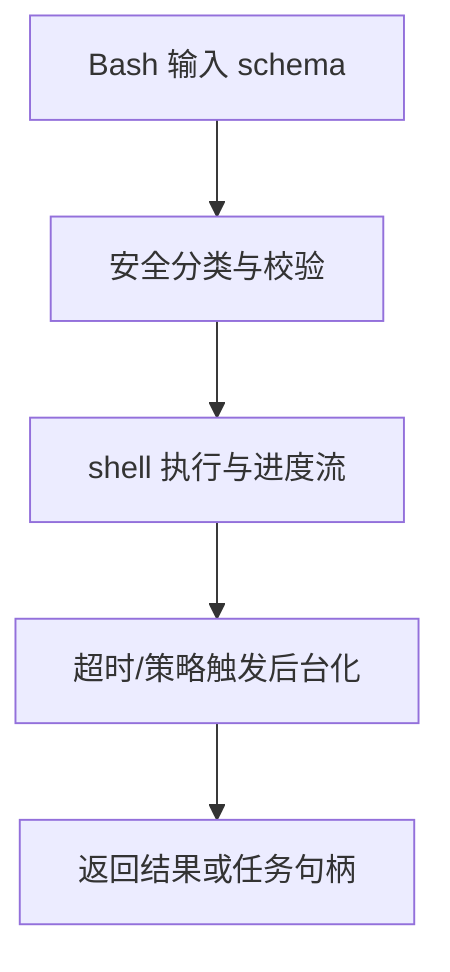
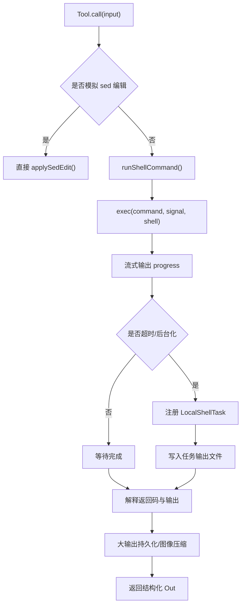

# 第 8 章 BashTool 深入解析

## 本章目标
- 理解 BashTool 为什么是整个工具系统中最具工程重量的模块之一。
- 看清命令执行、安全约束、流式进度、后台任务和 UI 反馈是怎样缝在一起的。
- 学会从 BashTool 读出“可执行能力必须被治理”的平台思维。

## 先修关系
- 建议先读第 7 章，至少要知道 Tool 协议的公共外壳。
- 如果第 6 章已经读过，将更容易把 BashTool 放回 query 主循环里理解。
- 本章最好与第 28 章和第 29 章配合阅读，前者看闭环，后者看重量级能力对比。

## 关键词
- `BashTool`：不是 shell 包装器，而是系统级命令执行能力。
- `runShellCommand`：真正消费 shell 进程并产生进度流的核心执行逻辑。
- `后台化`：长命令不一定失败，也可能被转移成后台任务继续运行。
- `安全分类`：命令在执行前会经过多层只读、危险性和 sandbox 判断。
- `Progress 流`：工具执行过程不是黑箱，系统会持续把阶段性进度回灌给 UI 和消息流。

## 正文图解

## 关键数据结构
| 结构/对象 | 在本章中的位置 | 阅读时要抓什么 |
| --- | --- | --- |
| `BashTool Input Schema` | 定义模型能提交哪些字段。 | 输入 schema 决定了 BashTool 的能力边界。 |
| `ExecResult` | 命令执行完成后的结果结构。 | 它决定 stdout/stderr/exit code 怎样回到系统。 |
| `Progress Event` | 运行中不断产出的中间态。 | 没有它，工具执行就无法被 UI 平滑展示。 |
| `LocalShellTask` | 命令被后台化后的生命周期容器。 | 它让“长时运行”不再阻塞主对话。 |

## 本章在第三阶段中的作用

如果第 7 章讲的是“工具协议的抽象层”，那么这一章讲的就是“一个重量级工具怎样把抽象层全部用满”。  
对读者来说，BashTool 是最有助于把协议、权限、任务、输出治理和 UI 展示一次性串起来的案例。

## BashTool 不能只当“命令执行器”来读

读者最容易犯的错误，就是把 BashTool 看成一层 `exec()` 包装。  
这样会漏掉最关键的部分：

- 为什么它要分析命令语义
- 为什么它要判断只读/搜索/列目录
- 为什么它要支持后台任务
- 为什么它要接入权限系统与沙箱
- 为什么它的输出不能总是原样回写

## 读这一章时的三条观察线

1. 风险线：哪些命令可能有副作用，系统如何提前约束它们。
2. 生命周期线：一条 shell 命令从提交、执行、进度、结束到回写经历了什么。
3. 工程线：为什么 BashTool 会自然牵出任务系统、结果存储和 UI 折叠策略。

## 8.1 为什么 BashTool 值得单独成章

`src/tools/BashTool/` 有接近 20 个相关文件，远超过很多普通工具。  
这是因为 BashTool 不只是“运行命令”，它还要处理：

- schema 与描述生成
- 只读检测
- 命令语义识别
- sed 编辑特殊处理
- sandbox 策略
- 权限规则匹配
- 进度流式回传
- 前台/后台任务切换
- 大输出持久化
- 图像输出压缩
- UI 折叠显示

它几乎把“工具系统的全部能力”都用了一遍。

## 8.2 BashTool 的组成

| 文件 | 职责 |
| --- | --- |
| `BashTool.tsx` | 工具主体与调用流程 |
| `bashPermissions.ts` | 权限判断、规则匹配、自动分类器相关 |
| `readOnlyValidation.ts` | 只读命令检测 |
| `pathValidation.ts` | 路径级安全约束 |
| `shouldUseSandbox.ts` | 决定是否进入 sandbox |
| `sedEditParser.ts` | 把特定 sed 编辑转成受控写入 |
| `UI.tsx` | 工具使用、进度、结果的界面渲染 |

## 8.3 BashTool 的核心设计思想

### 思想一：Bash 不是纯文本，而是受约束的能力

系统不会简单把用户给的命令丢给 Shell，而是先问很多问题：

- 这是只读命令吗？
- 这是搜索/读取命令吗？
- 这需要 sandbox 吗？
- 这条命令和已有权限规则匹配吗？
- 它是否适合后台运行？
- 它会不会其实是在做文件编辑？

这说明 BashTool 的本质是“受控 shell capability”。

### 思想二：Bash 结果不只是 stdout/stderr

输出结构中还包括：

- `backgroundTaskId`
- `assistantAutoBackgrounded`
- `persistedOutputPath`
- `persistedOutputSize`
- `returnCodeInterpretation`
- `noOutputExpected`

这表明工具结果也是富语义对象。

## 8.4 BashTool 的调用流程

从 `BashTool.call()` 到 `runShellCommand()`，大致经过以下阶段：

1. 若是模拟 sed 编辑，则直接走受控文件写入
2. 创建执行上下文和输出累积器
3. 通过 `runShellCommand()` 以异步生成器方式执行命令
4. 在执行过程中持续上报 `bash_progress`
5. 结束后解释退出码与语义结果
6. 如有需要，把大输出复制到 `tool-results` 目录
7. 若输出是图片，做压缩/缩放
8. 返回结构化工具结果

## 8.5 BashTool 的流程图

## 8.6 两个特别值得讲的细节

### 细节一：`isSearchOrReadBashCommand()`

这个函数说明 UI 折叠显示不是拍脑袋做的，而是靠命令语义识别：

- 搜索命令如 `grep`、`find`
- 读取命令如 `cat`、`head`
- 列表命令如 `ls`、`tree`

只有在整条复合命令都属于“可折叠语义”时，系统才会把它当作搜索/读取类命令来展示。

这体现了一个很好的工程习惯：

> UI 表现不直接依赖字符串，而依赖语义分类。

### 细节二：后台任务不是补丁，而是内建能力

`runShellCommand()` 里会在超时、assistant mode 等条件下把命令后台化，转入 `LocalShellTask`。  
这说明后台执行不是外围附加功能，而是 BashTool 的一等能力。

## 8.7 `LocalShellTask` 与 BashTool 的关系

当命令需要后台运行时，BashTool 并不会自己管理生命周期，而是转交给任务系统：

- `spawnShellTask()`
- `registerForeground()`
- `backgroundExistingForegroundTask()`

任务系统负责：

- 输出文件
- 状态跟踪
- stall watchdog
- 完成通知
- 与 UI 的协同

这是一种很干净的分层：  
工具负责“发起能力”，任务负责“承载长期执行”。

## 8.8 安全设计为什么这么重

Shell 是系统里风险最高的能力之一，所以将看到大量安全辅助模块：

- 只读检测
- 路径校验
- sandbox 策略
- 命令危险模式识别
- 自动分类器
- PowerShell 对应策略

这说明作者没有把“让模型能跑命令”当成功能，而是当成了安全工程问题。

## 8.9 最值得精读的三个片段

建议抓三段代码做近距离分析：

1. `buildTool({...})` 中 BashTool 的协议定义  
   让读者看到一个工具到底承担多少职责。

2. `call()` 中对 `runShellCommand()` 的消费  
   让读者看到异步生成器如何承载流式进度。

3. `runShellCommand()` 中的后台化逻辑  
   让读者理解“超时并不一定意味着失败，也可能意味着转任务”。

## 8.10 语言无关重建视角

从跨语言实现角度看，BashTool 至少由五个部件组成：

1. 输入 schema：`command`、`timeout`、`description`、`run_in_background`、`dangerouslyDisableSandbox` 等字段。
2. 语义分析器：区分 search/read/list/写操作，并据此决定 UI 折叠、权限与并发属性。
3. 执行器：真正调用 shell，持续产生 stdout、stderr、exit code、耗时与中断事件。
4. 安全层：只读校验、路径校验、命令语义解析、sandbox 判定、危险模式识别。
5. 生命周期桥：当同步执行不再适合时，转交给 `LocalShellTask` 承载长时运行。

因此，BashTool 不是“执行一条命令然后返回文本”，而是“受治理的命令执行子系统”。

### 输入输出契约

从源码可抽出一份稳定契约：

- 输入：一条 shell 命令及其执行约束。
- 过程输出：进度事件、排队提示、后台化提示、局部输出。
- 最终输出：标准化 `ToolResult`，其中包含文本结果、错误、附件或后台任务句柄。
- 副作用：文件变更、任务注册、通知触发、文件历史跟踪、工具结果落盘。

### 最小实现顺序

1. 定义 BashTool 输入 schema 与输出结构。
2. 实现 shell 执行器，保证可获取 stdout、stderr、exit code 与超时信息。
3. 实现基础权限检查与只读判定。
4. 实现语义分析器，用于识别搜索命令、读取命令、列表命令与危险命令。
5. 实现后台任务桥，使超时或显式后台化路径可转入任务系统。
6. 最后补入 UI 折叠、结果裁剪、截图/图片输出与文件历史等增强能力。

### 重建时最容易忽略的行为

- 只返回最终 stdout，忽略 progress 与排队提示，交互体验会明显退化。
- 不区分只读命令与写命令，权限与并发策略将无法成立。
- 把后台任务看成异常分支，而不是内建能力，导致长时命令无法稳定运行。
- 不为结果大小、图片输出与文件修改留出治理机制，最终会压垮消息系统和上下文窗口。

## 章末小结
- 本章围绕“命令执行能力、安全治理和后台任务化”重建了一层稳定理解，避免只记零散函数名或目录名。
- 真正需要沉淀下来的，不只是 `BashTool`、`runShellCommand`、`后台化` 这几个词，而是它们在 `BashTool Input Schema`、`ExecResult`、`Progress Event` 里的相互位置。
- 如后续在 第 28 章和第 29 章 中再次迷路，优先回看本章的“先修关系、正文图解、关键数据结构”三部分。

## 章末自测
1. 不看原文，用自己的话重述本章围绕“命令执行能力、安全治理和后台任务化”到底解决了什么问题。
2. 结合“正文图解”，把 `安全分类与校验` 到 `超时/策略触发后台化` 之间的连接关系重新讲一遍。
3. 对比 `BashTool Input Schema` 与 `ExecResult`：它们分别回答什么问题，边界为什么不能混掉？
4. 在 `BashTool`、`runShellCommand`、`后台化` 中任选两个，说明它们在本章中是如何互相作用的。
5. 如果后续要继续读 第 28 章和第 29 章，本章哪一部分最值得先回看？为什么？
