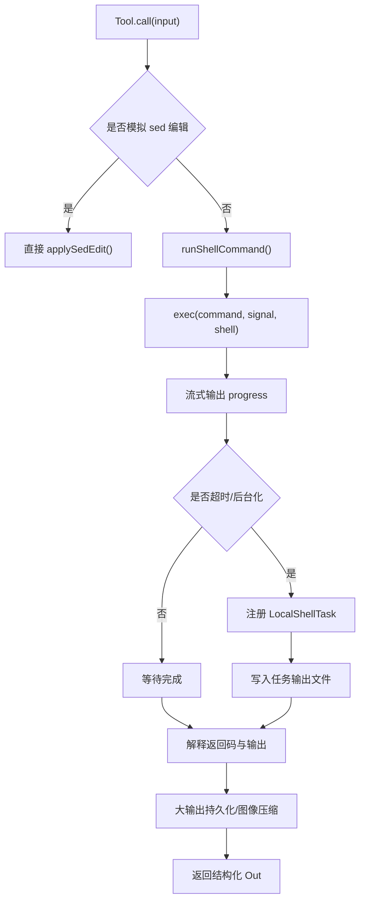

# 第 8 章 BashTool 深入解析

## 学习目标

- 认识 BashTool 为什么是整套系统中最核心、最复杂的工具之一
- 理解 BashTool 如何把 Shell 执行、安全控制、后台化与 UI 展示统一起来
- 学会从一个重量级工具反推整个系统的设计哲学

## 本章在第三阶段中的作用

如果第 7 章讲的是“工具协议的抽象层”，那么这一章讲的就是“一个重量级工具怎样把抽象层全部用满”。  
对学生来说，BashTool 是最能帮助你把协议、权限、任务、输出治理和 UI 展示一次性串起来的案例。

## BashTool 不能只当“命令执行器”来读

学生最容易犯的错误，就是把 BashTool 看成一层 `exec()` 包装。  
这样会漏掉最关键的部分：

- 为什么它要分析命令语义
- 为什么它要判断只读/搜索/列目录
- 为什么它要支持后台任务
- 为什么它要接入权限系统与沙箱
- 为什么它的输出不能总是原样回写

## 读这一章时的三条观察线

1. 风险线：哪些命令可能有副作用，系统如何提前约束它们。
2. 生命周期线：一条 shell 命令从提交、执行、进度、结束到回写经历了什么。
3. 工程线：为什么 BashTool 会自然牵出任务系统、结果存储和 UI 折叠策略。

## 8.1 为什么 BashTool 值得单独成章

`src/tools/BashTool/` 有接近 20 个相关文件，远超过很多普通工具。  
这是因为 BashTool 不只是“运行命令”，它还要处理：

- schema 与描述生成
- 只读检测
- 命令语义识别
- sed 编辑特殊处理
- sandbox 策略
- 权限规则匹配
- 进度流式回传
- 前台/后台任务切换
- 大输出持久化
- 图像输出压缩
- UI 折叠显示

它几乎把“工具系统的全部能力”都用了一遍。

## 8.2 BashTool 的组成

| 文件 | 职责 |
| --- | --- |
| `BashTool.tsx` | 工具主体与调用流程 |
| `bashPermissions.ts` | 权限判断、规则匹配、自动分类器相关 |
| `readOnlyValidation.ts` | 只读命令检测 |
| `pathValidation.ts` | 路径级安全约束 |
| `shouldUseSandbox.ts` | 决定是否进入 sandbox |
| `sedEditParser.ts` | 把特定 sed 编辑转成受控写入 |
| `UI.tsx` | 工具使用、进度、结果的界面渲染 |

## 8.3 BashTool 的核心设计思想

### 思想一：Bash 不是纯文本，而是受约束的能力

系统不会简单把用户给的命令丢给 Shell，而是先问很多问题：

- 这是只读命令吗？
- 这是搜索/读取命令吗？
- 这需要 sandbox 吗？
- 这条命令和已有权限规则匹配吗？
- 它是否适合后台运行？
- 它会不会其实是在做文件编辑？

这说明 BashTool 的本质是“受控 shell capability”。

### 思想二：Bash 结果不只是 stdout/stderr

输出结构中还包括：

- `backgroundTaskId`
- `assistantAutoBackgrounded`
- `persistedOutputPath`
- `persistedOutputSize`
- `returnCodeInterpretation`
- `noOutputExpected`

这表明工具结果也是富语义对象。

## 8.4 BashTool 的调用流程

从 `BashTool.call()` 到 `runShellCommand()`，大致经过以下阶段：

1. 若是模拟 sed 编辑，则直接走受控文件写入
2. 创建执行上下文和输出累积器
3. 通过 `runShellCommand()` 以异步生成器方式执行命令
4. 在执行过程中持续上报 `bash_progress`
5. 结束后解释退出码与语义结果
6. 如有需要，把大输出复制到 `tool-results` 目录
7. 若输出是图片，做压缩/缩放
8. 返回结构化工具结果

## 8.5 BashTool 的流程图

## 8.6 两个特别值得讲的细节

### 细节一：`isSearchOrReadBashCommand()`

这个函数说明 UI 折叠显示不是拍脑袋做的，而是靠命令语义识别：

- 搜索命令如 `grep`、`find`
- 读取命令如 `cat`、`head`
- 列表命令如 `ls`、`tree`

只有在整条复合命令都属于“可折叠语义”时，系统才会把它当作搜索/读取类命令来展示。

这体现了一个很好的工程习惯：

> UI 表现不直接依赖字符串，而依赖语义分类。

### 细节二：后台任务不是补丁，而是内建能力

`runShellCommand()` 里会在超时、assistant mode 等条件下把命令后台化，转入 `LocalShellTask`。  
这说明后台执行不是外围附加功能，而是 BashTool 的一等能力。

## 8.7 `LocalShellTask` 与 BashTool 的关系

当命令需要后台运行时，BashTool 并不会自己管理生命周期，而是转交给任务系统：

- `spawnShellTask()`
- `registerForeground()`
- `backgroundExistingForegroundTask()`

任务系统负责：

- 输出文件
- 状态跟踪
- stall watchdog
- 完成通知
- 与 UI 的协同

这是一种很干净的分层：  
工具负责“发起能力”，任务负责“承载长期执行”。

## 8.8 安全设计为什么这么重

Shell 是系统里风险最高的能力之一，所以你会看到大量安全辅助模块：

- 只读检测
- 路径校验
- sandbox 策略
- 命令危险模式识别
- 自动分类器
- PowerShell 对应策略

这说明作者没有把“让模型能跑命令”当成功能，而是当成了安全工程问题。

## 8.9 适合课堂精讲的片段

建议在课堂里选三段代码做近距离分析：

1. `buildTool({...})` 中 BashTool 的协议定义  
   让学生看到一个工具到底承担多少职责。

2. `call()` 中对 `runShellCommand()` 的消费  
   让学生看到异步生成器如何承载流式进度。

3. `runShellCommand()` 中的后台化逻辑  
   让学生理解“超时并不一定意味着失败，也可能意味着转任务”。

## 本章小结

这一章最重要的结论是：

> BashTool 不是 Shell 包装器，而是一个把命令执行、安全约束、后台任务和 UI 反馈整合到一起的系统级能力模块。

## 思考题

1. 为什么 BashTool 必须拆出这么多辅助文件，而不是全部写在一个类里？
2. 为什么“大输出持久化”要作为工具结果的一部分返回？
3. 如果让模型直接调用 `exec()` 而不经过 BashTool，会丢掉哪些系统能力？
