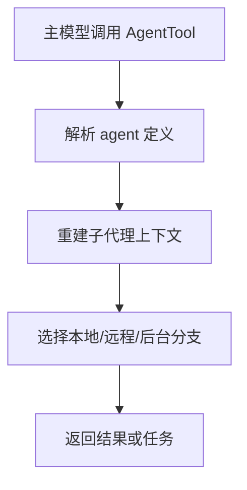
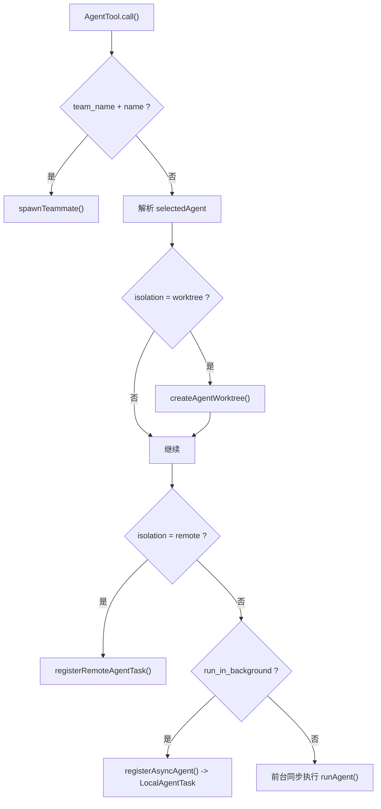

# 第 9 章 AgentTool、任务系统与多代理

## 本章目标
- 理解 AgentTool 为什么不是普通工具，而是“平台中的平台”。
- 看清子代理如何拥有自己的工具池、权限模式、工作目录和任务生命周期。
- 建立多代理系统的基本边界观，区分本地/远程、前台/后台、teammate/worktree 等概念。

## 先修关系
- 建议先读第 7 章和第 8 章，先熟悉 Tool 协议和任务容器的基本味道。
- 如果第 6 章已经读过，将更容易理解 AgentTool 是从主循环里被派生出来的。
- 本章与第 10 章、第 29 章联系紧密，前者讲扩展接入，后者讲重量级能力对比。

## 关键词
- `AgentTool`：允许模型继续派生新执行主体的工具。
- `runAgent`：真正创建子代理上下文并启动其运行的主入口。
- `worktree`：让代码代理在隔离副本中工作的机制。
- `LocalAgentTask`：后台本地子代理的生命周期容器。
- `remote agent`：不在本地当前进程内运行的代理分支。

## 正文图解

## 关键数据结构
| 结构/对象 | 在本章中的位置 | 阅读时要抓什么 |
| --- | --- | --- |
| `AgentTool Input Schema` | 描述子代理请求带哪些参数。 | 它决定模型能怎样声明要派生的代理。 |
| `AgentDefinition` | 每类 agent 的能力、权限和角色说明。 | 它是代理系统的“角色模板”。 |
| `Subagent Context` | 子代理运行时的上下文包。 | 它把主代理世界裁剪成可独立运行的缩小版系统。 |
| `Agent Task Record` | 后台代理的状态、输出和恢复信息。 | 没有它，多代理就很难持续存在。 |

## 本章在第三阶段中的位置

这一章是第三阶段里复杂度最高的一章之一。  
读者在这里会第一次真正感受到：系统不只是“自己做事”，还会“派出新的工作单元去做事”。

## 为什么这一章是整本书的复杂度跃迁点

在 BashTool 里，复杂度主要来自真实副作用。  
到了 AgentTool，复杂度进一步上升，因为这里还要处理：

- 子代理上下文
- 背景任务生命周期
- worktree 隔离
- remote 运行环境
- 任务输出回流

这意味着观察对象已经不再只是“一个工具怎么跑”，而是在看“平台如何调度另一个执行主体”。

## 读者应该先区分的四件事

1. 工具调用和任务运行不是一回事。
2. 同步代理和后台代理不是一回事。
3. 本地 worktree 代理和 remote 代理不是一回事。
4. 主线程上下文和子代理上下文不是一回事。

## 9.1 为什么 AgentTool 是平台中的平台

如果说 BashTool 让模型拥有“执行命令”的能力，那么 AgentTool 让模型拥有“派生新执行主体”的能力。  
它不是简单调用一个函数，而是在创建新的工作单元、新的上下文，甚至新的工作目录。

从 `src/tools/AgentTool/AgentTool.tsx` 可以直接看到，它支持：

- 选择 agent type
- 指定模型
- 前台或后台运行
- `team_name` 与 `name` 触发 teammate 生成
- `mode` 指定权限模式
- `isolation=worktree|remote`
- `cwd` 覆盖工作目录

这已经不是普通工具，而是“调度工具”。

## 9.2 AgentTool 的关键组成

| 文件 | 作用 |
| --- | --- |
| `AgentTool.tsx` | 子代理入口与分支调度 |
| `runAgent.ts` | 真正运行一个代理 |
| `agentToolUtils.ts` | 结果解析、进度、摘要等辅助 |
| `loadAgentsDir.ts` | 加载代理定义 |
| `built-in/*` | 内建代理模板 |
| `forkSubagent.ts` | fork 模式相关逻辑 |

## 9.3 AgentTool 的运行分支

AgentTool 最值得讲的地方，在于它不是单一路径，而是多分支调度器。  
根据参数和环境，可能出现以下路径：

1. 同步子代理  
   在当前交互流程中直接运行，主线程等待结果。

2. 异步后台子代理  
   注册为后台任务，稍后通过通知回到主线程。

3. worktree 隔离子代理  
   给代理单独创建工作树，避免直接污染当前仓库。

4. remote 子代理  
   把代理发到远程环境中运行。

5. teammate  
   当 `team_name + name` 同时存在时，生成团队协作代理。

## 9.4 AgentTool 的关键判断逻辑

从 `AgentTool.call()` 的中段可以总结出它的判断顺序：

1. 先判断是否在 team 语义下生成 teammate
2. 再解析具体 agent type
3. 再检查必须依赖的 MCP servers 是否可用
4. 再决定是否需要 `worktree` 或 `remote` 隔离
5. 再决定同步还是异步
6. 最后通过 `runAgent()` 真正运行

这说明 AgentTool 不是“执行器”，而是“代理调度决策器”。

## 9.5 `runAgent.ts` 的意义

`runAgent.ts` 是另一个非常值得讲的文件。它负责：

- 为子代理装配工具池
- 初始化 agent 专属 MCP 服务器
- 创建 subagent context
- 处理会话、sidechain transcript 与 metadata
- 执行 agent start hooks
- 调用 `query()` 运行代理自己的回合

这意味着子代理并不是轻量函数，而是“缩小版主系统”。

## 9.6 任务系统的抽象

`Task.ts` 很简洁，但概念极强。它定义了：

- `TaskType`
- `TaskStatus`
- `TaskHandle`
- `TaskContext`
- 任务状态基类

当前可见的主要任务类型包括：

- `local_bash`
- `local_agent`
- `remote_agent`
- `in_process_teammate`
- `dream`

这说明系统把“长生命周期工作单元”统一抽象成了任务。

## 9.7 任务系统的注册中心

`src/tasks.ts` 采用和工具系统相同的注册中心模式：

- `LocalShellTask`
- `LocalAgentTask`
- `RemoteAgentTask`
- `DreamTask`

再按 feature gate 条件加入其它任务。

这种设计的阅读价值在于：  
可看到，大型系统往往会把“可用能力清单”做成集中注册，而不是四处分散查找。

## 9.8 三类代理任务的差别

### 1. `LocalAgentTask`

后台本地子代理。  
典型特点：

- 有独立任务状态
- 可被 foreground/background
- 可记录摘要、进度、token 统计

### 2. `InProcessTeammateTask`

进程内 teammate。  
它的特点是：

- 与主进程共享运行时
- 但有独立身份、消息队列、待处理消息
- 更像“同进程 actor”

### 3. `RemoteAgentTask`

把代理交给远程环境。  
本地主要保留：

- task ID
- session URL
- output file
- 状态同步

## 9.9 代理与任务关系图

## 9.10 这套设计最值得深挖的地方

### 问题一：为什么代理也要有工具池

因为子代理不是复制主代理，而是带着新的权限模式、工作目录和上下文独立运行。

### 问题二：为什么 worktree 很重要

worktree 让代理能在隔离副本上改代码。  
这对于代码代理系统非常关键，因为它降低了并发修改与脏工作树污染的风险。

### 问题三：为什么 teammate 和 background agent 不是一回事

teammate 更强调协作身份与团队上下文；background agent 更强调长期任务执行。  
两者相交，但不等同。

## 9.11 语言无关重建视角

`AgentTool.tsx` 给出的并不是一个“再调用一次模型”的技巧，而是一套派生执行主体的协议。跨语言重写时，至少要保留以下输入字段：

- `description`
- `prompt`
- `subagent_type`
- `model`
- `run_in_background`
- `name`
- `team_name`
- `mode`
- `isolation`
- `cwd`

这些字段决定了子代理的身份、模型、权限模式、运行场所与生命周期。

### 运行分支必须清晰分开

从源码可抽象出四条典型分支：

1. 前台本地代理：直接在当前进程内同步执行并流式回传结果。
2. 后台本地代理：注册为 `LocalAgentTask`，由任务系统托管生命周期。
3. 远程代理：注册为 `RemoteAgentTask`，本地只保留 taskId、sessionUrl 与状态同步。
4. teammate/协作代理：带团队上下文、共享运行时但拥有独立身份与消息队列。

### 最小实现顺序

1. 先定义代理输入 schema 与输出 schema。
2. 实现代理定义加载器，使“可用代理集合”成为显式配置而非硬编码常量。
3. 实现 `runAgent`，使一个子代理可以获得独立的 system prompt、消息窗口与工具池。
4. 实现后台任务注册，使代理可以脱离当前交互回合继续运行。
5. 实现 isolation 层，例如 worktree 或 remote，使代理能够在隔离环境内工作。
6. 最后再补 teammate、多代理团队与 summarization 等高级功能。

### 必须保留的设计原则

- 子代理必须拥有独立上下文，而不是直接共享主代理的全部运行时状态。
- 工具池可继承但不可简单复用，权限、cwd 与 agent 类型变化后应重新装配。
- 后台化意味着进入任务语义，不能仅靠线程或协程存活。
- 远程分支必须显式记录恢复所需元数据，否则 session resume 会丢失代理状态。

## 重建蓝图：把 AgentTool 写成“生成新会话”的平台能力

### 必须保留的抽象

1. AgentTool 的核心抽象不是“再调一次模型”，而是“创建一个拥有独立上下文、独立生命周期、可能独立工作区的子会话”。因此 Agent Request、Agent Session、Agent Task 三层对象必须分开。
2. 任务系统必须作为平台基础设施存在。无论底层语言如何实现，它都至少要提供任务注册、状态查询、进度更新、完成/失败通知、资源清理和可恢复标识。
3. 子代理与父会话的关系必须通过显式 lineage 表达。原工程中的 parent/child transcript、逻辑父子关系与独立 worktree 都说明子代理既属于父会话，又不能与父会话共享可变状态。
4. 前台代理与后台代理必须是同一能力在不同调度模式下的表现，而不是两套完全不同的实现。否则一旦需要从前台切到后台，逻辑会撕裂。

### 最小实现顺序

1. 第一阶段先实现最小 Agent Request schema，包括子任务说明、上下文来源、可选工作目录和执行模式。
2. 第二阶段实现任务基类，使任务拥有统一 ID、状态机、日志与完成通知接口。若没有这一层，AgentTool 很快会把后台控制逻辑裹进自己体内。
3. 第三阶段实现本地子代理执行路径：创建子会话、分配独立上下文、运行一次查询主循环并把结果带回父会话。
4. 第四阶段再支持后台执行和 worktree 隔离，让子代理能够长期运行、并在独立代码树内操作。
5. 第五阶段补入远程代理、取消、失败恢复、资源清理与通知整合。

### 最容易写错的边界

1. 最危险的错误是让子代理直接复用父会话的可变消息列表或状态对象。这样一来，两个会话对同一份状态的竞争写入会立刻把恢复和展示逻辑搞乱。
2. 第二类错误是把 AgentTool 与任务注册器耦合得过紧。更稳定的方式是让 AgentTool 只负责构造任务与会话，把长期生命周期交给任务系统。
3. 第三类错误是把 worktree 当成附属细节。实际上它是多代理安全协作的重要边界，尤其在代码修改型任务中决定了隔离级别。
4. 第四类错误是没有把通知、进度和最终结果作为独立通道建模，导致父会话只能轮询子代理，这与原工程的设计精神相反。

## 章末小结
- 本章围绕“子代理派生、任务容器和多代理边界”重建了一层稳定理解，避免只记零散函数名或目录名。
- 真正需要沉淀下来的，不只是 `AgentTool`、`runAgent`、`worktree` 这几个词，而是它们在 `AgentTool Input Schema`、`AgentDefinition`、`Subagent Context` 里的相互位置。
- 如后续在 第 10 章、第 21 章和第 29 章 中再次迷路，优先回看本章的“先修关系、正文图解、关键数据结构”三部分。

## 章末自测
1. 不看原文，用自己的话重述本章围绕“子代理派生、任务容器和多代理边界”到底解决了什么问题。
2. 结合“正文图解”，把 `解析 agent 定义` 到 `选择本地/远程/后台分支` 之间的连接关系重新讲一遍。
3. 对比 `AgentTool Input Schema` 与 `AgentDefinition`：它们分别回答什么问题，边界为什么不能混掉？
4. 在 `AgentTool`、`runAgent`、`worktree` 中任选两个，说明它们在本章中是如何互相作用的。
5. 如果后续要继续读 第 10 章、第 21 章和第 29 章，本章哪一部分最值得先回看？为什么？
