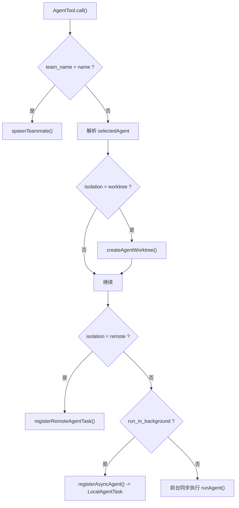

# 第 9 章 AgentTool、任务系统与多代理

## 学习目标

- 理解 `AgentTool` 为什么是系统中最“平台化”的工具
- 掌握任务系统如何承接后台代理、远程代理和进程内 teammate
- 学会分析同步代理、异步代理、worktree 代理、remote 代理的差异

## 本章在第三阶段中的位置

这一章是第三阶段里复杂度最高的一章之一。  
学生在这里会第一次真正感受到：系统不只是“自己做事”，还会“派出新的工作单元去做事”。

## 为什么这一章是整本书的复杂度跃迁点

在 BashTool 里，复杂度主要来自真实副作用。  
到了 AgentTool，复杂度进一步上升，因为这里还要处理：

- 子代理上下文
- 背景任务生命周期
- worktree 隔离
- remote 运行环境
- 任务输出回流

这意味着你已经不再只是看“一个工具怎么跑”，而是在看“平台如何调度另一个执行主体”。

## 学生应该先区分的四件事

1. 工具调用和任务运行不是一回事。
2. 同步代理和后台代理不是一回事。
3. 本地 worktree 代理和 remote 代理不是一回事。
4. 主线程上下文和子代理上下文不是一回事。

## 9.1 为什么 AgentTool 是平台中的平台

如果说 BashTool 让模型拥有“执行命令”的能力，那么 AgentTool 让模型拥有“派生新执行主体”的能力。  
它不是简单调用一个函数，而是在创建新的工作单元、新的上下文，甚至新的工作目录。

从 `src/tools/AgentTool/AgentTool.tsx` 可以直接看到，它支持：

- 选择 agent type
- 指定模型
- 前台或后台运行
- `team_name` 与 `name` 触发 teammate 生成
- `mode` 指定权限模式
- `isolation=worktree|remote`
- `cwd` 覆盖工作目录

这已经不是普通工具，而是“调度工具”。

## 9.2 AgentTool 的关键组成

| 文件 | 作用 |
| --- | --- |
| `AgentTool.tsx` | 子代理入口与分支调度 |
| `runAgent.ts` | 真正运行一个代理 |
| `agentToolUtils.ts` | 结果解析、进度、摘要等辅助 |
| `loadAgentsDir.ts` | 加载代理定义 |
| `built-in/*` | 内建代理模板 |
| `forkSubagent.ts` | fork 模式相关逻辑 |

## 9.3 AgentTool 的运行分支

AgentTool 最值得讲的地方，在于它不是单一路径，而是多分支调度器。  
根据参数和环境，可能出现以下路径：

1. 同步子代理  
   在当前交互流程中直接运行，主线程等待结果。

2. 异步后台子代理  
   注册为后台任务，稍后通过通知回到主线程。

3. worktree 隔离子代理  
   给代理单独创建工作树，避免直接污染当前仓库。

4. remote 子代理  
   把代理发到远程环境中运行。

5. teammate  
   当 `team_name + name` 同时存在时，生成团队协作代理。

## 9.4 AgentTool 的关键判断逻辑

从 `AgentTool.call()` 的中段可以总结出它的判断顺序：

1. 先判断是否在 team 语义下生成 teammate
2. 再解析具体 agent type
3. 再检查必须依赖的 MCP servers 是否可用
4. 再决定是否需要 `worktree` 或 `remote` 隔离
5. 再决定同步还是异步
6. 最后通过 `runAgent()` 真正运行

这说明 AgentTool 不是“执行器”，而是“代理调度决策器”。

## 9.5 `runAgent.ts` 的意义

`runAgent.ts` 是另一个非常值得讲的文件。它负责：

- 为子代理装配工具池
- 初始化 agent 专属 MCP 服务器
- 创建 subagent context
- 处理会话、sidechain transcript 与 metadata
- 执行 agent start hooks
- 调用 `query()` 运行代理自己的回合

这意味着子代理并不是轻量函数，而是“缩小版主系统”。

## 9.6 任务系统的抽象

`Task.ts` 很简洁，但概念极强。它定义了：

- `TaskType`
- `TaskStatus`
- `TaskHandle`
- `TaskContext`
- 任务状态基类

当前可见的主要任务类型包括：

- `local_bash`
- `local_agent`
- `remote_agent`
- `in_process_teammate`
- `dream`

这说明系统把“长生命周期工作单元”统一抽象成了任务。

## 9.7 任务系统的注册中心

`src/tasks.ts` 采用和工具系统相同的注册中心模式：

- `LocalShellTask`
- `LocalAgentTask`
- `RemoteAgentTask`
- `DreamTask`

再按 feature gate 条件加入其它任务。

这种设计的阅读价值在于：  
你可以看到，大型系统往往会把“可用能力清单”做成集中注册，而不是四处分散查找。

## 9.8 三类代理任务的差别

### 1. `LocalAgentTask`

后台本地子代理。  
典型特点：

- 有独立任务状态
- 可被 foreground/background
- 可记录摘要、进度、token 统计

### 2. `InProcessTeammateTask`

进程内 teammate。  
它的特点是：

- 与主进程共享运行时
- 但有独立身份、消息队列、待处理消息
- 更像“同进程 actor”

### 3. `RemoteAgentTask`

把代理交给远程环境。  
本地主要保留：

- task ID
- session URL
- output file
- 状态同步

## 9.9 代理与任务关系图

## 9.10 这套设计最值得深挖的地方

### 问题一：为什么代理也要有工具池

因为子代理不是复制主代理，而是带着新的权限模式、工作目录和上下文独立运行。

### 问题二：为什么 worktree 很重要

worktree 让代理能在隔离副本上改代码。  
这对于代码代理系统非常关键，因为它降低了并发修改与脏工作树污染的风险。

### 问题三：为什么 teammate 和 background agent 不是一回事

teammate 更强调协作身份与团队上下文；background agent 更强调长期任务执行。  
两者相交，但不等同。

## 本章小结

这一章最重要的认识是：

> AgentTool 把“让模型继续派生新的执行主体”变成了系统能力，而任务系统则为这些执行主体提供统一的生命周期容器。

## 思考题

1. 为什么 AgentTool 必须和任务系统配合，而不能只返回一个普通结果？
2. 为什么 worktree 隔离对代码代理特别重要？
3. 你如何向别人解释“子代理是缩小版主系统”这句话？
