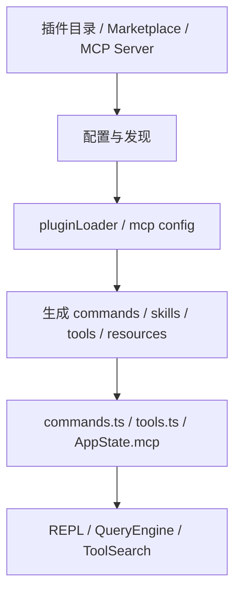

# 第 10 章 MCP 与插件扩展架构

## 学习目标

- 理解这套系统为什么不是封闭架构
- 掌握 MCP、插件、技能、命令之间的关系
- 学会分析“外部能力如何被吸纳进主系统”

## 10.1 扩展体系的四种入口

从源码看，这套系统至少有四类可扩展入口：

| 扩展入口 | 代表目录/文件 | 贡献内容 |
| --- | --- | --- |
| MCP | `services/mcp/` | 工具、资源、提示词、认证流程 |
| 插件 | `utils/plugins/` | 命令、技能、hooks、MCP 配置 |
| 技能 | `skills/`、`loadSkillsDir.ts` | Prompt 型能力与工作流知识 |
| 命令 | `commands.ts` + plugin commands | 用户可直接触发的 slash commands |

## 10.2 `services/mcp/client.ts` 的意义

这个文件非常关键，因为它承担了 MCP 客户端适配层。  
从可见代码可以看出它支持多种 transport：

- stdio
- SSE
- Streamable HTTP
- WebSocket
- SDK control transport

它还处理：

- OAuth/401 刷新
- tool/resource 获取
- tool result 截断与持久化
- 图片/二进制结果处理
- session 过期识别
- elicitation 交互

因此它并不是“调用一下 MCP SDK”，而是系统级的 MCP 运行时封装。

## 10.3 `services/mcp/config.ts` 的职责

配置层负责的不是“存一份 JSON”，而是：

- 解析多来源 MCP 配置
- 给配置打 scope
- 生成 server signature
- 对 plugin MCP server 做去重
- 处理 `.mcp.json`
- 处理 enterprise managed MCP 文件

特别值得课堂讲的是 `getMcpServerSignature()` 和 `dedupPluginMcpServers()`：  
它们说明扩展系统已经考虑到了“不同来源声明的是不是同一个服务器”这一类真实工程问题。

## 10.4 插件系统的结构

`utils/plugins/pluginLoader.ts` 开头写得很清楚，插件目录本身可以包含：

- `plugin.json`
- `commands/`
- `agents/`
- `hooks/`

也就是说，插件不是单点扩展，而是“能力包”。

## 10.5 插件装载器在做什么

从 `pluginLoader.ts` 可以归纳出它负责的工作：

- 发现插件
- 读取 manifest
- 解析 marketplace/source
- 验证路径与来源
- 处理版本缓存
- 处理 seed cache / zip cache
- 管理 enable/disable 状态
- 汇总错误

这说明插件系统是一个真正的包管理/装配系统，而不是简单地 `import` 某个目录。

## 10.6 `commands.ts` 中的动态合并

`commands.ts` 非常适合拿来讲“多来源合并”：

- 内建命令来自 `COMMANDS()`
- 技能命令来自 `getSkillDirCommands()`
- 插件技能来自 `getPluginSkills()`
- 内建插件技能来自 `getBuiltinPluginSkillCommands()`
- 工作流命令来自 `getWorkflowCommands()`
- 最后还会插入动态发现的技能

这说明最终的命令集合是运行时拼出来的，而不是编译时写死的。

## 10.7 扩展如何进入主系统

## 10.8 为什么扩展最后要汇入工具层

一个重要架构判断是：  
MCP、插件、技能虽然来源不同，但最终都要汇入主系统的统一协议。

最典型的是 MCP：

- MCP server 暴露的工具，最终会变成系统里的 `Tool`
- MCP resource 也会通过专门工具暴露出来

这能保证：

- 权限系统仍然可用
- UI 渲染仍然统一
- Query 主循环无需区分“内建工具”和“外来工具”

## 10.9 给学生强调的三个工程点

### 工程点一：扩展是运行时装配，而非静态依赖

这决定了系统必须有缓存、校验、去重、错误隔离。

### 工程点二：扩展不能绕过统一协议

否则外部能力会变成“系统外的例外”，整个架构会失控。

### 工程点三：配置来源和信任来源是不同问题

系统里不仅要知道“这个扩展来自哪里”，还要知道“它是否被允许”。

## 本章小结

这一章最重要的认识是：

> MCP 与插件并不是外挂，而是被严密吸纳进主系统协议中的扩展总线。

## 思考题

1. 为什么插件和 MCP 最终都要汇入统一工具池？
2. 为什么 `pluginLoader.ts` 需要版本缓存和来源校验？
3. 如果扩展系统不做去重，会带来哪些实际问题？
