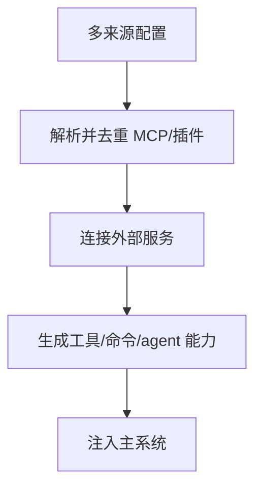
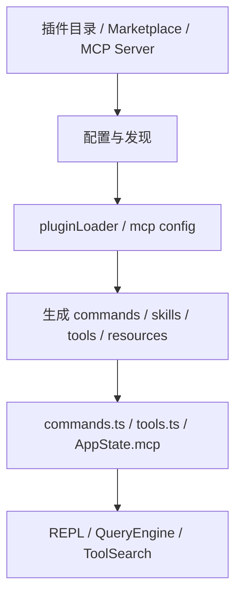

# 第 17 章 MCP 与插件扩展架构

## 本章目标
- 理解系统怎样把外部能力、插件能力和动态工具接进统一运行时。
- 看清 MCP 配置解析、客户端连接、去重与工具池注入的完整路径。
- 认识插件并不是单点功能，而是一种可以同时影响命令、agent、hook 和 MCP 的能力包。

## 先修关系
- 建议先读第 13 章，先理解“扩展能力最终也要变成统一协议面”。
- 如果第 16 章读过，将更自然地理解 agent 与插件为什么会在扩展层碰面。
- 本章和第 18 章相互照应：本章看接入机制，第 18 章看接入后的重量级能力形态。

## 关键词
- `MCP`：把外部服务的工具、资源和提示以统一协议接入系统的机制。
- `Plugin`：不仅能带命令，还能带 agent、hook 和 MCP 配置的能力包。
- `Server Signature`：用来判断两个来源声明的服务器是否本质相同。
- `配置解析`：MCP 配置会来自多个来源，并在运行时被合并与去重。
- `能力注入`：外部能力不会旁路执行，而是最终被吸收到当前工具池或命令面。

## 正文图解

## 关键数据结构
| 结构/对象 | 在本章中的位置 | 阅读时要抓什么 |
| --- | --- | --- |
| `MCP Server Config` | 描述服务器地址、认证、scope 等信息。 | 这是外部能力进入系统的最前门。 |
| `Server Signature` | 对服务器身份做去重判定的结构。 | 它避免重复声明造成能力重复或冲突。 |
| `Plugin Manifest` | 插件包里公开的命令、agent、hook、MCP 等入口。 | 它表明插件不是“一个按钮”，而是一组贡献集合。 |
| `AppState.mcp 聚合态` | 把已连接 MCP 服务、工具和资源挂进应用状态。 | 后续工具池和 UI 都会从这里取数据。 |

## 本章在扩展体系学习中的位置

这一章是第三阶段靠后的内容，适合放在读者已经理解命令、工具、任务之后再读。  
因为只有在知道“内建能力是怎样接入系统”的前提下，才会真正理解“外部能力为什么还能被无缝吸纳进来”。

## 读者最容易混淆的三个概念

1. 插件和 MCP 不是同一回事。
2. 技能和工具也不是同一回事。
3. 命令系统虽然也能扩展，但它和 MCP/插件的扩展边界不同。

如果这三个概念混了，整套扩展架构就会看成一团。

## 阅读顺序建议

建议这样读：

1. 先理解为什么系统不是封闭架构。
2. 再看 `services/mcp/client.ts` 这类“协议与连接层”。
3. 然后看 `config.ts` 和插件加载逻辑，理解扩展是怎么被发现、过滤和装配进主系统的。

## 10.1 扩展体系的四种入口

从源码看，这套系统至少有四类可扩展入口：

| 扩展入口 | 代表目录/文件 | 贡献内容 |
| --- | --- | --- |
| MCP | `services/mcp/` | 工具、资源、提示词、认证流程 |
| 插件 | `utils/plugins/` | 命令、技能、hooks、MCP 配置 |
| 技能 | `skills/`、`loadSkillsDir.ts` | Prompt 型能力与工作流知识 |
| 命令 | `commands.ts` + plugin commands | 用户可直接触发的 slash commands |

## 10.2 `services/mcp/client.ts` 的意义

这个文件非常关键，因为它承担了 MCP 客户端适配层。  
从可见代码可以看出它支持多种 transport：

- stdio
- SSE
- Streamable HTTP
- WebSocket
- SDK control transport

它还处理：

- OAuth/401 刷新
- tool/resource 获取
- tool result 截断与持久化
- 图片/二进制结果处理
- session 过期识别
- elicitation 交互

因此它并不是“调用一下 MCP SDK”，而是系统级的 MCP 运行时封装。

## 10.3 `services/mcp/config.ts` 的职责

配置层负责的不是“存一份 JSON”，而是：

- 解析多来源 MCP 配置
- 给配置打 scope
- 生成 server signature
- 对 plugin MCP server 做去重
- 处理 `.mcp.json`
- 处理 enterprise managed MCP 文件

特别值得细读的是 `getMcpServerSignature()` 和 `dedupPluginMcpServers()`：  
它们说明扩展系统已经考虑到了“不同来源声明的是不是同一个服务器”这一类真实工程问题。

## 10.4 插件系统的结构

`utils/plugins/pluginLoader.ts` 开头写得很清楚，插件目录本身可以包含：

- `plugin.json`
- `commands/`
- `agents/`
- `hooks/`

也就是说，插件不是单点扩展，而是“能力包”。

## 10.5 插件装载器在做什么

从 `pluginLoader.ts` 可以归纳出它负责的工作：

- 发现插件
- 读取 manifest
- 解析 marketplace/source
- 验证路径与来源
- 处理版本缓存
- 处理 seed cache / zip cache
- 管理 enable/disable 状态
- 汇总错误

这说明插件系统是一个真正的包管理/装配系统，而不是简单地 `import` 某个目录。

## 10.6 `commands.ts` 中的动态合并

`commands.ts` 非常适合拿来讲“多来源合并”：

- 内建命令来自 `COMMANDS()`
- 技能命令来自 `getSkillDirCommands()`
- 插件技能来自 `getPluginSkills()`
- 内建插件技能来自 `getBuiltinPluginSkillCommands()`
- 工作流命令来自 `getWorkflowCommands()`
- 最后还会插入动态发现的技能

这说明最终的命令集合是运行时拼出来的，而不是编译时写死的。

## 10.7 扩展如何进入主系统

## 10.8 为什么扩展最后要汇入工具层

一个重要架构判断是：  
MCP、插件、技能虽然来源不同，但最终都要汇入主系统的统一协议。

最典型的是 MCP：

- MCP server 暴露的工具，最终会变成系统里的 `Tool`
- MCP resource 也会通过专门工具暴露出来

这能保证：

- 权限系统仍然可用
- UI 渲染仍然统一
- Query 主循环无需区分“内建工具”和“外来工具”

## 10.9 本章应强调的三个工程点

### 工程点一：扩展是运行时装配，而非静态依赖

这决定了系统必须有缓存、校验、去重、错误隔离。

### 工程点二：扩展不能绕过统一协议

否则外部能力会变成“系统外的例外”，整个架构会失控。

### 工程点三：配置来源和信任来源是不同问题

系统里不仅要知道“这个扩展来自哪里”，还要知道“它是否被允许”。

## 10.10 语言无关重建视角

从重建角度看，MCP 与插件系统共同组成一条“扩展总线”。其最小可迁移骨架可拆为四步：

1. 配置发现：从本地文件、托管配置、插件清单与远程来源发现候选扩展。
2. 配置治理：解析、去重、策略过滤、签名比对、来源校验。
3. 连接或装载：建立 MCP transport，或装载插件命令、技能、agents 与 hooks。
4. 协议汇入：把扩展能力翻译成系统内部已有的 `Tool`、`Command`、`Resource` 等统一对象。

`services/mcp/config.ts`、`services/mcp/client.ts` 与插件装载器共同完成的正是这四个步骤。

### 必须保留的对象模型

跨语言实现时，至少应保留以下几类对象：

- 扩展配置对象：描述 server type、command/url、scope、headers、env 等信息。
- 扩展签名对象：用于内容级去重，而不只是按名称去重。
- 连接对象：保存 transport、capabilities、连接状态、关闭/重连逻辑。
- 协议转换对象：把远端 tool/resource/prompt 翻译成系统内部统一协议。

### 最小实现顺序

1. 先定义 MCP/插件配置结构与作用域模型。
2. 实现解析、去重与策略过滤，使能力集在进入系统前已被治理。
3. 实现 MCP 客户端，支持 stdio、HTTP、SSE、WebSocket 等最小 transport 集合。
4. 实现扩展到统一协议的映射层，使外来工具能与内建工具同池运行。
5. 最后再补认证缓存、会话过期重连、插件市场与官方注册表等增强能力。

### 重建时最容易出现的错误

- 仅按名称去重，而不是按命令或 URL 签名去重，导致等价服务器重复装载。
- 让扩展能力直接暴露给主循环，绕过权限、日志与结果治理。
- 把“配置存在”误当成“已被允许”，忽略企业策略与托管配置的过滤层。
- 把 MCP 客户端做成一次性调用器，忽略长连接、重连与会话过期语义。

## 重建蓝图：把扩展体系写成受控的能力汇入层

### 必须保留的抽象

1. MCP 与插件体系都应被视为“外部能力汇入机制”，而不是主系统的可选附属品。二者虽然来源不同，但最终都要进入工具、命令、资源或配置贡献的统一装配面。
2. MCP 至少需要 Server Descriptor、Transport Adapter、Capability Manifest、Connection Lifecycle 四个抽象。没有这四层，就无法支持 stdio、HTTP、WS、SSE、IDE 等多种接入方式。
3. 插件体系至少需要 Plugin Descriptor、Contribution Record、Loader、Conflict Policy 四个抽象，用来描述插件带来了什么、如何加载、冲突时谁优先。
4. 配置系统必须支持多来源合并，包括手工配置、插件注入、claude.ai 同步或其他来源；并且要有稳定的优先级和 allow/deny 策略。

### 最小实现顺序

1. 先定义扩展贡献模型，明确扩展究竟可以贡献工具、命令、资源、配置还是其他能力。只有把“能贡献什么”定义清楚，后续装载器才不会含糊。
2. 第二步实现配置解析与作用域合并，保证手工配置、默认配置和插件配置能被整理成统一 server list 与 plugin list。
3. 第三步实现传输适配层，把不同连接协议包装成统一的能力发现与调用接口。
4. 第四步实现能力发现与归并，把外部 server/plugin 暴露的能力规范化为内部工具与命令描述符。
5. 第五步补入失败隔离、重连、认证失效处理和冲突去重规则。

### 最容易写错的边界

1. 最常见的错误是把 MCP 仅仅理解为“远程工具”。实际上它还可能提供资源、提示词、命令等多类能力，因此内部抽象不能只围绕 tool call 展开。
2. 第二类错误是让插件初始化失败直接打断主系统。原工程更强调“扩展失败可见，但主系统仍可工作”的策略。
3. 第三类错误是忽略配置优先级与作用域合并。只要有插件、远端同步和本地手工配置同时存在，若没有明确 precedence，行为就会极不稳定。
4. 第四类错误是没有给连接生命周期建模。认证失败、网络抖动、server 丢失、重连成功等事件如果无法上报，扩展层就无法真正运行在生产环境。

## 章末小结
- 本章围绕“外部能力接入、配置解析与统一协议化”重建了一层稳定理解，避免只记零散函数名或目录名。
- 真正需要沉淀下来的，不只是 `MCP`、`Plugin`、`Server Signature` 这几个词，而是它们在 `MCP Server Config`、`Server Signature`、`Plugin Manifest` 里的相互位置。
- 如后续在 第 23 章、第 24 章和第 18 章 中再次迷路，优先回看本章的“先修关系、正文图解、关键数据结构”三部分。

## 章末自测
1. 不看原文，用自己的话重述本章围绕“外部能力接入、配置解析与统一协议化”到底解决了什么问题。
2. 结合“正文图解”，把 `解析并去重 MCP/插件` 到 `生成工具/命令/agent 能力` 之间的连接关系重新讲一遍。
3. 对比 `MCP Server Config` 与 `Server Signature`：它们分别回答什么问题，边界为什么不能混掉？
4. 在 `MCP`、`Plugin`、`Server Signature` 中任选两个，说明它们在本章中是如何互相作用的。
5. 如果后续要继续读 第 23 章、第 24 章和第 18 章，本章哪一部分最值得先回看？为什么？
