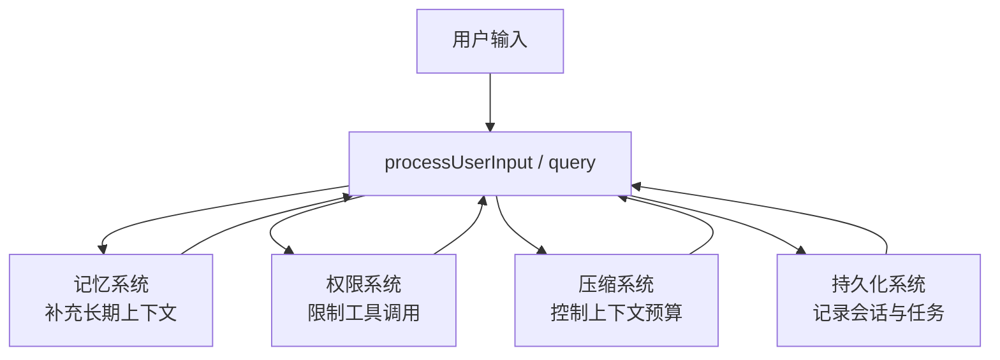

# 第 11 章 记忆、权限、压缩与持久化

## 学习目标

- 理解这四类横切系统为什么会反复出现在主流程中
- 掌握它们各自的职责和相互关系
- 学会从“系统约束”而非“功能模块”角度读代码

## 本章在第四阶段中的位置

这一章属于第四阶段，也就是学生已经理解主链路和核心能力层之后，回头补“系统为什么能长时间稳定运行”的那部分知识。

## 为什么横切系统比业务模块更难学

因为业务模块通常有比较清楚的入口和出口。  
横切系统不是这样。它们往往：

- 同时影响多个主流程
- 不只在一个目录里出现
- 既和产品逻辑有关，也和工程约束有关

所以，学生如果还用“这个功能在哪个文件夹”这种方式来找它们，几乎一定会迷路。

## 这一章要用“约束视角”来读

换句话说，不要只问“这段代码做了什么功能”，而要问：

- 它在限制什么风险？
- 它在修补什么系统缺陷？
- 如果没有它，系统会在哪个场景下出问题？

## 11.1 为什么这四类系统要放在一起讲

因为它们都不是单独的业务模块，而是会影响很多模块的全局规则：

- 记忆会影响提示词
- 权限会影响工具是否能执行
- 压缩会影响消息历史和上下文预算
- 持久化会影响恢复、后台任务和审计

如果学生不能把它们当“横切层”理解，就会误以为它们只是零散工具函数。

## 11.2 记忆系统：`memdir/`

`memdir/memdir.ts` 的设计很值得教学。  
它把记忆做成文件系统中的持久目录，并明确区分：

- 入口索引 `MEMORY.md`
- 单条 memory 文件
- 保存规则
- 不应该保存什么

最重要的教学点是：

> 记忆不是“多存一点上下文”，而是“建立一种长期、结构化、可读写的外部记忆机制”。

从 `truncateEntrypointContent()`、`buildMemoryLines()`、`ensureMemoryDirExists()` 可以看到，作者非常关心：

- 索引大小上限
- 记忆写入行为约束
- 记忆目录存在性
- 模型对记忆的正确使用方式

## 11.3 权限系统：`utils/permissions/`

`permissionSetup.ts` 是一个很好的入口文件。  
它揭示出权限系统不是简单白名单，而是多层规则系统：

- 权限模式
- 规则来源
- 危险规则检测
- auto mode 限制
- 额外工作目录
- 规则的读盘与应用

尤其值得讲的是两个函数：

- `isDangerousBashPermission()`
- `isDangerousPowerShellPermission()`

它们说明权限系统关注的不是“有没有权限”这么简单，而是“这种权限会不会让安全策略失效”。

## 11.4 压缩系统：`services/compact/`

`autoCompact.ts` 体现的是长上下文系统设计。  
它要解决的问题不是“消息太多怎么办”，而是：

- 什么时候该压缩
- 什么时候不该压缩
- 压缩失败时如何熔断
- 压缩后如何保留足够上下文
- 如何与 snip、context collapse、session memory 协同

这是典型的大模型应用“内存管理”问题。

## 11.5 持久化系统：`utils/sessionStorage.ts`

这个文件很长，说明它承担了很多职责：

- 会话 transcript 的路径管理
- JSONL 读写
- 恢复 session
- 记录 compact boundary
- 记录 file history 与 attribution
- 处理 agent transcript sidechain

一个很重要的设计是：  
它明确区分“哪些消息可以进 transcript，哪些不该进”。  
例如高频 progress message 被视为 UI 态，而不是持久化事实。

这非常适合课堂讲“日志不是全量镜像，而是精心挑选的持久化真相”。

## 11.6 四者关系图

## 11.7 这四类系统最值得讲给学生的共同点

### 共同点一：它们都在主流程里“隐身”

这些系统通常不会以一个显眼的入口出现，而是埋在启动、查询、工具执行、恢复等主链路中。

### 共同点二：它们都体现约束思维

它们关注的是：

- 不应该做什么
- 什么情况下必须降级
- 什么必须持久化，什么不能持久化
- 什么会破坏系统边界

### 共同点三：它们是“平台级治理能力”

没有这些横切系统，主系统也许能跑，但会：

- 不安全
- 不稳定
- 不可恢复
- 不可持续扩展

## 11.8 建议课堂精讲的四个问题

1. 为什么记忆要外化成文件，而不是永远留在消息历史里？
2. 为什么权限规则还要区分“危险规则”？
3. 为什么自动压缩需要熔断机制？
4. 为什么 transcript 不应该无脑记录所有 progress？

## 本章小结

这一章最核心的认识是：

> 记忆、权限、压缩、持久化不是附加功能，而是这套 Agent 平台能否长期稳定运行的治理基础设施。

## 思考题

1. 你如何用“操作系统”类比解释这四类横切系统？
2. 为什么说压缩系统其实是在做“上下文内存管理”？
3. 为什么 transcript 中的“真相”必须经过筛选？
