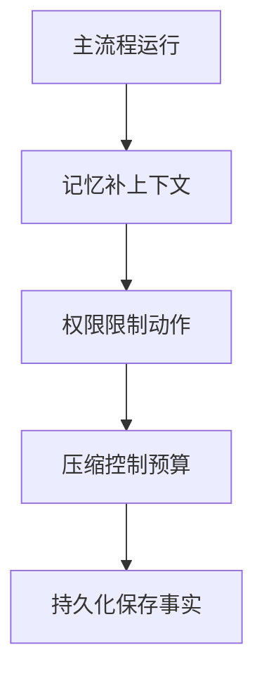
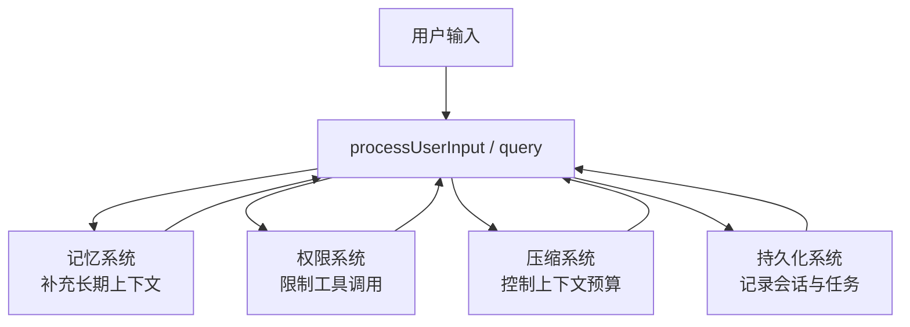

# 第 20 章 记忆、权限、压缩与持久化

## 本章目标
- 理解为什么记忆、权限、压缩和持久化必须放在一起看，而不能拆成零散功能点。
- 建立“约束视角”，看到这些系统如何在主链路中隐身但持续施加影响。
- 学会把横切系统理解为平台治理基础设施，而不是附加特性。

## 先修关系
- 建议先读第 9 章和第 13 章，至少知道 query 与工具执行是主流程。
- 如果第 21 章和第 22 章还没读，本章可以先建立框架，后面再补状态与恢复细节。
- 本章适合与第 10 章对照，因为很多横切能力会在请求时间线里出现。

## 关键词
- `memdir`：长期记忆目录与索引系统，把记忆从消息历史中外化出来。
- `permissions`：限制危险能力如何被调用的规则系统。
- `compact`：在上下文预算逼近阈值时重写消息历史的机制。
- `transcript`：会话与任务的重要持久化事实集合，而不是全量录像。
- `governance`：本章真正讲的是平台如何约束自己，而不是平台多会做事。

## 正文图解

## 关键数据结构
| 结构/对象 | 在本章中的位置 | 阅读时要抓什么 |
| --- | --- | --- |
| `MEMORY.md 索引` | 长期记忆目录的入口文件。 | 它决定模型如何发现和选择长期记忆。 |
| `Permission Rule Set` | 权限模式和危险规则的组合。 | 它是工具是否能执行的真正门槛。 |
| `Compact Boundary Message` | 压缩后留在消息历史里的边界或摘要单元。 | 它帮助系统恢复上下文的可解释性。 |
| `Transcript Record` | 被允许进入持久化日志的消息或事件。 | 它说明为什么持久化不等于录屏。 |

## 本章在第四阶段中的位置

这一章属于第四阶段，也就是读者已经理解主链路和核心能力层之后，回头补“系统为什么能长时间稳定运行”的那部分知识。

## 为什么横切系统比业务模块更难学

因为业务模块通常有比较清楚的入口和出口。  
横切系统不是这样。它们往往：

- 同时影响多个主流程
- 不只在一个目录里出现
- 既和产品逻辑有关，也和工程约束有关

所以，读者如果还用“这个功能在哪个文件夹”这种方式来找它们，几乎一定会迷路。

## 这一章要用“约束视角”来读

换句话说，不要只问“这段代码做了什么功能”，而要问：

- 它在限制什么风险？
- 它在修补什么系统缺陷？
- 如果没有它，系统会在哪个场景下出问题？

## 11.1 为什么这四类系统要放在一起讲

因为它们都不是单独的业务模块，而是会影响很多模块的全局规则：

- 记忆会影响提示词
- 权限会影响工具是否能执行
- 压缩会影响消息历史和上下文预算
- 持久化会影响恢复、后台任务和审计

如果读者不能把它们当“横切层”理解，就会误以为它们只是零散工具函数。

## 11.2 记忆系统：`memdir/`

`memdir/memdir.ts` 的设计很值得细读。  
它把记忆做成文件系统中的持久目录，并明确区分：

- 入口索引 `MEMORY.md`
- 单条 memory 文件
- 保存规则
- 不应该保存什么

最重要的理解点是：

> 记忆不是“多存一点上下文”，而是“建立一种长期、结构化、可读写的外部记忆机制”。

从 `truncateEntrypointContent()`、`buildMemoryLines()`、`ensureMemoryDirExists()` 可以看到，作者非常关心：

- 索引大小上限
- 记忆写入行为约束
- 记忆目录存在性
- 模型对记忆的正确使用方式

## 11.3 权限系统：`utils/permissions/`

`permissionSetup.ts` 是一个很好的入口文件。  
它揭示出权限系统不是简单白名单，而是多层规则系统：

- 权限模式
- 规则来源
- 危险规则检测
- auto mode 限制
- 额外工作目录
- 规则的读盘与应用

尤其值得讲的是两个函数：

- `isDangerousBashPermission()`
- `isDangerousPowerShellPermission()`

它们说明权限系统关注的不是“有没有权限”这么简单，而是“这种权限会不会让安全策略失效”。

## 11.4 压缩系统：`services/compact/`

`autoCompact.ts` 体现的是长上下文系统设计。  
它要解决的问题不是“消息太多怎么办”，而是：

- 什么时候该压缩
- 什么时候不该压缩
- 压缩失败时如何熔断
- 压缩后如何保留足够上下文
- 如何与 snip、context collapse、session memory 协同

这是典型的大模型应用“内存管理”问题。

## 11.5 持久化系统：`utils/sessionStorage.ts`

这个文件很长，说明它承担了很多职责：

- 会话 transcript 的路径管理
- JSONL 读写
- 恢复 session
- 记录 compact boundary
- 记录 file history 与 attribution
- 处理 agent transcript sidechain

一个很重要的设计是：  
它明确区分“哪些消息可以进 transcript，哪些不该进”。  
例如高频 progress message 被视为 UI 态，而不是持久化事实。

这非常适合用来理解一句话：“日志不是全量镜像，而是精心挑选的持久化真相”。

## 11.6 四者关系图

## 11.7 这四类系统最值得讲给读者的共同点

### 共同点一：它们都在主流程里“隐身”

这些系统通常不会以一个显眼的入口出现，而是埋在启动、查询、工具执行、恢复等主链路中。

### 共同点二：它们都体现约束思维

它们关注的是：

- 不应该做什么
- 什么情况下必须降级
- 什么必须持久化，什么不能持久化
- 什么会破坏系统边界

### 共同点三：它们是“平台级治理能力”

没有这些横切系统，主系统也许能跑，但会：

- 不安全
- 不稳定
- 不可恢复
- 不可持续扩展

## 11.8 本章最值得反复追问的四个问题

1. 为什么记忆要外化成文件，而不是永远留在消息历史里？
2. 为什么权限规则还要区分“危险规则”？
3. 为什么自动压缩需要熔断机制？
4. 为什么 transcript 不应该无脑记录所有 progress？

## 11.9 语言无关重建视角

横切系统往往最容易在重写时被低估，因为它们不像主链路那样显眼，却决定了系统能否长期稳定运行。按源码结构，可迁移的最小治理骨架至少包括四类接口：

- 记忆接口：决定哪些长期信息应以外部文件形式保存并何时回灌上下文。
- 权限接口：决定能力调用前的规则检查、交互批准与自动拒绝。
- 压缩接口：决定上下文窗口超限时如何改写消息历史而不破坏语义。
- 持久化接口：决定哪些事实进入 transcript、哪些状态进入 metadata、哪些过程状态应保持易失。

### 为什么必须把它们单列出来

若在重写时把这些能力散落进业务代码，会带来三类后果：

- 主链路代码迅速膨胀，无法再看出清晰的求值结构。
- 安全、压缩与持久化规则很难统一测试与演进。
- 扩展系统一旦进入，整个治理能力会因为边界不清而失控。

### 最小实现顺序

1. 先定义统一的“治理钩子点”，例如输入前、工具前、压缩前、持久化前。
2. 实现权限系统，使所有高风险能力在统一入口接受裁决。
3. 实现 transcript 与元数据持久化。
4. 实现上下文压缩与边界消息。
5. 最后再实现记忆文件系统、自动记忆与更复杂的治理策略。

### 重建时的关键原则

- 治理能力应作为主流程的内生组成部分，而不是外围插件。
- 记忆不应与普通消息历史混为一体；它属于另一种长期知识存储。
- 权限系统必须理解工具语义，而不是只理解“是否弹窗”。
- 压缩系统必须输出可解释边界，否则恢复与复盘都会失去依据。

## 重建蓝图：把横切系统写成统一策略层

### 必须保留的抽象

1. 记忆、权限、压缩与持久化都应被定义为“横切策略服务”，而不是散落在业务模块中的小工具函数。它们之所以难读，正因为它们在多处拦截主链路。
2. 每类横切能力都必须有清晰的接入点。记忆进入上下文装配阶段，权限进入工具执行前，压缩进入预算/上下文治理阶段，持久化进入消息和状态变化阶段。
3. 横切系统应优先返回决策结果，而不是直接操纵主流程。例如权限系统应返回允许、拒绝、需确认之类的 verdict，而不是在内部私自弹 UI。
4. 压缩系统必须被视为语义保留机制而非简单裁剪器。若缺少显式 compact policy，长会话将无法在上下文限制下维持连贯。
5. 会话持久化必须维护可恢复语义，而不是简单把内存对象 `JSON.stringify`。原工程保留 transcript、状态映射与 lineage 的做法，正是在为恢复服务。

### 最小实现顺序

1. 第一阶段先为主循环标出所有可能插入横切能力的钩子点，并写成统一接口，例如 `beforeToolRun`、`beforeModelRequest`、`afterStateChange`。
2. 第二阶段实现权限决策器，因为它直接影响能力是否可执行，是最基础的横切约束。
3. 第三阶段实现持久化与恢复协议，使用户消息、会话元数据和任务 lineage 能够被可靠记住。
4. 第四阶段实现上下文压缩，在会话足够长时通过显式流程压缩上下文，而不是任由消息历史无上限增长。
5. 第五阶段接入记忆系统，把历史记忆、工作区记忆或其他长期信息源纳入上下文装配阶段。

### 最容易写错的边界

1. 若把权限判断直接写进每个工具内部，策略将无法统一升级，也无法在不同能力之间保持一致体验。
2. 若把压缩当成“删掉旧消息”，系统会快速丢失先前推理与工具结果的重要约束。压缩必须是有语义摘要和边界规则的过程。
3. 若把持久化做成“每次都保存整个 AppState”，不仅开销大，而且会把大量瞬时噪声写进恢复文件。更稳妥的办法是保存可重建所需的最小 durable record。
4. 若让记忆系统绕过上下文装配阶段私自改写 prompt，调试时将极难定位一条信息究竟来自哪里。

## 章末小结
- 本章围绕“约束系统、治理基础设施与主流程隐式影响”重建了一层稳定理解，避免只记零散函数名或目录名。
- 真正需要沉淀下来的，不只是 `memdir`、`permissions`、`compact` 这几个词，而是它们在 `MEMORY.md 索引`、`Permission Rule Set`、`Compact Boundary Message` 里的相互位置。
- 如后续在 第 21 章、第 10 章和第 22 章 中再次迷路，优先回看本章的“先修关系、正文图解、关键数据结构”三部分。

## 章末自测
1. 不看原文，用自己的话重述本章围绕“约束系统、治理基础设施与主流程隐式影响”到底解决了什么问题。
2. 结合“正文图解”，把 `记忆补上下文` 到 `压缩控制预算` 之间的连接关系重新讲一遍。
3. 对比 `MEMORY.md 索引` 与 `Permission Rule Set`：它们分别回答什么问题，边界为什么不能混掉？
4. 在 `memdir`、`permissions`、`compact` 中任选两个，说明它们在本章中是如何互相作用的。
5. 如果后续要继续读 第 21 章、第 10 章和第 22 章，本章哪一部分最值得先回看？为什么？
