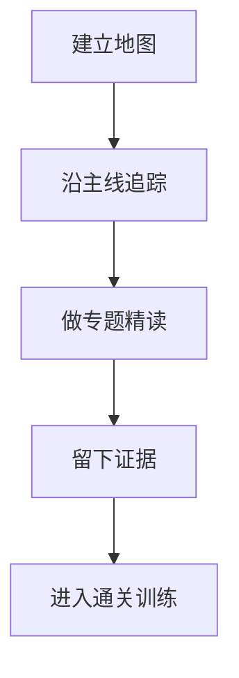

# 第 25 章 代码阅读指南：四轮阅读法与阶段规划

## 本章目标
- 建立一套可重复执行的大型源码阅读法，而不是依赖当时的灵感和记忆。
- 理解为什么要先抓主线、再做专题、最后留证据，而不是平铺扫目录。
- 让阅读结果沉淀成图、表、解释和检索入口，便于后续复习与答辩。

## 先修关系
- 这章可以在读完全书前后反复使用，但至少建议已经读过第 4 章和第 6 章。
- 如已完成第 5 章的一次请求走读，会更容易体会“主线追踪法”的必要性。
- 这章与第 27、28、29、30 章构成方法论闭环：怎么读、怎么沉淀、怎么复盘、怎么考核。

## 关键词
- `四轮阅读法`：把第一次建图、第二次主线、第三次专题、第四次验证区分开。
- `证据链`：每次阅读都要留下可追溯的图、表、解释或检索命令。
- `主线追踪`：优先顺着启动线、请求线和工具线读代码。
- `rg 检索`：用高效率的代码搜索去定位入口、分支和交叉点。
- `输出物`：真正的掌握一定伴随稳定的外部输出，而不是脑中模糊印象。

## 正文图解


## 关键数据结构
| 结构/对象 | 在本章中的位置 | 阅读时要抓什么 |
| --- | --- | --- |
| `四轮阅读模型` | 全书最重要的方法结构之一。 | 它防止不同阅读目标混在同一轮里。 |
| `证据矩阵` | 图、表、解释、命令等输出物的集合。 | 它让“我好像懂了”变成“我确实留下了证据”。 |
| `问题模板` | 每读一个文件都要回答的稳定问题集。 | 这能把阅读从被动浏览变成主动建模。 |
| `八周节奏表` | 把长期学习拆成阶段化计划。 | 它有助于在大项目面前保持节奏而不崩盘。 |

## 本章不是附录，而是主阅读方法

大型源码常常会把“阅读指南”误当成附录，结果一开始就陷入随意翻目录的状态。  
对于这套超过 50 万行的工程，这样做几乎一定会失控。

所以这一章不是可有可无的小贴士，而是全书的方法论中枢。  
独立阅读时，应将这一章视为“学习操作系统说明书”。

## 最容易失败的四种方式

### 方式一：按目录字母顺序读

这样最容易先掉进 `utils/`、`components/`、`hooks/` 这种体量很大的目录里。

### 方式二：一上来就啃最长的文件

例如直接硬啃 `REPL.tsx` 或 `query.ts`，通常只会积累挫败感。

### 方式三：把“看懂局部函数”误认为“理解模块职责”

局部函数看懂，不等于知道这个文件为什么存在，也不等于知道它与其它模块怎样配合。

### 方式四：没有输出物

如读完一章既没有图、也没有表、也没有提纲、也没有自测答案，那么大概率只是“看过”，不是“掌握”。

## 四轮阅读法总表

| 轮次 | 核心目标 | 主要动作 | 不要做什么 | 产出物 |
| --- | --- | --- | --- | --- |
| 第一轮 | 建立地图 | 只看入口、主链路、中枢文件 | 不要钻细节 | 系统草图 |
| 第二轮 | 走通主链 | 沿一次请求追代码 | 不要试图覆盖所有目录 | 时序图 |
| 第三轮 | 模块精读 | 分主题看工具、任务、状态、扩展 | 不要再按时间顺序读 | 模块笔记 |
| 第四轮 | 训练验证 | 做实验、作业、自测 | 不要只复述概念 | 报告与讲解稿 |

下面的具体顺序和练习，都是围绕这四轮阅读法展开的。

## 12.1 最推荐的阅读顺序

### 第一轮：建立系统地图

按下面顺序快速浏览：

1. `src/main.tsx`
2. `src/entrypoints/init.ts`
3. `src/setup.ts`
4. `src/screens/REPL.tsx`
5. `src/commands.ts`
6. `src/tools.ts`
7. `src/Tool.ts`
8. `src/QueryEngine.ts`
9. `src/query.ts`

目标不是读懂每一行，而是建立“哪些文件是中枢”的感觉。

### 第二轮：追踪一条真实请求链

宜沿着这一条链阅读：

`REPL.tsx -> processUserInput.ts -> QueryEngine.ts -> query.ts -> toolOrchestration.ts -> BashTool.tsx`

### 第三轮：进入专项子系统

按兴趣选择：

- 多代理：`AgentTool.tsx`、`runAgent.ts`、`tasks/`
- 扩展：`services/mcp/`、`utils/plugins/`
- 安全：`utils/permissions/`
- 长上下文：`services/compact/`
- 持久化：`utils/sessionStorage.ts`

## 12.2 不推荐的阅读方式

以下方式通常效率很低：

- 从 `utils/` 开始逐文件读
- 想一次性读完 `REPL.tsx`
- 先钻所有 UI 组件
- 先抠所有 feature gate 细节

原因很简单：  
没有主线时，这些代码会像迷宫。

## 12.3 “主线追踪法”

### 主线一：启动主线

问题：

- 程序如何进入 REPL？
- 哪些初始化是全局的，哪些是会话级的？

文件：

- `main.tsx`
- `entrypoints/init.ts`
- `setup.ts`
- `interactiveHelpers.tsx`

### 主线二：交互主线

问题：

- 用户输入如何进入消息流？
- Slash command 与普通 prompt 在哪里分叉？

文件：

- `REPL.tsx`
- `history.ts`
- `processUserInput.ts`
- `commands.ts`

### 主线三：执行主线

问题：

- 一轮 query 如何运行？
- 模型何时回调工具？

文件：

- `QueryEngine.ts`
- `query.ts`
- `services/api/claude.ts`
- `services/tools/`

### 主线四：能力主线

问题：

- 工具是如何定义的？
- 为什么同一种抽象能同时容纳 Bash、Read、Agent、MCP？

文件：

- `Tool.ts`
- `tools.ts`
- `BashTool.tsx`
- `AgentTool.tsx`

## 12.4 阅读问题模板

每读一个关键文件，都应回答四个问题：

1. 这个文件在系统里属于哪一层？
2. 这个文件的输入和输出分别是什么？
3. 这个文件依赖哪些上游抽象？
4. 这个文件会影响哪些下游模块？

这比单纯问“这个函数是做什么的”更有效。

## 12.5 建议使用的 grep/检索方式

阅读实践时可用如下命令：

```bash
rg --files src
rg -n "buildTool" src
rg -n "export async function\\* query|class QueryEngine" src
rg -n "registerAsyncAgent|spawnShellTask|connectToServer" src
rg -n "autoCompact|permission|sessionStorage|memdir" src
```

## 12.6 三个阅读实验

### 实验一：追踪一次普通文本请求

应回答：

- 这次请求在哪一步从字符串变成消息？
- 什么时候进入 `query()`？
- 最终 assistant message 在哪里被加入消息流？

### 实验二：追踪一次 Bash 工具调用

应回答：

- 工具 schema 在哪里定义？
- 为什么它能流式输出 progress？
- 什么情况下会进入后台任务？

### 实验三：追踪一次异步子代理

应回答：

- `run_in_background` 在哪里改变流程？
- 为什么会生成 taskId/outputFile？
- worktree/remote 分支在什么位置发生？

## 12.7 八周阅读节奏

若目标不是速通，而是真正掌握，可采用下面的八周节奏：

1. 第 1 周：第 1 章到第 4 章。
2. 第 2 周：第 5 章到第 7 章。
3. 第 3 周：第 8 章到第 10 章。
4. 第 4 周：第 11 章到第 14 章。
5. 第 5 周：第 15 章到第 18 章。
6. 第 6 周：第 19 章到第 22 章。
7. 第 7 周：第 23 章到第 26 章。
8. 第 8 周：第 27 章到第 30 章，并完成自测和实验。

## 12.8 每次阅读后应留下哪些证据

至少留下以下三样东西：

1. 一张图：架构图、流程图、时序图三者之一。
2. 一张表：模块职责表、数据结构表、对比表三者之一。
3. 一段解释：用白话说明这一章最核心的机制。

持续留下这三类证据，知识就会稳定沉淀下来。

## 12.9 最适合当阶段作业的题目

1. 画出一轮 query 的时序图
2. 比较 `BashTool` 与 `AgentTool` 的共同协议与差异职责
3. 分析 `commands.ts` 如何把内建命令与插件命令合并
4. 说明 `sessionStorage.ts` 为什么必须区分 transcript message 与 progress

## 重建蓝图：把阅读活动转成可执行规格

### 必须保留的产物

1. 若目标是跨语言重写，仅“读懂源码”远远不够，必须留下四类证据：调用链图、状态表、核心数据结构表、接口与副作用清单。
2. 每读完一个核心模块，都应能写出该模块的输入、输出、依赖、内部状态和失败分支。没有这些条目，所谓理解仍停留在感性印象。
3. 每条主链路都应至少形成一份事件时间线，从输入进入系统，到消息生成、模型流、工具执行、结果回写、持久化收尾为止。
4. 对于大文件，应额外留下“段落职责表”，即把文件切成若干责任区块，并说明每一块在运行时扮演什么角色。

### 最小实现顺序

1. 第一轮阅读只建立全局地图，识别程序入口、主循环、状态中心、工具协议、扩展入口和持久化出口。
2. 第二轮阅读追一条端到端链路，并把沿途经过的函数、状态变化和消息结构记录下来。
3. 第三轮阅读回到注册中心和协议文件，补齐工具、命令、任务、MCP、插件等动态汇入机制的规则。
4. 第四轮阅读才适合进入大文件深潜，把 QueryEngine、REPL、BashTool、AgentTool 等复杂模块拆成可重写的伪代码。
5. 第五轮阅读需要把前四轮产物整理成系统规格，包括模块边界、数据结构、状态机与测试想定。

### 最容易写错的边界

1. 最常见的问题是按目录顺序通读，但不留下任何结构化产物。这样信息量虽大，却无法转化为重写蓝图。
2. 第二类问题是只摘录“这段代码做了什么”，却没有记录“为什么要单独拆成这个模块”。跨语言重写最需要的是后者。
3. 第三类问题是对大文件只做线性阅读，不回头建立函数间关系图。像 `REPL.tsx`、`QueryEngine.ts` 这样的文件，如果不分层切段，很难真正掌握。
4. 第四类问题是只关心正向流程，不记录错误分支、取消分支和恢复分支。真正决定系统稳健性的，往往正是这些“边缘路径”。

## 章末小结
- 本章围绕“四轮阅读法、证据沉淀和主线追踪”重建了一层稳定理解，避免只记零散函数名或目录名。
- 真正需要沉淀下来的，不只是 `四轮阅读法`、`证据链`、`主线追踪` 这几个词，而是它们在 `四轮阅读模型`、`证据矩阵`、`问题模板` 里的相互位置。
- 如后续在 第 26 章、第 27 章和第 29 章 中再次迷路，优先回看本章的“先修关系、正文图解、关键数据结构”三部分。

## 章末自测
1. 不看原文，用自己的话重述本章围绕“四轮阅读法、证据沉淀和主线追踪”到底解决了什么问题。
2. 结合“正文图解”，把 `沿主线追踪` 到 `留下证据` 之间的连接关系重新讲一遍。
3. 对比 `四轮阅读模型` 与 `证据矩阵`：它们分别回答什么问题，边界为什么不能混掉？
4. 在 `四轮阅读法`、`证据链`、`主线追踪` 中任选两个，说明它们在本章中是如何互相作用的。
5. 如果后续要继续读 第 26 章、第 27 章和第 29 章，本章哪一部分最值得先回看？为什么？
