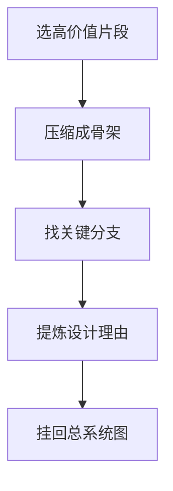

# 第 13 章 关键代码精讲

## 本章目标
- 通过若干高价值代码片段，练习如何把长文件压缩成骨架、决策点和设计理由。
- 理解“看懂代码”与“会解释代码”之间的差别，并学会跨过去。
- 把代表性实现重新挂回系统总图，避免精读变成局部沉迷。

## 先修关系
- 建议先读第 6、7、8、9、12 章，这样你知道为什么这些片段值得精讲。
- 如果第 20 章已经看过，你会更容易把精讲片段挂回目录地图。
- 本章适合与第 14 章一起使用：前者提供精读样本，后者教你如何把样本变成自己的输出。

## 关键词
- `buildTool`：最能体现协议工厂与平台默认值思想的代码片段。
- `getCommands`：多来源命令汇总与运行时过滤的代表性函数。
- `query 骨架`：理解状态机主循环最好的切入口。
- `AgentTool 决策树`：长函数不靠逐行解释，而靠决策顺序和分支图来理解。
- `渲染栈`：终端前端系统如何从组件树一路走到屏幕输出。

## 正文图解


## 关键数据结构
| 结构/对象 | 在本章中的位置 | 阅读时要抓什么 |
| --- | --- | --- |
| `协议工厂返回体` | 以 buildTool 为代表的统一默认行为结构。 | 它解释平台如何把具体实现拉回统一协议。 |
| `命令聚合结果` | getCommands 产出的运行时命令集合。 | 它说明入口层不是编译期常量。 |
| `Query 主循环骨架` | 把复杂控制流压缩成几个稳定阶段。 | 这是阅读长状态机代码的最重要动作。 |
| `Agent 决策树节点` | 把长函数拆成决策节点和分支出口。 | 它能帮助你解释复杂函数而不陷入逐行复述。 |

## 本章在第五阶段中的位置

这一章属于第五阶段，也就是学生已经对全局地图、主链路和核心模块有感觉之后，开始回到具体代码做“精读训练”的阶段。

## 为什么“关键代码精讲”不是替代源码

学生很容易把这一章误当成“只看这里就够了”。  
其实这一章真正的价值是：

- 帮你示范怎样拆大函数
- 帮你示范怎样从代码片段抽象出设计思想
- 帮你示范怎样把“会看代码”升级成“会解释代码”

它不能替代完整源码阅读，但能显著提升你后续再读源码时的抓手。

## 建议的使用方式

1. 先自己读原文件。
2. 再看本章的拆解方式。
3. 最后尝试用同样的方法去拆另一个你自己选的高价值文件。

## 13.1 精讲一：`buildTool()` 是协议工厂

位置：`src/Tool.ts`

### 为什么要讲它

因为它体现了整套工具系统的思想：  
先给出统一协议，再给出安全默认值，然后所有工具都按同一方式构建。

### 可以这样理解

伪代码：

```ts
function buildTool(def) {
  return {
    ...安全默认值,
    userFacingName: () => def.name,
    ...def,
  }
}
```

读者要抓的设计点：

- 这不是语法技巧，而是平台约束
- 默认值是 fail-closed 思想的体现
- 平台通过工厂把工具实现“拉回协议”

## 13.2 精讲二：`getCommands()` 是多来源合并器

位置：`src/commands.ts`

### 要点

`getCommands(cwd)` 并不是返回一个写死数组，而是按运行时组合：

- built-in commands
- skill dir commands
- plugin skills
- workflow commands
- dynamic skills

### 读者要抓的设计点

- 命令集合是运行时对象，不是静态常量
- 可扩展系统往往需要一个“最后汇总点”
- `memoize + availability/isEnabled 每次重算` 是性能与动态性的折中

## 13.3 精讲三：`query()` 是状态机主循环

位置：`src/query.ts`

### 读法

不要逐行解释，先把它压缩成骨架：

```ts
while (true) {
  准备上下文与预算
  必要时压缩
  发起模型请求
  收集 assistant 与 tool_use
  如果有工具调用:
    执行工具
    回写消息
    continue
  否则:
    return
}
```

### 读者要抓的设计点

- 先找状态对象，再找循环阶段，再找 continue 点
- 真正难点不是 API 调用，而是控制流拼接
- 这是系统内核式代码

## 13.4 精讲四：`BashTool.call()` 的两层结构

位置：`src/tools/BashTool/BashTool.tsx`

### 外层结构

- 处理模拟 sed 编辑
- 准备执行上下文
- 消费 `runShellCommand()` 产生的流式进度
- 结束后整理输出

### 内层结构

`runShellCommand()` 自己又是一个异步生成器：

- 启动 shell command
- 监听进度
- 判断是否后台化
- 最终返回 `ExecResult`

### 读者要抓的设计点

- 一个工具内部也可能包含小型状态机
- 生成器非常适合表达“执行中持续产出进度，结束后返回最终值”
- 这比 callback 风格更清晰

## 13.5 精讲五：`AgentTool.call()` 的决策树

位置：`src/tools/AgentTool/AgentTool.tsx`

### 建议的读法

把它画成决策树，不要直接念代码：

1. 这是 teammate 吗？
2. 这是 fork path 吗？
3. 需要哪些 MCP 服务器？
4. 要 worktree 吗？
5. 要 remote 吗？
6. 要同步还是异步？
7. 最终怎么调 `runAgent()`？

### 读者要抓的设计点

- 长函数不等于坏代码，前提是它承担的是调度职责
- 这种函数最重要的是“决策顺序”
- 当分支足够多时，应该先讲树，再讲代码

## 13.6 精讲六：自定义 Ink 渲染栈

位置：`src/ink/ink.tsx`、`src/ink/renderer.ts`

### 建议理解方式

先讲概念，再讲实现：

- React 组件树不是直接写终端
- 它先经过 reconciler
- 再经过 yoga 布局
- 再被渲染成 screen buffer
- 最后 diff 到真实终端

### 读者要抓的设计点

- “终端前端”也有自己的渲染管线
- 自定义渲染栈意味着作者对终端体验有很强控制需求
- 这部分最适合训练你的系统抽象能力

## 13.7 一页纸总结

如果你只允许自己在一页纸上留下六句话，可以写成：

1. `main.tsx` 是装配器
2. `REPL.tsx` 是 Shell
3. `QueryEngine + query` 是执行内核
4. `Tool` 是统一能力协议
5. `Task` 是统一异步容器
6. `MCP/Plugin/Memory/Permission/Compact/SessionStorage` 是平台级治理系统

## 章末小结
- 本章围绕“高价值代码片段、骨架化阅读和设计理由提炼”重建了一层稳定理解，不让你只记零散函数名或目录名。
- 真正需要沉淀下来的，不只是 `buildTool`、`getCommands`、`query 骨架` 这几个词，而是它们在 `协议工厂返回体`、`命令聚合结果`、`Query 主循环骨架` 里的相互位置。
- 如果你后续在 第 14 章和第 22 章 中再次迷路，优先回看本章的“先修关系、正文图解、关键数据结构”三部分。

## 章末自测
1. 不看原文，用自己的话重述本章围绕“高价值代码片段、骨架化阅读和设计理由提炼”到底解决了什么问题。
2. 结合“正文图解”，把 `压缩成骨架` 到 `提炼设计理由` 之间的连接关系重新讲一遍。
3. 对比 `协议工厂返回体` 与 `命令聚合结果`：它们分别回答什么问题，边界为什么不能混掉？
4. 在 `buildTool`、`getCommands`、`query 骨架` 中任选两个，说明它们在本章中是如何互相作用的。
5. 如果后续要继续读 第 14 章和第 22 章，本章哪一部分最值得先回看？为什么？
