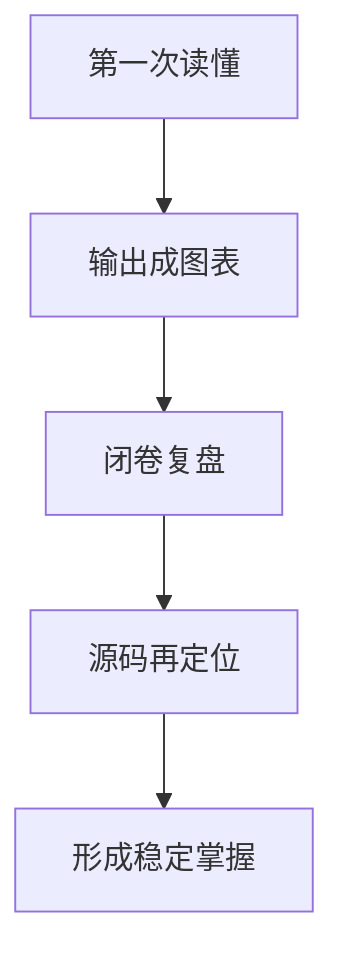

# 第 14 章 知识巩固方法：复习节奏、输出方法与阶段检查

## 本章目标
- 把前面章节学到的内容转化成可复盘、可输出、可迁移的知识。
- 建立适合大型源码教材的复习节奏和输出模板。
- 用于判断当前理解停留在“读过”“会讲”还是“能改”的哪一层。

## 先修关系
- 宜至少已经读到第 13 章，这样手头已经有足够的主线与模块材料可供复盘。
- 如果第 12 章的阅读方法还没真正执行过，本章会提供把方法落地成产出的支架。
- 本章与第 22、24、25 章形成学习出口：复习、总复盘、检查表和综合实验。

## 关键词
- `输出`：真正的掌握一定包含图、表、口头解释等外部化结果。
- `检索练习`：闭卷回忆不够，还要能重新定位到对应源码。
- `知识团块`：复习应按主题团块而不是日历或目录顺序进行。
- `掌握阶梯`：知道自己是在会讲主线、会讲边界还是会讲设计理由。
- `证据留存`：复习要留下稳定证据，后续自测和答辩才有抓手。

## 正文图解


## 关键数据结构
| 结构/对象 | 在本章中的位置 | 阅读时要抓什么 |
| --- | --- | --- |
| `输出物三件套` | 图、表、白话解释三类最重要的学习产物。 | 它们直接决定知识是否能沉淀。 |
| `复习单元表` | 按主题团块而不是章节线性推进的复习结构。 | 它有助于处理大型系统的复杂度。 |
| `掌握阶梯` | 初阶、中阶、高阶三层标准。 | 它能指示当前缺少的究竟是地图、边界还是设计理由。 |
| `源码定位记录` | 关键 `rg` 命令与入口文件集合。 | 它把抽象理解重新连回具体工程。 |

## 本章在全书中的位置

这一章位于第五阶段的末尾。  
前面的章节已经系统展开了系统地图、主链路、核心模块和关键代码。  
现在的问题不再是“这段代码我看见过没有”，而是：

> 我能不能在不翻书的情况下，把这些内容重新组织成自己的知识结构？

如果做不到，就说明理解还停留在“短期记忆层”。

## 为什么这一章很重要

大型工程最容易制造一种错觉：  
阅读时似乎已经理解，合上书以后却说不出来。

原因并不神秘：

- 信息量太大
- 模块太多
- 第一遍阅读时靠的是上下文提示
- 没有主动输出，理解就很难固化

因此，真正的掌握一定包含输出。  
必须把吸收进来的内容重新组织、重新命名、重新讲出来，知识才会稳定。

## 14.1 为什么“读懂一次”还不算掌握

读懂一次，通常只意味着两件事：

1. 在当下能跟上作者的推理。
2. 在上下文仍然清晰时能看懂代码关系。

但“掌握”至少还要多三步：

1. 能离开原文，把主线重新讲出来。
2. 能面对新文件时，用同样的方法继续分析。
3. 能把这套理解迁移到修改、扩展和排障上。

换句话说：

> 读懂是一种即时状态，掌握是一种可重复调动的能力。

## 14.2 适合这本书的三层输出法

如不知从何复习，可先做这三类输出。

### 第一层：图

每读完一个关键主题，至少留下一个图：

- 架构图
- 流程图
- 时序图
- 决策树

图的价值在于把“连续叙述”压缩成“空间结构”。  
例如：

- 第 2 章适合画九层架构图
- 第 16 章适合画单轮请求时序图
- 第 9 章适合画 AgentTool 决策树
- 第 28 章适合画工具执行闭环图

### 第二层：表

表的作用在于看清边界、职责和对比关系。  
常见的高价值表格有：

- 模块职责表
- 数据结构对照表
- 命令系统与工具系统对比表
- `AppState` / `bootstrap/state` / transcript 三层状态对比表

当开始能稳定做表，就说明理解不再停留在“听故事”，而是在识别结构。

### 第三层：口头解释

这是最重要的一层。  
应强制尝试用白话讲清下列问题：

- 这个模块解决什么问题
- 它为什么要这样设计
- 它和上游、下游怎么接

如果一段话里全是函数名和文件名，通常说明相关内容还没有真正理解。  
真正理解之后，应当能先用白话解释，再回到具体源码。

## 14.3 按主题复习，而不是按日期复习

很多人复习失败，不是因为不努力，而是因为把目录当作天然学习单元。  
对于这种大型工程，更有效的做法是按“知识团块”复习。

下面给出一套六个复习单元：

| 单元 | 核心问题 | 推荐章节 |
| --- | --- | --- |
| 单元一：系统是什么 | 这到底是不是普通 CLI？ | 第 15、26、23、1、2 章 |
| 单元二：程序怎么活起来 | 启动、UI、会话如何建立？ | 第 3、4 章 |
| 单元三：一次请求怎么跑完 | 输入、消息、Query、API 怎样接起来？ | 第 5、6、16、19、27 章 |
| 单元四：系统怎样获得行动能力 | 命令、工具、BashTool、工具执行闭环如何成立？ | 第 7、8、17、28 章 |
| 单元五：系统怎样派生新执行主体和接入外部能力 | Agent、任务、MCP、插件怎样工作？ | 第 9、10、29 章 |
| 单元六：系统怎样长期稳定运行 | 状态、权限、记忆、压缩、持久化与恢复怎样协同？ | 第 11、18、20、21、30 章 |

这样复习的好处是，将逐渐形成“主题地图”，而不是只有“章节顺序记忆”。

## 14.4 每次复习都应该留下哪些证据

一次有效复习，最好留下四样东西：

### 1. 一张图

哪怕很粗糙，也比什么都不画强。  
图会迫使分析回到“谁和谁相连、先后顺序是什么、哪里是分叉点”这类结构问题上。

### 2. 一张表

表会迫使分析回到“哪些东西很像、哪些东西不同、边界在哪里”这类边界问题上。

### 3. 一段白话解释

宜控制在 150 到 300 字之间。  
太短会变成口号，太长会重新滑回摘抄。

### 4. 一组源码定位记录

例如用 `rg` 记录关键入口：

```bash
rg -n "class QueryEngine|export async function\\* query" src
rg -n "buildTool|assembleToolPool|canUseTool" src
rg -n "run_in_background|registerAsyncAgent|registerRemoteAgentTask" src
```

定位记录的作用不是收藏命令，而是形成“进入源码的门把手”。

## 14.5 三种最有效的自测方式

### 方式一：闭卷复盘

不看书，直接回答：

1. 这个系统的三条主线是什么？
2. `Tool`、`Task`、`Command` 的边界是什么？
3. 为什么 transcript 不会记录所有 progress？

只要其中一个问题说不顺，就说明相应模块还需要回看。

### 方式二：源码定位题

给自己出题，然后只用检索来找答案：

- 工具池在哪里最终装配？
- AgentTool 的后台化分支在哪里发生？
- 哪个文件负责把 `AppState` 的变化同步到外部配置？

这种训练会把“知道概念”变成“找得到实现”。

### 方式三：对比题

大型系统最怕混淆。  
所以需反复做对比：

- 命令 vs 工具
- 主代理 vs 子代理
- UI 状态 vs transcript 状态
- 普通日志 vs 可恢复事实

一旦对比做清楚，很多模糊点会自动消失。

## 14.6 阶段性掌握标准

可用三级标准判断自己现在处在哪一步。

### 初阶：能讲主线

应当能：

- 说清系统大体结构
- 走通一次请求生命周期
- 指出几个最关键的中枢文件

### 中阶：能讲边界

应当能：

- 解释 `REPL.tsx` 和 `QueryEngine.ts` 的边界
- 解释为什么命令和工具不能合并
- 解释为什么工具系统和任务系统要分层

### 高阶：能讲设计理由

应当能：

- 解释为什么 transcript 不是全量录像
- 解释为什么工具执行要区分并发安全和非并发安全
- 解释为什么扩展能力最后都要回到统一协议层

当进入高阶时，基本就已经具备修改系统的资格了。

## 14.7 复习时最值得反复回收的关键词

宜反复回收以下关键词，因为它们会逐渐构成系统分析中的稳定语言：

- 装配器
- Shell
- 消息流
- 协议
- 状态机
- 调度
- 任务容器
- 扩展总线
- 横切治理

这些词不是装饰，而是压缩复杂源码的认知工具。

## 重建蓝图：把复盘工作转成重写规格工程

### 必须保留的产物

1. 若阅读目标是跨语言实现，那么复盘的最终成果不应只是摘要笔记，而应至少包括架构总图、主请求时序图、消息 schema、工具协议、任务状态机和恢复协议六类文档。
2. 每个核心章节都应沉淀为一个“契约页”，列出本模块的输入、输出、依赖、主要状态和失败边界。这样在真正重写时，可以直接作为设计文档使用。
3. 每条关键链路都应有一份“最小伪代码版本”，即去掉语言细节后仍然能描述其执行顺序的算法文本。
4. 每个横切系统都应有一份“触发点表”，说明它在哪些阶段介入主流程，以及介入后会改变什么。

### 最小实现顺序

1. 第一阶段复盘先整理概念与术语，把消息、任务、代理、工具、MCP、状态、transcript 这些高频名词固定下来。
2. 第二阶段整理链路，把一次请求、一次工具调用、一次子代理启动和一次恢复过程分别写成时序说明。
3. 第三阶段整理数据结构与状态机，把每个核心模块的内部状态和外部契约独立成表。
4. 第四阶段整理测试目录，为后续重写准备黑盒测试与白盒不变量列表。
5. 第五阶段再开始真正编码，此时已有文档应足够支撑脱离原语言重新搭建同构系统。

### 最容易写错的边界

1. 复盘若只按章节顺序做摘要，很容易得到一堆分散知识，却得不到一份可以指导工程实现的规格。
2. 第二类错误是只复盘正向主链路，而忽略取消、权限拒绝、后台化、恢复失败、扩展掉线等边缘流程。
3. 第三类错误是把“已经会讲”误认为“已经能写”。若没有把讲解进一步压缩成 schema、状态图和伪代码，真正动手实现时仍会卡住。
4. 第四类错误是没有为复盘成果建立版本迭代。随着理解加深，早期的粗略图和定义需要被不断修正，否则会拖累后续实现。

## 章末小结
- 本章围绕“复习节奏、输出模板和掌握标准”重建了一层稳定理解，避免只记零散函数名或目录名。
- 真正需要沉淀下来的，不只是 `输出`、`检索练习`、`知识团块` 这几个词，而是它们在 `输出物三件套`、`复习单元表`、`掌握阶梯` 里的相互位置。
- 如后续在 第 22 章、第 24 章和第 25 章 中再次迷路，优先回看本章的“先修关系、正文图解、关键数据结构”三部分。

## 章末自测
1. 不看原文，用自己的话重述本章围绕“复习节奏、输出模板和掌握标准”到底解决了什么问题。
2. 结合“正文图解”，把 `输出成图表` 到 `源码再定位` 之间的连接关系重新讲一遍。
3. 对比 `输出物三件套` 与 `复习单元表`：它们分别回答什么问题，边界为什么不能混掉？
4. 在 `输出`、`检索练习`、`知识团块` 中任选两个，说明它们在本章中是如何互相作用的。
5. 如果后续要继续读 第 22 章、第 24 章和第 25 章，本章哪一部分最值得先回看？为什么？
