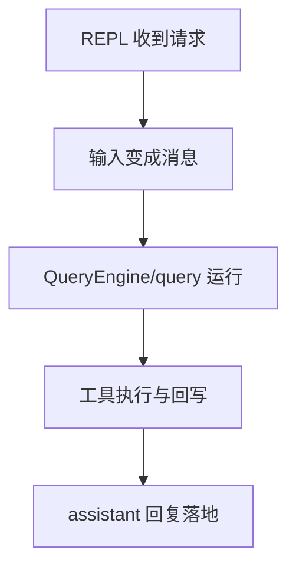
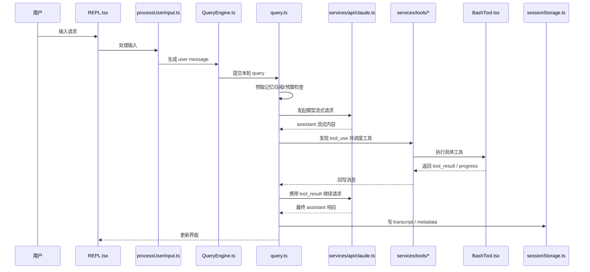

# 第 16 章 从一次请求走完整个系统

## 本章目标
- 用一条完整案例把整套系统从输入到结果回写先走顺一次。
- 建立用户线、模型线和工具线三条并行观察线。
- 为后续每个模块章节提供共同的“主链路挂点”。

## 先修关系
- 建议先读第 1 章和第 15 章，至少要知道这是 REPL 中的 Agent 平台。
- 如果第 26 章术语表已经浏览过，本章里的消息、tool_use、assistant block 会更容易吸收。
- 本章是第 5、6、19、27、28 章的总入口，读完后再回去拆各子模块会更轻松。

## 关键词
- `请求主链路`：用户目标第一次被系统完整处理的过程。
- `user message`：输入进入系统后不再只是字符串，而是消息对象。
- `tool_use`：模型在回复流中发出的结构化动作请求。
- `tool_result`：工具执行后回到消息历史里的结果对象。
- `transcript`：重要会话事实在运行过程中会被及时落盘。

## 正文图解

## 关键数据结构
| 结构/对象 | 在本章中的位置 | 阅读时要抓什么 |
| --- | --- | --- |
| `User Message` | 用户目标进入系统后的第一层正式表示。 | 后续几乎所有模块都围绕它展开。 |
| `Assistant Content Block` | 模型返回文本块与工具块的承载结构。 | 它决定 query 主循环为什么天然是回路。 |
| `Tool Result Pair` | tool_use 与 tool_result 之间的配对关系。 | 没有这个关系，后续继续推理会断裂。 |
| `Transcript Entry` | 请求处理中被持久化的关键事实。 | 它解释为什么系统能在异常中断后恢复语义。 |

## 本章在第二阶段中的位置

这一章是第二阶段的“主线课”。  
它的作用不是替代后续模块分析，而是先用一条具体路径把整套系统的骨架跑出来，让读者知道后面每章为什么会出现。

## 为什么全书要先讲一条完整案例

因为对零背景读者来说，“路径感”比“目录感”更重要。  
如果先给太多模块说明，读者会得到一堆分散知识；但如果先走一遍完整请求链，后面再读模块时就会不断把它们挂回那条主线。

## 读这一章时请盯住三条线

1. 输入线：请求是怎样进入系统的。
2. 执行线：消息是怎样被送进 QueryEngine 和 query 主循环的。
3. 能力线：模型什么时候决定调用工具、工具结果又怎样回到系统。

## 16.1 我们选择的示例请求

为了让路径尽量完整，我们选择这样一个用户输入：

> 请帮我分析当前项目测试失败的原因，并给出修复建议。

为什么选它？

因为它通常会触发一整套典型能力：

- 普通文本输入
- 模型理解任务
- 读文件
- 跑测试命令
- 搜索代码
- 汇总分析

这比只问“今天天气如何”更能展示系统全貌。

## 16.2 第一步：请求进入 REPL

主界面是 [REPL.tsx](src/screens/REPL.tsx)。  
从产品视角看，用户只是在输入框里敲字；但从系统视角看，REPL 做了很多准备工作：

- 当前主题是什么
- 当前工具池是什么
- 当前命令池是什么
- 当前 MCP 客户端有哪些
- 当前会话里有哪些任务在跑
- 当前是否处于特殊模式，例如 plan mode、remote mode、teammate view

所以，用户输入并不是直接扔给模型，而是先进入这个“交互总控层”。

## 16.3 第二步：输入进入 `processUserInput()`

REPL 收到输入后，会把它交给 [processUserInput.ts](src/utils/processUserInput/processUserInput.ts)。

此时系统首先要回答的不是“如何回复”，而是“这到底是什么输入”：

- 普通提示词？
- Slash command？
- 带粘贴引用的文本？
- 图片输入？
- 系统生成但用户不可见的 meta 输入？

只有判断清楚输入类型，后续流程才成立。

## 16.4 第三步：把输入变成消息

如果它是普通文本请求，那么系统会把它转换成 `user message`。  
这里请先记住一句很重要的话：

> 系统内部真正流动的，不是“原始字符串”，而是“消息对象”。

消息对象后面会不断被扩展：

- 用户消息
- 模型消息
- 工具结果消息
- 系统消息
- 附件消息

这是整个系统的数据共同语言。

## 16.5 第四步：QueryEngine 接管这一轮

接下来，请求会进入 [QueryEngine.ts](src/QueryEngine.ts)。

### 这里最容易讲错的地方

很多人会说：“QueryEngine 就是发请求。”  
这不准确。

更准确地说：

> QueryEngine 是会话执行器，它掌握跨轮次的消息历史、文件缓存、使用量统计、权限拒绝记录等会话级状态。

当本轮 `submitMessage()` 开始时，它会把本轮所需上下文与全局状态准备好，然后把真正的执行工作交给 `query()`。

## 16.6 第五步：`query()` 进入主循环

这一轮真正的核心逻辑发生在 [query.ts](src/query.ts) 中。

可把它想成一个总控循环：

1. 检查消息是否需要压缩
2. 构建本轮的 system prompt、user context、system context
3. 发起模型流式请求
4. 看模型是否要调用工具
5. 若要调用工具，执行工具再回来继续
6. 若不需要工具，结束这一轮

## 16.7 第六步：主循环先做“出发前检查”

在真正请求模型之前，系统会做很多“出发前检查”，这一步非常工程化：

- 相关记忆是否要预取
- 技能发现是否要预取
- 工具结果预算是否超标
- 是否需要 snip
- 是否需要 microcompact
- 是否需要 context collapse
- 是否需要 auto compact

### 为什么这一步如此重要

因为模型请求非常贵，而且上下文窗口有限。  
如果不在出发前做整理，很容易：

- 超出上下文
- 重复发送无用内容
- 丢失重要记忆
- 让缓存命中率下降

## 16.8 第七步：构造“本轮实际发给模型的内容”

在这一阶段，系统会把很多信息拼成模型能理解的输入：

- 系统提示词
- 用户上下文
- 系统上下文
- 本轮前的消息历史
- 工具定义
- MCP 资源/命令
- 必要的 memory 或 attachment

这就是为什么本项目里会有：

- `context.ts`
- `utils/queryContext.ts`
- `constants/prompts.ts`
- `utils/messages.ts`

这些模块都在为“构造本轮模型输入”服务。

## 16.9 第八步：发起流式模型请求

真正发请求时，`query.ts` 会调用 [services/api/claude.ts](src/services/api/claude.ts)。

### 这一层做了什么

它并不只是发 HTTP：

- 选择 provider
- 配置 header
- 处理 betas
- 处理流式输出
- 累计 usage
- 计算成本
- 处理 retry 与 fallback

所以它不是“网络层小工具”，而是模型通信层。

## 16.10 第九步：模型开始流式吐结果

一旦模型开始返回流式内容，系统就会边收边处理。

这里可能出现两种情况：

### 情况 A：模型直接回答

如果模型直接给出分析文本，那本轮就比较简单：

- assistant message 被逐步构造
- UI 渐进展示
- 最后完成本轮

### 情况 B：模型决定调用工具

如果模型判断自己需要查看更多证据，它会在消息中产生 `tool_use` 块，例如：

- 读取测试文件
- 执行测试命令
- 搜索报错关键字

此时主循环不会结束，而会转入工具执行阶段。

## 16.11 第十步：工具调度层开始工作

一旦 `tool_use` 出现，系统就会进入 `services/tools/`：

- [toolOrchestration.ts](src/services/tools/toolOrchestration.ts)
- [toolExecution.ts](src/services/tools/toolExecution.ts)
- [StreamingToolExecutor.ts](src/services/tools/StreamingToolExecutor.ts)

### 它们的分工

- `toolOrchestration.ts` 决定哪些工具并发、哪些串行
- `toolExecution.ts` 负责单次工具调用的完整执行流程
- `StreamingToolExecutor.ts` 负责工具边流入边执行的场景

## 16.12 第十一步：具体工具开始执行

假设模型调用了 BashTool 跑测试命令。  
系统会进入 [BashTool.tsx](src/tools/BashTool/BashTool.tsx)。

这时又发生了几个层次的动作：

1. 先检查命令是否安全
2. 判断是否需要 sandbox
3. 运行命令并流式上报进度
4. 如果太久，可能转成后台任务
5. 最终形成结构化工具结果

这就是为什么工具不是简单函数，而是完整协议对象。

## 16.13 第十二步：工具结果回到消息流

工具执行完后，不是直接把一堆 stdout 放到屏幕上，而是会被包装回消息系统：

- `tool_result`
- `attachment`
- `progress`
- `system` 通知

这一步非常关键。  
因为只有回到消息流中，模型才能继续阅读这些结果并进行下一步推理。

## 16.14 第十三步：主循环继续下一轮“模型 -> 工具 -> 模型”

如果本轮工具调用已经满足证据需要，模型下一轮可能会直接总结：

> 测试失败的主要原因是……

如果还不够，它还会继续调用更多工具。

所以，一次用户请求往往不是：

> 一次模型调用

而是：

> 多轮“模型推理 -> 工具执行 -> 结果回注”的复合循环

## 16.15 第十四步：结果展示与会话落盘

一旦本轮结束，系统通常还会做两类善后工作：

### 1. 展示层善后

- 更新消息列表
- 更新任务状态
- 更新通知
- 刷新状态栏/底部提示

### 2. 持久化层善后

- 记录 transcript
- 记录任务输出位置
- 记录 session metadata
- 必要时记录 compact boundary

这部分主要由 `sessionStorage.ts`、任务系统和 REPL 状态共同完成。

## 16.16 一张总时序图

## 16.17 对初学者最关键的三个认识

### 认识一：一次请求是“一串过程”，不是“一次调用”

如果读者脑中仍然把它理解成“用户说一句，模型答一句”，后面的代码就很难理解。

### 认识二：消息流是总线

用户输入、模型输出、工具结果、系统通知，最终都要回到消息系统。

### 认识三：工具让模型获得“行动能力”

模型本身不直接碰文件和 Shell，  
它是通过工具协议让系统代为行动。

## 16.18 本章自测：把主链路指出来

读完之后，试着回答：

1. 在哪一步，原始字符串第一次变成结构化消息？
2. 在哪一步，系统开始判断是否需要压缩上下文？
3. 在哪一步，assistant message 和 tool_use 分道扬镳？
4. 在哪一步，工具结果重新回到模型上下文？

只要能把这四步指出来，就说明这条主线已经开始进入真正掌握状态。

## 16.19 语言无关重建视角

若将整套系统浓缩成一个“最小可运行闭环”，本章给出的就是那份闭环说明书。跨语言重写时，可先只保留下面十四步中的核心骨架：

1. 接收输入。
2. 规范化输入。
3. 生成消息。
4. 写入 transcript。
5. 进入会话执行器。
6. 构造本轮上下文。
7. 发起模型请求。
8. 解析流式响应。
9. 识别 `tool_use`。
10. 编排并执行工具。
11. 将工具结果翻译成 `tool_result` 消息。
12. 回写消息历史。
13. 继续下一轮“模型 -> 工具 -> 模型”循环或终止。
14. 收束到 UI 与持久化层。

### 最小闭环所需对象

为了让这条链真正成立，至少需要六类对象：

- `UserInput`
- `Message`
- `SessionContext`
- `QueryState`
- `ToolResult`
- `TranscriptStore`

缺失其中任一类，都只能得到一个“能调用模型”的原型，而不是一个“能长期运行”的系统。

### 最小实现顺序

1. 实现输入到消息的转换。
2. 实现最小 transcript 存储。
3. 实现单轮查询循环与模型适配层。
4. 实现统一工具协议与一个最小工具。
5. 实现 `tool_use -> tool_result -> next round` 的闭环。
6. 最后再补入 UI 增量更新、压缩、权限、预算与恢复。

### 重建时最容易漏掉的步骤

- 在进入 API 之前记录用户消息。
- 将工具结果重新包装成消息，而不是直接拼接文本。
- 允许一次用户请求对应多次 API 往返。
- 在最终响应之外同步更新 UI、usage 与持久化状态。

## 章末小结
- 本章围绕“一次请求的全链路、三条观察线和消息回写”重建了一层稳定理解，避免只记零散函数名或目录名。
- 真正需要沉淀下来的，不只是 `请求主链路`、`user message`、`tool_use` 这几个词，而是它们在 `User Message`、`Assistant Content Block`、`Tool Result Pair` 里的相互位置。
- 如后续在 第 5 章、第 6 章、第 19 章和第 27 章 中再次迷路，优先回看本章的“先修关系、正文图解、关键数据结构”三部分。

## 章末自测
1. 不看原文，用自己的话重述本章围绕“一次请求的全链路、三条观察线和消息回写”到底解决了什么问题。
2. 结合“正文图解”，把 `输入变成消息` 到 `工具执行与回写` 之间的连接关系重新讲一遍。
3. 对比 `User Message` 与 `Assistant Content Block`：它们分别回答什么问题，边界为什么不能混掉？
4. 在 `请求主链路`、`user message`、`tool_use` 中任选两个，说明它们在本章中是如何互相作用的。
5. 如果后续要继续读 第 5 章、第 6 章、第 19 章和第 27 章，本章哪一部分最值得先回看？为什么？
