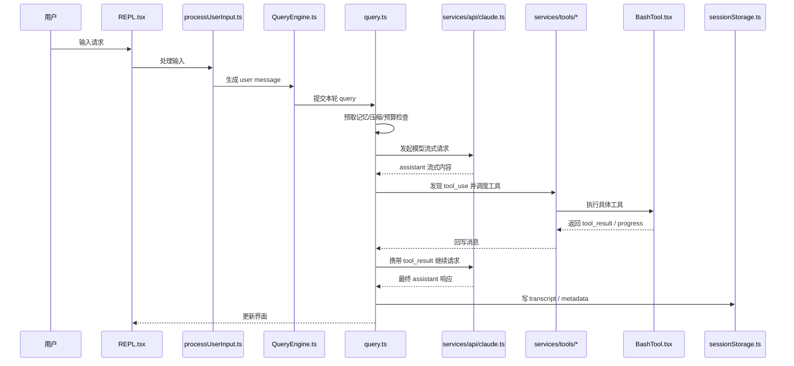

# 第 16 章 从一次请求走完整个系统

## 本章在第二阶段中的位置

这一章是第二阶段的“主线课”。  
它的作用不是替代后续模块分析，而是先用一条具体路径把整套系统的骨架跑出来，让学生知道后面每章为什么会出现。

## 本章目标

前面很多章节都在讲“模块”。  
但真正帮助初学者建立直觉的，往往不是模块说明书，而是一条完整路径：

> 假设用户发出一个请求，这个请求到底在系统里经历了什么？

本章就做这一件事。  
我们不急着讨论每个细节，而是先把一次请求从头走到尾。

## 为什么全书要先讲一条完整案例

因为对零背景学生来说，“路径感”比“目录感”更重要。  
如果先给太多模块说明，学生会得到一堆分散知识；但如果先走一遍完整请求链，后面再读模块时就会不断把它们挂回那条主线。

## 读这一章时请盯住三条线

1. 输入线：请求是怎样进入系统的。
2. 执行线：消息是怎样被送进 QueryEngine 和 query 主循环的。
3. 能力线：模型什么时候决定调用工具、工具结果又怎样回到系统。

## 16.1 我们选择的示例请求

为了让路径尽量完整，我们选择这样一个用户输入：

> 请帮我分析当前项目测试失败的原因，并给出修复建议。

为什么选它？

因为它通常会触发一整套典型能力：

- 普通文本输入
- 模型理解任务
- 读文件
- 跑测试命令
- 搜索代码
- 汇总分析

这比只问“今天天气如何”更能展示系统全貌。

## 16.2 第一步：请求进入 REPL

主界面是 [REPL.tsx](src/screens/REPL.tsx)。  
从产品视角看，用户只是在输入框里敲字；但从系统视角看，REPL 做了很多准备工作：

- 当前主题是什么
- 当前工具池是什么
- 当前命令池是什么
- 当前 MCP 客户端有哪些
- 当前会话里有哪些任务在跑
- 当前是否处于特殊模式，例如 plan mode、remote mode、teammate view

所以，用户输入并不是直接扔给模型，而是先进入这个“交互总控层”。

## 16.3 第二步：输入进入 `processUserInput()`

REPL 收到输入后，会把它交给 [processUserInput.ts](src/utils/processUserInput/processUserInput.ts)。

此时系统首先要回答的不是“如何回复”，而是“这到底是什么输入”：

- 普通提示词？
- Slash command？
- 带粘贴引用的文本？
- 图片输入？
- 系统生成但用户不可见的 meta 输入？

只有判断清楚输入类型，后续流程才成立。

## 16.4 第三步：把输入变成消息

如果它是普通文本请求，那么系统会把它转换成 `user message`。  
这里要强调一句课堂上很重要的话：

> 系统内部真正流动的，不是“原始字符串”，而是“消息对象”。

消息对象后面会不断被扩展：

- 用户消息
- 模型消息
- 工具结果消息
- 系统消息
- 附件消息

这是整个系统的数据共同语言。

## 16.5 第四步：QueryEngine 接管这一轮

接下来，请求会进入 [QueryEngine.ts](src/QueryEngine.ts)。

### 这里最容易讲错的地方

很多人会说：“QueryEngine 就是发请求。”  
这不准确。

更准确地说：

> QueryEngine 是会话执行器，它掌握跨轮次的消息历史、文件缓存、使用量统计、权限拒绝记录等会话级状态。

当本轮 `submitMessage()` 开始时，它会把本轮所需上下文与全局状态准备好，然后把真正的执行工作交给 `query()`。

## 16.6 第五步：`query()` 进入主循环

这一轮真正的核心逻辑发生在 [query.ts](src/query.ts) 中。

你可以把它想成一个总控循环：

1. 检查消息是否需要压缩
2. 构建本轮的 system prompt、user context、system context
3. 发起模型流式请求
4. 看模型是否要调用工具
5. 若要调用工具，执行工具再回来继续
6. 若不需要工具，结束这一轮

## 16.7 第六步：主循环先做“出发前检查”

在真正请求模型之前，系统会做很多“出发前检查”，这一步非常工程化：

- 相关记忆是否要预取
- 技能发现是否要预取
- 工具结果预算是否超标
- 是否需要 snip
- 是否需要 microcompact
- 是否需要 context collapse
- 是否需要 auto compact

### 为什么这一步如此重要

因为模型请求非常贵，而且上下文窗口有限。  
如果不在出发前做整理，很容易：

- 超出上下文
- 重复发送无用内容
- 丢失重要记忆
- 让缓存命中率下降

## 16.8 第七步：构造“本轮实际发给模型的内容”

在这一阶段，系统会把很多信息拼成模型能理解的输入：

- 系统提示词
- 用户上下文
- 系统上下文
- 本轮前的消息历史
- 工具定义
- MCP 资源/命令
- 必要的 memory 或 attachment

这就是为什么本项目里会有：

- `context.ts`
- `utils/queryContext.ts`
- `constants/prompts.ts`
- `utils/messages.ts`

这些模块都在为“构造本轮模型输入”服务。

## 16.9 第八步：发起流式模型请求

真正发请求时，`query.ts` 会调用 [services/api/claude.ts](src/services/api/claude.ts)。

### 这一层做了什么

它并不只是发 HTTP：

- 选择 provider
- 配置 header
- 处理 betas
- 处理流式输出
- 累计 usage
- 计算成本
- 处理 retry 与 fallback

所以它不是“网络层小工具”，而是模型通信层。

## 16.10 第九步：模型开始流式吐结果

一旦模型开始返回流式内容，系统就会边收边处理。

这里可能出现两种情况：

### 情况 A：模型直接回答

如果模型直接给出分析文本，那本轮就比较简单：

- assistant message 被逐步构造
- UI 渐进展示
- 最后完成本轮

### 情况 B：模型决定调用工具

如果模型判断自己需要查看更多证据，它会在消息中产生 `tool_use` 块，例如：

- 读取测试文件
- 执行测试命令
- 搜索报错关键字

此时主循环不会结束，而会转入工具执行阶段。

## 16.11 第十步：工具调度层开始工作

一旦 `tool_use` 出现，系统就会进入 `services/tools/`：

- [toolOrchestration.ts](src/services/tools/toolOrchestration.ts)
- [toolExecution.ts](src/services/tools/toolExecution.ts)
- [StreamingToolExecutor.ts](src/services/tools/StreamingToolExecutor.ts)

### 它们的分工

- `toolOrchestration.ts` 决定哪些工具并发、哪些串行
- `toolExecution.ts` 负责单次工具调用的完整执行流程
- `StreamingToolExecutor.ts` 负责工具边流入边执行的场景

## 16.12 第十一步：具体工具开始执行

假设模型调用了 BashTool 跑测试命令。  
系统会进入 [BashTool.tsx](src/tools/BashTool/BashTool.tsx)。

这时又发生了几个层次的动作：

1. 先检查命令是否安全
2. 判断是否需要 sandbox
3. 运行命令并流式上报进度
4. 如果太久，可能转成后台任务
5. 最终形成结构化工具结果

这就是为什么工具不是简单函数，而是完整协议对象。

## 16.13 第十二步：工具结果回到消息流

工具执行完后，不是直接把一堆 stdout 放到屏幕上，而是会被包装回消息系统：

- `tool_result`
- `attachment`
- `progress`
- `system` 通知

这一步非常关键。  
因为只有回到消息流中，模型才能继续阅读这些结果并进行下一步推理。

## 16.14 第十三步：主循环继续下一轮“模型 -> 工具 -> 模型”

如果本轮工具调用已经满足证据需要，模型下一轮可能会直接总结：

> 测试失败的主要原因是……

如果还不够，它还会继续调用更多工具。

所以，一次用户请求往往不是：

> 一次模型调用

而是：

> 多轮“模型推理 -> 工具执行 -> 结果回注”的复合循环

## 16.15 第十四步：结果展示与会话落盘

一旦本轮结束，系统通常还会做两类善后工作：

### 1. 展示层善后

- 更新消息列表
- 更新任务状态
- 更新通知
- 刷新状态栏/底部提示

### 2. 持久化层善后

- 记录 transcript
- 记录任务输出位置
- 记录 session metadata
- 必要时记录 compact boundary

这部分主要由 `sessionStorage.ts`、任务系统和 REPL 状态共同完成。

## 16.16 一张总时序图

## 16.17 对初学者最关键的三个认识

### 认识一：一次请求是“一串过程”，不是“一次调用”

如果学生脑中仍然把它理解成“用户说一句，模型答一句”，后面的代码就很难理解。

### 认识二：消息流是总线

用户输入、模型输出、工具结果、系统通知，最终都要回到消息系统。

### 认识三：工具让模型获得“行动能力”

模型本身不直接碰文件和 Shell，  
它是通过工具协议让系统代为行动。

## 16.18 如果要带学生做课堂演练

建议这样提问：

1. 在哪一步，原始字符串第一次变成结构化消息？
2. 在哪一步，系统开始判断是否需要压缩上下文？
3. 在哪一步，assistant message 和 tool_use 分道扬镳？
4. 在哪一步，工具结果重新回到模型上下文？

只要学生能把这四步指出来，就说明他们开始真正掌握这条主线了。

## 本章小结

本章最想让你记住的一句话是：

> 这套系统的本质，不是“会聊天”，而是“能把用户目标拆成消息、推理、工具和状态变化的一整条运行链”。

这条运行链，就是整套源码最重要的骨架。
