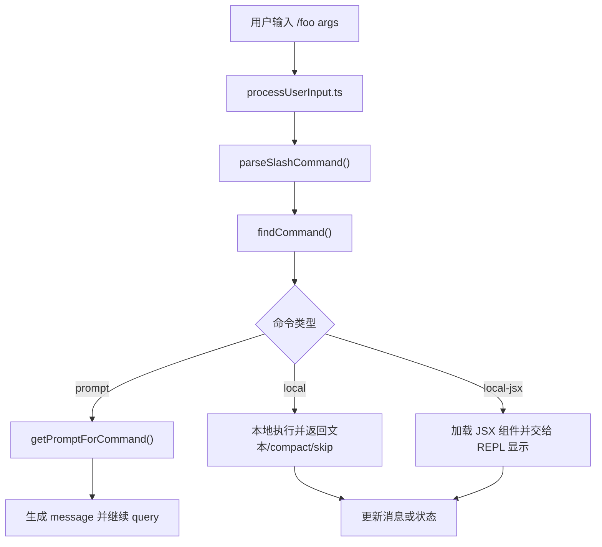

# 第 17 章 命令系统深度解读

## 17.1 为什么要单独讲命令系统

如果读者只看 UI，很容易以为这个产品的主要输入只有一种：自由文本提示词。  
但从源码看，命令系统是另一条非常重要的输入通道。

命令系统承担了三个角色：

1. 用户显式调用系统功能
2. 技能、插件、工作流接入主系统
3. 某些命令把“局部功能”提升为“可被模型和用户共同使用的能力”

因此，命令系统不是外围小功能，而是入口层的重要组成部分。

## 17.2 `types/command.ts`：命令协议

理解命令系统，最好的入口不是 `commands.ts`，而是 [types/command.ts](src/types/command.ts)。

这里给出了一个很清晰的事实：

> 这个系统里至少有三种命令。

### 类型一：`PromptCommand`

这类命令的本质是“生成要喂给模型的内容”。  
它们的 `getPromptForCommand()` 会返回 `ContentBlockParam[]`。

这非常适合：

- 技能
- 模板化 Prompt
- 轻量工作流

### 类型二：`LocalCommand`

这类命令本地执行，返回 `LocalCommandResult`，不一定走 UI 组件。

### 类型三：`LocalJSXCommand`

这类命令可以加载本地 JSX 组件，适合：

- 配置菜单
- 选择器
- 对话框

从教学角度看，这是个非常漂亮的设计：  
同样叫“命令”，但根据输出形态不同，被明确分成了三种协议。

## 17.3 命令数据结构的教学价值

### `CommandBase`

它描述命令的共同属性，例如：

- `name`
- `description`
- `aliases`
- `availability`
- `isEnabled`
- `loadedFrom`
- `kind`
- `immediate`

这说明命令不仅有“做什么”，还有：

- 从哪里来
- 什么时候可见
- 能否立即执行
- 对用户如何显示

### `PromptCommand`

这个结构尤其值得讲，因为它把技能、命令和模型上下文联系起来：

- `allowedTools`
- `model`
- `hooks`
- `skillRoot`
- `context: inline | fork`
- `agent`
- `paths`

也就是说，一个 prompt 型命令，不只是“展开一段文本”，它还可以规定：

- 允许哪些工具
- 用哪个模型
- 在当前上下文还是 fork 出去执行
- 需要哪些 hook

## 17.4 `commands.ts`：命令注册中心

[commands.ts](src/commands.ts) 是命令系统的装配器。

### 它做了三件关键事情

#### 1. 注册内建命令

例如：

- `help`
- `config`
- `model`
- `mcp`
- `plugin`
- `resume`
- `tasks`

#### 2. 条件性加载命令

大量 `feature('...')` 和惰性 `require()` 说明：

- 某些命令只在特性开启时存在
- 某些重量级命令延迟到真正使用时再加载

#### 3. 汇总多来源命令

最终命令集合来自多个地方：

- built-in
- skill dir
- plugin skills
- builtin plugin skills
- workflow commands
- dynamic skills

## 17.5 为什么 `getCommands()` 值得细读

`getCommands(cwd)` 很适合课堂板书，因为它是典型的“动态能力合并器”。

### 它的基本逻辑

1. `loadAllCommands(cwd)` 先把各类命令源全部加载出来
2. 再按 `availability` 和 `isEnabled()` 做本轮过滤
3. 再把动态发现的技能插进去

### 为什么要这样设计

因为命令不是纯静态资源，用户的可用命令会受以下因素影响：

- 当前工作目录
- 用户认证状态
- 插件加载状态
- feature gate
- 运行时动态技能发现

## 17.6 命令是如何从输入中被识别的

这条链路主要是：

```text
REPL.tsx
  -> processUserInput.ts
      -> parseSlashCommand(...)
          -> findCommand(...)
              -> commands.ts 中汇总后的命令集合
```

如果输入以 `/` 开头，而且没有被 `skipSlashCommands` 禁用，那么系统就会尝试把它当命令解析。

## 17.7 命令系统与工具系统的关系

这是课堂上特别值得强调的点：

> 命令和工具不是一回事。

### 命令更偏向“用户入口”

用户通过 `/something` 主动调用。

### 工具更偏向“模型能力”

模型在推理过程中调用。

### 但两者又会互相连接

例如：

- 某些命令本质上是生成 prompt，让模型继续执行
- 某些技能命令会限制后续可用工具
- 某些命令会 fork 子代理，而子代理再去使用工具

所以命令系统和工具系统不是平行线，而是两条会相交的输入/能力路径。

## 17.8 命令系统和插件、技能的关系

这套系统一个很有意思的地方是：

- 技能经常以命令形态暴露给用户
- 插件也可以贡献命令

这意味着命令系统是一个“平台入口汇聚层”。

从工程视角看，这很合理，因为：

- 用户最终要有一个统一入口
- 自动补全和帮助系统也需要统一入口

## 17.9 命令执行流图



## 17.10 对教学最有帮助的四个问题

1. 为什么 `PromptCommand` 要和 `LocalJSXCommand` 分开？
2. 为什么命令集合不能写成编译期常量？
3. 为什么一个技能最终会表现成命令？
4. 为什么命令协议里会有 `loadedFrom`、`availability`、`disableModelInvocation` 这些字段？

## 17.11 课堂讲法建议

可以这样讲：

### 第一层讲法：用户视角

命令就是 `/help`、`/config`、`/mcp` 这种系统入口。

### 第二层讲法：架构视角

命令系统是把多来源入口统一起来的注册中心。

### 第三层讲法：平台视角

命令协议定义了“谁可以接进系统入口层”。

这样学生就不会把命令系统误解成“只是一个 switch-case”。

## 17.12 本章小结

命令系统最核心的价值不是“让用户输入斜杠命令”，而是：

> 把内建功能、技能、插件和工作流统一装配成一套可发现、可过滤、可扩展的入口体系。

这就是为什么 `commands.ts` 在整体架构里非常重要。
