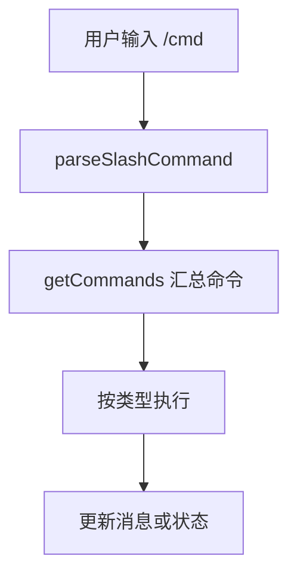
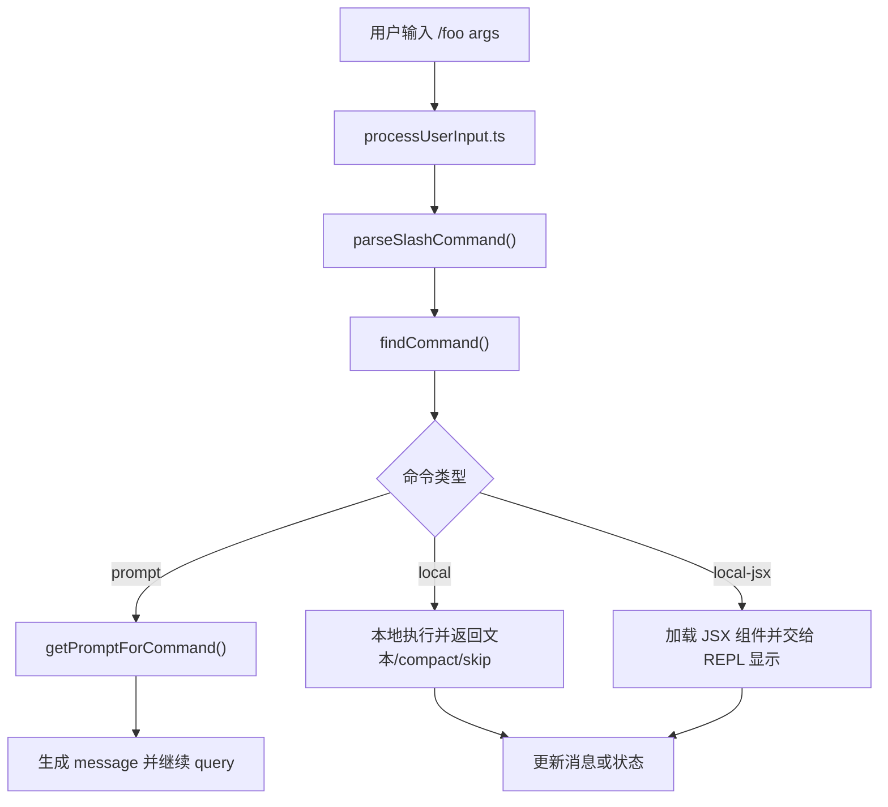

# 第 17 章 命令系统深度解读

## 本章目标
- 理解命令系统为什么要与工具系统分开，以及它如何构成用户入口层。
- 看清多来源命令怎样在运行时合并、过滤和暴露给用户。
- 建立命令协议的类型观，知道不同输出形态为何需要不同命令种类。

## 先修关系
- 建议先读第 5 章和第 7 章，先知道输入层会分流到命令，而能力层是工具。
- 如果第 1 章和第 16 章已经读过，将更容易把命令放回用户入口这条线。
- 本章和第 10 章、第 20 章联系紧密，因为插件和技能最终也会影响命令集合。

## 关键词
- `Slash Command`：用户显式输入的系统入口，不直接等于模型能力。
- `CommandBase`：所有命令共享的基础协议。
- `PromptCommand`：生成消息继续进入 query 主循环的命令类型。
- `LocalJSXCommand`：直接驱动本地 UI 组件的命令类型。
- `availability`：命令不是永远可见，需根据运行时状态判定是否开放。

## 正文图解


## 关键数据结构
| 结构/对象 | 在本章中的位置 | 阅读时要抓什么 |
| --- | --- | --- |
| `CommandBase` | 命令的共同属性集合。 | 它定义了所有命令共享的最小边界。 |
| `PromptCommand` | 把命令结果重新送入消息流。 | 它解释为什么命令系统能和 query 主循环接上。 |
| `LocalCommand / LocalJSXCommand` | 直接更新本地状态或渲染 UI 的命令类型。 | 它说明“命令”不只是文本替换。 |
| `Runtime Command Set` | 当前工作目录和状态下可用的命令集合。 | 它体现命令面是动态计算结果，而不是常量表。 |

## 本章在第三阶段中的位置

这一章是第三阶段里最容易被低估的一章。  
很多读者一开始会把命令系统当成“外围小功能”，但一旦真正读进去，就会发现它其实是产品入口层的重要组成部分。

## 17.1 为什么要单独讲命令系统

如果读者只看 UI，很容易以为这个产品的主要输入只有一种：自由文本提示词。  
但从源码看，命令系统是另一条非常重要的输入通道。

命令系统承担了三个角色：

1. 用户显式调用系统功能
2. 技能、插件、工作流接入主系统
3. 某些命令把“局部功能”提升为“可被模型和用户共同使用的能力”

因此，命令系统不是外围小功能，而是入口层的重要组成部分。

## 为什么命令系统不能和工具系统混讲

因为它们虽然都会影响系统行为，但面向对象不同：

- 命令首先面向用户显式输入。
- 工具首先面向模型调用协议。

这两个系统在产品层会交错，在运行时层也会协作，但它们不是同一个抽象。

## 读者在这一章最容易犯的两个错误

1. 只看 `commands.ts`，不看命令类型协议。
2. 把 slash 命令误认为“换个形式的工具调用”。

## 17.2 `types/command.ts`：命令协议

理解命令系统，最好的入口不是 `commands.ts`，而是 [types/command.ts](src/types/command.ts)。

这里给出了一个很清晰的事实：

> 这个系统里至少有三种命令。

### 类型一：`PromptCommand`

这类命令的本质是“生成要喂给模型的内容”。  
它们的 `getPromptForCommand()` 会返回 `ContentBlockParam[]`。

这非常适合：

- 技能
- 模板化 Prompt
- 轻量工作流

### 类型二：`LocalCommand`

这类命令本地执行，返回 `LocalCommandResult`，不一定走 UI 组件。

### 类型三：`LocalJSXCommand`

这类命令可以加载本地 JSX 组件，适合：

- 配置菜单
- 选择器
- 对话框

从结构角度看，这是个非常漂亮的设计：  
同样叫“命令”，但根据输出形态不同，被明确分成了三种协议。

## 17.3 命令数据结构为什么值得细看

### `CommandBase`

它描述命令的共同属性，例如：

- `name`
- `description`
- `aliases`
- `availability`
- `isEnabled`
- `loadedFrom`
- `kind`
- `immediate`

这说明命令不仅有“做什么”，还有：

- 从哪里来
- 什么时候可见
- 能否立即执行
- 对用户如何显示

### `PromptCommand`

这个结构尤其值得讲，因为它把技能、命令和模型上下文联系起来：

- `allowedTools`
- `model`
- `hooks`
- `skillRoot`
- `context: inline | fork`
- `agent`
- `paths`

也就是说，一个 prompt 型命令，不只是“展开一段文本”，它还可以规定：

- 允许哪些工具
- 用哪个模型
- 在当前上下文还是 fork 出去执行
- 需要哪些 hook

## 17.4 `commands.ts`：命令注册中心

[commands.ts](src/commands.ts) 是命令系统的装配器。

### 它做了三件关键事情

#### 1. 注册内建命令

例如：

- `help`
- `config`
- `model`
- `mcp`
- `plugin`
- `resume`
- `tasks`

#### 2. 条件性加载命令

大量 `feature('...')` 和惰性 `require()` 说明：

- 某些命令只在特性开启时存在
- 某些重量级命令延迟到真正使用时再加载

#### 3. 汇总多来源命令

最终命令集合来自多个地方：

- built-in
- skill dir
- plugin skills
- builtin plugin skills
- workflow commands
- dynamic skills

## 17.5 为什么 `getCommands()` 值得细读

`getCommands(cwd)` 很适合自己画成结构图，因为它是典型的“动态能力合并器”。

### 它的基本逻辑

1. `loadAllCommands(cwd)` 先把各类命令源全部加载出来
2. 再按 `availability` 和 `isEnabled()` 做本轮过滤
3. 再把动态发现的技能插进去

### 为什么要这样设计

因为命令不是纯静态资源，用户的可用命令会受以下因素影响：

- 当前工作目录
- 用户认证状态
- 插件加载状态
- feature gate
- 运行时动态技能发现

## 17.6 命令是如何从输入中被识别的

这条链路主要是：

```text
REPL.tsx
  -> processUserInput.ts
      -> parseSlashCommand(...)
          -> findCommand(...)
              -> commands.ts 中汇总后的命令集合
```

如果输入以 `/` 开头，而且没有被 `skipSlashCommands` 禁用，那么系统就会尝试把它当命令解析。

## 17.7 命令系统与工具系统的关系

这是本章特别值得反复提醒自己的点：

> 命令和工具不是一回事。

### 命令更偏向“用户入口”

用户通过 `/something` 主动调用。

### 工具更偏向“模型能力”

模型在推理过程中调用。

### 但两者又会互相连接

例如：

- 某些命令本质上是生成 prompt，让模型继续执行
- 某些技能命令会限制后续可用工具
- 某些命令会 fork 子代理，而子代理再去使用工具

所以命令系统和工具系统不是平行线，而是两条会相交的输入/能力路径。

## 17.8 命令系统和插件、技能的关系

这套系统一个很有意思的地方是：

- 技能经常以命令形态暴露给用户
- 插件也可以贡献命令

这意味着命令系统是一个“平台入口汇聚层”。

从工程视角看，这很合理，因为：

- 用户最终要有一个统一入口
- 自动补全和帮助系统也需要统一入口

## 17.9 命令执行流图



## 17.10 本章最有帮助的四个问题

1. 为什么 `PromptCommand` 要和 `LocalJSXCommand` 分开？
2. 为什么命令集合不能写成编译期常量？
3. 为什么一个技能最终会表现成命令？
4. 为什么命令协议里会有 `loadedFrom`、`availability`、`disableModelInvocation` 这些字段？

## 17.11 三层理解法

可以这样理解：

### 第一层：用户视角

命令就是 `/help`、`/config`、`/mcp` 这种系统入口。

### 第二层：架构视角

命令系统是把多来源入口统一起来的注册中心。

### 第三层：平台视角

命令协议定义了“谁可以接进系统入口层”。

这样就不会把命令系统误解成“只是一个 switch-case”。

## 重建蓝图：把命令系统写成独立调度面

### 必须保留的抽象

1. 命令系统必须与工具系统分离。命令是由显式输入触发的局部控制面，工具是由模型在推理过程中调用的外部能力面，二者在触发源、输入格式和执行语义上都不同。
2. 命令协议至少要区分元数据、触发词、参数解析策略和执行器类型。原工程中的 `PromptCommand` 与 `LocalJSXCommand` 说明命令的结果既可能是文本动作，也可能是本地 UI 行为。
3. 命令注册表必须支持多来源合并，包括内建命令、技能命令、插件命令和动态发现命令，并且必须有稳定的去重与覆盖规则。
4. Slash 命令解析器必须是独立部件。其职责是从原始输入中识别命令名、参数字符串和余下文本，而不是直接执行业务逻辑。

### 最小实现顺序

1. 第一阶段先定义统一命令描述符，明确一个命令至少有哪些字段和执行签名。
2. 第二阶段实现 slash 解析器，把 `/name arg1 arg2` 一类输入稳定地翻译成命令调用意图。
3. 第三阶段实现命令注册中心，并支持内建命令的静态装载。
4. 第四阶段再接入技能和插件贡献的动态命令，同时加入名称冲突与去重规则。
5. 第五阶段补入命令执行结果的统一表现形式，使命令既可修改状态，也可触发渲染、通知或后续输入。

### 最容易写错的边界

1. 最常见的错误是把 slash 命令也做成工具，结果导致命令执行需要经过模型回合，失去了本地即时控制面意义。
2. 第二类错误是以简单字符串 split 实现命令解析，忽略引号、空参数、剩余文本和命令名冲突等细节。
3. 第三类错误是让插件命令绕过统一注册表直接挂到某个组件上，这会破坏命令视图的一致性。
4. 第四类错误是把命令结果看成普通输出文本。实际上某些命令会改变模式、状态或界面行为，需要有比“打印一行字”更丰富的结果协议。

## 章末小结
- 本章围绕“命令协议、多来源汇总和用户入口层边界”重建了一层稳定理解，避免只记零散函数名或目录名。
- 真正需要沉淀下来的，不只是 `Slash Command`、`CommandBase`、`PromptCommand` 这几个词，而是它们在 `CommandBase`、`PromptCommand`、`LocalCommand / LocalJSXCommand` 里的相互位置。
- 如后续在 第 7 章、第 10 章和第 20 章 中再次迷路，优先回看本章的“先修关系、正文图解、关键数据结构”三部分。

## 章末自测
1. 不看原文，用自己的话重述本章围绕“命令协议、多来源汇总和用户入口层边界”到底解决了什么问题。
2. 结合“正文图解”，把 `parseSlashCommand` 到 `按类型执行` 之间的连接关系重新讲一遍。
3. 对比 `CommandBase` 与 `PromptCommand`：它们分别回答什么问题，边界为什么不能混掉？
4. 在 `Slash Command`、`CommandBase`、`PromptCommand` 中任选两个，说明它们在本章中是如何互相作用的。
5. 如果后续要继续读 第 7 章、第 10 章和第 20 章，本章哪一部分最值得先回看？为什么？
