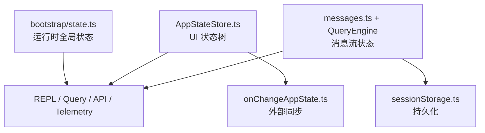

# 第 18 章 状态系统、消息系统与会话状态同步

## 本章在第四阶段中的位置

这一章属于第四阶段，是学生把“系统会跑”升级为“系统怎样持续保持一致”的关键一章。

## 18.1 为什么这一章很关键

很多大型工程的难点，不是单个算法，而是“状态太多”。  
这套系统就是一个典型例子。

如果学生不能区分不同层次的状态，他们会很快迷失：

- 哪些是 UI 状态？
- 哪些是全局运行状态？
- 哪些是会话状态？
- 哪些是外部同步状态？
- 哪些是消息流本身？

这一章就是专门解决这个问题。

## 为什么状态问题是大型工程的阅读分水岭

读到这一步，学生通常已经能解释很多“发生了什么”。  
但如果状态层没立住，就仍然很难解释：

- 为什么有些变化会立刻反映到 UI
- 为什么有些变化会写到配置
- 为什么有些变化会影响外部同步
- 为什么会话能恢复、任务能继续、权限模式能被记住

所以，状态问题其实是“会跑”和“可维护”之间的分水岭。

## 读这一章时要分清的三类对象

1. 值：当前到底保存了什么数据。
2. 变化：这些数据由谁修改、何时修改。
3. 扩散：修改之后，哪些副作用会被触发。

## 18.2 三层状态，不要混在一起

这套系统至少有三层状态。

### 第一层：启动/会话级全局状态

入口文件是 [bootstrap/state.ts](src/bootstrap/state.ts)。

这里保存的内容很多，例如：

- `originalCwd`
- `projectRoot`
- `sessionId`
- `mainLoopModelOverride`
- `isInteractive`
- `clientType`
- `allowedChannels`
- `scheduledTasksEnabled`
- `telemetry` 相关对象

这层状态更像“进程级和会话级全局寄存器”。

### 第二层：UI/AppState

入口在 [state/AppStateStore.ts](src/state/AppStateStore.ts)。

这里关注的是：

- REPL 当前长什么样
- 当前有哪些任务
- 当前有哪些插件/MCP 客户端
- 当前显示哪个视图
- 当前权限模式是什么

这层状态更像“前端应用状态树”。

### 第三层：消息状态

消息并不是简单挂在 `AppState` 上就完了。  
它还会被：

- QueryEngine 维护
- Query 主循环变换
- sessionStorage 持久化
- 工具执行层回写

所以消息状态是一个横跨多个模块的“运行中数据流”。

## 18.3 `bootstrap/state.ts` 的角色

这个文件开头就写得很克制：

> DO NOT ADD MORE STATE HERE - BE JUDICIOUS WITH GLOBAL STATE

这句话非常有启发性。  
它说明作者知道全局状态危险，但仍然需要一个集中地点保存“真正属于会话运行时”的核心值。

### 可以把它理解成什么

你可以把 `bootstrap/state.ts` 理解成：

- 不是 React store
- 不是业务对象
- 而是系统运行时的全局控制台

### 它为什么会这么大

因为它覆盖了非常多基础运行信息：

- 成本统计
- 模型使用量
- 日志/追踪 provider
- 插件与频道配置
- session lineage
- prompt cache latch
- auto mode / plan mode 标记
- invoked skills

从架构上看，这是“平台态”，不是“页面态”。

## 18.4 `AppStateStore.ts` 的角色

如果 `bootstrap/state.ts` 更像运行时全局寄存器，  
那么 `AppStateStore.ts` 更像终端应用的页面状态树。

### 为什么它必须很丰富

因为 REPL 不是一个简单列表页，而是一个会随运行态变化的复合界面：

- 任务可以进前台/后台
- teammate transcript 可以切换
- 远程连接状态会变化
- MCP 连接状态会变化
- 权限模式可能切换
- 通知、弹窗、调查问卷、桥接状态都可能变化

如果没有统一状态树，这些交互会非常难控。

## 18.5 `onChangeAppState.ts`：状态变化的同步器

[onChangeAppState.ts](src/state/onChangeAppState.ts) 是一个很值得精读的小文件。

### 它说明了什么

状态变化并不是“改完就结束”，还要触发副作用同步，例如：

- 权限模式变化后通知 CCR/SDK
- mainLoopModel 变化后写回 settings
- expandedView 变化后持久化到 globalConfig
- settings.env 变化后重新应用环境变量

换句话说：

> `AppState` 不是孤立状态，它会向外投射副作用。

这就是状态同步器存在的原因。

## 18.6 消息系统为什么要单独看

在很多项目里，消息只是 UI 内容。  
但在这里，消息同时承担：

- 用户输入表示
- 模型输出表示
- 工具调用中间结果表示
- 系统通知表示
- transcript 持久化单元

因此消息系统在这里其实接近“事件日志系统”。

## 18.7 `utils/messages.ts` 的角色

[utils/messages.ts](src/utils/messages.ts) 的体量本身就说明了它的重要性。

它主要做三类事：

### 第一类：消息构造

例如：

- `createUserMessage`
- `createSystemMessage`
- `createAttachmentMessage`

### 第二类：消息规范化

例如把不同来源的消息结构，统一成模型/API/UI 能处理的格式。

### 第三类：消息解释和辅助

例如：

- 是否是 compact boundary
- 如何补全 tool result pairing
- 如何处理拒绝消息
- 如何生成 stop hook summary

## 18.8 为什么 transcript 不记录一切

这是很多读者第一次接触时最容易忽略的点。

### 直觉上的错误想法

“既然都发生了，那就全部写进 transcript。”

### 实际设计

[sessionStorage.ts](src/utils/sessionStorage.ts) 明确区分：

- 哪些消息是 transcript message
- 哪些只是 UI 过程状态，例如高频 progress

### 为什么要这样

因为持久化日志不是“录像机”，而是“未来恢复和理解所需的有效事实集合”。

如果把短周期 progress 全写进去，会造成：

- transcript 噪音暴涨
- 恢复时链路混乱
- 成本和 I/O 上升

## 18.9 三层状态协作图

## 18.10 给初学者的一个稳定理解

可以这样记：

- `bootstrap/state.ts` 管“系统今天是谁、在哪、开什么模式”
- `AppStateStore.ts` 管“屏幕现在长什么样”
- `messages.ts / QueryEngine` 管“这次对话正在发生什么”

这样记虽然不精细，但非常有助于入门。

## 18.11 本章自测问题

读完之后，直接问自己：

1. 为什么 `AppState` 不是全局状态的全部？
2. 为什么要有 `onChangeAppState` 这种状态同步器？
3. 为什么 progress message 不应该无脑持久化？
4. `bootstrap/state.ts` 和 React store 的定位有何不同？

## 18.12 本章小结

这一章的核心不是背字段，而是建立一个正确的状态观：

> 大型交互式系统的状态通常分层存在；运行时全局状态、UI 状态和消息状态既相关又不能混同。

读懂这一点之后，读后面的 REPL、Task、sessionStorage 都会轻松很多。
