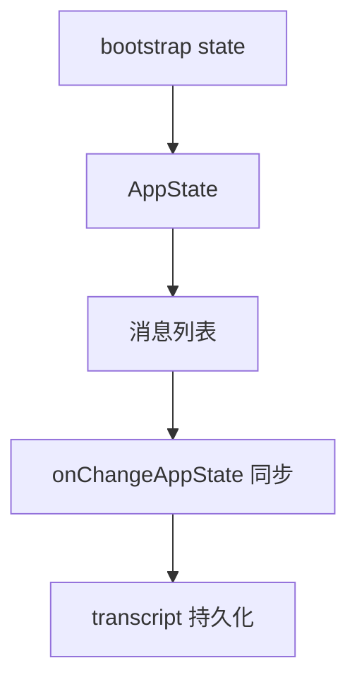
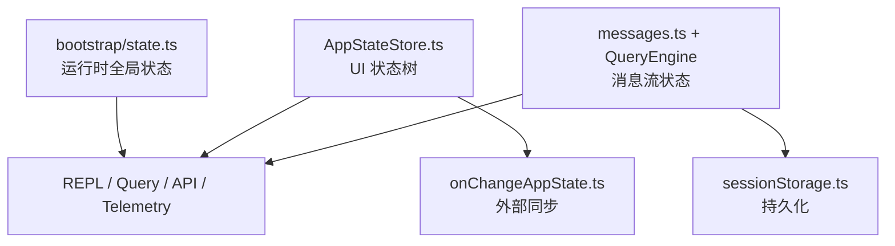

# 第 21 章 状态系统、消息系统与会话状态同步

## 本章目标
- 把 bootstrap state、AppState、消息列表与 transcript 这几层状态彻底区分开。
- 理解状态变化为什么不是简单赋值，而常常伴随副作用同步。
- 建立“消息也是状态系统的一部分”的视角。

## 先修关系
- 建议先读第 19、8、9 章，先知道 UI 状态、消息对象和 query 主循环分别长什么样。
- 如果第 20 章已经读过，将更自然地理解 transcript 和压缩为什么是状态治理问题。
- 本章和第 22 章是姊妹篇：本章重在状态层次与同步，第 22 章重在持久化与恢复。

## 关键词
- `bootstrap state`：进程或会话启动期的基础全局状态。
- `AppState`：应用与 UI 运行态的主状态树。
- `message list`：当前会话正在流动的结构化消息历史。
- `onChangeAppState`：把状态变更翻译成副作用同步的桥。
- `transcript`：只记录可恢复事实而不记录所有过程噪音。

## 正文图解

## 关键数据结构
| 结构/对象 | 在本章中的位置 | 阅读时要抓什么 |
| --- | --- | --- |
| `Bootstrap State Object` | 保存 sessionId、cwd、model 等基础坐标。 | 它回答“系统现在是谁、在哪、开什么模式”。 |
| `AppState Tree` | UI、任务、MCP、权限等应用态集合。 | 它是 REPL 交互层最重要的状态容器。 |
| `Message Array` | 用户、assistant、tool_result 等消息的有序集合。 | 它是 query、UI 与持久化之间的共同语言。 |
| `State Sync Side Effect` | 由状态变化触发的外部写回或通知。 | 它解释为什么状态不是纯内存对象。 |

## 本章在第四阶段中的位置

这一章属于第四阶段，是读者把“系统会跑”升级为“系统怎样持续保持一致”的关键一章。

## 18.1 为什么这一章很关键

很多大型工程的难点，不是单个算法，而是“状态太多”。  
这套系统就是一个典型例子。

如果读者不能区分不同层次的状态，他们会很快迷失：

- 哪些是 UI 状态？
- 哪些是全局运行状态？
- 哪些是会话状态？
- 哪些是外部同步状态？
- 哪些是消息流本身？

这一章就是专门解决这个问题。

## 为什么状态问题是大型工程的阅读分水岭

读到这一步，读者通常已经能解释很多“发生了什么”。  
但如果状态层没立住，就仍然很难解释：

- 为什么有些变化会立刻反映到 UI
- 为什么有些变化会写到配置
- 为什么有些变化会影响外部同步
- 为什么会话能恢复、任务能继续、权限模式能被记住

所以，状态问题其实是“会跑”和“可维护”之间的分水岭。

## 读这一章时要分清的三类对象

1. 值：当前到底保存了什么数据。
2. 变化：这些数据由谁修改、何时修改。
3. 扩散：修改之后，哪些副作用会被触发。

## 18.2 三层状态，不要混在一起

这套系统至少有三层状态。

### 第一层：启动/会话级全局状态

入口文件是 [bootstrap/state.ts](src/bootstrap/state.ts)。

这里保存的内容很多，例如：

- `originalCwd`
- `projectRoot`
- `sessionId`
- `mainLoopModelOverride`
- `isInteractive`
- `clientType`
- `allowedChannels`
- `scheduledTasksEnabled`
- `telemetry` 相关对象

这层状态更像“进程级和会话级全局寄存器”。

### 第二层：UI/AppState

入口在 [state/AppStateStore.ts](src/state/AppStateStore.ts)。

这里关注的是：

- REPL 当前长什么样
- 当前有哪些任务
- 当前有哪些插件/MCP 客户端
- 当前显示哪个视图
- 当前权限模式是什么

这层状态更像“前端应用状态树”。

### 第三层：消息状态

消息并不是简单挂在 `AppState` 上就完了。  
它还会被：

- QueryEngine 维护
- Query 主循环变换
- sessionStorage 持久化
- 工具执行层回写

所以消息状态是一个横跨多个模块的“运行中数据流”。

## 18.3 `bootstrap/state.ts` 的角色

这个文件开头就写得很克制：

> DO NOT ADD MORE STATE HERE - BE JUDICIOUS WITH GLOBAL STATE

这句话非常有启发性。  
它说明作者知道全局状态危险，但仍然需要一个集中地点保存“真正属于会话运行时”的核心值。

### 可以把它理解成什么

可把 `bootstrap/state.ts` 理解成：

- 不是 React store
- 不是业务对象
- 而是系统运行时的全局控制台

### 它为什么会这么大

因为它覆盖了非常多基础运行信息：

- 成本统计
- 模型使用量
- 日志/追踪 provider
- 插件与频道配置
- session lineage
- prompt cache latch
- auto mode / plan mode 标记
- invoked skills

从架构上看，这是“平台态”，不是“页面态”。

## 18.4 `AppStateStore.ts` 的角色

如果 `bootstrap/state.ts` 更像运行时全局寄存器，  
那么 `AppStateStore.ts` 更像终端应用的页面状态树。

### 为什么它必须很丰富

因为 REPL 不是一个简单列表页，而是一个会随运行态变化的复合界面：

- 任务可以进前台/后台
- teammate transcript 可以切换
- 远程连接状态会变化
- MCP 连接状态会变化
- 权限模式可能切换
- 通知、弹窗、调查问卷、桥接状态都可能变化

如果没有统一状态树，这些交互会非常难控。

## 18.5 `onChangeAppState.ts`：状态变化的同步器

[onChangeAppState.ts](src/state/onChangeAppState.ts) 是一个很值得精读的小文件。

### 它说明了什么

状态变化并不是“改完就结束”，还要触发副作用同步，例如：

- 权限模式变化后通知 CCR/SDK
- mainLoopModel 变化后写回 settings
- expandedView 变化后持久化到 globalConfig
- settings.env 变化后重新应用环境变量

换句话说：

> `AppState` 不是孤立状态，它会向外投射副作用。

这就是状态同步器存在的原因。

## 18.6 消息系统为什么要单独看

在很多项目里，消息只是 UI 内容。  
但在这里，消息同时承担：

- 用户输入表示
- 模型输出表示
- 工具调用中间结果表示
- 系统通知表示
- transcript 持久化单元

因此消息系统在这里其实接近“事件日志系统”。

## 18.7 `utils/messages.ts` 的角色

[utils/messages.ts](src/utils/messages.ts) 的体量本身就说明了它的重要性。

它主要做三类事：

### 第一类：消息构造

例如：

- `createUserMessage`
- `createSystemMessage`
- `createAttachmentMessage`

### 第二类：消息规范化

例如把不同来源的消息结构，统一成模型/API/UI 能处理的格式。

### 第三类：消息解释和辅助

例如：

- 是否是 compact boundary
- 如何补全 tool result pairing
- 如何处理拒绝消息
- 如何生成 stop hook summary

## 18.8 为什么 transcript 不记录一切

这是很多读者第一次接触时最容易忽略的点。

### 直觉上的错误想法

“既然都发生了，那就全部写进 transcript。”

### 实际设计

[sessionStorage.ts](src/utils/sessionStorage.ts) 明确区分：

- 哪些消息是 transcript message
- 哪些只是 UI 过程状态，例如高频 progress

### 为什么要这样

因为持久化日志不是“录像机”，而是“未来恢复和理解所需的有效事实集合”。

如果把短周期 progress 全写进去，会造成：

- transcript 噪音暴涨
- 恢复时链路混乱
- 成本和 I/O 上升

## 18.9 三层状态协作图

## 18.10 给初学者的一个稳定理解

可以这样记：

- `bootstrap/state.ts` 管“系统今天是谁、在哪、开什么模式”
- `AppStateStore.ts` 管“屏幕现在长什么样”
- `messages.ts / QueryEngine` 管“这次对话正在发生什么”

这样记虽然不精细，但非常有助于入门。

## 18.11 本章自测问题

读完之后，直接问自己：

1. 为什么 `AppState` 不是全局状态的全部？
2. 为什么要有 `onChangeAppState` 这种状态同步器？
3. 为什么 progress message 不应该无脑持久化？
4. `bootstrap/state.ts` 和 React store 的定位有何不同？

## 18.12 语言无关重建视角

从重建角度看，本章最重要的结论是：系统至少维护三层不同性质的状态，而不是一个统一大对象。

1. 启动/会话级状态：例如 sessionId、cwd、模型选择、运行模式、全局开关。
2. UI 状态：例如当前屏幕、面板开关、任务展示、通知、MCP 连接状态。
3. 消息状态：例如对话历史、tool_use/tool_result 对应关系、progress、compact boundary。

### 三层状态为什么不可合并

- 启动态强调“系统坐标”，生命周期长，变化频率相对低。
- UI 状态强调“界面呈现”，变化频率高，具有明显交互性。
- 消息状态强调“会话事实”，既参与模型上下文，又参与持久化与恢复。

若把三者混成一个 store，往往会导致恢复语义不清、更新粒度失控和副作用扩散。

### 必须保留的桥接器

`onChangeAppState.ts` 所代表的，不是某个 React 技巧，而是“状态变化副作用出口”。跨语言实现时同样需要等价桥接器，用于：

- 把状态变化同步到外部配置或会话元数据。
- 在必要时触发通知、日志与任务更新。
- 保持内部状态与外部可观察世界的一致性。

### 最小实现顺序

1. 先定义三层状态对象及其读写边界。
2. 实现消息对象与消息查找索引。
3. 实现 UI 状态树。
4. 实现状态桥接器，把状态变化映射到持久化与外部同步。
5. 最后再补入压缩、任务、MCP 与通知等复杂状态来源。

### 重建时最容易出错的地方

- 把 progress 当作 transcript 主体的一部分持久化。
- 让 UI 状态直接承担会话恢复语义。
- 让启动态、界面态和消息态共享同一组粗粒度更新函数。
- 忽略消息查找索引，导致 tool_use/tool_result 配对和恢复逻辑变得脆弱。

## 重建蓝图：把状态系统写成分层同步网络

### 必须保留的抽象

1. 至少要区分 bootstrap state、runtime app state、durable transcript state 三层对象。它们分别回答“系统如何启动”“界面当前如何显示”“进程重启后如何恢复”三个不同问题。
2. 状态变更必须经过统一 mutation funnel。无论来自用户输入、模型流、工具结果还是后台任务，最终都应通过受控的更新入口进入系统。
3. `onChangeAppState.ts` 一类同步器必须单独存在，因为状态变化后的副作用处理本身就是一层逻辑。它负责把运行态变化投影到持久化、通知或其他外部系统。
4. 消息系统必须被视为状态网络中的主干总线，而不是普通字段。许多状态变化其实都是围绕消息列表展开的投影或衍生。

### 最小实现顺序

1. 先定义三层状态各自拥有的字段，并明确哪些字段可以持久化、哪些字段只能存在于内存。
2. 第二步实现统一的状态更新 API，保证任意一次更新都能被观测、被记录并触发后续同步。
3. 第三步实现消息列表与 transcript 的双向关系：消息如何进入状态、哪些消息需要落盘、恢复时如何重新构造显示状态。
4. 第四步实现副作用同步器，使状态变化能推动通知、会话保存、任务面板更新和外部资源清理。
5. 第五步再处理恢复、重放、压缩后状态更新和后台任务状态回填等复杂路径。

### 最容易写错的边界

1. 最常见的错误是只保留一个巨大的全局 store，把启动配置、运行状态和持久化数据全部塞在一起，最终既难恢复，也难维护。
2. 第二类错误是直接在组件或工具内部原地修改共享对象，不留下统一的状态变化入口。这样同步器和持久化层就会失去观测能力。
3. 第三类错误是把所有派生状态也写进 durable store，例如临时 progress、搜索命中、滚动位置等，这会让恢复结果异常膨胀。
4. 第四类错误是没有定义 transcript 与消息列表的差异，导致恢复后要么丢信息，要么重复生成 UI 噪声。

## 章末小结
- 本章围绕“三层状态、消息系统和副作用同步”重建了一层稳定理解，避免只记零散函数名或目录名。
- 真正需要沉淀下来的，不只是 `bootstrap state`、`AppState`、`message list` 这几个词，而是它们在 `Bootstrap State Object`、`AppState Tree`、`Message Array` 里的相互位置。
- 如后续在 第 22 章和第 20 章 中再次迷路，优先回看本章的“先修关系、正文图解、关键数据结构”三部分。

## 章末自测
1. 不看原文，用自己的话重述本章围绕“三层状态、消息系统和副作用同步”到底解决了什么问题。
2. 结合“正文图解”，把 `AppState` 到 `onChangeAppState 同步` 之间的连接关系重新讲一遍。
3. 对比 `Bootstrap State Object` 与 `AppState Tree`：它们分别回答什么问题，边界为什么不能混掉？
4. 在 `bootstrap state`、`AppState`、`message list` 中任选两个，说明它们在本章中是如何互相作用的。
5. 如果后续要继续读 第 22 章和第 20 章，本章哪一部分最值得先回看？为什么？
