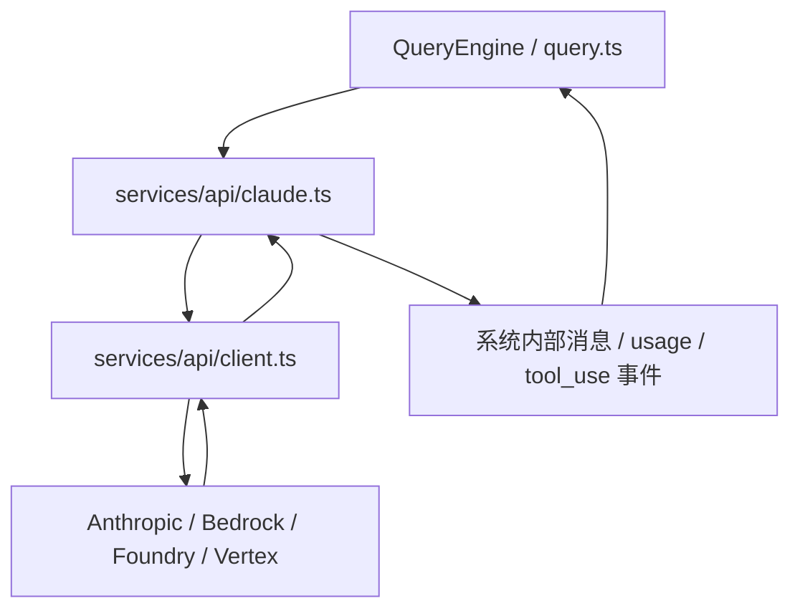

# 第 19 章 模型 API 层与流式执行机制

## 19.1 为什么要单独讲 API 层

在很多小项目里，API 层只是“fetch 一下后端”。  
但在这个系统里，模型 API 层承担的责任远远超过网络请求：

- 选择 provider
- 处理认证
- 配置 headers
- 支持不同平台
- 处理流式消息
- 管理 retry/fallback
- 记录 usage 与 cost
- 配合 prompt cache、thinking、betas

因此，它本身就是一个复杂子系统。

## 19.2 API 层的主要文件

| 文件 | 作用 |
| --- | --- |
| `services/api/client.ts` | 构建 Anthropic 客户端与 provider 适配 |
| `services/api/claude.ts` | 组织消息、工具 schema、流式调用与 usage 统计 |
| `services/api/errors.ts` | API 错误分类与解释 |
| `services/api/withRetry.ts` | 重试、fallback、不可重试判定 |
| `services/api/bootstrap.ts` | 启动期相关 API 预取 |

## 19.3 `client.ts`：不是一个普通 client 工厂

[client.ts](src/services/api/client.ts) 展示了很典型的平台化 API 适配写法。

### 它支持多种后端提供者

从代码可以看到至少支持：

- 直接 Anthropic API
- AWS Bedrock
- Azure Foundry
- Vertex AI

这说明上层 `query.ts` 并不需要知道请求最后发向哪里，  
它只依赖一个统一的客户端构造层。

### 它还处理了什么

- OAuth token 刷新
- API key 注入
- proxy/mTLS
- User-Agent
- session 标识 header
- 非交互/交互场景差异

从教学上讲，这就是“平台层对外部 provider 的屏蔽”。

## 19.4 `claude.ts`：模型通信核心

[claude.ts](src/services/api/claude.ts) 是整条模型通信链最关键的文件之一。

### 为什么它这么大

因为它要负责把上层“会话语义”翻译成下层“API 协议”。

它需要处理的内容包括：

- messages 转 API 结构
- tools 转 API schema
- output config、task budget、thinking 配置
- beta headers
- prompt cache 相关逻辑
- usage 累计
- 错误和 retry

## 19.5 这一层到底在转换什么

可以把 `claude.ts` 的工作理解成三次转换：

### 转换一：内部消息 -> API 消息

系统内部的 `Message` 类型，不等于 Anthropic SDK 期望的 API 消息。  
所以需要做 normalize。

### 转换二：内部工具 -> API 工具 schema

`Tool.ts` 里的 Tool 很丰富，但发给模型时要转换成标准工具 schema。

### 转换三：API 流式事件 -> 系统内部事件

流式返回的 token、tool_use、usage delta，最终要被转换回系统能消费的消息与状态变化。

## 19.6 为什么这里会出现这么多 header/beta

初学者容易被代码里的 header 和 beta 常量吓到。  
其实它们大多属于一种现象：

> 模型 API 不只是“给文本，拿文本”，而是通过 header 和 body 参数控制推理特性、缓存策略和实验能力。

例如代码里可以看到：

- thinking
- effort
- fast mode
- context management
- structured outputs
- task budgets

这说明 API 层已经和产品能力深度绑定。

## 19.7 流式执行为什么会把系统复杂度拉高

假设模型不是流式输出，那么系统只需要：

- 发请求
- 等结果
- 一次性更新 UI

但现在不是。

### 流式执行带来的额外要求

- UI 要能边到边显示
- 工具调用可能在流中途出现
- progress 需要即时显示
- 错误不能简单等最后再说
- usage/cost 也可能是渐进累计

所以流式执行会把很多模块绑得更紧：

- API 层
- Query 主循环
- 工具执行层
- UI 渲染层

## 19.8 `StreamingToolExecutor.ts` 为什么存在

如果工具调用只会在完整 assistant 响应结束后统一出现，那么普通调度器就够了。  
但这里工具可能“边流进来边开始执行”，于是就需要 [StreamingToolExecutor.ts](src/services/tools/StreamingToolExecutor.ts)。

### 它解决的是什么问题

- 工具逐个流入时，何时开始执行
- 并发安全工具能否并跑
- 非并发安全工具要不要等待
- 如果某个 Bash tool 出错，兄弟工具如何取消
- 如果出现 streaming fallback，已经启动的工具如何丢弃结果

这就是流式执行复杂度在工具层的具体体现。

## 19.9 模型 API 层与上层模块的关系

## 19.10 这一层最值得课堂强调的工程思想

### 思想一：上层不要关心 provider 细节

否则 `query.ts` 会被 AWS、Vertex、OAuth、代理这些细节污染。

### 思想二：流式不是 UI 特性，而是系统特性

一旦采用流式，整个系统的状态机和工具执行方式都要调整。

### 思想三：成本与性能都属于一等问题

从 usage、token、cost、cache 这些逻辑的密度可以看出，  
这里不是“能用就行”，而是“必须可持续运行”。

## 19.11 建议教师如何讲这一章

不要把它讲成“SDK 文档复述”。  
更好的讲法是：

1. 先问学生：“为什么 API 层会这么大？”
2. 再引导他们意识到：
   - provider 屏蔽
   - 流式转换
   - 成本与缓存
   - 特性开关
3. 最后再回到具体代码

这样学生会把它看成架构层，而不是网络细节层。

## 19.12 本章小结

模型 API 层的真正作用不是“请求模型”，而是：

> 把上层会话系统的复杂语义，稳定地翻译成底层模型协议，并把底层流式事件重新翻译回系统内部可理解的结构。

这是整套平台成立的关键桥梁之一。
