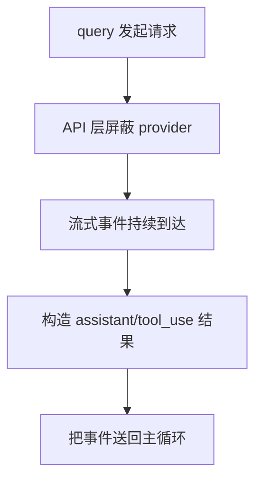
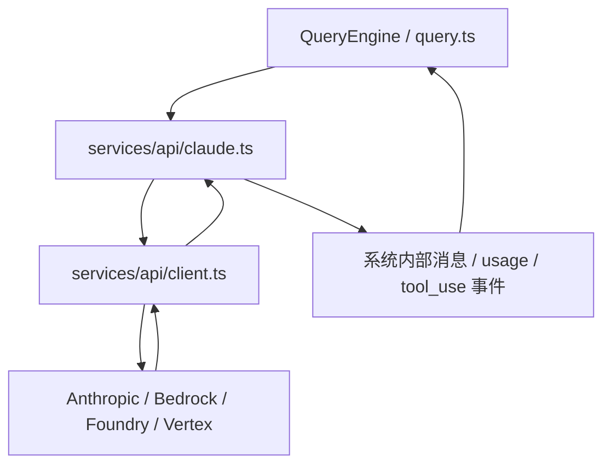

# 第 11 章 模型 API 层与流式执行机制

## 本章目标
- 理解为什么模型 API 层远不只是“发一个 HTTP 请求”。
- 看清 provider 屏蔽、流式事件转换、usage/cost 记录和错误处理如何合在一起。
- 建立“流式是系统特性而不是 UI 小功能”的认知。

## 先修关系
- 建议先读第 9 章和第 5 章，先知道 query 主循环怎样需要流式层配合。
- 如果第 10 章已经浏览过，将更容易把 API 阶段挂到请求时间线中。
- 本章和第 14 章互为左右手：一个负责模型流，一个负责工具流。

## 关键词
- `provider abstraction`：上层不直接接触各个模型供应商的差异细节。
- `stream event`：模型返回的不是单一结果，而是一串事件流。
- `usage/cost`：成本和 token 使用是运行时一等问题，而不是事后统计。
- `tool_use block`：工具请求以结构化块的形式嵌在流式返回中。
- `retry/错误处理`：流式通信必须处理网络、认证和响应异常等复杂条件。

## 正文图解

## 关键数据结构
| 结构/对象 | 在本章中的位置 | 阅读时要抓什么 |
| --- | --- | --- |
| `API Request Payload` | 主循环最终提交给模型后端的请求结构。 | 它是上层会话语义与下层协议之间的桥。 |
| `Stream Event Envelope` | 流式返回事件的统一包装。 | 没有它，系统无法把 provider 事件重译成内部结构。 |
| `Usage/Cost Ledger` | 记录 token、缓存和花费的运行时结构。 | 它决定平台能否持续运行而不是失控烧钱。 |
| `Assistant Block Builder` | 把流中的碎片拼成最终 assistant message。 | 它解释为什么 API 层需要理解消息结构而不只是网络协议。 |

## 本章在第二阶段中的位置

这一章虽然看上去像“基础设施章节”，但它实际上属于第二阶段的主链路学习。  
因为如果读者不理解模型 API 层在做什么，就无法真正看懂 `query()` 为什么会这么复杂。

## 19.1 为什么要单独讲 API 层

在很多小项目里，API 层只是“fetch 一下后端”。  
但在这个系统里，模型 API 层承担的责任远远超过网络请求：

- 选择 provider
- 处理认证
- 配置 headers
- 支持不同平台
- 处理流式消息
- 管理 retry/fallback
- 记录 usage 与 cost
- 配合 prompt cache、thinking、betas

因此，它本身就是一个复杂子系统。

## 读者最容易把 API 层想简单的地方

最常见的误解是把 API 层理解成：

- 拼一个请求体
- 发个 HTTP 请求
- 收到响应

但在这套系统里，API 层还承担：

- provider 选择
- 工具 schema 传递
- usage/cost 统计
- 重试与 fallback
- streaming 事件解码
- thinking / beta / prompt cache 等运行时选项装配

## 本章建议的理解顺序

1. 先看它要解决哪些产品和运行时问题。
2. 再看 `client.ts` 这种客户端适配层。
3. 最后再看 `claude.ts` 中为什么会出现大量流式和工具相关逻辑。

## 19.2 API 层的主要文件

| 文件 | 作用 |
| --- | --- |
| `services/api/client.ts` | 构建 Anthropic 客户端与 provider 适配 |
| `services/api/claude.ts` | 组织消息、工具 schema、流式调用与 usage 统计 |
| `services/api/errors.ts` | API 错误分类与解释 |
| `services/api/withRetry.ts` | 重试、fallback、不可重试判定 |
| `services/api/bootstrap.ts` | 启动期相关 API 预取 |

## 19.3 `client.ts`：不是一个普通 client 工厂

`src/services/api/client.ts` 展示了很典型的平台化 API 适配写法。

### 它支持多种后端提供者

从代码可以看到至少支持：

- 直接 Anthropic API
- AWS Bedrock
- Azure Foundry
- Vertex AI

这说明上层 `query.ts` 并不需要知道请求最后发向哪里，  
它只依赖一个统一的客户端构造层。

### 它还处理了什么

- OAuth token 刷新
- API key 注入
- proxy/mTLS
- User-Agent
- session 标识 header
- 非交互/交互场景差异

从结构上看，这就是“平台层对外部 provider 的屏蔽”。

## 19.4 `claude.ts`：模型通信核心

`src/services/api/claude.ts` 是整条模型通信链最关键的文件之一。

### 为什么它这么大

因为它要负责把上层“会话语义”翻译成下层“API 协议”。

它需要处理的内容包括：

- messages 转 API 结构
- tools 转 API schema
- output config、task budget、thinking 配置
- beta headers
- prompt cache 相关逻辑
- usage 累计
- 错误和 retry

## 19.5 这一层到底在转换什么

可以把 `claude.ts` 的工作理解成三次转换：

### 转换一：内部消息 -> API 消息

系统内部的 `Message` 类型，不等于 Anthropic SDK 期望的 API 消息。  
所以需要做 normalize。

### 转换二：内部工具 -> API 工具 schema

`Tool.ts` 里的 Tool 很丰富，但发给模型时要转换成标准工具 schema。

### 转换三：API 流式事件 -> 系统内部事件

流式返回的 token、tool_use、usage delta，最终要被转换回系统能消费的消息与状态变化。

## 19.6 为什么这里会出现这么多 header/beta

初学者容易被代码里的 header 和 beta 常量吓到。  
其实它们大多属于一种现象：

> 模型 API 不只是“给文本，拿文本”，而是通过 header 和 body 参数控制推理特性、缓存策略和实验能力。

例如代码里可以看到：

- thinking
- effort
- fast mode
- context management
- structured outputs
- task budgets

这说明 API 层已经和产品能力深度绑定。

## 19.7 流式执行为什么会把系统复杂度拉高

假设模型不是流式输出，那么系统只需要：

- 发请求
- 等结果
- 一次性更新 UI

但现在不是。

### 流式执行带来的额外要求

- UI 要能边到边显示
- 工具调用可能在流中途出现
- progress 需要即时显示
- 错误不能简单等最后再说
- usage/cost 也可能是渐进累计

所以流式执行会把很多模块绑得更紧：

- API 层
- Query 主循环
- 工具执行层
- UI 渲染层

## 19.8 `StreamingToolExecutor.ts` 为什么存在

如果工具调用只会在完整 assistant 响应结束后统一出现，那么普通调度器就够了。  
但这里工具可能“边流进来边开始执行”，于是就需要 `src/services/tools/StreamingToolExecutor.ts`。

### 它解决的是什么问题

- 工具逐个流入时，何时开始执行
- 并发安全工具能否并跑
- 非并发安全工具要不要等待
- 如果某个 Bash tool 出错，兄弟工具如何取消
- 如果出现 streaming fallback，已经启动的工具如何丢弃结果

这就是流式执行复杂度在工具层的具体体现。

## 19.9 模型 API 层与上层模块的关系

## 19.10 这一层最值得记住的工程思想

### 思想一：上层不要关心 provider 细节

否则 `query.ts` 会被 AWS、Vertex、OAuth、代理这些细节污染。

### 思想二：流式不是 UI 特性，而是系统特性

一旦采用流式，整个系统的状态机和工具执行方式都要调整。

### 思想三：成本与性能都属于一等问题

从 usage、token、cost、cache 这些逻辑的密度可以看出，  
这里不是“能用就行”，而是“必须可持续运行”。

## 19.11 怎样复盘这一章

不要把它理解成“SDK 文档复述”。  
更好的复盘方式是：

1. 先问自己：“为什么 API 层会这么大？”
2. 再检查自己是否已经意识到：
   - provider 屏蔽
   - 流式转换
   - 成本与缓存
   - 特性开关
3. 最后再回到具体代码

这样将把它看成架构层，而不是网络细节层。

## 19.12 语言无关重建视角

API 层在这套系统中承担的是“模型协议适配器”角色，而不是普通 HTTP 客户端。跨语言重写时，至少要保留四类职责：

1. Provider 屏蔽：把 Anthropic、Bedrock、Foundry、Vertex 等差异吸收在适配层内部。
2. 请求装配：把内部消息、工具 schema、system prompt 与 beta headers 翻译成 provider 可接受的 payload。
3. 流式事件归一化：把 provider 的 message_start、delta、tool_use、stop 等事件转成内部统一事件流。
4. 统计与治理：记录 usage、cost、cache、fallback、错误与重试信息。

### 需要显式建模的对象

为了保证 API 层可迁移，建议显式定义以下对象：

- `ProviderRequest`
- `ProviderStreamEvent`
- `NormalizedStreamEvent`
- `UsageLedger`
- `ProviderCapabilities`

这些对象会让“上层业务逻辑”和“下层网络协议”之间形成清晰的边界。

### 最小实现顺序

1. 先实现 provider 无关的内部请求结构。
2. 实现一个 provider 适配器，把内部请求翻译成外部 payload。
3. 实现流式事件解析器，把外部流事件统一成内部流事件。
4. 实现 usage 与错误记录。
5. 最后再补入 cache、fallback、beta headers 与多 provider 特性差异。

### 重建时最容易遗漏的系统特征

- 流式不仅影响 UI，还会反向影响主循环与工具执行方式。
- 工具 schema 必须与消息 payload 一并装配，而不是临时拼接。
- usage/cost 不是日志附属品，而是调度与预算策略的重要输入。
- provider 差异若上溢到 `query()`，主循环很快会被实现细节污染。

## 重建蓝图：把模型通信层写成供应商无关的流式适配器

### 必须保留的抽象

1. API 层必须由 Provider Client Factory 与 Streaming Adapter 两部分组成。前者负责凭据和供应商差异，后者负责把原始流式响应翻译成内部统一事件。
2. 请求规范化过程必须单独建模。外部调用方应只看到 canonical request，而供应商特有 header、beta、cache 控制和字段修补应被封装在适配器内部。
3. 流式响应至少要被拆成文本增量、工具调用增量、完成事件、usage 统计、错误事件和可能的修复事件。只有这样，主循环才能稳定消费。
4. API 层还必须承担守护职责，包括超时监控、异常中断检测、凭据刷新、响应修补和 usage 汇总。

### 最小实现顺序

1. 第一阶段先定义内部统一的请求与响应事件类型，确保主循环完全不依赖某一家供应商的原始格式。
2. 第二阶段实现 client factory，根据配置返回具体 provider client，并处理认证与凭据刷新。
3. 第三阶段实现 streaming adapter，把 provider chunk 按顺序翻译成内部事件流。
4. 第四阶段加入工具调用片段修补、usage 统计、cache 控制和 beta header 等高级能力。
5. 第五阶段补入 watchdog、重试和异常分支，使流式链路在网络抖动或供应商非规范行为下仍可运行。

### 最容易写错的边界

1. 最常见的错误是让主循环直接消费供应商 SDK 的原始事件。这会把厂商细节带进核心层，几乎无法迁移。
2. 第二类错误是把非流式与流式当成两套毫不相关的实现。实际上二者应共享同一请求模型和同一结果语义，只是传输方式不同。
3. 第三类错误是忽略供应商返回中的不规范片段。原工程中的修补逻辑说明，真实 API 环境并不总是完美遵循理想协议。
4. 第四类错误是没有 usage ledger 与 watchdog，导致一旦流式输出异常停止，系统既无法准确记账，也无法及时判断请求是否卡死。

## 章末小结
- 本章围绕“provider 屏蔽、流式事件和 usage/cost 治理”重建了一层稳定理解，避免只记零散函数名或目录名。
- 真正需要沉淀下来的，不只是 `provider abstraction`、`stream event`、`usage/cost` 这几个词，而是它们在 `API Request Payload`、`Stream Event Envelope`、`Usage/Cost Ledger` 里的相互位置。
- 如后续在 第 10 章和第 14 章 中再次迷路，优先回看本章的“先修关系、正文图解、关键数据结构”三部分。

## 章末自测
1. 不看原文，用自己的话重述本章围绕“provider 屏蔽、流式事件和 usage/cost 治理”到底解决了什么问题。
2. 结合“正文图解”，把 `API 层屏蔽 provider` 到 `构造 assistant/tool_use 结果` 之间的连接关系重新讲一遍。
3. 对比 `API Request Payload` 与 `Stream Event Envelope`：它们分别回答什么问题，边界为什么不能混掉？
4. 在 `provider abstraction`、`stream event`、`usage/cost` 中任选两个，说明它们在本章中是如何互相作用的。
5. 如果后续要继续读 第 10 章和第 14 章，本章哪一部分最值得先回看？为什么？
