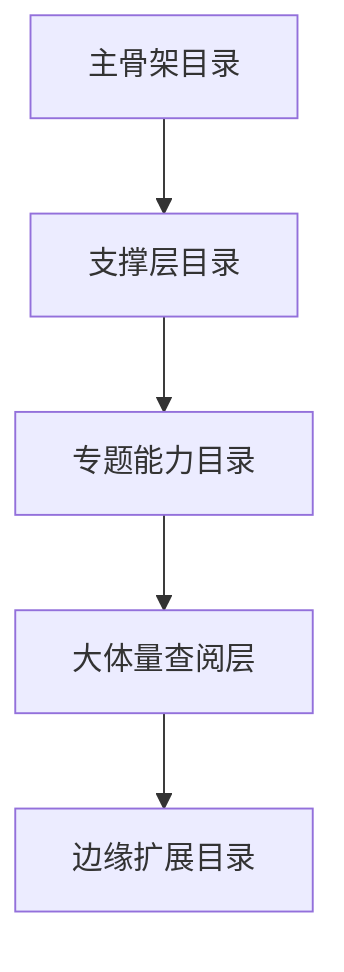

# 第 23 章 模块学习地图：按阅读优先级解读目录

## 本章目标
- 把庞大的顶层目录重新整理成“现在先读什么、以后再查什么”的学习地图。
- 在失去目录感时能够快速回到正确入口，而不是在 `utils/` 或 `components/` 里漫游。
- 建立目录查阅能力，让“知道结构”升级成“知道从哪一层重新切入”。

## 先修关系
- 宜至少已经读过第 6、5、12、11 章中的若干核心章节，否则本章会过于接近百科式查阅。
- 本章最适合在第一轮主线阅读后使用，用来补齐“覆盖面”和“目录感”。
- 如发现关键问题总是无法定位到对应文件，本章就是应当回看的位置。

## 关键词
- `学习优先级`：不是所有目录都值得立刻读，必须按理解收益排序。
- `模块地图`：把顶层目录看成结构地图而不是线性目录清单。
- `主骨架目录`：支撑系统地图建立的第一优先级目录。
- `查阅型目录`：只在需要时定点检索，不适合作为主动学习入口。
- `目录感`：能在需要时快速知道某种问题大概率落在哪层。

## 正文图解

## 关键数据结构
| 结构/对象 | 在本章中的位置 | 阅读时要抓什么 |
| --- | --- | --- |
| `优先级总表` | 把目录按学习价值重新排序。 | 这是本章最核心的导航结构。 |
| `Atlas Entry` | 每个目录的职责、入口文件和阅读入口条目。 | 它有助于从“知道名字”升级到“知道如何进入”。 |
| `核心文件集合` | 第一轮必须优先读的文件清单。 | 它把几百个目录项压缩成少量有效入口。 |
| `目录定位问题` | 碰到某类问题时该回哪个目录的心智清单。 | 它能显著减少漫无目的搜索。 |

## 先说明：本章已经按“学习优先级”重组

如果按工程目录顺序平铺讲解，很容易产生一种错觉：  
仿佛每个目录都同样重要、同样应该立刻阅读。事实并不是这样。

目录学习必须按“理解收益”排序：

- 哪些目录决定能不能先看懂系统主链路？
- 哪些目录属于第二层支撑，应该在主链路后补齐？
- 哪些目录虽然很大，但第一轮不应该深挖？
- 哪些目录更像查阅型资料，不适合作为主动学习起点？

所以，本章不再把目录当成一份简单词典，而是先给出一张“应先读什么、后读什么”的学习地图。下文保留目录词典式说明，但那一部分更适合在已经建立地图之后作为查阅工具使用。

## 学习优先级总表

| 优先级 | 当前推荐读法 | 代表目录/文件 | 原因 |
| --- | --- | --- | --- |
| 第一优先级 | 必须先读 | `main.tsx`、`entrypoints/`、`setup.ts`、`screens/`、`query.ts`、`QueryEngine.ts`、`tools.ts`、`Tool.ts` | 它们决定系统主骨架 |
| 第二优先级 | 主链路后立即补齐 | `commands/`、`services/api/`、`services/tools/`、`state/`、`history.ts` | 它们决定输入、执行和状态如何真正跑起来 |
| 第三优先级 | 核心能力专题学习 | `tools/`、`tasks/`、`services/mcp/`、`utils/plugins/`、`memdir/`、`services/compact/`、`utils/permissions/` | 它们决定系统为什么强大，也决定系统为什么复杂 |
| 第四优先级 | 已懂主线后再读 | `components/`、`hooks/`、`ink/`、`utils/` | 体量大、细节多，但不是第一轮入口 |
| 第五优先级 | 当索引查，不要首读 | `assistant/`、`bridge/`、`buddy/`、`voice/`、`upstreamproxy/`、`remote/`、`server/`、`vim/` | 这些目录更偏功能分支或边缘扩展 |

## 第一优先级：先把系统主骨架立住

### 应当先读什么

1. `main.tsx`
2. `entrypoints/init.ts`
3. `setup.ts`
4. `screens/REPL.tsx`
5. `utils/processUserInput/processUserInput.ts`
6. `QueryEngine.ts`
7. `query.ts`
8. `Tool.ts`
9. `tools.ts`

### 为什么先读这些

因为它们决定了整个系统最关键的三个问题：

1. 程序怎么启动。
2. 请求怎么流动。
3. 能力怎么被统一暴露给模型。

### 第一轮的最低完成标准

第一轮不要求看懂所有实现细节，但至少要能说清：

- 用户输入从哪里进入。
- 会话状态由谁托管。
- 单轮查询由谁驱动。
- 工具能力如何被挂进系统。

## 第二优先级：补齐真正能跑起来的支撑层

### 这一层包括什么

- `commands/`
- `commands.ts`
- `services/api/`
- `services/tools/`
- `state/`
- `history.ts`

### 为什么这一层不能跳过

第一轮若只盯着 `query.ts`，后面再问“用户输入怎么分流”“状态是怎么同步的”“工具到底是谁在调度”，往往就答不上来了。  
第二优先级模块的价值，就是把主骨架从“能看懂大概”升级成“知道它怎么真正运转”。

## 第三优先级：理解系统的力量来源

### 这一层包括什么

- `tools/`
- `tasks/`
- `services/mcp/`
- `utils/plugins/`
- `memdir/`
- `services/compact/`
- `utils/permissions/`

### 为什么这层最能体现系统深度

因为这一层回答的是“这套系统为什么不只是聊天程序”。  
如果没有这些模块，它就不会拥有：

- Shell 执行能力
- 多代理协作能力
- 外部能力接入能力
- 长上下文管理能力
- 安全与权限治理能力

## 第四优先级：大体量目录的正确打开方式

### 这一层包括什么

- `components/`
- `hooks/`
- `ink/`
- `utils/`

### 为什么这些目录不能作为第一入口

不是因为它们不重要，而是因为它们太重要、太大、太细。  
如果在没有主线地图时就直接冲进去，就会只见树木，不见森林。

### 正确读法

1. 先带着问题读，而不是整目录漫游。
2. 从主链路涉及到的文件反向进入这些目录。
3. 把它们当成“支撑主线的细节库”，而不是“第一阶段教材”。

## 第五优先级：查阅型目录

这一层目录在工程里当然有价值，但在第一轮中不应作为主要学习入口。  
更适合在出现具体问题时回到这些目录做定点检索。

## 本章最容易犯的错误

1. 以为文件多的目录就一定要先读。
2. 以为顶层目录顺序就是系统运行顺序。
3. 以为 `utils/` 这种目录能提供最好的切入点。
4. 以为所有目录都必须在第一轮理解完。

## 怎样使用下文的目录词典

从本章下一节开始，仍然保留了按顶层目录展开的“模块词典”。  
但请把它当成：

- 第二轮和第三轮阅读时的查阅索引
- 做作业、写报告、补证据时的目录地图
- 当主链路已经理解之后，用来补齐“全局覆盖面”的工具

不要把下面的目录词典，当成第一遍阅读的执行顺序。

## 20.1 本章的使用方式

如果前面的章节像“主线叙事”，那么本章更像一本“模块地图册”。  
它的目标不是完整走完一条流程，而是回答：

> `src` 里每个大模块大致是干什么的？它和谁交互？应该从哪几个文件开始读？

为了方便查阅，本章按顶层目录逐一说明。

## 20.2 顶层目录总表

根据对 `src` 的扫描，当前顶层结构可以概括如下：

| 模块 | 文件量级 | 主要职责 |
| --- | ---: | --- |
| `assistant` | 极少 | Assistant 模式相关入口 |
| `bootstrap` | 极少但关键 | 运行时全局状态与启动态 |
| `bridge` | 中等 | 外部桥接、权限桥 |
| `buddy` | 小型 | 伴随式角色/Companion 相关能力 |
| `cli` | 中等 | 结构化输出、远程 IO、传输层 |
| `commands` | 很大 | 用户命令系统 |
| `components` | 很大 | REPL 组件与 UI 展示 |
| `constants` | 小到中 | 常量、提示词片段、产品开关 |
| `context` | 小到中 | React/运行时上下文 |
| `coordinator` | 小型 | 协调者模式相关逻辑 |
| `entrypoints` | 小型但关键 | 初始化入口 |
| `hooks` | 很大 | UI 逻辑与运行时 Hook |
| `ink` | 很大 | 自定义终端渲染引擎 |
| `keybindings` | 中等 | 快捷键系统 |
| `memdir` | 中等 | 记忆系统 |
| `migrations` | 小型 | 配置迁移脚本 |
| `native-ts` | 小型 | 原生绑定/布局/颜色扩展 |
| `plugins` | 小型 | 内建插件入口 |
| `query` | 小型但关键 | 查询子模块 |
| `remote` | 小型 | 远程会话管理 |
| `screens` | 小型但关键 | 顶层屏幕组件 |
| `server` | 小型 | 直连会话与服务端相关 |
| `services` | 很大 | 业务服务和平台服务 |
| `skills` | 中等 | 技能系统 |
| `state` | 小型但关键 | AppState 与选择器 |
| `tasks` | 小型但关键 | 后台任务种类 |
| `tools` | 很大 | 模型可调用工具 |
| `types` | 小型 | 类型定义与生成类型 |
| `upstreamproxy` | 很小 | 上游代理支持 |
| `utils` | 最大 | 横切基础设施 |
| `vim` | 小型 | Vim 风格编辑/导航 |
| `voice` | 很小 | 语音相关能力 |

下面逐个解读。

## 20.3 `assistant/`

### 这个模块做什么

从 `main.tsx` 的特性门控可见，`assistant/` 是 Assistant 模式相关的子系统。  
它不是整套程序的默认主线，而是特性打开后进入的专门模式。

### 应该怎么读

先从 `main.tsx` 中对 `assistantModule`、`kairosGate` 的引入位置看起，  
再回到 `assistant/` 里看它如何接到主入口。

### 和谁交互

- `main.tsx`
- `REPL.tsx`
- 可能与 `services`、`hooks`、`tools` 联动

## 20.4 `bootstrap/`

### 这个模块做什么

它是“全局运行时状态模块”。  
最关键文件是 `src/bootstrap/state.ts`。

### 为什么重要

很多会话级、进程级状态都在这里保存，例如：

- sessionId
- cwd / originalCwd / projectRoot
- telemetry provider
- prompt cache latch
- mainLoop model
- clientType

### 阅读提示

可以把它解释成“终端 Agent 平台的内核态变量仓库”。

## 20.5 `bridge/`

### 这个模块做什么

从名称和 `REPL.tsx`/`main.tsx` 中的导入位置看，它负责：

- REPL bridge
- 权限桥接
- 外部会话和控制请求桥接

### 适合怎么理解

它更像“与外部控制端通信的桥层”，  
不是普通业务层。

## 20.6 `buddy/`

### 这个模块做什么

从 `CompanionSprite.tsx`、`companion.ts`、`prompt.ts` 等名字看，  
这是一个伴随式角色/小伙伴系统，用来在 UI 中提供陪伴式反馈或交互增强。

### 为什么它存在

说明这个产品并不仅追求功能性，还在尝试把交互做得更具人格感。

## 20.7 `cli/`

### 这个模块做什么

`cli/` 并不是入口的代名词，而更偏向：

- 非 REPL 模式的结构化输出
- 远程 I/O
- transport
- handlers

例如：

- `structuredIO.ts`
- `remoteIO.ts`
- `transports/*`

### 与谁交互

- SDK/headless 模式
- API 层
- 远程通信层

## 20.8 `commands/`

### 这个模块做什么

它是用户命令实现的主要容器。  
而 `src/commands.ts` 则是命令注册中心。

### 关键理解

用户看见的是 `/help`、`/mcp`、`/plugin`；  
系统内部则把它们编排成统一的命令协议对象。

### 优先阅读文件

- `commands.ts`
- `types/command.ts`
- 任意几个代表性命令目录，如 `commands/mcp/`、`commands/plugin/`

## 20.9 `components/`

### 这个模块做什么

它是终端 UI 的组件库。  
包含：

- 消息展示
- 权限弹窗
- PromptInput
- 任务列表
- MCP 对话框
- 设置对话框

### 为什么文件这么多

因为这个终端 UI 不是简单打印文本，而是一个完整交互界面。

## 20.10 `constants/`

### 这个模块做什么

存放产品层与系统层常量，例如：

- prompt 片段
- tool 限制
- XML tag 名称
- beta header 常量

### 阅读提醒

不要低估 constants 目录。  
在这类系统中，它往往能揭示产品语义边界。

## 20.11 `context/`

### 这个模块做什么

它主要提供多种 React/运行时 Context：

- notifications
- mailbox
- stats
- overlay
- modal

### 适合如何理解

如果 `state/` 是统一状态树，那么 `context/` 更像“跨组件共享能力入口”。

## 20.12 `coordinator/`

### 这个模块做什么

从 `coordinatorMode.ts` 与多处 feature gate 看，  
它是协调者模式相关逻辑，用于多代理协作时区分 leader 与 worker 的行为。

### 与谁交互

- `AgentTool`
- `tools.ts`
- `query.ts`

## 20.13 `entrypoints/`

### 这个模块做什么

它负责“程序级初始化入口”。  
最重要的是 `src/entrypoints/init.ts`。

### 关键观察

它体现了启动期的：

- 配置启用
- 遥测初始化
- 预热
- cleanup 注册

## 20.14 `hooks/`

### 这个模块做什么

这里主要是 React/Ink hook，以及部分与权限、通知、远程连接相关的逻辑 hook。

### 为什么重要

`REPL.tsx` 之所以能维持可读性，一个关键原因就是大量逻辑被拆成了 hooks。

## 20.15 `ink/`

### 这个模块做什么

终端渲染引擎。  
包括：

- reconciler
- layout
- output buffer
- terminal 写入
- 事件系统
- 选择与高亮

### 为什么是大模块

因为项目没有满足于用现成终端 UI 能力，而是要掌控底层渲染行为。

## 20.16 `keybindings/`

### 这个模块做什么

负责快捷键解析、校验、展示和用户自定义绑定。

### 关键观察

它说明这套系统把键盘交互当成一等公民，而不是简单监听几个按键。

## 20.17 `memdir/`

### 这个模块做什么

长期记忆系统。  
核心文件是 `src/memdir/memdir.ts`。

### 关键能力

- 记忆目录结构
- `MEMORY.md` 入口
- 记忆提示词构造
- 记忆扫描与选择

## 20.18 `migrations/`

### 这个模块做什么

处理配置和模型名称等历史遗留迁移。  
这说明产品配置结构曾经演进过很多次。

### 工程意义

说明“成熟产品必然要面对迁移问题”。

## 20.19 `native-ts/`

### 这个模块做什么

放置接近原生实现的 TypeScript 包装，例如：

- `yoga-layout`
- `color-diff`
- `file-index`

### 作用

多半是为了补足性能敏感能力或终端布局底层能力。

## 20.20 `plugins/`

### 这个模块做什么

这里更多是“内建插件”入口和聚合层；  
真正复杂的插件装载逻辑在 `utils/plugins/`。

## 20.21 `query/`

### 这个模块做什么

它是 `query.ts` 的辅助子模块集合：

- `config.ts`
- `deps.ts`
- `stopHooks.ts`
- `tokenBudget.ts`

### 理解价值

说明作者在努力把主循环的大文件继续拆成子关注点。

## 20.22 `remote/`

### 这个模块做什么

处理远程会话管理、权限桥接、WebSocket 会话等。  
如果要理解远程协作/远程控制能力，这里是重要入口。

## 20.23 `screens/`

### 这个模块做什么

顶层屏幕组件。  
虽然目录不大，但 `src/screens/REPL.tsx` 非常关键。

### 阅读提醒

不要因为 `screens/` 文件少，就误以为它不重要。  
它属于“少而重”的目录。

## 20.24 `server/`

### 这个模块做什么

处理 direct connect session 等服务端接入点。  
它与 `remote/` 一起构成远程运行相关的底层支持。

## 20.25 `services/`

### 这个模块做什么

这是非常大的“业务服务层/平台服务层”，包含：

- `api/`
- `mcp/`
- `compact/`
- `analytics/`
- `lsp/`
- `oauth/`
- `plugins/`

### 适合怎么理解

如果 `utils/` 更偏基础设施，那么 `services/` 更偏“有明确业务语义的服务模块”。

## 20.26 `skills/`

### 这个模块做什么

技能系统。  
它既有 bundled skills，也有技能加载与构建逻辑。

### 与谁交互

- `commands.ts`
- `tools/SkillTool`
- 动态技能发现逻辑

## 20.27 `state/`

### 这个模块做什么

REPL 应用状态层。

关键文件：

- `AppStateStore.ts`
- `AppState.tsx`
- `selectors.ts`
- `onChangeAppState.ts`

### 关键观察

这是理解 UI 如何维持复杂交互的核心目录。

## 20.28 `tasks/`

### 这个模块做什么

后台任务种类实现。  
典型包括：

- `LocalShellTask`
- `LocalAgentTask`
- `InProcessTeammateTask`
- `RemoteAgentTask`

### 与谁交互

- `tools/*`
- `AppState`
- `sessionStorage`

## 20.29 `tools/`

### 这个模块做什么

模型可调用工具实现层。  
这是本项目最重要的目录之一。

### 关键特点

- 目录分层很清晰
- 大工具都有独立子目录
- 工具不仅有执行逻辑，还有 UI 逻辑、权限逻辑、提示词逻辑

## 20.30 `types/`

### 这个模块做什么

统一类型定义。  
另外还有大量 generated types。

### 阅读提醒

不要只把 types 当“补充材料”。  
在大型 TypeScript 工程里，类型文件往往能快速暴露系统边界。

## 20.31 `upstreamproxy/`

### 这个模块做什么

处理上游代理中继，主要在远程/CCR 场景下使用。  
属于网络与部署适配层。

## 20.32 `utils/`

### 这个模块做什么

这是全项目最大的目录。  
它容纳的是各种横切基础设施，例如：

- auth
- debug
- file / path
- shell
- sandbox
- settings
- plugins
- permissions
- sessionStorage

### 如何读它

绝对不要试图“按文件一个个看完”。  
正确方式是按专题读：

- 读权限，就看 `utils/permissions/`
- 读插件，就看 `utils/plugins/`
- 读 Shell，就看 `utils/bash/`、`utils/shell/`

## 20.33 `vim/`

### 这个模块做什么

实现 Vim 风格的文本对象、操作符、motion 等。  
说明这个终端应用对键盘效率非常重视。

## 20.34 `voice/`

### 这个模块做什么

语音相关功能，规模较小，但显示出产品在探索更丰富输入方式。

## 重建蓝图：把目录词典转化为重写时的包图

### 必须保留的抽象

1. 目录图谱真正的价值，不在于记住有多少文件夹，而在于识别哪些目录构成运行时主骨架，哪些目录只是实现支撑或宿主适配。
2. 重写时至少要保留七类 package：入口装配、交互容器、查询编排、模型通信、能力系统、状态与持久化、扩展与集成。
3. 其余目录如 `ink/`、`voice/`、`vim/`、`native-ts/`、`upstreamproxy/` 等，应按“宿主适配层”或“专项能力层”归并处理，而不必机械复制目录名。
4. `tasks/`、`tools/`、`services/`、`state/`、`utils/` 这些目录的边界需要格外谨慎，因为它们承载的是平台级抽象，而非单一业务逻辑。

### 最小实现顺序

1. 先根据运行时职责而非源码目录数量，绘制目标语言中的 package map，并标出核心依赖方向。
2. 第二步只迁移第一优先级目录所代表的核心能力，先让最小版本跑通：`entrypoints/`、`screens/`、`query/`、`services/api/`、`Tool.ts` 一类中枢。
3. 第三步迁移 `tools/`、`tasks/`、`state/` 和 `services/tools/`，把能力闭环与状态闭环建立起来。
4. 第四步再迁移 `services/mcp/`、`plugins/`、`commands/`、`skills/` 等动态扩展层。
5. 第五步最后处理宿主适配与边缘目录，把终端渲染、代理、语音、编辑器联动等专项能力纳入系统。

### 最容易写错的边界

1. 最常见的错误是看到某目录文件多，就误以为它在运行时最重要。实际上某些看似普通的中心文件比整组目录都更关键。
2. 第二类错误是原样照抄目录结构。换语言之后，package 组织应服务于新语言生态与新运行时，而不是忠实复刻旧仓库外形。
3. 第三类错误是把 `utils/` 当成垃圾桶继续扩张。原工程中很多 `utils` 文件其实承载着重要协议或基础设施，应在重写时重新归位。
4. 第四类错误是忽略目录之间的依赖方向。如果没有先画出拓扑图，重写过程中很容易形成反向依赖和循环引用。

## 章末小结
- 本章围绕“学习优先级、目录感和模块查阅能力”重建了一层稳定理解，避免只记零散函数名或目录名。
- 真正需要沉淀下来的，不只是 `学习优先级`、`模块地图`、`主骨架目录` 这几个词，而是它们在 `优先级总表`、`Atlas Entry`、`核心文件集合` 里的相互位置。
- 如后续在 第 24 章、第 29 章和后续源码实践 中再次迷路，优先回看本章的“先修关系、正文图解、关键数据结构”三部分。

## 章末自测
1. 不看原文，用自己的话重述本章围绕“学习优先级、目录感和模块查阅能力”到底解决了什么问题。
2. 结合“正文图解”，把 `支撑层目录` 到 `大体量查阅层` 之间的连接关系重新讲一遍。
3. 对比 `优先级总表` 与 `Atlas Entry`：它们分别回答什么问题，边界为什么不能混掉？
4. 在 `学习优先级`、`模块地图`、`主骨架目录` 中任选两个，说明它们在本章中是如何互相作用的。
5. 如果后续要继续读 第 24 章、第 29 章和后续源码实践，本章哪一部分最值得先回看？为什么？
