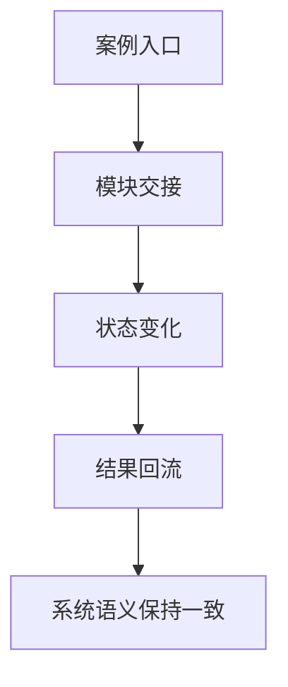

# 第 24 章 关键模块交互案例集

## 本章目标
- 通过交互案例把多个章节里学到的模块重新编织成真实系统协作过程。
- 训练“模块 A 为什么在时机 X 调用模块 B”的解释能力。
- 把局部模块理解升级成时序化、状态化的系统理解。

## 先修关系
- 建议先读第 5 章和第 23 章，先有主链路和目录地图。
- 如果第 13、16、17、21、14 章已经读过，案例里的工具、任务和状态回流会更容易吸收。
- 本章与第 28、29、30 章关系很近，因为案例是做复盘和实验最好的材料。

## 关键词
- `交互案例`：不是复述章节，而是把多个模块在同一时刻的协作重新放在一起。
- `模块交接`：一个模块把什么交给下一个模块，是本章最该观察的点。
- `状态改变`：每次调用不仅产生返回值，还改变系统后续状态。
- `工具池刷新`：外部配置、命令或插件变化会影响后续能力面。
- `恢复语义`：任务和 transcript 要能在异步/后台流程后继续保持解释性。

## 正文图解

## 关键数据结构
| 结构/对象 | 在本章中的位置 | 阅读时要抓什么 |
| --- | --- | --- |
| `Case Template` | 每个案例都包含涉及模块、交互过程和关键观察。 | 它把案例阅读变成一种可重复的方法。 |
| `Handoff Chain` | 模块之间传递消息、状态或句柄的链路。 | 它是理解系统互动而不只看单模块的关键。 |
| `Task Feedback Loop` | 后台任务状态如何重新回到 UI 与会话。 | 这解释了“后台化之后系统为何仍然可控”。 |
| `Tool Pool Refresh Path` | 外部能力变化如何更新当前能力面。 | 它有助于理解系统为何是动态平台而非静态程序集。 |

## 本章在第五阶段中的位置

这一章位于第五阶段，也就是读者已经认识主要模块之后，开始训练“把模块重新连成完整协作网络”的阶段。

## 21.1 为什么要有这一章

很多读者在读完“模块介绍”后，仍然会有一种典型困惑：

> 我知道每个模块是干什么的了，但它们怎么真正配合起来？

这正是本章的目的。  
我们不再单独讲模块，而是讲“模块交互案例”。

## 这章不是复述，而是整合

如果前面的章节更像“模块说明书”，这一章更像“系统配合演练”。  
它要求读者不只记住模块职责，还要解释：

- 调用顺序
- 数据流方向
- 状态变化点
- 模块边界上的接口形式

## 正确使用方式

可将本章视为“自测场景库”来用：

1. 先自己尝试画出交互链。
2. 再对照本章案例。
3. 最后换一个场景，自己再独立推一遍。

## 21.2 案例一：普通文本请求如何穿过系统

### 涉及模块

- `REPL.tsx`
- `processUserInput.ts`
- `QueryEngine.ts`
- `query.ts`
- `services/api/claude.ts`
- `messages.ts`

### 交互过程

1. REPL 收到用户输入
2. 输入被预处理并转换为 `user message`
3. QueryEngine 取出当前会话的消息历史
4. query 主循环组装上下文
5. API 层发起模型请求
6. assistant message 回流到 UI 与 transcript

### 这个案例最想说明什么

这个案例说明：  
即使没有工具调用，系统也已经是多层协作，而不是简单函数调用。

## 21.3 案例二：一个 Bash 命令如何从模型调用变成后台任务

### 涉及模块

- `query.ts`
- `toolOrchestration.ts`
- `toolExecution.ts`
- `BashTool.tsx`
- `LocalShellTask.tsx`
- `AppStateStore.ts`

### 交互过程

1. 模型在 assistant 响应中产生 `tool_use: Bash`
2. 调度层把 BashTool 交给执行层
3. BashTool 运行命令并上报 progress
4. 如果执行时间过长或命中特定策略，命令被后台化
5. `LocalShellTask` 注册任务状态并接管生命周期
6. UI 根据 `tasks` 状态展示后台任务

### 最该抓住的点

这里最值得体会的是：

> “工具调用”和“任务运行”不是同一个抽象层次。

## 21.4 案例三：一个子代理如何拥有自己的上下文

### 涉及模块

- `AgentTool.tsx`
- `runAgent.ts`
- `assembleToolPool()`
- `createSubagentContext`
- `query.ts`
- `tasks/LocalAgentTask`

### 交互过程

1. 主模型调用 `AgentTool`
2. AgentTool 解析 agent definition
3. 根据 agent 的 permissionMode、tools、MCP 需求重建工具池
4. `runAgent()` 创建子代理上下文
5. 子代理运行自己的 `query()`
6. 如果后台运行，则注册为 `LocalAgentTask`

### 最该抓住的点

子代理并不是“在主代理里套一个函数”，  
而是重新构造了一套缩小版运行环境。

## 21.5 案例四：MCP 工具如何进入主工具池

### 涉及模块

- `services/mcp/config.ts`
- `services/mcp/client.ts`
- `tools.ts`
- `AppState.mcp`
- `assembleToolPool()`

### 交互过程

1. 系统从多来源解析 MCP 配置
2. MCP client 层连接各服务器
3. 连接成功后抓取 tools/resources
4. 这些工具进入 `AppState.mcp.tools`
5. `assembleToolPool()` 把它们和 built-in tools 合并

### 最该抓住的点

这说明“扩展能力”不是旁路调用，而是被吸收进统一工具协议。

## 21.6 案例五：权限模式切换如何影响外部系统

### 涉及模块

- `AppStateStore.ts`
- `onChangeAppState.ts`
- `utils/permissions/*`
- `sessionState.ts`
- CCR/SDK 状态同步

### 交互过程

1. 用户或系统改变 `toolPermissionContext.mode`
2. AppState 更新
3. `onChangeAppState()` 检测到 mode 变化
4. 外部 metadata 被同步
5. 相关 UI 和远端状态保持一致

### 最该抓住的点

状态变化不是局部事件，而可能触发跨系统同步。

## 21.7 案例六：一次 compact 如何改变消息历史

### 涉及模块

- `query.ts`
- `services/compact/autoCompact.ts`
- `services/compact/compact.ts`
- `messages.ts`
- `sessionStorage.ts`

### 交互过程

1. query 发现 token 接近阈值
2. `autoCompactIfNeeded()` 决定是否压缩
3. `compact.ts` 生成总结与边界消息
4. query 用压缩后的消息替代旧消息继续执行
5. sessionStorage 可记录 compact boundary，供恢复和理解使用

### 最该抓住的点

压缩不是“删掉旧消息”，而是“改写消息历史的可解释表示”。

## 21.8 案例七：一个插件如何影响用户命令与模型能力

### 涉及模块

- `pluginLoader.ts`
- `loadPluginCommands.ts`
- `commands.ts`
- `loadPluginAgents.ts`
- `services/mcp/config.ts`

### 交互过程

1. 插件被发现并验证
2. 插件贡献的 commands/skills/agents/hooks/MCP 配置被解析
3. 命令进入命令系统
4. agent 进入 agent 定义系统
5. MCP 配置可能进一步扩展工具池

### 最该抓住的点

插件影响的不是单一入口，而可能同时改变：

- 用户命令面
- agent 面
- 模型工具面

## 21.9 适合做练习的“交互追踪题”

### 题目一

追踪 `/mcp` 命令如何影响后续 Query 的工具池。

### 题目二

追踪一次 `AgentTool` 异步后台运行后，任务状态如何回到 UI。

### 题目三

追踪一次 `BashTool` 超时后台化后，为什么 transcript 仍然能恢复语义。

## 重建蓝图：把交互案例转成集成测试规范

### 必须保留的抽象

1. 每一个交互案例都应被视为系统集成测试模板，而不是阅读时的说明性故事。案例的价值在于验证多个模块在真实链路中的协同关系。
2. 一个完整案例至少要记录四类信息：输入条件、经过的模块、关键状态变化、最终外部可观察结果。
3. 案例中的“关键检查点”必须显式列出。例如 BashTool 案例不仅要验证命令是否执行，还要验证权限判定、任务注册、消息回写和 UI 投影是否同时成立。
4. 案例应覆盖正常路径与关键异常路径。只有这样，后续跨语言重写时才能用它们检验系统行为是否等价。

### 最小实现顺序

1. 先为每个案例抽取一份事件轨迹表，把入口、关键函数、状态变化和出口列出来。
2. 第二步把轨迹表改写为集成测试说明，每一步注明期望观察到的消息、任务、日志或状态变化。
3. 第三步在目标语言中实现测试桩或观察接口，使这些检查点都可以被自动验证。
4. 第四步再实现案例本身所需的模块协作逻辑，用案例驱动的方式逐步逼近原系统行为。

### 最容易写错的边界

1. 最常见的错误是只验证最后屏幕上出现的文本，而不检查过程中是否产生了正确的 tool_result、任务状态和 transcript 记录。
2. 第二类错误是把案例写成模块单元测试，忽略跨模块 handoff。原工程的难点恰恰在于 handoff 极多。
3. 第三类错误是没有记录异常路径，导致目标实现只有“顺利时能跑”，一遇到权限拒绝、扩展掉线或后台切换就脱轨。
4. 第四类错误是让案例直接依赖源码文件名，而不提炼出模块角色。这样测试就很难迁移到新语言工程中。

## 章末小结
- 本章围绕“跨模块协作、状态交接与案例化理解”重建了一层稳定理解，避免只记零散函数名或目录名。
- 真正需要沉淀下来的，不只是 `交互案例`、`模块交接`、`状态改变` 这几个词，而是它们在 `Case Template`、`Handoff Chain`、`Task Feedback Loop` 里的相互位置。
- 如后续在 第 28 章、第 29 章和第 30 章 中再次迷路，优先回看本章的“先修关系、正文图解、关键数据结构”三部分。

## 章末自测
1. 不看原文，用自己的话重述本章围绕“跨模块协作、状态交接与案例化理解”到底解决了什么问题。
2. 结合“正文图解”，把 `模块交接` 到 `结果回流` 之间的连接关系重新讲一遍。
3. 对比 `Case Template` 与 `Handoff Chain`：它们分别回答什么问题，边界为什么不能混掉？
4. 在 `交互案例`、`模块交接`、`状态改变` 中任选两个，说明它们在本章中是如何互相作用的。
5. 如果后续要继续读 第 28 章、第 29 章和第 30 章，本章哪一部分最值得先回看？为什么？
