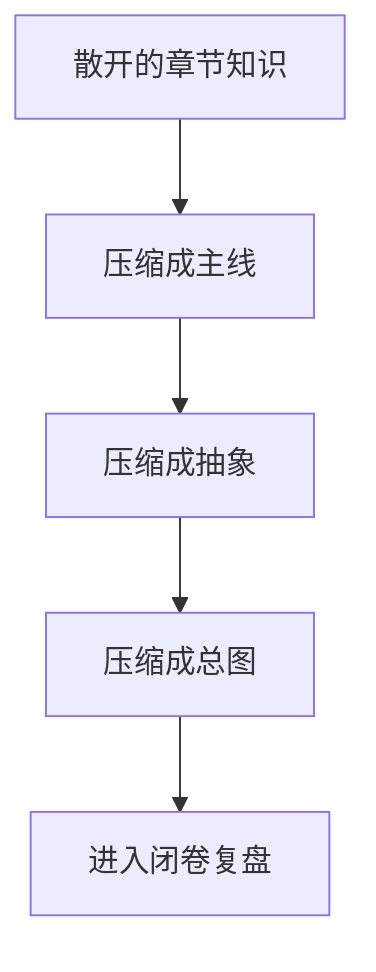

# 第 22 章 总复盘：一张总图、一条主线和十二个关键问题

## 本章目标
- 把全书内容压缩成一张总图、一条主线和一组核心问题。
- 训练在不翻书的情况下重新讲清系统的能力。
- 为最后的通关清单和综合实验准备一套可直接复用的复盘框架。

## 先修关系
- 建议已经读完主要主线和模块章节，否则本章会过于抽象。
- 如果第 14 章已经执行过，将更容易把本章变成真正的闭卷复盘。
- 本章之后最适合接第 24 章和第 25 章，把复盘直接转成检查与实践。

## 关键词
- `一页纸总图`：把复杂系统压缩成可随身携带的认知地图。
- `自我解释`：真正掌握的重要标志，是能不借助原文重新讲清系统。
- `五层压缩`：主线、抽象、模块、交互、治理五个层次的总结法。
- `关键问题集`：用一组高价值问题检查理解是否成型。
- `收束`：本章不是加知识，而是把知识重新折回可操作结构。

## 正文图解


## 关键数据结构
| 结构/对象 | 在本章中的位置 | 阅读时要抓什么 |
| --- | --- | --- |
| `一页纸总图模板` | 最小但完整的系统复盘结构。 | 它是后续答辩、讲解和设计迁移的基础。 |
| `五层模型` | 主线、抽象、模块、交互、治理的压缩框架。 | 它能把复杂工程稳定收束。 |
| `十二问问题集` | 用高价值问题检查理解是否有空洞。 | 它比单纯背目录有效得多。 |
| `30 分钟复盘顺序` | 有限时间内重建系统的讲述流程。 | 它有助于判断自己是不是真的掌握了。 |

## 本章在全书中的角色

这一章位于第六阶段开头。  
本章并不增加新知识，而是负责把前文内容压缩、收束、重组。

如果前面的章节像是“把地图逐步展开”，那么这一章做的事情正相反：

> 把已经展开的地图重新折叠成一张可随时调用的认知地图。

## 22.1 为什么在收尾阶段还要再讲一次“总图”

很多读者会在学习后期遇到一个常见问题：

- 单章都能看懂
- 单个模块也有印象
- 但要整体复述时，顺序就乱了

这并非努力程度问题，而是大型工程天然会分散注意力。  
所以在学习后期，必须主动做一次“结构压缩”：

- 把很多文件压缩成几条主线
- 把很多函数压缩成少数抽象
- 把很多章节压缩成一张总图

一旦压缩成功，对系统的控制感会明显增强。

## 22.2 一次完整复盘最好的顺序

如需准备在 30 分钟内把整套系统讲清楚，最稳定的顺序通常是：

### 第一步：先回答“这是什么系统”

先别急着讲函数。  
先用一句话回答：

> 这是一个运行在终端里的、多能力、可扩展、可恢复的 Agent 平台，而不是一次性调用模型的脚本。

### 第二步：再讲一条主线

最值得优先建立的主线仍然是：

> 用户输入 -> `processUserInput` -> `QueryEngine` -> `query` -> API -> 工具执行 -> 消息回流

这条主线一旦顺了，后面很多模块都能找到挂点。

### 第三步：再讲三个核心抽象

最值得优先记住的三个抽象是：

- `Command`：用户入口层
- `Tool`：模型能力协议层
- `Task`：异步执行容器层

它们分别解决“怎么进系统”“模型能做什么”“长时任务如何存在”这三个问题。

### 第四步：再讲两个代表性重模块

最适合做代表的是：

- `BashTool`
- `AgentTool`

因为这两个模块能把协议、安全、异步、状态和扩展问题一起带出来。

### 第五步：最后讲横切治理

也就是：

- Permission
- Memory
- Compact
- SessionStorage
- MCP / Plugin

讲到这里，系统理解已经从“能跑”上升到“能长期稳定跑”。

## 22.3 一页纸总图模板

如仅保留留一页纸，建议按这个结构写：

### 第一块：主链路

```text
用户输入
  -> processUserInput
  -> QueryEngine
  -> query
  -> API
  -> tool_use
  -> 工具执行
  -> tool_result
  -> assistant
```

### 第二块：三大抽象

```text
Command = 用户入口
Tool = 模型能力协议
Task = 异步执行容器
```

### 第三块：横切系统

```text
Permission
Memory
Compact
SessionStorage
MCP / Plugin
```

### 第四块：两大重模块

```text
BashTool = 命令执行 + 安全约束 + 后台化 + UI 反馈
AgentTool = 子代理派生 + 任务注册 + worktree/remote 分支
```

这四块信息足够支撑一次高质量复盘。

## 22.4 应当能说出的四段口头解释

真正掌握这套系统时，至少应能用白话说清下面四段话。

### 关于 `main.tsx`

> `main.tsx` 像总装配器。它本身不是所有业务的执行者，但它负责把启动、配置、会话、命令、工具、UI 和远程能力组装成一个可运行系统。

### 关于 `Tool.ts`

> 如果没有 Tool 协议，这个项目会退化成一堆零散能力。正是因为有统一协议，模型才拥有一套稳定、可授权、可组合的行动能力面。

### 关于 `query.ts`

> `query()` 不是普通请求函数，而是一个会反复推进的主循环。它一边维护消息历史，一边和模型交互，一边调度工具，还要照顾压缩、预算和异常分支。

### 关于 `AgentTool`

> `AgentTool` 不是在“再调一次函数”，而是在派生新的执行主体。它把单代理系统扩展成了多代理协作平台。

若这四段话都能顺畅讲出，再回头看源码，很多结构会变得异常清晰。

## 22.5 最常见的三种复盘错误

### 错误一：按目录挨个念

这样会被细节淹没，却抓不住主线。

### 错误二：只讲产品功能，不讲抽象

这样将知道“它能做什么”，却不知道“为什么会拆成这样”。

### 错误三：只讲概念，不回到文件

这样会让理解停留在空中，最后落不到真正的源码入口。

更好的方式永远是：

> 系统主线 -> 关键抽象 -> 代表模块 -> 再回到系统主线

## 22.6 十二个关键自测问题

1. 为什么 `main.tsx` 不是所有逻辑都自己做？
2. `REPL.tsx` 和 `QueryEngine.ts` 的边界在哪里？
3. 为什么消息是系统内部的统一语言？
4. 为什么命令和工具必须分开？
5. 为什么工具要自带 UI 渲染方法？
6. 为什么 BashTool 需要后台任务系统配合？
7. 为什么 AgentTool 不等于“递归调用自己”？
8. 为什么 MCP 最终也要汇入工具池？
9. 为什么 transcript 不能记录所有 progress？
10. 为什么自动压缩必须写进 `query` 主循环？
11. 为什么插件系统需要版本缓存和来源校验？
12. 这套架构最像哪种操作系统或平台结构？

如果这 12 个问题里有 4 个以上答不顺，建议先回看对应主线章节，而不是继续往后加新知识。

## 22.7 收官复盘顺序

在准备进入第 24、25 章之前，建议按下面顺序做最后一次复盘：

1. 一条主链路  
   输入 -> Query -> Tool -> Result -> Persist

2. 三个核心抽象  
   Command / Tool / Task

3. 四个横切治理系统  
   Permission / Memory / Compact / SessionStorage

4. 两个代表性重模块  
   BashTool / AgentTool

5. 一个扩展总线  
   MCP / Plugin

只要这五层都能讲顺，后面的通关清单和综合实验就会顺畅很多。

## 章末小结
- 本章围绕“知识压缩、自我解释和总系统复盘”重建了一层稳定理解，避免只记零散函数名或目录名。
- 真正需要沉淀下来的，不只是 `一页纸总图`、`自我解释`、`五层压缩` 这几个词，而是它们在 `一页纸总图模板`、`五层模型`、`十二问问题集` 里的相互位置。
- 如后续在 第 24 章和第 25 章 中再次迷路，优先回看本章的“先修关系、正文图解、关键数据结构”三部分。

## 章末自测
1. 不看原文，用自己的话重述本章围绕“知识压缩、自我解释和总系统复盘”到底解决了什么问题。
2. 结合“正文图解”，把 `压缩成主线` 到 `压缩成总图` 之间的连接关系重新讲一遍。
3. 对比 `一页纸总图模板` 与 `五层模型`：它们分别回答什么问题，边界为什么不能混掉？
4. 在 `一页纸总图`、`自我解释`、`五层压缩` 中任选两个，说明它们在本章中是如何互相作用的。
5. 如果后续要继续读 第 24 章和第 25 章，本章哪一部分最值得先回看？为什么？
