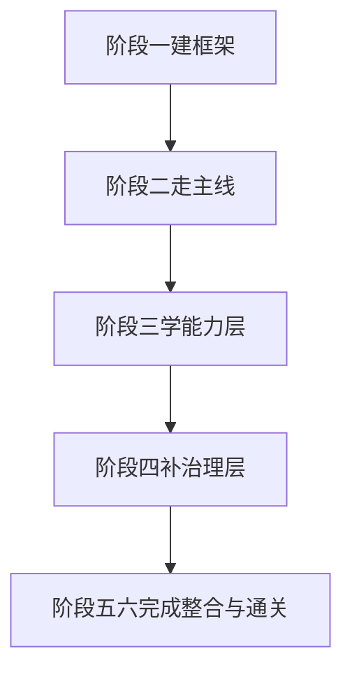
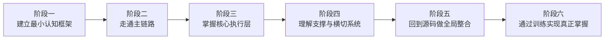

# 第 23 章 学生自学总路线与阶段目标

## 本章目标
- 给学生一个可以实际执行的六阶段自学路线。
- 说明每个阶段的目标、读法、输出物和危险信号。
- 帮助读者把“想学完整套系统”变成可分解、可推进的计划。

## 先修关系
- 建议先快速读第 1 章，知道为什么这套书不按目录顺序组织。
- 如果零背景焦虑较强，可以先把第 15 章和第 26 章当作预热，再回来执行路线图。
- 本章最好和第 14 章一起看，一个负责路线，一个负责沉淀。

## 关键词
- `六阶段模型`：把整本书拆成目标明确的学习阶段。
- `阶段目标`：每个阶段并不是“读几章”，而是“形成哪种能力”。
- `输出物`：每个阶段都要有图、表、解释或小实验作为成果。
- `危险信号`：如果出现某些症状，就说明学习顺序或节奏需要调整。
- `推进节奏`：大工程学习必须有节律，否则容易在中途失去方向感。

## 正文图解

## 关键数据结构
| 结构/对象 | 在本章中的位置 | 阅读时要抓什么 |
| --- | --- | --- |
| `六阶段路线图` | 全书最重要的时间结构之一。 | 它让学习过程具备阶段感和里程碑。 |
| `阶段目标卡` | 每个阶段要完成的能力与问题清单。 | 它能防止“读了很多却不知道该会什么”。 |
| `阶段输出物` | 每个阶段应该留下的图、表或实验。 | 它把阅读转成可验证进步。 |
| `危险信号表` | 常见卡点与修正方法。 | 它能帮助你在跑偏时及时拉回。 |

## 本章在全书中的角色

这一章是整本书的“学习导航中枢”。  
学生如果跳过这一章，后面虽然也能读，但很容易重新回到“大型工程随手翻目录”的低效率状态。

## 本章要解决什么问题

很多学生读大型工程会卡在同一个地方：不是不努力，而是不知道应该先学什么、后学什么，也不知道“读懂”和“掌握”之间到底差了哪一步。本章的任务，就是把整本书重新组织成一条适合自学者推进的路线，让你在面对 50 多万行代码时，仍然有稳定的前进节奏。

学完本章后，你应该做到：

1. 知道整本书为什么要按阶段学习，而不是按文件夹平铺阅读。
2. 知道每个阶段的目标、重点章节、产出物和通关标准。
3. 知道自己在每个阶段到底应该“看到什么、记住什么、画出什么、解释什么”。
4. 知道如何从“知道概念”走到“可以自己改代码”。

## 为什么必须分阶段学习

先回忆一下我们面对的系统规模：

- 源码目录：`src`
- 代码文件数：约 `1902` 个
- 代码总行数：约 `512,685` 行
- 顶层模块数量很多，既有 UI，又有命令系统、工具系统、任务系统、插件系统、MCP 扩展、状态存储、权限控制和会话持久化

如果你试图按文件一个个读下去，很容易出现三种问题：

1. 读了很多文件，但脑子里没有总图。
2. 看懂了局部函数，却说不清它为什么存在。
3. 记住了文件名，却不会从功能需求倒推到源码位置。

所以，大型工程的自学不能采用“小项目模式”。正确做法是先建立地图，再跑一条主链路，再展开模块，再用训练把知识固定下来。

## 六阶段自学模型

本书建议把自学过程拆成六个阶段。

下面我们逐个解释。

## 阶段一：建立最小认知框架

### 学习目标

这一阶段只有一个目标：让你不再把这套源码看成一堆杂乱文件，而是看成一个“终端里的 AI Agent 系统”。

### 必读章节

1. 第 15 章《零基础预备知识》
2. 第 1 章《课程导论》

### 你需要回答的问题

1. 什么叫 REPL？
2. 什么叫工具调用？
3. 什么叫任务系统？
4. 这个系统为什么不能只写成一个 `main.ts`？
5. 这里的 `src` 目录为什么会同时出现 `screens`、`tools`、`tasks`、`services`、`utils`？

### 本阶段产出

1. 手画一张系统草图。
2. 用自己的话写一段 300 到 500 字的系统简介。
3. 能向没有读过源码的人解释：这不是普通 CLI，而是一个可扩展 Agent 终端系统。

### 通关标准

如果别人问你“这个项目是做什么的”，你不能只回答“它是个 AI 工具”。你必须能说明：

- 它的交互界面在哪里。
- 它的模型调用主循环在哪里。
- 它的工具能力在哪里定义。
- 它为什么需要状态、权限和持久化。

## 阶段二：走通主链路

### 学习目标

这一阶段的目标是掌握“用户一句话进入系统之后，到底发生了什么”。这是整本书最重要的一阶段，因为系统所有模块最终都要挂到这条主链上。

### 必读章节

1. 第 16 章《从一次请求走完整个系统》
2. 第 2 章《系统架构全景》
3. 第 3 章《启动链路与初始化过程》
4. 第 5 章《输入处理与消息模型》
5. 第 6 章《QueryEngine 与查询主循环》
6. 第 19 章《模型 API 层与流式执行机制》

### 你需要回答的问题

1. `main.tsx` 为什么是程序入口？
2. `REPL.tsx` 在请求链中处于什么位置？
3. 用户输入什么时候被清洗、解析和变成消息对象？
4. `QueryEngine` 和 `query.ts` 分别承担什么职责？
5. 模型流式输出是怎样被接收、更新和显示的？

### 建议的阅读方法

第一遍只看函数之间的调用顺序。

第二遍开始追数据形态：

- 输入最初长什么样？
- 中间消息对象长什么样？
- 工具调用事件长什么样？
- 最终 UI 显示消费的又是什么样？

第三遍再问一个更高级的问题：为什么这里要把逻辑拆成这些层，而不是全部塞进 `REPL.tsx`？

### 本阶段产出

1. 画出“从用户输入到模型输出”的时序图。
2. 写出主链路上的 10 个关键文件。
3. 能不用看书，口述一次请求的完整执行路径。

## 阶段三：掌握核心执行层

### 学习目标

当你已经会追请求主链路之后，下一步就要理解系统真正的“能力中枢”。这个中枢不是 UI，而是工具系统、任务系统和扩展系统。

### 必读章节

1. 第 7 章《工具系统设计》
2. 第 8 章《BashTool 深入解析》
3. 第 9 章《AgentTool、任务系统与多代理》
4. 第 10 章《MCP 与插件扩展架构》
5. 第 17 章《命令系统深度解读》

### 你需要回答的问题

1. 什么是 `Tool` 抽象？
2. 工具是如何被注册、枚举、授权和执行的？
3. `BashTool` 为什么不是一个简单的 `spawn` 包装？
4. `AgentTool` 和普通工具有什么本质差异？
5. MCP 是怎样把“外部能力”接进来的？
6. 命令系统和工具系统的边界在哪里？

### 本阶段最容易犯的错误

1. 只看工具类本身，不看工具编排层。
2. 只记住 `BashTool` 的行为，不理解权限模型和执行上下文。
3. 把命令和工具混为一谈。
4. 只从“功能列表”角度理解模块，而不是从“协议与协作”角度理解模块。

### 本阶段产出

1. 画出“工具从声明到执行”的完整流程图。
2. 比较 `BashTool`、`AgentTool`、MCP 工具三者的相同点与不同点。
3. 能解释为什么任务系统是这套工程的核心扩展点之一。

## 阶段四：理解支撑与横切系统

### 学习目标

这一阶段的目标是理解“为什么系统不只是业务主链路”，还必须有一批横切能力把它撑住。

### 必读章节

1. 第 4 章《REPL、Ink 与状态管理》
2. 第 11 章《记忆、权限、压缩与持久化》
3. 第 18 章《状态系统、消息系统与会话状态同步》

### 你需要回答的问题

1. UI 状态和会话状态分别由谁管理？
2. 为什么需要自动压缩上下文？
3. 会话如何恢复？
4. 为什么权限系统必须独立存在？
5. 为什么“记忆”不是简单的历史记录？

### 本阶段产出

1. 画出状态更新闭环。
2. 写一份“系统横切能力清单”，说明每项能力解决的风险。
3. 解释如果去掉持久化、权限、压缩，系统分别会出什么问题。

## 阶段五：回到源码做全局整合

### 学习目标

当你对主链路和核心模块已经有感觉后，就要回到“整体工程结构”做一次整合。这个阶段不是新增知识，而是把前面学到的知识织成一张网。

### 必读章节

1. 第 20 章《模块百科全书：顶层目录逐一解读》
2. 第 21 章《关键模块交互案例集》
3. 第 12 章《代码阅读指南》
4. 第 13 章《关键代码精讲》

### 你需要回答的问题

1. 如果让你按顶层目录给这个工程重新讲一遍，你会怎么讲？
2. 如果学生只读一个目录，会错过什么？
3. 哪些模块的职责边界最容易混淆？
4. 哪些文件虽然不大，但在调用链中位置极关键？

### 本阶段产出

1. 自己写一份“缩略版架构总图”。
2. 为每个顶层目录写一句职责描述。
3. 为 15 个关键文件写一句“为什么必须读它”。

## 阶段六：通过训练实现真正掌握

### 学习目标

这一阶段的核心，不再是“理解别人的代码”，而是检验你能不能在理解的基础上做推理、做设计、做修改。

### 必读章节

1. 第 24 章《模块通关清单与自学检查表》
2. 第 25 章《综合实验、作业与毕业考核》

### 本阶段产出

1. 至少完成 3 个跟踪型实验。
2. 至少完成 2 个改造型实验。
3. 完成一份系统讲解 PPT 或书面报告。
4. 能把整个系统讲给别人听，并回答追问。

## 两种推荐节奏

### 四周强化版

适合已经会 TypeScript、React 或 Node 的学生。

1. 第 1 周：读第 15、1、16、2、3 章。
2. 第 2 周：读第 5、6、19、7 章。
3. 第 3 周：读第 8、9、10、4、11、18 章。
4. 第 4 周：读第 20、21、12、13、24、25 章，并完成实验。

### 八周标准版

适合第一次系统阅读大型工程的学生。

1. 第 1 周：第 15 章。
2. 第 2 周：第 1、2 章。
3. 第 3 周：第 3、16 章。
4. 第 4 周：第 5、6、19 章。
5. 第 5 周：第 7、8 章。
6. 第 6 周：第 9、10 章。
7. 第 7 周：第 4、11、18、20、21 章。
8. 第 8 周：第 12、13、24、25 章。

## 自学笔记建议模板

读每一章时，你都可以固定写下面五项：

1. 这一章试图解决什么问题？
2. 这一章最关键的三个文件是什么？
3. 这一章最关键的数据结构是什么？
4. 这一章和前后章节分别怎么连接？
5. 如果让我改这个模块，我最担心哪个点？

这五个问题会逼你从“被动阅读”切换到“主动建模”。

## 每个阶段结束时的自测问题

### 阶段一结束后

你能不能在不看源码的情况下，用白话说明这套系统的产品形态？

### 阶段二结束后

你能不能从 `main.tsx` 讲到 `QueryEngine`，再讲到工具执行与结果回写？

### 阶段三结束后

你能不能比较命令系统、工具系统、任务系统、MCP 系统各自的边界？

### 阶段四结束后

你能不能解释为什么状态、权限、压缩、记忆和持久化都必须存在？

### 阶段五结束后

你能不能在一页纸上画出全系统的目录与交互关系？

### 阶段六结束后

你能不能独立设计一个新工具或新任务，并说清楚它应该插入哪条链路？

## 章末小结
- 本章围绕“六阶段路线、阶段目标和学习节奏控制”重建了一层稳定理解，不让你只记零散函数名或目录名。
- 真正需要沉淀下来的，不只是 `六阶段模型`、`阶段目标`、`输出物` 这几个词，而是它们在 `六阶段路线图`、`阶段目标卡`、`阶段输出物` 里的相互位置。
- 如果你后续在 第 14 章和第 24 章 中再次迷路，优先回看本章的“先修关系、正文图解、关键数据结构”三部分。

## 章末自测
1. 不看原文，用自己的话重述本章围绕“六阶段路线、阶段目标和学习节奏控制”到底解决了什么问题。
2. 结合“正文图解”，把 `阶段二走主线` 到 `阶段四补治理层` 之间的连接关系重新讲一遍。
3. 对比 `六阶段路线图` 与 `阶段目标卡`：它们分别回答什么问题，边界为什么不能混掉？
4. 在 `六阶段模型`、`阶段目标`、`输出物` 中任选两个，说明它们在本章中是如何互相作用的。
5. 如果后续要继续读 第 14 章和第 24 章，本章哪一部分最值得先回看？为什么？
