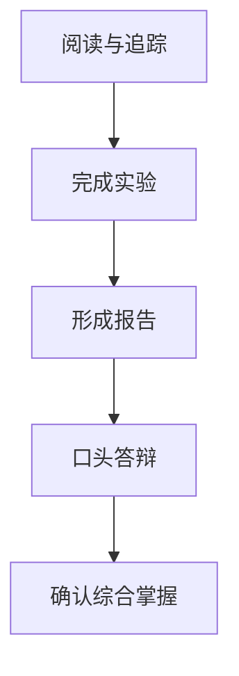

# 第 25 章 综合实验、作业与毕业考核

## 本章目标
- 用综合实验、作业和毕业考核把阅读能力转成实战能力。
- 训练追踪、比较、批判和改造系统的多种能力。
- 让读者在动手输出中真正暴露并修复理解盲区。

## 先修关系
- 建议至少已经完成第 22 章复盘和第 24 章通关检查。
- 如果你还无法稳定回答主链路与核心边界问题，先不要急着做综合题。
- 本章最适合与第 12 和第 14 章一起使用，一个负责方法，一个负责沉淀。

## 关键词
- `跟踪实验`：顺着真实主线把状态、消息和工具调用追清楚。
- `比较题`：通过对比两个模块的边界来暴露理解深浅。
- `设计批判`：不是只复述作者怎么写，还要分析为什么这么写。
- `capstone`：把多章能力整合到一个较大任务中。
- `答辩`：最后不仅要交作业，还要能讲清思路与证据。

## 正文图解

## 关键数据结构
| 结构/对象 | 在本章中的位置 | 阅读时要抓什么 |
| --- | --- | --- |
| `Experiment Spec` | 每道实验的目标、关注文件和输出要求。 | 它保证训练不是随意浏览代码。 |
| `Deliverable Bundle` | 图、表、报告、命令记录等交付物组合。 | 它能全面反映理解深度。 |
| `Scoring Rubric` | 评价实验和毕业考核的维度。 | 它帮助你判断自己缺的是结构、证据还是表达。 |
| `Defense Question Set` | 用于口头复盘和答辩的关键问题。 | 它能迫使理解从纸面走向口头表达。 |

## 本章在第六阶段中的位置

这一章是整本书的收束章。  
前面的章节负责建立理解，而这一章负责把理解压实成实验、作业、讲解和设计能力。

## 为什么需要这一章

读源码最容易产生一种错觉：看懂了几段关键代码，就以为自己已经掌握了系统。实际上，真正的掌握至少要经历三步：

1. 能复述。
2. 能追踪。
3. 能改造。

本章就是把这三步落实成具体训练。你可以把它当作训练手册，也可以把它当作毕业考核。

## 训练设计原则

本章所有练习都遵循三个原则：

1. 先做跟踪型练习，再做解释型练习，最后做改造型练习。
2. 先练主链路，再练模块，再练跨模块协作。
3. 先要求证据，再要求结论。

换句话说，你不能只说“我觉得它是这样”，而要能指出关键文件、关键函数和关键状态变化作为依据。

## 第一组：跟踪型实验

### 实验 1：追踪一次普通用户请求

#### 目标

从输入一句普通自然语言开始，一路追踪到模型回复回到界面。

#### 建议关注文件

- `main.tsx`
- `screens/REPL.tsx`
- `utils/processUserInput/processUserInput.ts`
- `QueryEngine.ts`
- `query.ts`
- `services/api/claude.ts`

#### 你需要交付的结果

1. 一张时序图。
2. 一份不少于 800 字的链路说明。
3. 一个“关键跳转点列表”，列出每次调用层级切换的位置。

#### 合格标准

你的说明里必须同时出现：

- 输入进入点
- 消息构造点
- 查询执行点
- API 调用点
- 结果显示点

### 实验 2：追踪一次工具调用

#### 目标

观察模型决定调用工具之后，系统如何完成工具编排、执行和结果回写。

#### 建议关注文件

- `query.ts`
- `Tool.ts`
- `tools.ts`
- `services/tools/toolOrchestration.ts`
- `services/tools/toolExecution.ts`

#### 你需要交付的结果

1. 一张“工具调用闭环图”。
2. 一份 5 到 10 个步骤的流程说明。
3. 一个“模型消息与工具结果如何互相作用”的解释。

### 实验 3：追踪一次 BashTool 执行

#### 目标

解释为什么 BashTool 必须和任务、权限、输出管理一起看。

#### 建议关注文件

- `tools/BashTool/BashTool.tsx`
- `tasks/LocalShellTask/LocalShellTask.tsx`
- `utils/permissions/`

#### 你需要交付的结果

1. 一张执行流程图。
2. 一段关于风险控制的说明。
3. 一段关于输出如何反馈到系统的说明。

## 第二组：解释型作业

### 作业 1：解释系统为什么不是“模型 API 包装器”

要求写一篇 1200 到 2000 字的短文，至少从下面五个角度展开：

1. 交互层
2. 查询循环
3. 工具协议
4. 任务模型
5. 横切系统

### 作业 2：比较命令系统、工具系统和任务系统

要求输出一张对比表，并回答下面三个问题：

1. 它们分别面向谁？
2. 它们分别在什么时机被触发？
3. 它们分别如何影响整个系统的运行方式？

### 作业 3：解释“状态同步”为什么是终端 Agent 的核心难点

要求至少讨论以下内容：

1. UI 状态
2. 会话状态
3. 消息历史
4. 工具执行状态
5. 持久化与恢复

## 第三组：设计型作业

### 作业 4：设计一个新工具接入方案

#### 任务要求

假设你要为该系统增加一个“项目文档检索工具”，请说明：

1. 它应该被建模成什么类型的工具。
2. 它需要哪些输入参数。
3. 它如何返回结果。
4. 它是否需要权限控制。
5. 它应当接入哪些现有模块。

#### 评分重点

不是看你写不写代码，而是看你是否真正理解工具协议和系统边界。

### 作业 5：设计一个新任务类型

#### 任务要求

假设你要引入一个“长时间后台分析任务”，请说明：

1. 为什么普通同步工具不够用。
2. 这个任务的生命周期应该是什么。
3. 任务状态如何反馈给界面层。
4. 任务结果如何回到主会话。

## 第四组：改造型实验

### 实验 4：给自己做一个“最小子系统”

目标不是直接修改原工程，而是模仿其架构思想，自己写一个最小版系统，包括：

1. 一个输入入口。
2. 一个查询循环。
3. 一个工具注册表。
4. 一个假工具。
5. 一个最简单的状态存储。

这个实验的意义是：当你能用自己的代码复刻一个简化版结构时，你才真正理解了原系统为什么要这样设计。

### 实验 5：为现有书稿补一份新的架构图

要求：

1. 只用一页图讲完整个系统。
2. 图上必须同时出现主链路和扩展点。
3. 图中每个方框都要写明职责，而不是只写目录名。

## 毕业考核建议

如果把这套教材作为一个完整课程，建议毕业考核采用“笔试 + 口试 + 实验报告”三部分。

### 笔试部分

重点考查概念边界和整体理解。

示例题：

1. 解释 `QueryEngine` 在系统中的位置。
2. 解释为什么 `Tool` 抽象是系统关键协议。
3. 解释 `AgentTool` 与普通工具的差异。
4. 解释会话持久化与历史记录的关系。
5. 解释 MCP 为什么会改变系统的扩展边界。

### 口试部分

重点考查是否真的能讲明白。

示例题：

1. 从 `main.tsx` 开始，把整个系统讲给我听。
2. 如果模型回复里包含工具调用，系统会怎么走？
3. 如果 BashTool 执行失败，失败信息会怎样回到系统？
4. 如果要增加一种新的外部能力，应该优先考虑内置工具、插件还是 MCP？

### 实验报告部分

重点考查是否具备“动手理解”和“结构化表达”能力。

建议读者至少提交以下两类成果之一：

1. 一份完整的链路跟踪报告。
2. 一份完整的模块设计报告。

## 评分建议

可以按下面的比例评分：

| 项目 | 比例 | 说明 |
| --- | --- | --- |
| 主链路理解 | 25% | 是否能完整讲清一次请求 |
| 模块理解 | 25% | 是否能解释核心模块职责和边界 |
| 交互与数据结构理解 | 20% | 是否能指出关键消息、状态与任务对象 |
| 设计与扩展能力 | 20% | 是否能提出合理的新增工具或任务设计 |
| 表达与证据质量 | 10% | 是否能用源码位置支持自己的结论 |

## 真正的毕业标准

如果读者完成了本书并达成下面六项，就可以认为已经比较全面地掌握了该系统：

1. 能画出整体架构图。
2. 能讲清一次请求的完整链路。
3. 能说清工具、任务、命令、插件、MCP 的区别与关系。
4. 能解释状态、权限、记忆、压缩、持久化等横切能力的必要性。
5. 能定位关键源码文件并进行二次阅读。
6. 能提出至少一个合理的扩展设计方案。

## 章末小结
- 本章围绕“综合实验、批判性作业和毕业答辩能力”重建了一层稳定理解，不让你只记零散函数名或目录名。
- 真正需要沉淀下来的，不只是 `跟踪实验`、`比较题`、`设计批判` 这几个词，而是它们在 `Experiment Spec`、`Deliverable Bundle`、`Scoring Rubric` 里的相互位置。
- 如果你后续在 回到第 14 章和第 22 章做循环强化 中再次迷路，优先回看本章的“先修关系、正文图解、关键数据结构”三部分。

## 章末自测
1. 不看原文，用自己的话重述本章围绕“综合实验、批判性作业和毕业答辩能力”到底解决了什么问题。
2. 结合“正文图解”，把 `完成实验` 到 `口头答辩` 之间的连接关系重新讲一遍。
3. 对比 `Experiment Spec` 与 `Deliverable Bundle`：它们分别回答什么问题，边界为什么不能混掉？
4. 在 `跟踪实验`、`比较题`、`设计批判` 中任选两个，说明它们在本章中是如何互相作用的。
5. 如果后续要继续读 回到第 14 章和第 22 章做循环强化，本章哪一部分最值得先回看？为什么？
