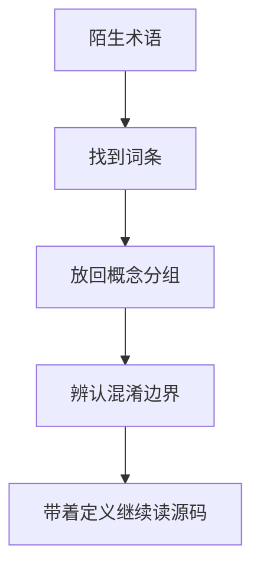

# 第 2 章 零背景术语表：把源码里反复出现的词讲明白

## 本章目标
- 把整本书最常出现的术语做成可随时查阅的词典。
- 降低大型工程阅读中的术语摩擦和误解概率。
- 让零背景读者能够在遇到陌生词时快速得到足够准确的工作定义。

## 先修关系
- 无严格前置要求；本章适合作为全书任意阶段的随查工具。
- 如果第 1 章已经读过，将更容易把这里的术语精确定义和生活化理解对应起来。
- 读词条时不必追求一次性背熟，重点是知道它和哪些词容易混淆。

## 关键词
- `词条`：每个术语都需要有足够稳定的最小定义。
- `概念分组`：词不是孤立出现，而是按运行单位、能力单位、状态单位等成组出现。
- `混淆对`：最容易误用的一组相近词，需要特别澄清边界。
- `工作定义`：先给能支持阅读的定义，再逐步深化，而不是一上来给学术定义。
- `交叉引用`：一个词的意义往往要靠另一个词帮助定位。

## 正文图解

## 关键数据结构
| 结构/对象 | 在本章中的位置 | 阅读时要抓什么 |
| --- | --- | --- |
| `Glossary Entry` | 单个词条的名称、定义、位置与关联词。 | 它是本章最基础的数据单元。 |
| `Concept Group` | 把术语按运行阶段或系统角色分组。 | 分组比零散记忆更稳。 |
| `Confusion Pair` | 容易混淆的一对词。 | 它能显著降低后续阅读中的理解误差。 |
| `Cross-reference Path` | 词与词之间的跳转关系。 | 它让术语系统形成网络，而不是字典列表。 |

## 本章在整本书中的位置

这一章放在第一阶段，不是为了“凑词典”，而是为了帮没有背景的读者拆掉第一个阅读障碍：  
很多代码并不难在逻辑，而是难在名词。一旦把名词理解成模糊的大概意思，后续理解就会层层偏移。

例如：

- 把 `session` 误解成一次 API 请求。
- 把 `query` 误解成数据库查询。
- 把 `Tool` 误解成某个普通函数。
- 把 `Task` 误解成异步函数。
- 把 `MCP` 误解成“又一个插件系统”。

所以，本章的目标不是背单词，而是建立“概念边界”。

## 为什么大型工程一定要先做术语清理

小项目里，一个变量名理解得不准，通常只会影响一小块逻辑。  
大型工程里，一个核心名词理解得不准，会连带影响整条主链路。

这套系统里最容易被误读的名词恰好都很关键：

- `REPL`
- `session`
- `query`
- `message`
- `tool`
- `task`
- `agent`
- `plugin`
- `MCP`
- `permission`
- `compact`
- `transcript`

下面我们按“先容易混淆、再逐步深入”的顺序来解释。

## 第一组：先把系统的运行单位讲清楚

### 1. 进程

最容易理解的单位就是“进程”。  
当程序启动时，操作系统会创建一个运行中的进程。这个进程里会加载 `main.tsx`、初始化环境、构建状态、进入 REPL。

读者要记住：

- 进程是操作系统层面的运行实体。
- 一个进程里可以承载一个完整的会话。
- 某些后台任务、子代理、远程会话会跟这个进程产生协作关系。

### 2. 会话 `session`

会话不是“一次输入”，而是“一段持续的对话与工作过程”。  
从源码看，这个概念在很多地方都出现：

- `bootstrap/state.ts` 会保存会话级状态。
- `QueryEngine` 的注释里明确说明，一个 `QueryEngine` 对应一个 conversation。
- `utils/sessionStorage.ts` 负责把会话转录、会话标题、会话项目目录等内容落盘。

可把会话理解成：

> 从终端助手被打开，到这一段工作结束并可被恢复，整个过程就是一个 session。

### 3. 轮次 `turn`

轮次是“会话中的一次交互循环”。  
一个会话里会有很多轮。每一轮通常从一次用户输入开始，到模型输出和工具执行稳定结束为止。

在代码里，`query()` 更接近“单轮查询主循环”，而 `QueryEngine` 更接近“跨轮次的会话执行器”。

### 4. 请求 `request`

“请求”这个词在本系统里有两个上下文：

1. 用户向系统发出的请求。
2. 系统向模型 API 发出的请求。

读者一定要区分：

- 用户请求是产品层概念。
- API 请求是基础设施层概念。

一个用户请求，在复杂情况下可能会触发多次 API 请求，因为工具执行后还要继续送回模型。

## 第二组：把交互与消息讲清楚

### 5. REPL

`REPL` 是 Read-Eval-Print Loop 的缩写。  
直白说，它是一种“读取输入 -> 处理输入 -> 输出结果 -> 等下一轮输入”的交互形态。

在这个系统里，REPL 不只是一个输入框，而是整个交互壳层。主界面文件是：

- `src/screens/REPL.tsx`

应当把它理解成：

> 用户与整套 Agent 平台发生交互的主容器。

### 6. 输入 `input`

输入不只是文本。  
从 `processUserInput.ts` 可以看出，输入可能是：

- 普通文本
- slash 命令
- 图片或附件
- 粘贴内容扩展
- IDE 选择上下文
- 系统生成的 meta 输入

所以，读者要先放弃一种错误想象：  
这个系统不是“接收一个字符串，然后发给模型”。

### 7. 消息 `message`

消息是整个系统的统一语言。  
无论是用户输入、助手输出、附件、系统提示、工具结果还是压缩边界，最后都会被组织成消息。

在多处源码里都能看到这个设计：

- `types/message.js`
- `utils/messages.js`
- `query.ts`
- `QueryEngine.ts`

对读者来说，最重要的理解是：

> 消息不是屏幕上显示的那一段文字，而是系统内部流动的数据对象。

### 8. 内容块 `content block`

模型消息内部并不总是单一文本，它可以由多个内容块组成，比如：

- 文本块
- `tool_use` 块
- `tool_result` 块
- 图片块
- thinking 块

为什么读者一定要知道这个概念？  
因为工具调用不是“在文字里提到一个工具名”，而是模型明确输出了结构化的 `tool_use` 块。

## 第三组：把执行核心讲清楚

### 9. QueryEngine

`QueryEngine` 不是“查询数据库的引擎”，也不是“搜索资料的模块”。  
它在本系统中的真实身份更接近：

> 会话级执行器。

它负责：

- 维护跨轮次消息
- 跟踪 usage
- 持有 abort controller
- 跟踪权限拒绝
- 组织 `processUserInput`
- 调用 `query()`

### 10. query

`query()` 是单轮查询主循环。  
它是整套执行系统里最接近“运行时状态机”的一段代码。

读者不要把它看成“普通的业务函数”，而应把它看成：

- 一轮对话求值器
- 模型与工具之间的调度循环
- 上下文预算、流式输出、工具回写的交汇点

### 11. streaming

流式执行指的是结果不是一次性返回，而是边生成边到达。  
这里既包括：

- 模型 token 流式输出
- 工具执行期间的进度流式反馈

读者需要理解：

> 流式不是一个“性能优化小技巧”，而是交互式 Agent 保持实时反馈的基本机制。

## 第四组：把能力层讲清楚

### 12. Tool

Tool 是整个系统最重要的概念之一。  
它不是一个“工具类”的泛称，而是一套严格协议。

从 `Tool.ts` 可以看到，一个 Tool 通常包含：

- `name`
- `description`
- `inputSchema`
- `call()`
- `checkPermissions()`
- `validateInput()`
- `isReadOnly()`
- `isConcurrencySafe()`
- `interruptBehavior()`
- `maxResultSizeChars`

也就是说，Tool 不是普通函数，而是：

> 被模型以统一方式调用的一等能力对象。

### 13. ToolUseContext

`ToolUseContext` 是工具执行时最核心的上下文对象之一。  
它里面装着很多对工具来说必须知道的信息：

- 当前工具集合
- 当前命令集合
- 当前模型
- 当前 MCP 客户端
- 当前 AppState 读写接口
- 当前中止控制器
- 文件状态缓存
- 消息列表
- 权限上下文

可以把它理解成：

> 工具被调用时所处的整个运行现场。

### 14. Tool result

工具结果不是随便返回一段字符串。  
工具返回值通常会被包装、截断、格式化、持久化，最后再以 `tool_result` 形式进入消息流。

这意味着：

- 工具输出要服务于后续模型继续推理。
- 不是所有输出都直接原样塞回上下文。

### 15. Permission

权限系统不是可有可无的安全附件，而是工具系统不可分割的一部分。  
因为很多工具具备真实世界副作用，比如：

- 读写文件
- 执行 shell
- 创建 worktree
- 启动远程代理
- 调用外部 MCP 服务

所以，在本系统里，能力越强，权限问题越关键。

## 第五组：把后台与扩展讲清楚

### 16. Task

Task 不是普通 Promise。  
它更像一个“可跟踪、可展示、可恢复、可前后台切换的工作单元”。

为什么要引入 Task？  
因为像 Bash、子代理、远程任务这些能力都可能运行很久，不能只靠一次同步函数调用来管理。

### 17. Agent

在这套系统里，Agent 不是泛泛的“AI”。  
更具体地说，它通常指可以被派出去执行某项工作的子代理或工作代理。

`AgentTool` 会把“再开一个代理帮我做事”也抽象成一种工具调用。  
这是这套系统很有代表性的设计：连“调用另一个代理”都被协议化了。

### 18. MCP

MCP 是 Model Context Protocol。  
从 `services/mcp/client.ts` 可以看出，它是一个把外部工具、资源、提示词等能力接进系统的标准化接口层。

读者可以先把它理解成：

> 一种连接外部能力服务器的标准协议。

但要注意，它和普通插件不是一回事：

- 插件更像本地扩展包。
- MCP 更像标准化远程能力总线。

### 19. Plugin

插件是系统本地扩展机制的一部分。  
从 `utils/plugins/pluginLoader.ts` 等文件可以看出，插件可以贡献：

- 命令
- 技能
- MCP 配置
- 其它扩展能力

插件强调“把新能力装进系统”，而 MCP 更强调“把外部服务挂进系统”。

## 第六组：把长期运行与记忆讲清楚

### 20. Transcript

Transcript 可以理解为会话转录。  
`utils/sessionStorage.ts` 里会把重要消息写到 JSONL 文件里，用于：

- 恢复会话
- 浏览历史
- 子代理转录
- 分析与调试

这里最值得读者记住的一点是：

> 不是所有消息都会被持久化，尤其高频 progress 消息不会全部进入转录。

### 21. Persistence

持久化的意思就是把重要运行信息写到磁盘或其它稳定存储中，而不是只放在内存里。  
如果没有持久化，一旦进程退出，整个会话就像没发生过一样。

### 22. Compact

Compact 是上下文压缩。  
因为会话越长，消息越多，模型上下文就越容易过长、过贵、过慢。  
所以系统会引入自动压缩、微压缩、边界消息等机制来控制上下文规模。

### 23. Memory

Memory 在这里不是简单的“历史记录”，而是系统主动组织给模型参考的长期信息。  
例如：

- `memdir`
- 嵌套 memory 附件
- 会话级和项目级记忆提示

它的目标不是存档，而是帮助后续推理。

## 读者最容易混淆的 10 对概念

| 容易混淆的概念 | 正确区分方式 |
| --- | --- |
| 会话 vs 轮次 | 会话是长期容器，轮次是其中一次交互 |
| 用户请求 vs API 请求 | 前者是产品行为，后者是底层调用 |
| 文本显示 vs 消息对象 | 前者是 UI 结果，后者是内部数据 |
| Tool vs 普通函数 | Tool 是被协议化、可授权、可描述、可跟踪的能力对象 |
| Task vs Promise | Task 是长期运行、可观察、可管理的工作单元 |
| Plugin vs MCP | Plugin 偏本地扩展，MCP 偏协议化外部接入 |
| Transcript vs Memory | Transcript 偏转录记录，Memory 偏后续推理上下文 |
| 进度消息 vs 持久化消息 | 前者大多是 UI 态，后者才进入会话转录 |
| QueryEngine vs query() | 前者是会话执行器，后者是单轮主循环 |
| AppState vs bootstrap state | 前者偏应用状态树，后者偏进程/会话级全局快照 |

## 四个必须先认识的数据结构

### 1. QueryEngineConfig

它说明一个 QueryEngine 要想工作，需要拿到哪些外部条件，例如：

- cwd
- tools
- commands
- mcpClients
- getAppState / setAppState
- readFileCache
- customSystemPrompt
- thinkingConfig
- budget 参数

它相当于“会话执行器的初始化材料包”。

### 2. QueryParams

它说明一次 `query()` 需要哪些参数，例如：

- messages
- systemPrompt
- userContext
- systemContext
- canUseTool
- toolUseContext
- fallbackModel
- taskBudget

它相当于“单轮主循环的入场参数包”。

### 3. ToolUseContext

它说明具体工具在执行时拿到的是怎样一个运行现场。

### 4. AppState

它说明 UI、任务、MCP、插件、通知、权限模式、模型设置等大量状态在应用层是如何集中组织的。

## 给零基础读者的记忆方法

如一口气记不住这么多词，不要焦虑。  
建议先分三层记：

1. 第一层：`session`、`message`、`tool`、`task`、`MCP`
2. 第二层：`QueryEngine`、`query()`、`ToolUseContext`、`AppState`
3. 第三层：`compact`、`transcript`、`permission`、`plugin`

只要第一层立住，后面的大图就能慢慢接起来。

## 重建蓝图：把术语表落实为类型表与事件表

### 必须保留的抽象

1. 术语表中的每一个高频名词，最好都能在目标语言里对应到一个具体类型、接口、枚举或模块。否则术语只会停留在口头理解层面。
2. “消息、工具、任务、代理、会话、状态、transcript、provider event、MCP server” 这些术语尤其需要绑定到确定的数据结构。
3. 术语之间的关系也要被明确。例如代理是一种能产生任务与子会话的能力，任务是一种有生命周期的执行实体，二者不可互换。
4. 某些术语属于运行时事件，而非静态对象，如 `tool_use`、`tool_result`、stream chunk、state change。这类词应进入事件表，而不是对象表。

### 最小实现顺序

1. 先把全书术语分成对象、事件、策略、宿主适配四类。
2. 第二步为每个术语写下“定义、所属模块、典型字段、与其他术语的关系”。
3. 第三步在目标语言中把这些术语落为实际类型，并在代码中尽量保持术语与类型名的一致。
4. 第四步用术语表反查源码，确认没有关键概念仍处于模糊状态。

### 最容易写错的边界

1. 最常见的问题是多个不同层次的概念共用同一个词，例如把 session、state、task 都叫做“上下文”，最后导致设计混乱。
2. 第二类问题是术语只解释表面含义，而没有指出它在系统里归谁负责、如何流动、何时生成、何时销毁。
3. 第三类问题是把事件词误当成持久对象，或把持久对象误当成瞬时事件，这会直接影响状态模型设计。
4. 第四类问题是翻译术语时过度自由，导致跨文档、跨代码文件的命名关系被切断，不利于重建。

## 章末小结
- 本章围绕“术语精确定义、混淆边界和随查能力”重建了一层稳定理解，避免只记零散函数名或目录名。
- 真正需要沉淀下来的，不只是 `词条`、`概念分组`、`混淆对` 这几个词，而是它们在 `Glossary Entry`、`Concept Group`、`Confusion Pair` 里的相互位置。
- 如后续在 第 1 章和任一主线章节 中再次迷路，优先回看本章的“先修关系、正文图解、关键数据结构”三部分。

## 章末自测
1. 不看原文，用自己的话重述本章围绕“术语精确定义、混淆边界和随查能力”到底解决了什么问题。
2. 结合“正文图解”，把 `找到词条` 到 `辨认混淆边界` 之间的连接关系重新讲一遍。
3. 对比 `Glossary Entry` 与 `Concept Group`：它们分别回答什么问题，边界为什么不能混掉？
4. 在 `词条`、`概念分组`、`混淆对` 中任选两个，说明它们在本章中是如何互相作用的。
5. 如果后续要继续读 第 1 章和任一主线章节，本章哪一部分最值得先回看？为什么？
