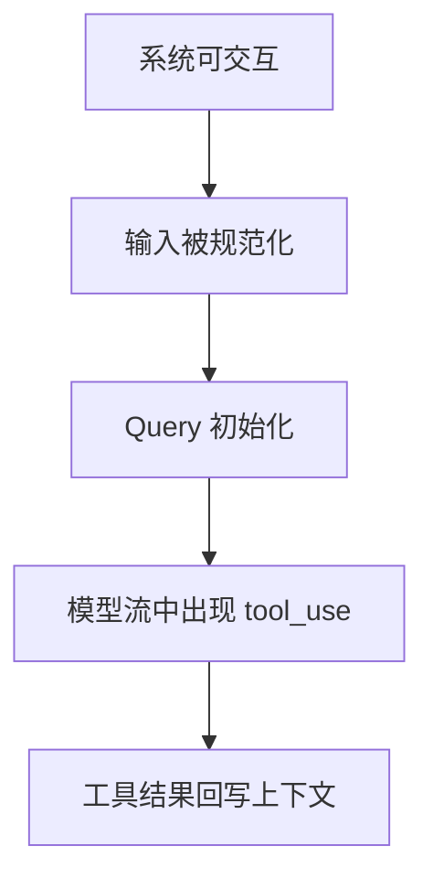
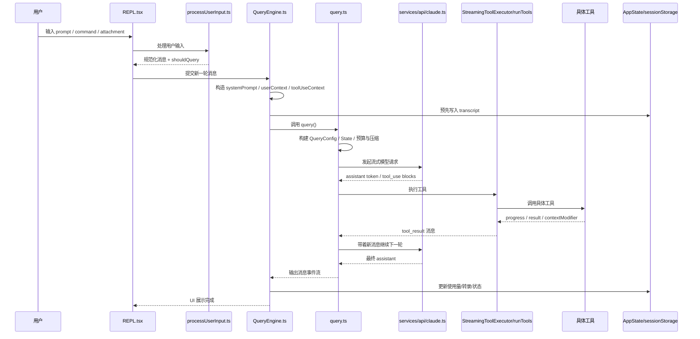

# 第 27 章 把一次请求拆成 14 个阶段：从输入到 `tool_result` 的时序剖面

## 本章目标
- 把一次请求从进入系统到得到 `tool_result` 的全过程拆成稳定阶段。
- 训练对时序、阶段边界和阶段输出的敏感度。
- 让你在后续调试或讲解时，能够准确指出“问题出在哪一阶段”。

## 先修关系
- 建议先读第 16 章和第 6 章，这样你已经对整体主链路有感觉。
- 如果第 19 章和第 28 章读过，你会更容易看懂时间线中 API 流和工具流的切换。
- 本章最好和第 30 章搭配读，因为很多阶段边界同时也是持久化或恢复边界。

## 关键词
- `阶段`：把一条长链拆成几个能被单独命名和检查的时间片。
- `前置准备`：用户看到输入框前系统其实已经做了大量工作。
- `Query 初始化`：从会话视角切换到单轮视角的关键阶段。
- `tool_use 识别`：模型回复流进入工具执行支路的转折点。
- `tool_result 回写`：工具结果重新成为后续推理上下文的一部分。

## 正文图解


## 关键数据结构
| 结构/对象 | 在本章中的位置 | 阅读时要抓什么 |
| --- | --- | --- |
| `14 阶段总表` | 整章的核心时序索引。 | 它能帮助你迅速判断某个现象落在哪一步。 |
| `Stage Input/Output` | 每一阶段都有自己的输入、产物和下一跳。 | 这能把时间线从故事变成结构。 |
| `tool_use Event` | 模型流里切换到工具执行的关键结构。 | 没有它，主循环不会进入工具支路。 |
| `Compact / Transcript Boundary` | 某些阶段同时也是语义持久化的边界。 | 它能帮助你理解恢复与时序的关系。 |

## 本章在学习路线中的位置

这一章属于第二阶段，也就是“走通主链路”的强化版。  
如果第 16 章像一次全景式导览，那么这一章就是把那条链路拆得更细，细到学生可以真正拿着源码逐步对照。

本章的目标不是给你更多概念，而是让你真正回答：

> 用户输入一句话以后，系统到底先做什么、后做什么、在哪里切层、什么时候进入工具、什么时候又回到模型？

## 为什么必须把“一次请求”拆成阶段

很多学生会把一次请求想象成下面这种伪代码：

```ts
const input = getUserInput()
const answer = await callModel(input)
render(answer)
```

但真正的系统远比这复杂。  
在这套工程里，一次请求可能牵涉：

- 输入预处理
- slash 命令分流
- 附件注入
- 会话级上下文构造
- 系统提示词装配
- 上下文预算与压缩
- 模型流式输出
- 工具并发执行
- 工具结果回写
- 下一轮继续调用模型
- 结果转录与状态同步

把它拆成阶段，是为了把复杂控制流变成可以逐步理解的过程。

## 先看全局时序图



## 14 个阶段总表

| 阶段 | 问题 | 关键文件 |
| --- | --- | --- |
| 1 | 程序是否已经进入可交互状态 | `main.tsx`、`setup.ts`、`REPL.tsx` |
| 2 | 用户输入首先落到哪里 | `REPL.tsx` |
| 3 | 输入如何被预处理 | `processUserInput.ts` |
| 4 | slash 命令和普通 prompt 如何分流 | `commands.ts`、`processUserInput.ts` |
| 5 | 用户输入如何变成消息对象 | `utils/messages.ts`、`processUserInput.ts` |
| 6 | 会话执行器如何建立上下文 | `QueryEngine.ts` |
| 7 | 系统提示词、用户上下文、系统上下文如何装配 | `utils/queryContext.ts`、`QueryEngine.ts` |
| 8 | 为什么要在 API 前先写转录 | `QueryEngine.ts`、`sessionStorage.ts` |
| 9 | 单轮主循环如何初始化 | `query.ts`、`query/config.ts` |
| 10 | 预算、压缩、记忆、附件如何进入本轮 | `query.ts`、`services/compact/*` |
| 11 | 模型流式请求如何发起和接收 | `services/api/claude.ts`、`query.ts` |
| 12 | 工具调用如何被识别 | `query.ts`、消息 content block |
| 13 | 工具如何执行并回写 | `StreamingToolExecutor.ts`、`toolOrchestration.ts`、`toolExecution.ts` |
| 14 | 结果如何回到 UI 和持久化层 | `QueryEngine.ts`、`REPL.tsx`、`sessionStorage.ts` |

下面我们一阶段一阶段地讲。

## 阶段 1：程序先进入“可交互状态”

### 学生要回答的问题

在用户还没输入任何内容之前，系统已经做了哪些准备？

### 关键证据

从 `main.tsx` 开头就能看到很多启动前置动作：

- 启动 profiler
- 预读 MDM 信息
- 预取 keychain
- 初始化配置、遥测、远程设置、MCP、插件、技能
- 最终进入 REPL 启动流程

这说明用户看到输入框时，系统其实已经不是“空白状态”。

### 阅读提示

对零背景学生，一定要强调：

> 看到 REPL 时，系统早就完成了一轮复杂启动，而不是刚刚开始工作。

## 阶段 2：输入首先落到 REPL 层

### 发生了什么

REPL 负责把来自用户的交互动作收进来，再交给输入处理层。  
它既是 UI，也是产品交互控制器。

### 为什么这一步重要

很多学生会误以为输入直接送进 `QueryEngine`。  
其实中间至少还隔着：

- 输入模式判断
- 命令与普通 prompt 的分流
- 附件与粘贴内容处理
- permission / tool context 准备

## 阶段 3：`processUserInput()` 对输入做第一次“正规化”

### 这个函数解决什么问题

从 `processUserInput.ts` 可以看到，这个函数接收的不是单纯字符串，而是一个很丰富的输入上下文：

- `input`
- `mode`
- `setToolJSX`
- `context`
- `pastedContents`
- `ideSelection`
- `messages`
- `querySource`
- `canUseTool`
- `skipSlashCommands`
- `bridgeOrigin`
- `isMeta`

这说明它的职责并不是“把字符串 trim 一下”，而是：

> 把各种用户输入情境统一整理成后续可处理的消息与控制信号。

### 它的典型输出

`ProcessUserInputBaseResult` 里最关键的字段有：

- `messages`
- `shouldQuery`
- `allowedTools`
- `model`
- `effort`
- `resultText`
- `nextInput`

学生要特别记住：

- `messages` 表示这次输入被翻译成了哪些消息。
- `shouldQuery` 表示这次操作到底要不要进入模型主循环。

## 阶段 4：slash 命令与普通 prompt 分流

### 为什么这里必须分流

并不是所有以用户输入形式出现的内容都该走模型。  
例如配置类操作、状态切换类命令、工具管理类命令，很多更适合直接在本地执行。

### 对学生最关键的认识

系统里存在两类“用户意图入口”：

1. 命令型入口
2. 对话型入口

这两者共享交互界面，但不共享执行路径。

## 阶段 5：输入被翻译成消息对象

### 为什么消息化这么重要

从这一刻开始，系统不再主要关心“用户打了什么字符”，而是开始关心：

- 这是 user message 吗
- 是否有 attachment
- 是否是 meta message
- 是否需要后续进入模型

### 学生应当观察什么

你应该观察：

- message 的 `type`
- message 的 `content`
- 是否带有工具相关字段
- 是否是系统消息或附件消息

## 阶段 6：`QueryEngine.submitMessage()` 接手

### 这个阶段最重要的变化

一旦进入 `QueryEngine.submitMessage()`，系统就从“输入处理”切换到了“会话执行”。

从源码看，`submitMessage()` 在这一步会做很多关键准备：

- 清理 turn-scoped 的技能发现集合
- 设置 cwd
- 包装 `canUseTool`，顺带记录权限拒绝
- 读取初始 AppState
- 解析主模型与 thinking 配置

### 为什么说这一步是“会话层”

因为它开始使用和维护的是跨轮次状态，而不是单次输入的临时变量。

## 阶段 7：装配系统提示词与上下文

### 核心文件

- `utils/queryContext.ts`
- `QueryEngine.ts`

### 这里发生了什么

`fetchSystemPromptParts()` 会把下面三种信息取出来：

1. 默认系统提示词
2. 用户上下文 `userContext`
3. 系统上下文 `systemContext`

之后 `QueryEngine` 还会再把以下内容叠加进去：

- custom system prompt
- append system prompt
- memory mechanics prompt
- coordinator user context

### 学生最需要建立的认识

模型不是“直接拿消息就开始答题”。  
在真正发请求之前，系统要先给它构造一个非常完整的运行语境。

## 阶段 8：在进入 API 前先写 transcript

### 这是一个特别值得讲的设计

`QueryEngine.ts` 里有一段很关键的注释说明：  
用户消息在进入 query 主循环之前就会先写入 transcript。

### 为什么要这么做

因为如果用户刚发出消息，进程就在 API 返回前被杀掉，那么如果不提前持久化，这段对话就会在恢复时消失。

### 工程意义

这一步非常适合拿来给学生说明“工程系统和 demo 程序的区别”：

- demo 程序关心能不能跑通
- 工程系统关心异常中断后还能不能恢复

## 阶段 9：`query()` 初始化单轮主循环

### 进入这一阶段意味着什么

从这里开始，系统切到单轮求值器视角。  
`query()` 会构造：

- `QueryConfig`
- `State`
- token budget tracker
- consumed command 列表

### 为什么 `QueryConfig` 和 `State` 要分开

`QueryConfig` 负责保存本轮固定不变的配置快照。  
`State` 负责保存会在循环中不断变化的运行状态。

这对学生来说是非常重要的设计意识：

> 复杂循环代码如果不把“静态配置”和“动态状态”拆开，很快就会失控。

## 阶段 10：预算、压缩、记忆、附件进入本轮

### 这一阶段解决什么问题

模型上下文不是无限的。  
所以在真正发请求前，系统还要做一批“上下文治理”工作：

- token 预算估算
- auto compact
- tool result budget
- memory 附件处理
- context collapse
- reactive compact 等特性判断

### 学生要建立的认识

一次请求送给模型的内容，不等于当前会话里肉眼看到的所有消息。  
中间会经过筛选、压缩、附加、裁剪和组织。

## 阶段 11：流式模型请求发起

### 关键文件

- `services/api/claude.ts`
- `query.ts`

### 这一阶段的典型现象

模型不是一次性给出完整答案，而是边生成边流出 token、事件和结构化块。

这一步会牵涉：

- request start event
- stream event
- assistant message 逐步构建
- tool_use block 识别

### 学生最容易忽略的一点

工具调用不是另起一套系统，而是嵌在模型回复流里的结构化事件。

## 阶段 12：识别 `tool_use`

### 这一阶段发生了什么

当 assistant message 的 content 里出现 `tool_use` 块时，系统就知道：

- 模型现在不是要继续单纯输出文本
- 它是在请求调用某个工具

于是主循环要暂停“继续生成文本”这条路径，切到“执行工具 -> 回写结果 -> 再继续”。

### 这一步的理解意义

这是学生第一次真正看到：

> 模型并不是一个只能吐文本的黑盒，它会在协议层面向系统发出结构化动作请求。

## 阶段 13：工具执行、进度反馈与结果回写

### 这里有两种典型路径

1. 批量工具走 `runTools()`
2. 流式到达的工具走 `StreamingToolExecutor`

### 这一阶段包含哪些子步骤

1. 根据工具名找到 Tool 定义。
2. 验证输入 schema。
3. 判断并发安全性。
4. 执行权限检查。
5. 运行 pre/post hooks。
6. 调用具体工具的 `call()`。
7. 生成 progress message。
8. 处理 tool result。
9. 把 `tool_result` 包装成新的 user message。
10. 必要时修改 ToolUseContext。

### 为什么这一阶段最容易让学生觉得“突然复杂”

因为这里同时交织了四件事：

- 业务能力执行
- 安全与权限
- 并发与取消
- 消息系统回写

## 阶段 14：结果回到主循环、UI 和持久化层

### 工具结果去了哪里

工具结果不会停留在工具层。  
它会被转成消息，再重新进入 query 主循环，让模型继续基于工具结果思考。

同时，系统还会：

- 更新 UI
- 更新会话消息
- 更新 usage
- 记录 transcript
- 维护状态树

### 真正的闭环

到这里，一次“用户输入 -> 模型决定调工具 -> 工具执行 -> 结果回写 -> 模型继续”才算真正闭环。

## 用一张表再收束一遍

| 阶段 | 你看到的表象 | 系统真正做的事 |
| --- | --- | --- |
| 1 | 程序启动 | 准备运行环境与全局能力 |
| 2 | 用户开始输入 | REPL 收集交互 |
| 3 | 提交输入 | 输入被正规化 |
| 4 | 有些输入不走模型 | 命令与 prompt 分流 |
| 5 | 输入出现在消息列表 | 构造成内部消息对象 |
| 6 | 进入执行器 | 会话级状态准备 |
| 7 | 还没调模型 | 先装配 system prompt 与上下文 |
| 8 | 还没见到回复 | 先写 transcript 保证可恢复 |
| 9 | query 开始 | 初始化单轮状态机 |
| 10 | 看不到的准备工作 | 预算、压缩、记忆、附件治理 |
| 11 | 回复开始滚动出现 | 流式模型事件开始到达 |
| 12 | 模型突然要用工具 | 识别 `tool_use` 块 |
| 13 | 工具开始跑 | 权限、并发、执行、回写 |
| 14 | 最终结果出现 | 消息、状态、UI、持久化一起收束 |

## 学生如何验证自己是否真正理解了这 14 个阶段

请尝试在不看书的情况下回答下面五题：

1. 为什么用户消息会在 API 前先写入 transcript？
2. 为什么 `QueryEngine` 和 `query()` 要分成两层？
3. `tool_use` 是在哪里被识别为结构化动作的？
4. 工具结果为什么要再被包装成消息？
5. 为什么“一次用户请求”不一定只对应“一次 API 调用”？

如果这五题都能答清，你对主链路已经不只是“有印象”，而是真的能追代码了。

## 章末小结
- 本章围绕“阶段化时间线、阶段边界与问题定位”重建了一层稳定理解，不让你只记零散函数名或目录名。
- 真正需要沉淀下来的，不只是 `阶段`、`前置准备`、`Query 初始化` 这几个词，而是它们在 `14 阶段总表`、`Stage Input/Output`、`tool_use Event` 里的相互位置。
- 如果你后续在 第 19 章、第 28 章和第 30 章 中再次迷路，优先回看本章的“先修关系、正文图解、关键数据结构”三部分。

## 章末自测
1. 不看原文，用自己的话重述本章围绕“阶段化时间线、阶段边界与问题定位”到底解决了什么问题。
2. 结合“正文图解”，把 `输入被规范化` 到 `模型流中出现 tool_use` 之间的连接关系重新讲一遍。
3. 对比 `14 阶段总表` 与 `Stage Input/Output`：它们分别回答什么问题，边界为什么不能混掉？
4. 在 `阶段`、`前置准备`、`Query 初始化` 中任选两个，说明它们在本章中是如何互相作用的。
5. 如果后续要继续读 第 19 章、第 28 章和第 30 章，本章哪一部分最值得先回看？为什么？
