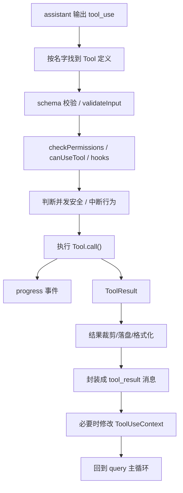

# 第 28 章 工具执行闭环：权限、并发、流式结果与上下文回写

## 本章为什么重要

学生在理解主链路之后，通常会遇到第二个大坎：  
他们知道模型会调用工具，但不清楚工具到底是怎样被“安全地、可控地、可回写地”执行的。

如果只把工具理解成“调用一个函数然后拿结果”，你会完全低估这套系统的复杂度。  
本章要讲清楚的，就是工具调用背后的完整闭环。

## 一个结论先讲在前面

在这套系统里，工具执行不是一个点动作，而是一个闭环流程：

1. 模型输出 `tool_use`
2. 系统找到对应 Tool 定义
3. 验证输入
4. 判断权限
5. 运行 hooks
6. 执行具体能力
7. 产生 progress
8. 处理结果大小与格式
9. 包装成 `tool_result`
10. 回写消息流与上下文

只有这 10 步全部成立，工具调用才算完成。

## 为什么 Tool 不是普通函数

从 `Tool.ts` 能看到，一个 Tool 至少要回答下面这些问题：

| 能力维度 | 对应字段 |
| --- | --- |
| 我叫什么 | `name`、`aliases` |
| 我怎么描述自己 | `description()`、`searchHint` |
| 我吃什么参数 | `inputSchema`、`inputJSONSchema` |
| 我怎么跑 | `call()` |
| 我能不能并发 | `isConcurrencySafe()` |
| 我是不是只读 | `isReadOnly()` |
| 我有没有破坏性 | `isDestructive()` |
| 用户中断时怎么办 | `interruptBehavior()` |
| 输出太大怎么办 | `maxResultSizeChars` |
| 需不需要先校验 | `validateInput()` |
| 权限怎么判 | `checkPermissions()` |
| 我怎么在 UI 里呈现 | `renderToolUseMessage()` 等渲染函数 |

这已经远远超出了“函数”这个词的含义。  
它更像一个具备协议、生命周期和治理规则的能力单元。

## ToolUseContext：工具执行时的“运行现场”

如果 Tool 是能力对象，那么 `ToolUseContext` 就是能力运行时的现场环境。

从 `Tool.ts` 中可以看到，它包含的内容极其丰富：

- `options.commands`
- `options.tools`
- `options.mainLoopModel`
- `options.mcpClients`
- `getAppState() / setAppState()`
- `abortController`
- `readFileState`
- `messages`
- `requestPrompt`
- `contentReplacementState`
- `loadedNestedMemoryPaths`
- `queryTracking`
- `fileReadingLimits`
- `globLimits`

这意味着一个工具在执行时，并不是“孤零零拿到输入参数”。  
它能感知自己位于哪个会话、哪组工具池、哪个消息历史、哪种权限模式和哪个中止控制器之下。

## 第一层闭环：系统如何找到正确的工具

### 工具注册

`tools.ts` 是内建工具的总注册表之一。  
`getAllBaseTools()` 会把大量工具集中列出来，例如：

- `AgentTool`
- `BashTool`
- `FileReadTool`
- `FileEditTool`
- `WebFetchTool`
- `TodoWriteTool`
- `AskUserQuestionTool`
- `ListMcpResourcesTool`
- `ReadMcpResourceTool`

### 工具查找

当 query 主循环读到 `tool_use` 时，会通过 `findToolByName()` 去当前工具池里寻找匹配定义。

学生要理解：

- 工具名不是随手写死在主循环里。
- 主循环依赖的是统一协议和注册表。

## 第二层闭环：输入验证

### 为什么必须先验证

模型输出的工具参数理论上可能不合法。  
所以系统在调用工具前，必须先用 `inputSchema` 做结构校验。

### 验证失败意味着什么

验证失败并不是“代码炸掉”，而应该被转换为模型能够理解的错误结果或系统级拒绝信息。  
这也是为什么工具协议里需要 `validateInput()`。

## 第三层闭环：并发安全判断

### 核心文件

- `services/tools/toolOrchestration.ts`

### 系统做了什么

`partitionToolCalls()` 会根据工具的 `isConcurrencySafe(input)` 把工具调用分成两类：

1. 可并发批次
2. 必须串行的批次

### 为什么不是所有工具都并发

因为有些工具只读，彼此并行影响不大；  
但有些工具会写文件、改状态、开任务，如果并发跑，很容易互相干扰。

### 学生最该抓住的设计思想

> 并发不是系统默认赠送的能力，而是需要每个工具显式声明自己能不能安全并发。

## 第四层闭环：权限决策

### 为什么工具层必须内置权限

想象下面这些操作：

- 执行 shell
- 写文件
- 发网络请求
- 启动远程 agent

如果没有权限治理，模型一旦做错判断，后果可能是现实世界的副作用，而不只是生成一段错误文本。

### 相关机制

从 `toolExecution.ts` 可以看出，工具执行前会牵涉：

- `canUseTool`
- `checkPermissions()`
- hook 决策
- permission reason 到 OTel source 的映射

### 学生应该怎么理解

权限不是“弹窗确认一下”这么简单，而是：

- 规则系统
- 模式系统
- hook 系统
- UI 交互系统
- 审计与遥测系统

共同组成的治理层。

## 第五层闭环：工具真正执行

### 关键路径

执行真正落地时，最终会到：

- `runToolUse()`
- 具体 Tool 的 `call()`

`call()` 才是工具实现者真正写业务逻辑的地方。

### 为什么工具实现层反而不是最难的部分

因为真正困难的不是“把 shell 跑起来”或“把文件读出来”，而是要把它们纳入：

- 权限规则
- 并发约束
- 中断机制
- 结果格式
- UI 展示
- 消息回写

的统一框架里。

## 第六层闭环：Progress 机制

### 为什么需要 progress

很多工具不是瞬间完成的，尤其：

- Bash
- Agent
- MCP 远程调用

如果系统只在结束时给结果，中间几十秒甚至几分钟都没有反馈，用户会觉得卡死了。

### Progress 的作用

Progress 让工具在执行期间也能向 UI 发信号，例如：

- 当前阶段
- 当前命令
- 当前输出片段
- 当前状态变化

这就是为什么 Tool 协议里会有 `ToolCallProgress` 和对应的 progress message。

## 第七层闭环：流式工具执行

### 为什么需要 `StreamingToolExecutor`

有些场景下，工具调用不是在模型输出完所有内容之后才统一出现，而是随着流式输出逐步被发现。  
这时系统就需要一个能边接收边排队边执行的工具执行器。

### `StreamingToolExecutor` 的核心职责

从源码能看出它会维护：

- 工具队列
- 工具状态 `queued/executing/completed/yielded`
- 并发安全标记
- 待输出 progress
- context modifiers
- 兄弟工具中止控制器

### 这意味着什么

工具执行在这里已经不只是“函数调用器”，而像一个小型调度器。

## 第八层闭环：中断与取消

### 为什么中断是难点

用户可能在工具还没跑完时就提交了新输入。  
这时系统不能只有一种处理方式。

### `interruptBehavior`

工具可以声明两种典型中断行为：

- `'cancel'`
- `'block'`

这说明不同工具在交互层的策略是不同的。  
例如某些工具适合立刻取消，另一些则必须跑完。

## 第九层闭环：结果大小治理

### 为什么工具结果不能无脑塞回模型

如果工具一次读出成千上万行内容，直接塞回上下文会带来：

- token 暴涨
- 成本上升
- 速度下降
- 后续推理被噪声淹没

### 相关机制

`Tool` 协议里有 `maxResultSizeChars`。  
`toolExecution.ts` 与 `toolResultStorage` 相关逻辑会在结果过大时做持久化和预览化处理。

### 学生必须建立的意识

> 大型 Agent 系统的“结果处理”不只是格式化文本，而是上下文预算治理的一部分。

## 第十层闭环：回写消息流

### 为什么工具结果要变回消息

因为模型的后续推理并不直接读取某个 JavaScript 返回值，而是读取消息历史。  
因此工具结果必须转换成标准化的 `tool_result` 消息，再送回主循环。

### 这一步的意义

它把“工具世界”和“模型世界”接了起来：

- 工具世界产生真实结果
- 消息世界承载结构化表达
- 模型世界继续基于消息推理

## 上下文修改器 `contextModifier`

### 这是什么

有些工具不仅返回消息，还会修改后续工具上下文。  
例如工具执行后，某些状态、缓存或上下文需要变化。

### 为什么重要

它说明工具调用的副作用不止体现在文本结果上，还可能改变后续运行环境。

## 把整个闭环压缩成一张图

## 学生最容易误解的五件事

1. 以为 Tool 就是一个普通函数。
2. 以为权限只是 UI 弹窗。
3. 以为工具可以默认并发执行。
4. 以为工具结果直接原样给模型。
5. 以为工具层和消息层是分离的。

只要这五点没理顺，后面读 BashTool、AgentTool、MCP 时就会持续模糊。

## 本章小结

工具系统的真正难点，不在“实现多少工具”，而在“如何把各种能力纳入统一协议并安全地运行”。  
当你真正看懂这个闭环之后，再去读 BashTool、AgentTool 和 MCP，就不会把它们当成三个孤立功能，而会把它们看成同一协议下的三种不同实现。
