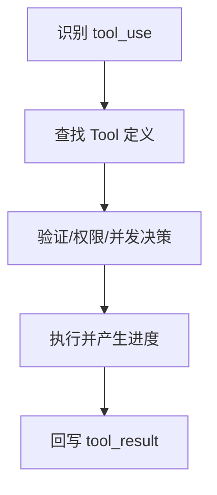
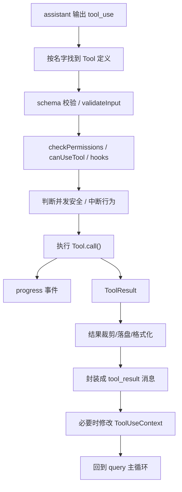

# 第 14 章 工具执行闭环：权限、并发、流式结果与上下文回写

## 本章目标
- 把工具执行从“调用工具”还原为完整闭环。
- 理解输入验证、权限判断、并发安全、流式执行与结果回写如何衔接。
- 看清工具执行层为什么是系统稳定性的高风险区域。

## 先修关系
- 建议先读第 13 章和第 15 章，先知道 Tool 协议长什么样以及 BashTool 为什么复杂。
- 如果第 9 章和第 11 章已经读过，将更容易把工具执行放回 query 与流式返回之间。
- 本章与第 18 章互为专题深化：这里讲闭环，那里讲重量级能力横向比较。

## 关键词
- `ToolUseContext`：工具执行时拿到的完整运行现场。
- `validateInput`：模型给出的参数必须先经过结构合法性检查。
- `checkPermissions`：即使工具名匹配，权限不满足也不能执行。
- `partitionToolCalls`：按并发安全性把一批工具调用切成可并发与不可并发部分。
- `StreamingToolExecutor`：处理流式到达工具调用及其执行状态的执行器。

## 正文图解

## 关键数据结构
| 结构/对象 | 在本章中的位置 | 阅读时要抓什么 |
| --- | --- | --- |
| `ToolUseContext` | 工具执行层最重要的运行时结构。 | 它把会话、消息、状态和控制器交给工具。 |
| `Partition Result` | 工具调用按并发安全划分后的批次结果。 | 它决定多工具调用如何调度。 |
| `Executor State` | StreamingToolExecutor 内部维护的执行中、已完成、已中止等状态。 | 它是流式工具执行可追踪的关键。 |
| `Tool Result Message` | 执行结果重新回到消息流中的承载结构。 | 它把外部行动重新翻译成模型可继续推理的上下文。 |

## 本章为什么重要

读者在理解主链路之后，通常会遇到第二个大坎：
他们知道模型会调用工具，但不清楚工具到底是怎样被“安全地、可控地、可回写地”执行的。

如果只把工具理解成“调用一个函数然后拿结果”，将完全低估这套系统的复杂度。
本章要讲清楚的，就是工具调用背后的完整闭环。

## 一个结论先讲在前面

在这套系统里，工具执行不是一个点动作，而是一个闭环流程：

1. 模型输出 `tool_use`
2. 系统找到对应 Tool 定义
3. 验证输入
4. 判断权限
5. 运行 hooks
6. 执行具体能力
7. 产生 progress
8. 处理结果大小与格式
9. 包装成 `tool_result`
10. 回写消息流与上下文

只有这 10 步全部成立，工具调用才算完成。

## 为什么 Tool 不是普通函数

从 `Tool.ts` 能看到，一个 Tool 至少要回答下面这些问题：

| 能力维度 | 对应字段 |
| --- | --- |
| 我叫什么 | `name`、`aliases` |
| 我怎么描述自己 | `description()`、`searchHint` |
| 我吃什么参数 | `inputSchema`、`inputJSONSchema` |
| 我怎么跑 | `call()` |
| 我能不能并发 | `isConcurrencySafe()` |
| 我是不是只读 | `isReadOnly()` |
| 我有没有破坏性 | `isDestructive()` |
| 用户中断时怎么办 | `interruptBehavior()` |
| 输出太大怎么办 | `maxResultSizeChars` |
| 需不需要先校验 | `validateInput()` |
| 权限怎么判 | `checkPermissions()` |
| 我怎么在 UI 里呈现 | `renderToolUseMessage()` 等渲染函数 |

这已经远远超出了“函数”这个词的含义。
它更像一个具备协议、生命周期和治理规则的能力单元。

## ToolUseContext：工具执行时的“运行现场”

如果 Tool 是能力对象，那么 `ToolUseContext` 就是能力运行时的现场环境。

从 `Tool.ts` 中可以看到，它包含的内容极其丰富：

- `options.commands`
- `options.tools`
- `options.mainLoopModel`
- `options.mcpClients`
- `getAppState() / setAppState()`
- `abortController`
- `readFileState`
- `messages`
- `requestPrompt`
- `contentReplacementState`
- `loadedNestedMemoryPaths`
- `queryTracking`
- `fileReadingLimits`
- `globLimits`

这意味着一个工具在执行时，并不是“孤零零拿到输入参数”。
它能感知自己位于哪个会话、哪组工具池、哪个消息历史、哪种权限模式和哪个中止控制器之下。

## 第一层闭环：系统如何找到正确的工具

### 工具注册

`tools.ts` 是内建工具的总注册表之一。
`getAllBaseTools()` 会把大量工具集中列出来，例如：

- `AgentTool`
- `BashTool`
- `FileReadTool`
- `FileEditTool`
- `WebFetchTool`
- `TodoWriteTool`
- `AskUserQuestionTool`
- `ListMcpResourcesTool`
- `ReadMcpResourceTool`

### 工具查找

当 query 主循环读到 `tool_use` 时，会通过 `findToolByName()` 去当前工具池里寻找匹配定义。

读者要理解：

- 工具名不是随手写死在主循环里。
- 主循环依赖的是统一协议和注册表。

## 第二层闭环：输入验证

### 为什么必须先验证

模型输出的工具参数理论上可能不合法。
所以系统在调用工具前，必须先用 `inputSchema` 做结构校验。

### 验证失败意味着什么

验证失败并不是“代码炸掉”，而应该被转换为模型能够理解的错误结果或系统级拒绝信息。
这也是为什么工具协议里需要 `validateInput()`。

## 第三层闭环：并发安全判断

### 核心文件

- `services/tools/toolOrchestration.ts`

### 系统做了什么

`partitionToolCalls()` 会根据工具的 `isConcurrencySafe(input)` 把工具调用分成两类：

1. 可并发批次
2. 必须串行的批次

### 为什么不是所有工具都并发

因为有些工具只读，彼此并行影响不大；
但有些工具会写文件、改状态、开任务，如果并发跑，很容易互相干扰。

### 读者最该抓住的设计思想

> 并发不是系统默认赠送的能力，而是需要每个工具显式声明自己能不能安全并发。

## 第四层闭环：权限决策

### 为什么工具层必须内置权限

想象下面这些操作：

- 执行 shell
- 写文件
- 发网络请求
- 启动远程 agent

如果没有权限治理，模型一旦做错判断，后果可能是现实世界的副作用，而不只是生成一段错误文本。

### 相关机制

从 `toolExecution.ts` 可以看出，工具执行前会牵涉：

- `canUseTool`
- `checkPermissions()`
- hook 决策
- permission reason 到 OTel source 的映射

### 读者应该怎么理解

权限不是“弹窗确认一下”这么简单，而是：

- 规则系统
- 模式系统
- hook 系统
- UI 交互系统
- 审计与遥测系统

共同组成的治理层。

## 第五层闭环：工具真正执行

### 关键路径

执行真正落地时，最终会到：

- `runToolUse()`
- 具体 Tool 的 `call()`

`call()` 才是工具实现者真正写业务逻辑的地方。

### 为什么工具实现层反而不是最难的部分

因为真正困难的不是“把 shell 跑起来”或“把文件读出来”，而是要把它们纳入：

- 权限规则
- 并发约束
- 中断机制
- 结果格式
- UI 展示
- 消息回写

的统一框架里。

## 第六层闭环：Progress 机制

### 为什么需要 progress

很多工具不是瞬间完成的，尤其：

- Bash
- Agent
- MCP 远程调用

如果系统只在结束时给结果，中间几十秒甚至几分钟都没有反馈，用户会觉得卡死了。

### Progress 的作用

Progress 让工具在执行期间也能向 UI 发信号，例如：

- 当前阶段
- 当前命令
- 当前输出片段
- 当前状态变化

这就是为什么 Tool 协议里会有 `ToolCallProgress` 和对应的 progress message。

## 第七层闭环：流式工具执行

### 为什么需要 `StreamingToolExecutor`

有些场景下，工具调用不是在模型输出完所有内容之后才统一出现，而是随着流式输出逐步被发现。
这时系统就需要一个能边接收边排队边执行的工具执行器。

### `StreamingToolExecutor` 的核心职责

从源码能看出它会维护：

- 工具队列
- 工具状态 `queued/executing/completed/yielded`
- 并发安全标记
- 待输出 progress
- context modifiers
- 兄弟工具中止控制器

### 这意味着什么

工具执行在这里已经不只是“函数调用器”，而像一个小型调度器。

## 第八层闭环：中断与取消

### 为什么中断是难点

用户可能在工具还没跑完时就提交了新输入。
这时系统不能只有一种处理方式。

### `interruptBehavior`

工具可以声明两种典型中断行为：

- `'cancel'`
- `'block'`

这说明不同工具在交互层的策略是不同的。
例如某些工具适合立刻取消，另一些则必须跑完。

## 第九层闭环：结果大小治理

### 为什么工具结果不能无脑塞回模型

如果工具一次读出成千上万行内容，直接塞回上下文会带来：

- token 暴涨
- 成本上升
- 速度下降
- 后续推理被噪声淹没

### 相关机制

`Tool` 协议里有 `maxResultSizeChars`。
`toolExecution.ts` 与 `toolResultStorage` 相关逻辑会在结果过大时做持久化和预览化处理。

### 读者必须建立的意识

> 大型 Agent 系统的“结果处理”不只是格式化文本，而是上下文预算治理的一部分。

## 第十层闭环：回写消息流

### 为什么工具结果要变回消息

因为模型的后续推理并不直接读取某个 JavaScript 返回值，而是读取消息历史。
因此工具结果必须转换成标准化的 `tool_result` 消息，再送回主循环。

### 这一步的意义

它把“工具世界”和“模型世界”接了起来：

- 工具世界产生真实结果
- 消息世界承载结构化表达
- 模型世界继续基于消息推理

### 从源码看，一次 `tool_use` 真实要过哪些关

如果把 `services/tools/toolExecution.ts` 展开来看，一次工具调用通常会经过下面这张关卡表。
这张表比“先验证再执行”更接近真实代码结构。

| 关卡 | 发生位置 | 解决的问题 |
| --- | --- | --- |
| 1. 工具查找 | `runToolUse()` | 当前工具池里是否存在这个工具，是否需要兼容旧 alias。 |
| 2. 中断前置检查 | `runToolUse()` | 如果会话已经中断，是否直接生成停止型 `tool_result`。 |
| 3. schema 解析 | `checkPermissionsAndCallTool()` | 模型生成的参数结构是否满足 `inputSchema`。 |
| 4. 语义校验 | `validateInput()` | 参数即使结构合法，语义上是否仍不允许。 |
| 5. 预判分类器 | Bash 特殊路径 | 对高风险命令提前并行启动自动分类检查。 |
| 6. 输入观测克隆 | `backfillObservableInput()` | 给 hook、权限系统和日志补齐观察字段，但不污染真正调用输入。 |
| 7. 前置 hook | `runPreToolUseHooks()` | 是否需要修改输入、补上下文、提前阻断。 |
| 8. 权限决策 | `resolveHookPermissionDecision()` + `canUseTool` | 当前模式、规则、hook、分类器综合后是否允许执行。 |
| 9. 真正执行 | `tool.call()` | 进入具体工具实现。 |
| 10. 结果治理 | `processToolResultBlock()` 等 | 结果是否需要裁剪、落盘、保留结构化元数据。 |
| 11. 后置 hook | `runPostToolUseHooks()` | 执行后是否还要补消息、补上下文或记录额外信息。 |
| 12. 结果回写 | `createUserMessage({ tool_result })` | 将真实执行结果重新编码成消息，送回 query 主循环。 |

这张表说明，工具执行最核心的复杂度并不在 `tool.call()` 本身，而在调用前后的治理通道。

### `runToolUse()` 与 `runTools()` 的分工

教材里很有必要把这两个函数分开讲：

- `runToolUse()` 负责单次工具调用，从查找工具到产出结果消息。
- `runTools()` 负责一批 `tool_use` 的编排，从并发分批到上下文修改器应用顺序。

这意味着系统有两层执行逻辑：

1. 单工具执行逻辑：关心某一个工具调用如何合法、安全、可中断地完成。
2. 多工具编排逻辑：关心一批工具调用如何排序、并发、合并结果并保持上下文一致。

如果把这两层混在一起，就会立刻遇到两个问题：

- 单工具路径无法复用，任何工具调用都要重复处理 schema、权限和 hook。
- 多工具并发策略无法独立演化，稍微加一条规则就会污染所有具体工具实现。

### `partitionToolCalls()` 体现的是“保守并发”

`services/tools/toolOrchestration.ts` 中的 `partitionToolCalls()` 有一个特别值得强调的实现细节：
它不是简单按工具类型分组，而是逐个解析当前 `tool_use` 的输入，再调用工具自己的 `isConcurrencySafe(input)`。

这带来三层含义：

1. 并发安全不是静态标签，而是可能依赖具体输入。
2. 就算是同一个工具，不同输入也可能导致不同并发决策。
3. 一旦 `isConcurrencySafe()` 抛错，系统会保守地把它当成不安全，退回串行执行。

在可产生副作用的工具系统里，这种“出错时保守退化”的策略比“出错时继续并发”更合理。

### 并发批次为什么要延后应用 `contextModifier`

源码还有一个很容易被忽略的细节：
对于并发安全批次，`runTools()` 会先把每个工具的 `contextModifier` 收集起来，等整个并发批次跑完后再按原顺序统一应用。

这样做的原因是：

1. 并发执行时不希望多个工具同时改写共享上下文，造成竞态。
2. 即使允许并发执行，也要保持“上下文副作用的应用顺序”可预测。
3. 工具结果消息可以先流出来，真正改变后续上下文则延后到批次收尾。

这是一个很有教材价值的设计点，因为它展示了并发系统里很常见的一种分层手法：

> 允许结果并发产生，但把共享状态修改串行化。

### `backfillObservableInput()` 暴露出“观察输入”和“调用输入”的分离

`toolExecution.ts` 中有一段非常精细的处理：
在某些工具上，会对输入做一次浅克隆，然后调用 `backfillObservableInput()` 给克隆补充旧字段或衍生字段，让 hook、权限系统、SDK 流和 transcript 看到更完整的输入；与此同时，真正传给 `tool.call()` 的 `callInput` 却保持未污染状态。

这说明系统显式区分了两件事：

- 观察用途的输入：用于日志、权限、hook 和向外暴露的可读形态。
- 执行用途的输入：用于真正的副作用调用，必须避免无意改写。

这是工具框架设计中很容易被忽略的一条重要原则。
若两类输入不分开，日志修饰字段或路径规范化字段很容易反向污染真实执行结果，进而影响 transcript、一致性测试和缓存命中。

### 错误并不是抛出去就结束，而是要翻译成 `tool_result`

源码反复体现出一个原则：
大多数工具执行错误不会直接中断整个 query 主循环，而会被翻译成带 `is_error: true` 的 `tool_result` 用户消息。

典型场景包括：

- 工具不存在。
- `inputSchema` 解析失败。
- `validateInput()` 返回失败。
- 权限被拒绝。
- 工具调用过程中抛出异常。

这种设计的优势是：

1. 模型能够获得结构化失败信息，并决定是否改参数、换工具或解释失败原因。
2. 主循环不必把“工具失败”误判成“整个会话崩溃”。
3. transcript 中能保留失败事实，便于恢复和审计。

换言之，工具错误在这里不是普通异常，而是会话语义的一部分。

### 流式工具执行与普通批执行的关系

`query.ts` 中会根据当前配置与场景，选择使用 `StreamingToolExecutor` 或传统 `runTools()` 路径。
二者的关系不是“新替旧”，而是各自适配不同的工具出现时机：

- 普通批执行适用于模型已经完整输出了当前批 `tool_use` 的情况。
- 流式工具执行适用于工具调用在流式响应过程中逐步出现、需要边发现边执行的情况。

但无论采用哪条路径，系统最终都必须满足同一组语义约束：

- 每个 `tool_use` 最终都要有对应结果或取消结果。
- 工具结果仍然要回写为标准消息。
- 共享上下文修改仍然要经过可预测的应用顺序。
- 中断、fallback 和 sibling error 不能留下孤儿 `tool_result`。

这说明 `StreamingToolExecutor` 不是另起一套协议，而是在同一协议之下提供另一种执行时机。

### 中断语义比 `abort()` 更复杂

教材中还应特别强调一点：
在工具系统里，中断不是单一操作，而是多层语义的组合：

1. 会话级 `abortController.signal` 触发。
2. 某个工具自己的 `interruptBehavior()` 决定是 `cancel` 还是 `block`。
3. query 主循环判断这是普通中断还是 submit-interrupt。
4. 必要时产生中断型用户消息或停止型 `tool_result`。
5. 某些长时工具或子系统还需要做额外清理。

因此，中断系统本质上是“交互控制 + 工具语义 + 清理逻辑”的联合协议，而不是一行 `controller.abort()`。

## 上下文修改器 `contextModifier`

### 这是什么

有些工具不仅返回消息，还会修改后续工具上下文。
例如工具执行后，某些状态、缓存或上下文需要变化。

### 为什么重要

它说明工具调用的副作用不止体现在文本结果上，还可能改变后续运行环境。

## 把整个闭环压缩成一张图

## 读者最容易误解的五件事

1. 以为 Tool 就是一个普通函数。
2. 以为权限只是 UI 弹窗。
3. 以为工具可以默认并发执行。
4. 以为工具结果直接原样给模型。
5. 以为工具层和消息层是分离的。

只要这五点没理顺，后面读 BashTool、AgentTool、MCP 时就会持续模糊。

## 28.11 语言无关重建视角

`services/tools/toolOrchestration.ts`、`toolExecution.ts` 与 `StreamingToolExecutor.ts` 共同给出了一条完整的工具执行规格。跨语言重写时，这条规格至少包含十个步骤：

1. 根据 `tool_use.name` 查找工具定义。
2. 用输入 schema 验证参数。
3. 运行权限决策与 hook。
4. 判断并发安全性。
5. 按批次并发或串行调度。
6. 执行 `Tool.call()`。
7. 持续产出 progress。
8. 对结果做裁剪、落盘或格式化。
9. 把结果重新封装成 `tool_result` 消息。
10. 必要时修改 `ToolUseContext`，再回到查询主循环。

### 为什么必须有编排层

如果缺失编排层而只保留工具实现层，会出现四类问题：

- 无法统一校验与权限。
- 无法处理并发安全差异。
- 无法把 progress 与最终结果统一纳入消息系统。
- 无法在 streaming fallback、中断或 sibling error 时正确取消其它工具。

### 最小实现顺序

1. 先实现工具查找与 schema 校验。
2. 实现统一权限检查。
3. 实现串行执行路径。
4. 实现并发分区与并发执行路径。
5. 实现 progress 消息与标准化结果消息。
6. 最后实现 streaming executor、fallback discard 与 contextModifier。

### 必须保留的高级语义

- 工具结果并不直接进入模型，而是要经过消息层重新编码。
- 并发安全判断应建立在工具语义上，而不是一律并发。
- 中断不是简单 `abort()`，还必须结合工具的 `interruptBehavior`。
- streaming executor 必须在顺序保持与并发性能之间做平衡。

## 重建蓝图：把工具闭环压缩成最小可实现执行器

### 必须保留的抽象

1. 工具执行器至少要维护十个关卡：工具查找、输入验证、上下文构造、并发判定、权限决策、实际执行、进度上报、取消控制、结果治理、消息回写。
2. `ToolUseContext` 一类运行现场对象必须保留，它负责把 cwd、会话信息、权限模式、状态存取、任务句柄和回调接口打包给工具。
3. 流式工具执行与普通工具执行必须共享同一外层协议，只是在执行过程中多出增量回调与可能的长期任务登记。
4. 上下文修改器、结果截断器与 transcript 回写器都应被视为执行器的一部分，而不是工具自行处理的细节。

### 最小实现顺序

1. 先写一个不含权限与流式的最小执行器，验证从工具名查找到返回统一结果信封的闭环。
2. 第二步加入 schema 校验与上下文构造，使工具执行从一开始就处于受控环境。
3. 第三步加入权限判定和并发安全检查，把平台策略前置到真正执行之前。
4. 第四步加入 progress、取消和后台任务衔接，使执行器能够服务于长时间运行能力。
5. 第五步加入结果大小治理、消息回写与 transcript 追加，使工具闭环真正并入主请求闭环。

### 最容易写错的边界

1. 最常见的错误是让工具处理器自己去做参数校验、权限询问和结果截断。这样平台能力会碎成大量重复逻辑。
2. 第二类错误是没有统一执行上下文，导致每种工具都各自去拿 session、cwd、store、任务句柄，既难测试也难迁移。
3. 第三类错误是将流式工具视为完全不同的能力类型。正确做法是保留统一外层协议，在内部为其增加事件发射与中断控制。
4. 第四类错误是把结果回写放到工具内部完成。真正稳定的边界应当是：工具只负责产生结果，执行器负责把结果纳入消息流与持久化系统。

## 章末小结
- 本章围绕“工具执行闭环、并发安全与结果回写”重建了一层稳定理解，避免只记零散函数名或目录名。
- 真正需要沉淀下来的，不只是 `ToolUseContext`、`validateInput`、`checkPermissions` 这几个词，而是它们在 `ToolUseContext`、`Partition Result`、`Executor State` 里的相互位置。
- 如后续在 第 18 章和第 24 章 中再次迷路，优先回看本章的“先修关系、正文图解、关键数据结构”三部分。

## 章末自测
1. 不看原文，用自己的话重述本章围绕“工具执行闭环、并发安全与结果回写”到底解决了什么问题。
2. 结合“正文图解”，把 `查找 Tool 定义` 到 `执行并产生进度` 之间的连接关系重新讲一遍。
3. 对比 `ToolUseContext` 与 `Partition Result`：它们分别回答什么问题，边界为什么不能混掉？
4. 在 `ToolUseContext`、`validateInput`、`checkPermissions` 中任选两个，说明它们在本章中是如何互相作用的。
5. 如果后续要继续读 第 18 章和第 24 章，本章哪一部分最值得先回看？为什么？
