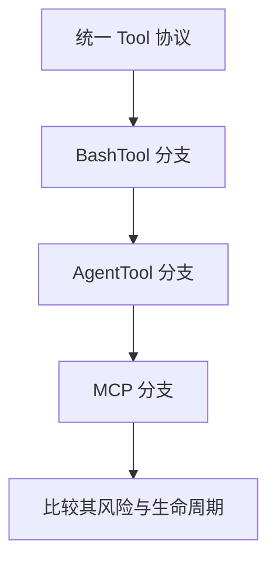

# 第 29 章 三大重量级能力专题：BashTool、AgentTool 与 MCP

## 本章目标
- 通过横向比较 BashTool、AgentTool 和 MCP，理解三类重量级能力的共同点与差异。
- 看清不同能力在风险、生命周期、上下文依赖和扩展方式上的不同。
- 形成“如何评价一个重量级系统能力”的观察框架。

## 先修关系
- 宜先读第 8、9、10、28 章，否则本章的比较会缺少具体参照。
- 如果第 7 章已经很熟，将更容易看出三者在同一 Tool 协议之下的异构性。
- 本章适合作为第三阶段的收束，用于把单点模块认识提升到横向能力视角。

## 关键词
- `重量级能力`：单个模块内部就同时包含协议、安全、状态、UI、任务等多个层次的问题。
- `能力面`：模型可见的不是底层实现，而是对外暴露的可调用表面。
- `风险画像`：不同能力的危险源和治理重点并不相同。
- `生命周期`：有的能力瞬时完成，有的能力会派生出长时运行实体。
- `集成点`：重量级能力通常会同时碰到 query、UI、任务、权限和持久化。

## 正文图解

## 关键数据结构
| 结构/对象 | 在本章中的位置 | 阅读时要抓什么 |
| --- | --- | --- |
| `Capability Comparison Matrix` | 三类能力的横向比较表。 | 它是本章最重要的认知压缩结构。 |
| `Risk Matrix` | 从安全、权限、远程依赖等角度比较能力风险。 | 它有助于理解为什么治理策略不能一刀切。 |
| `Lifecycle Path` | 每类能力从输入到完成或托管的生命周期。 | 它能说明何时只是一次调用，何时会派生长期实体。 |
| `Integration Point Table` | 三类能力分别接触哪些系统层。 | 它揭示重量级能力为什么总是牵一发动全身。 |

## 为什么专门讲这三类能力

这三类能力几乎可以代表整套系统的“深度和野心”：

- BashTool 代表系统直接操作本地环境的能力
- AgentTool 代表系统把“再开一个代理”也协议化的能力
- MCP 代表系统把外部世界接进来的能力

如只看 FileRead、Glob 之类轻量工具，会觉得这不过是一套方便的工具总线。  
但一旦把这三类能力看懂，就会意识到：  
这套系统其实在逼近一个“终端智能体运行平台”。

## 一张总对比表先建立感觉

| 能力 | 本质问题 | 关键复杂度 | 代表文件 |
| --- | --- | --- | --- |
| BashTool | 如何安全地执行真实 shell 命令 | 沙箱、权限、进度、后台化、输出治理 | `tools/BashTool/BashTool.tsx` |
| AgentTool | 如何把“再开一个代理”做成一等能力 | 子代理上下文、后台任务、隔离、远程/本地模式 | `tools/AgentTool/AgentTool.tsx`、`runAgent.ts` |
| MCP | 如何把外部能力标准化接入本系统 | 连接、认证、超时、会话过期、工具资源映射 | `services/mcp/client.ts` |

下面逐个讲。

## 第一部分：BashTool

### BashTool 解决的核心问题

语言模型最强的一点，是生成决策和指令。  
但如果系统只能回答“我建议执行这个命令”，而不能真正执行，很多自动化价值就出不来。

于是 BashTool 的作用就是：

> 把模型建议的 shell 操作接入真实世界。

### 为什么 BashTool 很危险也很重要

它重要，因为它能直接：

- 读目录
- 查文件
- 跑测试
- 调 git
- 调 npm / bun / cargo / python 等工具链
- 做批量文本处理

它危险，因为它也可能：

- 改文件
- 删文件
- 发网络请求
- 破坏工作目录
- 跳出受控环境

这就是 BashTool 为什么一定会牵涉权限和沙箱。

### 从输入 schema 看 BashTool 的真实定位

在源码里可以看到，BashTool 的输入不仅有：

- `command`
- `timeout`

还包括：

- `description`
- `run_in_background`
- `dangerouslyDisableSandbox`

这说明 BashTool 不只是“给我一条命令”，而是要求模型同时说明：

- 这条命令在做什么
- 是否要后台运行
- 是否试图突破沙箱

### BashTool 为何要分析命令语义

源码里有很多与命令语义相关的辅助逻辑，例如：

- `isSearchOrReadBashCommand`
- `isSilentBashCommand`
- 搜索类、读取类、列目录类命令集合
- 只读约束检查

这说明系统并不把 shell 命令当一串不可理解的黑字符串，而是在尽量提取它的语义类别，用来做：

- UI 折叠展示
- 权限判定
- 只读限制
- 结果解释

### BashTool 为什么和任务系统绑定

短命令可以前台跑，但长命令怎么办？  
所以 BashTool 还会和：

- `LocalShellTask`
- 前后台切换
- 任务输出文件

联动。

这意味着 BashTool 的本质不只是 shell adapter，而是：

> 本地命令执行 + 任务管理 + 输出治理 + 权限控制的复合系统。

### 理解 BashTool 时必须盯住的四件事

1. 输入 schema 和描述生成。
2. 权限与只读约束。
3. 前台执行和后台任务的切换。
4. 输出如何显示、截断、落盘和回写。

## 第二部分：AgentTool

### AgentTool 在系统中的地位

初次看到 `AgentTool` 时，常会产生一种判断：“这不就是再调用一次模型吗？”  
这其实只说对了一半。

更准确地说，AgentTool 的作用是：

> 把“把任务委派给另一个代理”这件事，变成系统级能力。

### 为什么这比普通工具复杂得多

因为它要回答的不再是：

- 输入参数是什么
- 返回结果是什么

而是更复杂的一组问题：

- 新代理用什么角色和系统提示词
- 它继承哪些上下文
- 它可用哪些工具
- 它是同步执行还是后台执行
- 它在同一工作区、worktree 还是 remote 环境里跑
- 结果怎样回到主会话

### 从输入 schema 看 AgentTool

源码里可以看到它的输入包含：

- `description`
- `prompt`
- `subagent_type`
- `model`
- `run_in_background`
- `name`
- `team_name`
- `mode`
- `isolation`
- `cwd`

仅从这些字段就能看出，它已经不像“普通工具调用”，而更像一个小型任务调度系统。

### 为什么 AgentTool 要先过滤 agent 列表

它的 `prompt()` 阶段会结合：

- 当前可用工具
- 当前 MCP 服务器
- 当前权限上下文
- 被禁用的 agent 类型

来决定模型实际看到哪些 agent。

这说明：

> AgentTool 不是把所有子代理定义一股脑暴露给模型，而是要根据运行时环境做裁剪。

### 背景任务与隔离模式

AgentTool 还支持：

- `run_in_background`
- `worktree`
- `remote`
- 多 agent/team 模式

这让它从“调用另一个模型”升级为“调度另一个工作单元”。

### 为什么 AgentTool 是系统能力的放大器

因为一旦有了 AgentTool，系统就不仅能：

- 自己调用 shell
- 自己读写文件

还能够：

- 把任务拆给专门 agent
- 让不同 agent 并行
- 让某些任务在隔离环境下跑
- 让结果最后再回到主线程

也就是说，AgentTool 把系统从“单智能体”推向了“多工作单元协作平台”。

## 第三部分：MCP

### MCP 解决什么问题

内建工具再多，也终究是有限的。  
如果系统想长期扩展，就需要一种标准机制把外部能力接进来。

MCP 就是在回答这个问题。

### 从 `services/mcp/client.ts` 看 MCP 的真实复杂度

这个文件里能看到很多信息：

- 多种 transport：`stdio`、`SSE`、`streamable HTTP`、`WebSocket`
- OAuth / auth 处理
- 401 刷新
- session 过期识别
- tool/resource/prompt 列表协议
- 结果截断与持久化

这说明 MCP 不是一个小插件接口，而是一套相当完整的外部能力接入层。

### MCP 连接不是“拿到一个 URL 就结束”

系统要面对很多现实问题：

- 服务怎么连接
- 认证怎么办
- 过期怎么办
- 工具描述太长怎么办
- 结果太大怎么办
- 资源列表怎么挂进系统

这也是为什么 MCP 客户端代码体量不小。

### MCP 在系统里最终变成什么

对模型来说，MCP 最终也会被包装成统一的工具、资源和提示词接口。  
这正是这套系统设计漂亮的地方：

- 内建 BashTool 是 Tool
- 内建 AgentTool 是 Tool
- 外部 MCPTool 也是 Tool

对模型而言，它看到的是统一工具协议；  
对系统而言，底层接入方式却可以完全不同。

## 这三类能力的共同点

尽管它们差异巨大，但它们有四个共同点：

1. 都遵守 Tool 协议。
2. 都受权限与上下文控制。
3. 都会产生可回写的结果。
4. 都可能与任务、状态、UI 发生深度交互。

## 这三类能力的关键差异

| 维度 | BashTool | AgentTool | MCP |
| --- | --- | --- | --- |
| 面向对象 | 本地 shell 环境 | 子代理/工作单元 | 外部服务 |
| 主要风险 | 本地副作用与安全 | 任务失控、上下文隔离 | 认证、会话过期、远程依赖 |
| 典型复杂度 | 沙箱、后台化、输出治理 | 多代理、隔离、任务生命周期 | 连接、协议、认证、资源映射 |
| 返回内容 | shell 结果和进度 | 代理结果或任务句柄 | 标准化 MCP result/resource |

## 本章的理解框架

如一时记不住这么多细节，可以先用下面这个框架：

- BashTool：系统“自己动手”的能力。
- AgentTool：系统“把事分给另一个智能体”的能力。
- MCP：系统“向外部世界借能力”的能力。

这三个维度正好对应了一套复杂 Agent 系统的三种扩张方向：

1. 向本地环境扩张
2. 向多智能体协作扩张
3. 向外部生态扩张

## 章末小结
- 本章围绕“重量级能力比较、风险画像与生命周期差异”重建了一层稳定理解，避免只记零散函数名或目录名。
- 真正需要沉淀下来的，不只是 `重量级能力`、`能力面`、`风险画像` 这几个词，而是它们在 `Capability Comparison Matrix`、`Risk Matrix`、`Lifecycle Path` 里的相互位置。
- 如后续在 第 22 章和第 25 章 中再次迷路，优先回看本章的“先修关系、正文图解、关键数据结构”三部分。

## 章末自测
1. 不看原文，用自己的话重述本章围绕“重量级能力比较、风险画像与生命周期差异”到底解决了什么问题。
2. 结合“正文图解”，把 `BashTool 分支` 到 `MCP 分支` 之间的连接关系重新讲一遍。
3. 对比 `Capability Comparison Matrix` 与 `Risk Matrix`：它们分别回答什么问题，边界为什么不能混掉？
4. 在 `重量级能力`、`能力面`、`风险画像` 中任选两个，说明它们在本章中是如何互相作用的。
5. 如果后续要继续读 第 22 章和第 25 章，本章哪一部分最值得先回看？为什么？
