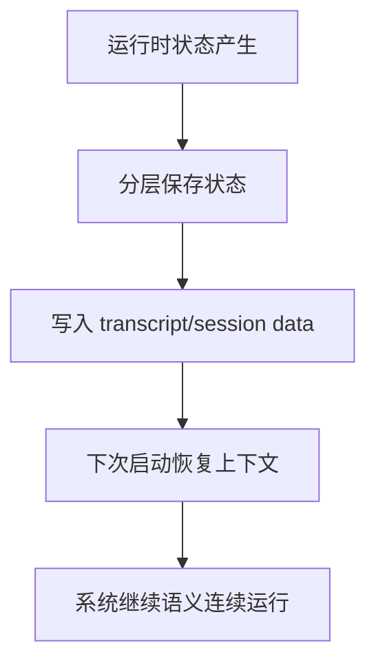
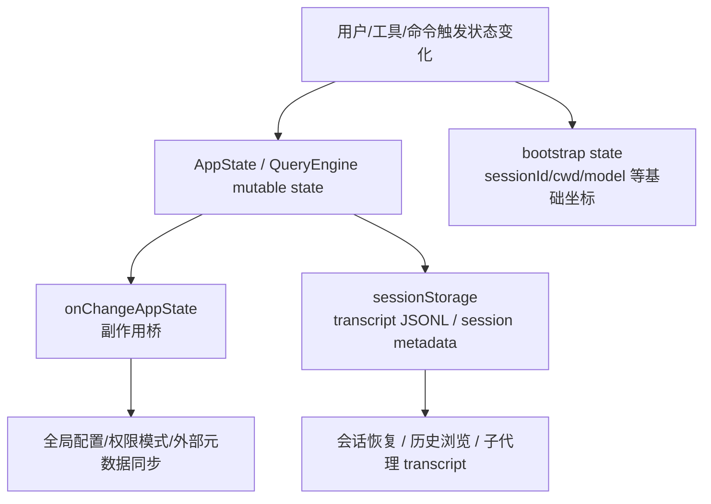

# 第 30 章 系统如何记住自己：状态、会话、转录与恢复

## 本章目标
- 系统化区分启动状态、应用状态、会话转录和长期记忆四层“记住自己”的方式。
- 理解系统为什么能在退出、中断或子代理运行后恢复语义。
- 建立“恢复不是重新开始，而是恢复到可解释状态”的工程视角。

## 先修关系
- 建议先读第 18 章和第 11 章，先建立状态层次与持久化治理的基本框架。
- 如果第 16 章和第 27 章读过，将更容易看出持久化边界落在请求主线的什么位置。
- 本章最好作为第四阶段的收束章节，因为它会把前面多个治理系统重新连起来。

## 关键词
- `bootstrap state`：进程/会话启动级基础状态。
- `AppState`：应用与 UI 运行态的主要状态树。
- `transcript`：会话中值得保存的结构化事实日志。
- `sessionStorage`：负责转录写入、读取和恢复的关键设施。
- `recovery`：把系统恢复到一个语义连续、可继续运行的状态。

## 正文图解

## 关键数据结构
| 结构/对象 | 在本章中的位置 | 阅读时要抓什么 |
| --- | --- | --- |
| `Persistence Layers` | 不同层状态的保存位置与时机。 | 它有助于区分谁该常驻、谁该持久化、谁只是暂态。 |
| `Transcript Record` | 进入会话日志的消息或事件单元。 | 它决定恢复后系统还保留哪些事实。 |
| `Session Metadata` | 与转录一起保存的会话级附加信息。 | 它帮助系统定位恢复入口和恢复方式。 |
| `Recovery Inputs` | 恢复时需要读取的状态源集合。 | 它说明恢复不是单读一个文件，而是重组多个来源。 |

## 为什么这一章必须单独讲

很多读者读完整条主链路之后，会形成一个危险的误解：

> 这个系统不过是在内存里维护一串消息，然后不停调模型。

这只对了一小半。
真正的工程系统必须回答更困难的问题：

- 当前状态放在哪里？
- 状态变化后谁负责同步副作用？
- 会话怎样持久化？
- 子代理怎样有自己的转录？
- 如果中途退出，下次怎样恢复？

这一章就是要把这些问题讲明白。

## 先做一个最重要的区分

这套系统里至少存在四层“记忆”：

1. 进程/启动级状态
2. AppState 应用状态
3. 会话消息与转录
4. 长期记忆与上下文压缩相关状态

如把这四层混成一层，就会一直搞不清谁在负责什么。

## 第一层：bootstrap state

### 它是什么

`bootstrap/state.ts` 维护的是进程或会话启动期非常核心的全局信息，例如：

- sessionId
- cwd
- originalCwd
- projectRoot
- mainLoopModel

### 它解决什么问题

它更像“运行时基础状态”，供大量模块读取。
读者可以把它类比成：

> 程序启动后就存在的全局基础坐标系。

### 它和 AppState 的区别

- bootstrap state 更偏底层和全局。
- AppState 更偏应用层、UI 层、会话交互层。

## 第二层：AppState

### AppState 有多大

从 `AppStateStore.ts` 可以看到，AppState 非常庞大，里面包含：

- 设置项
- 当前模型
- 展开视图状态
- 工具权限上下文
- 任务状态
- MCP 客户端、工具、资源
- 插件状态
- agent definitions
- file history
- attribution
- todos
- notifications
- elicitation queue
- session hooks
- 远程会话状态
- bridge 状态

这意味着它不是一个“小前端 store”，而是：

> 整个应用运行状态的中枢树。

### 为什么 AppState 会这么大

因为这个系统不是单页表单，而是一个长期交互、带后台任务、带扩展、带远程连接的终端应用。
状态自然会很多。

## 第三层：状态变化不是改完就完了

### `onChangeAppState.ts` 的意义

读者经常会低估这个文件，因为它不像 `query.ts` 那么显眼。
但它很关键，因为它负责把“状态变化”翻译成一系列副作用。

例如：

- 权限模式变化后，要通知外部会话元数据
- mainLoopModel 变化后，要写回设置和 bootstrap override
- expandedView 变化后，要落到全局配置
- verbose 变化后，要持久化
- settings 变化后，要清缓存、重应用环境变量

### 这说明什么

AppState 不是一个纯粹的内存对象。
它和：

- 外部控制通道
- 持久化配置
- 凭证缓存
- 环境变量

之间存在联动。

## 第四层：消息列表与 transcript

### 为什么消息必须持久化

如果消息只存在内存里，进程一退出，整个会话就断了。
所以系统要把重要消息写入 transcript。

### `sessionStorage.ts` 在做什么

这个文件不是“小工具合集”，而是会话持久化中枢。
里面会处理：

- transcript 路径
- session 项目目录
- JSONL 读写
- 会话标题
- 子代理 transcript
- worktree 状态
- 内容替换记录

### transcript 的重要设计点

源码里有几处特别值得讲：

1. transcript 用 JSONL 存储。
2. 并不是所有消息都会持久化。
3. 高频 progress 消息不作为 transcript message。
4. 会特别区分哪些消息参与 parentUuid 链。

这说明 transcript 不是“把屏幕上的东西原样 dump 到磁盘”，而是一个经过筛选和结构化的会话记录。

## 为什么 progress 通常不持久化

`sessionStorage.ts` 里有明确说明：

- progress 属于 UI 态
- 它们不应该参与 transcript parentUuid 链
- 老版本遗留 progress 还要在加载时桥接处理

对读者来说，这是理解“显示状态”和“语义状态”差异的好例子：

- UI 上一闪而过的进度，不代表要进入长期语义记录
- transcript 记录的是对恢复和继续推理真正有意义的内容

## 为什么用户消息要先写 transcript 再等 API

这是整套系统很工程化的一点。
如果用户刚发消息，API 还没回，进程就被杀了：

- 如果先不写 transcript，这条消息就丢了
- 如果先写 transcript，就至少能从“用户已经成功提交这一轮”的位置恢复

这正是 `QueryEngine.ts` 中提前 `recordTranscript(messages)` 的原因。

## 第五层：子代理也有自己的 transcript

### 为什么子代理不能混写到主 transcript

因为子代理是独立工作单元。
如果所有消息全混在主 transcript 里，后续查看、恢复、调试都会非常困难。

### 源码里怎么做

`sessionStorage.ts` 提供了：

- `setAgentTranscriptSubdir`
- `getAgentTranscriptPath`

也就是说，系统会为不同 agent 组织自己的 transcript 路径。

这说明系统把“子代理也是长期工作单元”这件事考虑得很认真。

## 第六层：会话恢复

### 恢复依赖哪些东西

当一个会话被恢复时，系统不能只靠一份 transcript 文本，它通常还需要：

- sessionId
- projectDir / originalCwd
- 相关元数据
- 可能的 worktree 状态
- 任务与子代理相关记录

### 为什么恢复是难题

因为恢复不是“重新显示旧消息”这么简单，而是要尽量把系统拉回一个合理的继续工作状态。

对读者来说，可以先把恢复理解成：

> 从磁盘上重新拼出一个可继续交互的会话现场。

## 第七层：状态与持久化的分工

下面这张表很重要。

| 层次 | 存什么 | 主要代表 |
| --- | --- | --- |
| bootstrap state | 启动期、进程级、会话基础坐标 | `bootstrap/state.ts` |
| AppState | 应用层运行状态 | `AppStateStore.ts` |
| mutableMessages / QueryEngine state | 当前会话执行中的消息与控制状态 | `QueryEngine.ts` |
| transcript / sessionStorage | 持久化会话记录和相关元数据 | `utils/sessionStorage.ts` |

读者经常问：“为什么不只保留一个 state store？”
答案是：因为这几层承担的是不同类型的时间尺度和职责。

## 第八层：状态变化如何向外扩散

### 不是每次 setState 都只影响本地

在这套系统里，状态变化可能还要影响：

- 全局配置
- 外部元数据同步
- 模型设置缓存
- 权限模式广播
- 认证缓存

这就是 `onChangeAppState.ts` 这种“状态副作用桥”存在的原因。

### 读者需要建立的设计意识

> 大型系统的状态管理，不只是“把值存起来”，而是“定义状态变化的传播边界和副作用出口”。

## 第九层：为什么这套系统需要这么多“记住自己”的机制

因为它不是一次性脚本，而是长期交互系统。
长期交互系统天然会遇到：

- 用户中断
- 进程退出
- 工具长时间运行
- 子代理并行
- 远程会话切换
- 多项目上下文

如果没有状态、转录、会话恢复、任务记录这些机制，它就很难成为真正可依赖的工作平台。

## 本章最值得读者画出来的图

## 读者最容易混淆的四件事

1. 以为 AppState 就等于所有状态。
2. 以为 transcript 就是把 UI 原样保存。
3. 以为 progress 也应该完整持久化。
4. 以为恢复只是重新读出一串消息。

只要这四点没理清，后面看 resume、subagent transcript、background task 时都会模糊。

## 本章的判断标准

如真正理解了这一章，应当能回答：

1. `bootstrap state` 和 `AppState` 分别管什么？
2. 为什么状态变化后还要有 `onChangeAppState()`？
3. 为什么用户消息要在 API 返回前先写 transcript？
4. 为什么 progress 不应该和 transcript message 混在一起？
5. 子代理为什么需要自己的 transcript 路径？

### `AppState` 应按状态簇理解，而不是按字段长度理解

`AppStateStore.ts` 中的 `AppState` 非常庞大，但它并不是一棵无结构的大树。教材里更合适的读法，是把它拆成若干状态簇：

| 状态簇 | 典型字段 | 作用 |
| --- | --- | --- |
| 配置簇 | `settings`、`mainLoopModel`、`verbose`、`thinkingEnabled` | 控制全局行为与执行偏好。 |
| 交互簇 | `expandedView`、`footerSelection`、`statusLineText` | 控制当前界面与交互状态。 |
| 权限簇 | `toolPermissionContext`、`isUltraplanMode` 等 | 控制工具与计划模式的运行边界。 |
| 任务簇 | `tasks`、`foregroundedTaskId`、`viewingAgentTaskId` | 管理后台任务、子代理与前台焦点。 |
| 扩展簇 | `mcp`、`plugins`、`agentDefinitions` | 管理外部能力与扩展状态。 |
| 辅助治理簇 | `fileHistory`、`attribution`、`notifications`、`elicitation`、`sessionHooks` | 承载审计、通知、补充输入和会话钩子。 |
| 远程/桥接簇 | `replBridge*`、`remoteConnectionStatus`、`remoteBackgroundTaskCount` | 管理远程会话、桥接模式与外部联动。 |

这样拆开之后，就能看出一件事：
`AppState` 并不是一个“前端界面 store”，而是一棵覆盖界面、权限、任务、扩展和远程协作的应用运行态树。

### `onChangeAppState.ts` 是“状态副作用桥”，而不是普通监听器

教材中如果只说“状态变化后会触发副作用”，还不足以体现这个文件的意义。
`state/onChangeAppState.ts` 真正承担的是一个非常关键的桥接职责：把纯内存状态变化翻译成对外可见的系统副作用。

源码中至少可以观察到以下几类桥接：

1. 权限模式变化后，要同步外部会话元数据，并通知 SDK/CCR 通道。
2. 主模型变化后，要写回用户设置，并更新 bootstrap 层的模型覆盖值。
3. 视图展开状态变化后，要同步到全局配置，保持下次启动仍能复现 UI 偏好。
4. `verbose` 或面板显隐变化后，要写回持久化配置。
5. `settings.env` 变化后，要清除认证缓存并重新应用环境变量。

这说明状态管理在这里采用的是一种相当成熟的分层方式：

- `setAppState` 负责声明性地改变内存状态。
- `onChangeAppState` 负责把某些变化扩散到外部世界。

这种拆分可以避免把“状态修改”和“外部副作用”混写在所有调用点里。

### transcript 写入的关键规则都藏在 `sessionStorage.ts`

若只从功能说明理解 transcript，很容易觉得它只是“消息写文件”。源码其实把 transcript 设计成了一份带严格规则的事实账本。

#### 规则一：只有特定消息类型属于 transcript 主链

`isTranscriptMessage(entry)` 明确限定只有四类消息进入 transcript 主链：

- `user`
- `assistant`
- `attachment`
- `system`

这条规则很关键，因为它决定了“哪些内容属于未来恢复时必须保留的事实”。

#### 规则二：参与 parent 链的范围比 transcript 还要更窄

`isChainParticipant(m)` 又进一步规定：
即使某条消息被写入 transcript，也未必参与 `parentUuid` 链；`progress` 明确被排除在链外。

这意味着 transcript 至少包含两层语义：

1. 可以写到事实账本里的条目。
2. 真正参与会话逻辑链的核心条目。

教材中非常值得强调这一点，因为很多恢复 bug 就是由“写入了不该参与 parent 链的东西”引发的。

#### 规则三：session file 不是一启动就创建，而是在需要时 materialize

`insertMessageChain()` 中有一个很有代表性的设计：
只有当这批待写消息里首次出现 `user` 或 `assistant` 消息时，session file 才会真正 materialize。单独的 hook progress 或零散附件不会单独把会话文件提前落盘。

这说明 sessionStorage 在这里追求的是：

- 不为了短暂 UI 杂音过早创建会话文件。
- 让真正构成对话事实的消息来决定会话账本的落地时机。

#### 规则四：每条写入消息都会被补齐会话坐标

源码在写入 `TranscriptMessage` 时，会统一补写：

- `sessionId`
- `cwd`
- `version`
- `gitBranch`
- `slug`
- `userType`
- `entrypoint`

这一步非常有教材意义，因为它说明 transcript 保存的并不只是“消息正文”，而是“带会话坐标和版本语义的消息事实”。

### `parentUuid`、`logicalParentUuid` 与 compact boundary 的特殊语义

`insertMessageChain()` 中还有一个非常值得反复讲解的细节：
compact boundary 写入时，`parentUuid` 会被置空，而之前的父节点则被保存在 `logicalParentUuid` 中。

这背后是一个非常精细的恢复语义设计：

- 从“主链遍历”角度看，compact boundary 需要成为新的截断点。
- 从“语义解释”角度看，又不能完全丢失它在压缩前接在谁后面这一事实。

因此系统同时保留了两条关系：

1. 恢复与链遍历使用的真实 `parentUuid`。
2. 说明压缩边界原本逻辑位置的 `logicalParentUuid`。

这一设计非常适合作为跨语言重建时必须保留的高级语义之一。
如果只保留一条父链，compact 后的恢复与继续推理会很容易出错。

### `recordTranscript()` 不是“把数组再写一遍”，而是增量去重器

`recordTranscript(messages)` 的实现同样不能被简化理解。根据源码，它至少做了三件关键事情：

1. 调用 `cleanMessagesForLogging()`，先清洗出适合写入账本的消息集合。
2. 对比当前 session 已记录的 UUID 集合，只挑出真正新增的消息。
3. 维护 `startingParentUuid`，确保即使前缀消息都已记录，新写入片段仍能正确接到已有链尾。

这里的 `startingParentUuid` 尤其重要。它解决的是这样的问题：

- 当前要写入的消息切片里，前半段可能已经落过盘。
- 新增消息不一定从链头开始。
- 如果不记录“前缀里最后一个已存在的链参与者”，后续新增消息就会找不到正确父节点。

这说明 `recordTranscript()` 本质上是一个“增量链拼接器”，而不是文件 append 包装。

### 为什么子代理 transcript 必须独立建路径

`getAgentTranscriptPath(agentId)` 与 `setAgentTranscriptSubdir()` 表明，子代理的 transcript 被明确放到会话目录下的独立子路径中。
这么做至少有四个理由：

1. 主线程会话与子代理会话的消息链不同，不能混写。
2. 子代理往往有自己的恢复语义和输出视图。
3. 若混写在主 transcript 中，多代理并行会极大增加 parent 链混乱概率。
4. 调试某个 agent 的行为时，需要能单独读取它的事实账本。

因此，子代理 transcript 不是“主 transcript 的附页”，而是同一会话空间中的平行事实账本。

### 恢复依赖的是“事实账本”，不是 UI 快照

教材最后必须把这一点说透：
整套恢复系统之所以复杂，恰恰是因为它恢复的不是屏幕像素，也不是某个 React 组件树，而是“系统曾经发生过哪些具有持续语义的事实”。

这也是以下设计同时成立的根本原因：

- progress 不进主链。
- 用户消息先落账。
- compact boundary 要特殊维护父链。
- 子代理要有独立 transcript。
- AppState 变化要经过副作用桥向外扩散。

只有在“恢复的是事实，不是画面”这个前提下，上述规则才会显得连贯一致。

## 30.10 语言无关重建视角

`utils/sessionStorage.ts` 所体现的，不只是“把消息写文件”，而是一套会话事实账本模型。跨语言重写时，至少要保留四层存储语义：

1. 启动态存储：sessionId、cwd、模型、运行模式等基础坐标。
2. UI/应用态存储：当前界面与运行中的任务信息。
3. transcript 存储：用户、助手、附件、系统消息的可恢复事实链。
4. 代理/远程元数据存储：子代理 transcript 路径、remote task 元数据、恢复所需补充信息。

### transcript 的核心规则

从源码可抽出三条决定恢复质量的关键规则：

- 只有 transcript message 进入主链；progress 等高频 UI 事件保持易失。
- parentUuid 链只能由真正参与对话语义的消息构成。
- 用户消息在 API 返回之前就应写入 transcript，以保证“请求已被系统接受”这一事实可恢复。

### 最小实现顺序

1. 先定义 transcript entry 与 metadata entry。
2. 实现消息写入与 parent 链维护。
3. 实现会话元数据写入，例如标题、tag、branch、mode。
4. 实现恢复读取器，能够从 JSONL 或等价格式重建消息链。
5. 实现子代理与远程代理的独立 transcript/metadata 路径。
6. 最后再补入 tombstone、内容替换记录、lite log 与大文件优化。

### 重建时最容易破坏恢复语义的做法

- 把所有 progress 都写进 transcript，导致链路噪音过大且恢复配对失真。
- 不维护 parentUuid 链，导致 resume 时无法重建正确会话顺序。
- 把子代理 transcript 混写到主 transcript，导致多代理历史互相污染。
- 只保存消息正文，不保存与会话坐标相关的元数据，导致跨项目恢复出错。

## 重建蓝图：把恢复体系写成可验证的一致性协议

### 必须保留的抽象

1. 状态恢复至少包含 durable event log、会话元数据、消息投影规则、任务 lineage 和恢复入口五个抽象。缺少任一项，恢复都只能停留在“重新打开界面”层面。
2. Transcript 应被视为可追加日志，而不是界面快照。它保存的是能够重建会话语义的关键事实，而不是某一瞬间屏幕长什么样。
3. parentUuid 与 logicalParentUuid 这类 lineage 字段体现了“物理父子关系”与“逻辑归属关系”的区分。跨语言重写时，这类区分必须被保留，否则多代理恢复会丢失上下文血缘。
4. 状态恢复应有明确顺序：先恢复最小会话元数据，再恢复 transcript，再恢复任务与子会话关系，最后投影成 UI 状态。

### 最小实现顺序

1. 第一阶段先定义 transcript schema，明确哪些消息和事件会被写入、写入时机是什么、如何处理失败。
2. 第二阶段实现 append-only 日志协议，保证用户消息、工具结果和关键状态变化能稳定落盘。
3. 第三阶段实现恢复装配器，按既定顺序重建会话、消息列表和任务 lineage。
4. 第四阶段实现异常恢复策略，包括日志不完整、任务已结束、子会话缺失或版本迁移时如何降级。
5. 第五阶段再补入清理策略、压缩后的恢复适配与跨进程后台任务回填。

### 最容易写错的边界

1. 最常见的错误是把渲染态也当成需要恢复的真相数据。实际上滚动位置、临时 progress、瞬时通知通常不属于 durable truth。
2. 第二类错误是用覆盖式存储替代追加式日志。只要进程在写入中途崩溃，就可能同时失去旧状态和新状态。
3. 第三类错误是恢复顺序错误，例如在 transcript 尚未恢复前就尝试构造 UI 派生状态，最终会出现缺项或重复。
4. 第四类错误是没有对 lineage 做显式建模，导致父代理与子代理恢复后只剩一堆孤立会话，无法还原原来的关系网络。

## 章末小结
- 本章围绕“状态分层、转录持久化和恢复语义”重建了一层稳定理解，避免只记零散函数名或目录名。
- 真正需要沉淀下来的，不只是 `bootstrap state`、`AppState`、`transcript` 这几个词，而是它们在 `Persistence Layers`、`Transcript Record`、`Session Metadata` 里的相互位置。
- 如后续在 第 22 章和第 25 章 中再次迷路，优先回看本章的“先修关系、正文图解、关键数据结构”三部分。

## 章末自测
1. 不看原文，用自己的话重述本章围绕“状态分层、转录持久化和恢复语义”到底解决了什么问题。
2. 结合“正文图解”，把 `分层保存状态` 到 `下次启动恢复上下文` 之间的连接关系重新讲一遍。
3. 对比 `Persistence Layers` 与 `Transcript Record`：它们分别回答什么问题，边界为什么不能混掉？
4. 在 `bootstrap state`、`AppState`、`transcript` 中任选两个，说明它们在本章中是如何互相作用的。
5. 如果后续要继续读 第 22 章和第 25 章，本章哪一部分最值得先回看？为什么？
