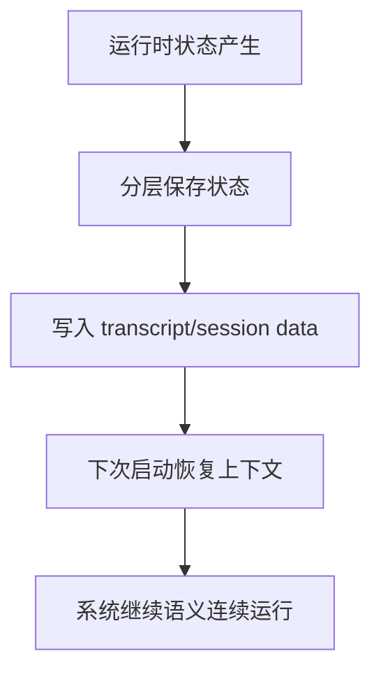
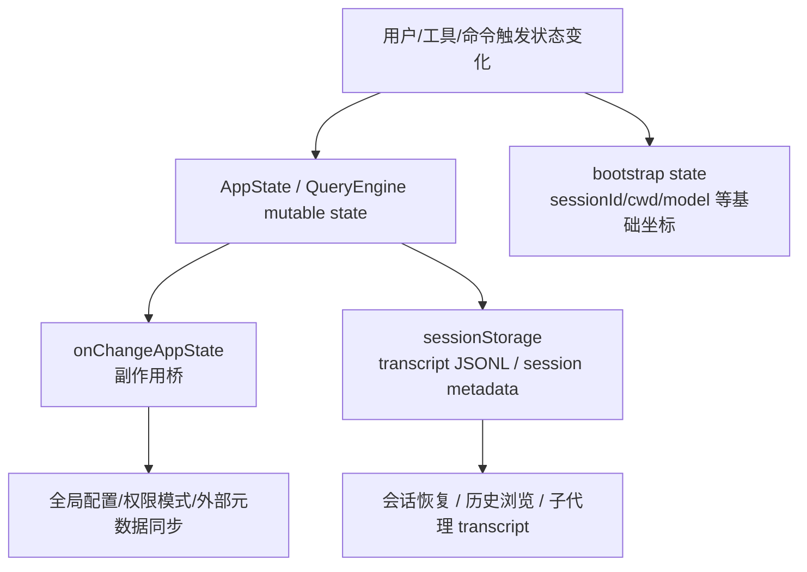

# 第 30 章 系统如何记住自己：状态、会话、转录与恢复

## 本章目标
- 系统化区分启动状态、应用状态、会话转录和长期记忆四层“记住自己”的方式。
- 理解系统为什么能在退出、中断或子代理运行后恢复语义。
- 建立“恢复不是重新开始，而是恢复到可解释状态”的工程视角。

## 先修关系
- 建议先读第 18 章和第 11 章，先建立状态层次与持久化治理的基本框架。
- 如果第 16 章和第 27 章读过，你会更容易看出持久化边界落在请求主线的什么位置。
- 本章最好作为第四阶段的收束章节，因为它会把前面多个治理系统重新连起来。

## 关键词
- `bootstrap state`：进程/会话启动级基础状态。
- `AppState`：应用与 UI 运行态的主要状态树。
- `transcript`：会话中值得保存的结构化事实日志。
- `sessionStorage`：负责转录写入、读取和恢复的关键设施。
- `recovery`：把系统恢复到一个语义连续、可继续运行的状态。

## 正文图解

## 关键数据结构
| 结构/对象 | 在本章中的位置 | 阅读时要抓什么 |
| --- | --- | --- |
| `Persistence Layers` | 不同层状态的保存位置与时机。 | 它帮助你区分谁该常驻、谁该持久化、谁只是暂态。 |
| `Transcript Record` | 进入会话日志的消息或事件单元。 | 它决定恢复后系统还保留哪些事实。 |
| `Session Metadata` | 与转录一起保存的会话级附加信息。 | 它帮助系统定位恢复入口和恢复方式。 |
| `Recovery Inputs` | 恢复时需要读取的状态源集合。 | 它说明恢复不是单读一个文件，而是重组多个来源。 |

## 为什么这一章必须单独讲

很多学生读完整条主链路之后，会形成一个危险的误解：

> 这个系统不过是在内存里维护一串消息，然后不停调模型。

这只对了一小半。  
真正的工程系统必须回答更困难的问题：

- 当前状态放在哪里？
- 状态变化后谁负责同步副作用？
- 会话怎样持久化？
- 子代理怎样有自己的转录？
- 如果中途退出，下次怎样恢复？

这一章就是要把这些问题讲明白。

## 先做一个最重要的区分

这套系统里至少存在四层“记忆”：

1. 进程/启动级状态
2. AppState 应用状态
3. 会话消息与转录
4. 长期记忆与上下文压缩相关状态

如果你把这四层混成一层，就会一直搞不清谁在负责什么。

## 第一层：bootstrap state

### 它是什么

`bootstrap/state.ts` 维护的是进程或会话启动期非常核心的全局信息，例如：

- sessionId
- cwd
- originalCwd
- projectRoot
- mainLoopModel

### 它解决什么问题

它更像“运行时基础状态”，供大量模块读取。  
学生可以把它类比成：

> 程序启动后就存在的全局基础坐标系。

### 它和 AppState 的区别

- bootstrap state 更偏底层和全局。
- AppState 更偏应用层、UI 层、会话交互层。

## 第二层：AppState

### AppState 有多大

从 `AppStateStore.ts` 可以看到，AppState 非常庞大，里面包含：

- 设置项
- 当前模型
- 展开视图状态
- 工具权限上下文
- 任务状态
- MCP 客户端、工具、资源
- 插件状态
- agent definitions
- file history
- attribution
- todos
- notifications
- elicitation queue
- session hooks
- 远程会话状态
- bridge 状态

这意味着它不是一个“小前端 store”，而是：

> 整个应用运行状态的中枢树。

### 为什么 AppState 会这么大

因为这个系统不是单页表单，而是一个长期交互、带后台任务、带扩展、带远程连接的终端应用。  
状态自然会很多。

## 第三层：状态变化不是改完就完了

### `onChangeAppState.ts` 的意义

学生经常会低估这个文件，因为它不像 `query.ts` 那么显眼。  
但它很关键，因为它负责把“状态变化”翻译成一系列副作用。

例如：

- 权限模式变化后，要通知外部会话元数据
- mainLoopModel 变化后，要写回设置和 bootstrap override
- expandedView 变化后，要落到全局配置
- verbose 变化后，要持久化
- settings 变化后，要清缓存、重应用环境变量

### 这说明什么

AppState 不是一个纯粹的内存对象。  
它和：

- 外部控制通道
- 持久化配置
- 凭证缓存
- 环境变量

之间存在联动。

## 第四层：消息列表与 transcript

### 为什么消息必须持久化

如果消息只存在内存里，进程一退出，整个会话就断了。  
所以系统要把重要消息写入 transcript。

### `sessionStorage.ts` 在做什么

这个文件不是“小工具合集”，而是会话持久化中枢。  
里面会处理：

- transcript 路径
- session 项目目录
- JSONL 读写
- 会话标题
- 子代理 transcript
- worktree 状态
- 内容替换记录

### transcript 的重要设计点

源码里有几处特别值得讲：

1. transcript 用 JSONL 存储。
2. 并不是所有消息都会持久化。
3. 高频 progress 消息不作为 transcript message。
4. 会特别区分哪些消息参与 parentUuid 链。

这说明 transcript 不是“把屏幕上的东西原样 dump 到磁盘”，而是一个经过筛选和结构化的会话记录。

## 为什么 progress 通常不持久化

`sessionStorage.ts` 里有明确说明：

- progress 属于 UI 态
- 它们不应该参与 transcript parentUuid 链
- 老版本遗留 progress 还要在加载时桥接处理

对学生来说，这是理解“显示状态”和“语义状态”差异的好例子：

- UI 上一闪而过的进度，不代表要进入长期语义记录
- transcript 记录的是对恢复和继续推理真正有意义的内容

## 为什么用户消息要先写 transcript 再等 API

这是整套系统很工程化的一点。  
如果用户刚发消息，API 还没回，进程就被杀了：

- 如果先不写 transcript，这条消息就丢了
- 如果先写 transcript，就至少能从“用户已经成功提交这一轮”的位置恢复

这正是 `QueryEngine.ts` 中提前 `recordTranscript(messages)` 的原因。

## 第五层：子代理也有自己的 transcript

### 为什么子代理不能混写到主 transcript

因为子代理是独立工作单元。  
如果所有消息全混在主 transcript 里，后续查看、恢复、调试都会非常困难。

### 源码里怎么做

`sessionStorage.ts` 提供了：

- `setAgentTranscriptSubdir`
- `getAgentTranscriptPath`

也就是说，系统会为不同 agent 组织自己的 transcript 路径。

这说明系统把“子代理也是长期工作单元”这件事考虑得很认真。

## 第六层：会话恢复

### 恢复依赖哪些东西

当一个会话被恢复时，系统不能只靠一份 transcript 文本，它通常还需要：

- sessionId
- projectDir / originalCwd
- 相关元数据
- 可能的 worktree 状态
- 任务与子代理相关记录

### 为什么恢复是难题

因为恢复不是“重新显示旧消息”这么简单，而是要尽量把系统拉回一个合理的继续工作状态。

对学生来说，可以先把恢复理解成：

> 从磁盘上重新拼出一个可继续交互的会话现场。

## 第七层：状态与持久化的分工

下面这张表很重要。

| 层次 | 存什么 | 主要代表 |
| --- | --- | --- |
| bootstrap state | 启动期、进程级、会话基础坐标 | `bootstrap/state.ts` |
| AppState | 应用层运行状态 | `AppStateStore.ts` |
| mutableMessages / QueryEngine state | 当前会话执行中的消息与控制状态 | `QueryEngine.ts` |
| transcript / sessionStorage | 持久化会话记录和相关元数据 | `utils/sessionStorage.ts` |

学生经常问：“为什么不只保留一个 state store？”  
答案是：因为这几层承担的是不同类型的时间尺度和职责。

## 第八层：状态变化如何向外扩散

### 不是每次 setState 都只影响本地

在这套系统里，状态变化可能还要影响：

- 全局配置
- 外部元数据同步
- 模型设置缓存
- 权限模式广播
- 认证缓存

这就是 `onChangeAppState.ts` 这种“状态副作用桥”存在的原因。

### 学生需要建立的设计意识

> 大型系统的状态管理，不只是“把值存起来”，而是“定义状态变化的传播边界和副作用出口”。

## 第九层：为什么这套系统需要这么多“记住自己”的机制

因为它不是一次性脚本，而是长期交互系统。  
长期交互系统天然会遇到：

- 用户中断
- 进程退出
- 工具长时间运行
- 子代理并行
- 远程会话切换
- 多项目上下文

如果没有状态、转录、会话恢复、任务记录这些机制，它就很难成为真正可依赖的工作平台。

## 本章最值得学生画出来的图

## 学生最容易混淆的四件事

1. 以为 AppState 就等于所有状态。
2. 以为 transcript 就是把 UI 原样保存。
3. 以为 progress 也应该完整持久化。
4. 以为恢复只是重新读出一串消息。

只要这四点没理清，后面看 resume、subagent transcript、background task 时都会模糊。

## 给学生的最终判断标准

如果你真正理解了这一章，你应该能回答：

1. `bootstrap state` 和 `AppState` 分别管什么？
2. 为什么状态变化后还要有 `onChangeAppState()`？
3. 为什么用户消息要在 API 返回前先写 transcript？
4. 为什么 progress 不应该和 transcript message 混在一起？
5. 子代理为什么需要自己的 transcript 路径？

## 章末小结
- 本章围绕“状态分层、转录持久化和恢复语义”重建了一层稳定理解，不让你只记零散函数名或目录名。
- 真正需要沉淀下来的，不只是 `bootstrap state`、`AppState`、`transcript` 这几个词，而是它们在 `Persistence Layers`、`Transcript Record`、`Session Metadata` 里的相互位置。
- 如果你后续在 第 22 章和第 25 章 中再次迷路，优先回看本章的“先修关系、正文图解、关键数据结构”三部分。

## 章末自测
1. 不看原文，用自己的话重述本章围绕“状态分层、转录持久化和恢复语义”到底解决了什么问题。
2. 结合“正文图解”，把 `分层保存状态` 到 `下次启动恢复上下文` 之间的连接关系重新讲一遍。
3. 对比 `Persistence Layers` 与 `Transcript Record`：它们分别回答什么问题，边界为什么不能混掉？
4. 在 `bootstrap state`、`AppState`、`transcript` 中任选两个，说明它们在本章中是如何互相作用的。
5. 如果后续要继续读 第 22 章和第 25 章，本章哪一部分最值得先回看？为什么？
